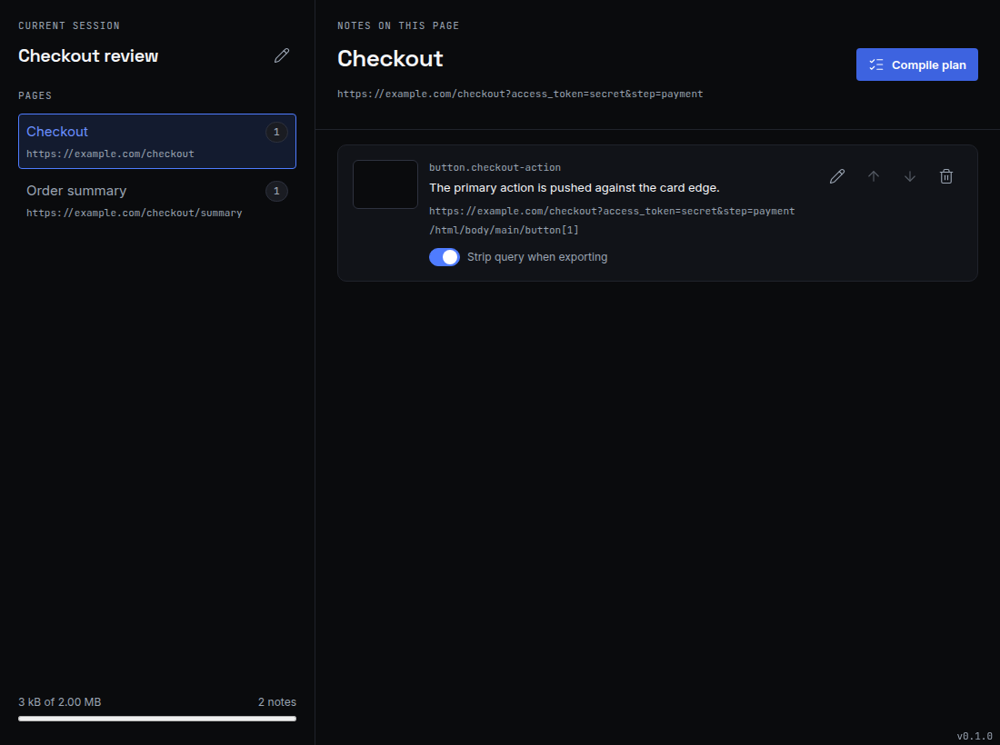

<p align="center">
  
</p>

<h1 align="center">Point & Shoot</h1>

<p align="center">
  Turn UI and UX bugs into evidence a coding agent can act on.
</p>

<p align="center">
  <a href="https://github.com/whizzzkid/point-and-shoot/actions/workflows/ci.yml">
    
  </a>
  <a href="https://github.com/whizzzkid/point-and-shoot/actions/workflows/site.yml">
    
  </a>
  
  
</p>

<p align="center">
  <a href="https://pointandshoot.app/">Website</a>
  ·
  <a href="https://pointandshoot.app/docs/">Documentation</a>
  ·
  <a href="#build-from-source">Build from source</a>
</p>



Point & Shoot is a cross-browser extension for reporting interface problems in place. Start a
session, select an element or drag around a region, add a note, and export the result as a
structured bundle for a local coding agent. The report keeps the visible symptom and the underlying
page evidence together, without requiring a hosted service.

## What it captures

Each note can include:

- a WebP screenshot of the selected region;
- the page URL, with query-string privacy controls;
- test-id, ARIA, CSS, and XPath selector fallbacks;
- relevant DOM text and metadata;
- a bounded computed-style digest; and
- the note and capture geometry.

Sessions export as canonical JSON, an agent-readable plan, and referenced screenshots. Point & Shoot
does not upload the bundle.

Every extension surface shows its packaged version in a tiny bottom-right marker, making a
release-candidate install easy to identify while testing.

## Build from source

Chrome Web Store and Firefox Add-ons listings are not live yet. Until they are, build the extension
locally with [Git](https://git-scm.com/) and [mise](https://mise.jdx.dev/):

```bash
git clone https://github.com/whizzzkid/point-and-shoot.git
cd point-and-shoot
mise install
mise exec -- deno task build
```

The build writes unpacked extensions to:

- `dist/chrome/` for Chrome 116 or newer; and
- `dist/firefox/` for Firefox 109 or newer.

### Load in Chrome

1. Open `chrome://extensions`.
2. Turn on **Developer mode**.
3. Select **Load unpacked**.
4. Choose `dist/chrome/`.

Reload the extension from this page after each rebuild.

### Load in Firefox

1. Open `about:debugging#/runtime/this-firefox`.
2. Select **Load Temporary Add-on**.
3. Choose `dist/firefox/manifest.json`.

Firefox removes a temporary add-on when the browser exits. Load the manifest again after restarting
Firefox.

## Capture a session

1. Open a normal web page and select the Point & Shoot toolbar icon. The side panel opens, a session
   starts, and the capture overlay appears.
2. Select an element or drag around a visible region. The note composer opens before anything is
   stored.
3. Describe what should change and select **Save note**, or select **Save without note** to keep an
   empty body. **Cancel** discards the pending capture.
4. Repeat across as many pages as needed.
5. Select **Compile plan**, review the included notes, then select **Download for agent**.
6. Select the browser toolbar icon again to end the session.

The default shortcut is `Command+Shift+P` on macOS and `Ctrl+Shift+P` elsewhere. It toggles the
capture overlay without ending the active session.

See the [getting-started tutorial](docs/tutorials/getting-started.md) for the complete workflow.

## Give the export to an agent

Extract the downloaded ZIP, open your coding agent in the target repository, and point it at
`plan.md`. Ask the agent to use `session.json` as the canonical record and `shots/` as the visual
evidence.

The archive contains:

- `session.json` — the canonical session and captured page evidence;
- `plan.md` — the selected notes with relative screenshot links; and
- `shots/` — one WebP screenshot for every included note.

If you give the bundle to a hosted agent, its screenshots, URLs, DOM text, selectors, and styles may
leave your machine. Review the plan, exclude notes you do not want to share, and check each note's
query-string setting first.

## Known limits

Point & Shoot cannot inspect inside closed shadow roots or cross-origin iframe documents. Restricted
browser pages cannot grant `activeTab`. Region screenshots are clamped to the visible viewport;
scroll-and-stitch capture is not implemented.

See [troubleshooting and known limits](docs/tutorials/troubleshooting.md) for expected behavior and
workarounds.

## Development

The repository uses Deno for extension and site development. Astro and other npm packages resolve
through Deno; there is no separate Node or npm project under `site/`, and none of the site's
dependencies ship inside the extension.

Run the extension gate with:

```bash
mise exec -- deno task ci
```

Run the site checks with:

```bash
mise exec -- deno task site:ci
```

The [Playwright companion guide](docs/tutorials/playwright-companion.md) explains how to load the
unpacked extension beside a local application. Product documentation is also available on the
[published documentation site](https://pointandshoot.app/docs/). Architecture decisions and behavior
specifications live in the [repository documentation index](docs/README.md). Maintainers can follow
the [release guide](docs/tutorials/releasing.md) to test and publish the browser packages.
