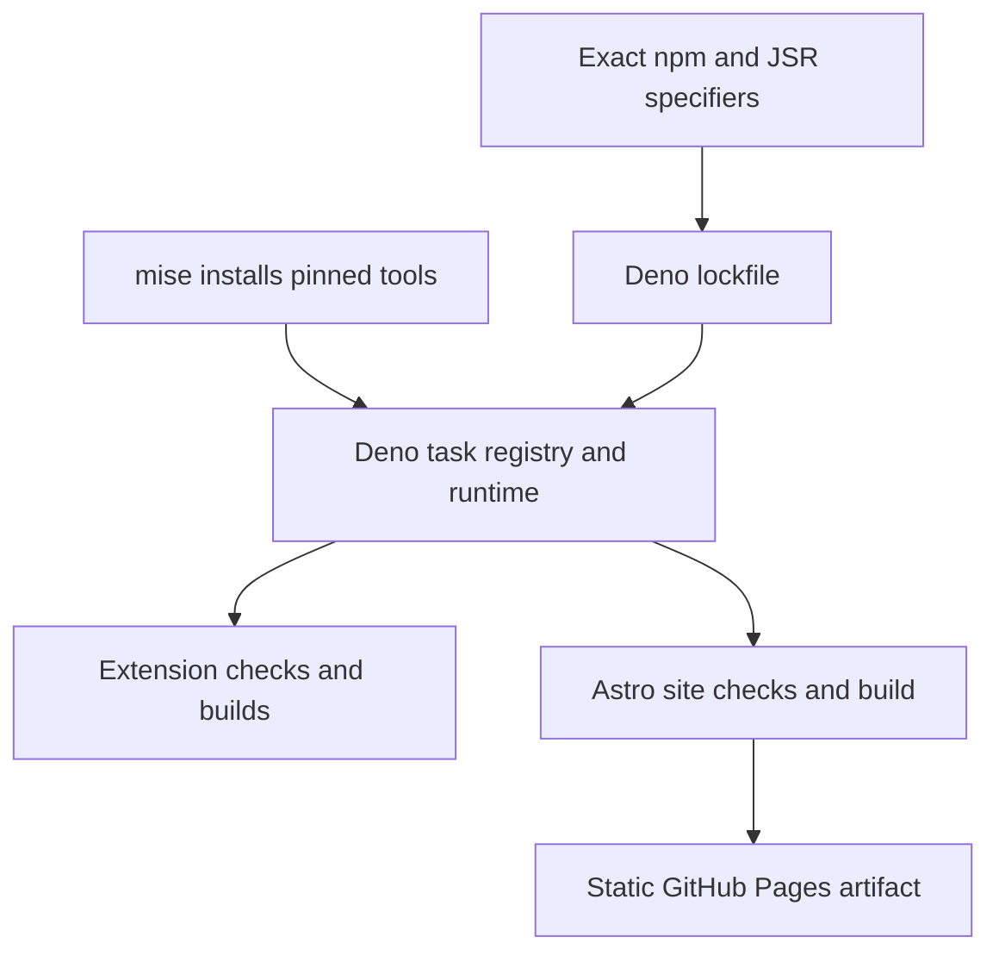

# ADR-0019 — Deno owns the repository toolchain

- **Status:** Accepted
- **Date:** 2026-08-05
- **Supersedes:** [ADR-0004](0004-deno-first-toolchain-npm-specifiers.md) and
  [ADR-0018](0018-astro-for-marketing-and-documentation.md)

## Context

ADR-0004 made Deno the extension toolchain but allowed the Astro website to keep a separate Node
project. ADR-0018 expanded that site to publish product documentation while preserving the same
carve-out. The result was two task registries, two dependency manifests, two lockfiles, and two
runtimes in CI even though Deno can execute Astro and its npm dependencies through its Node
compatibility layer.

The carve-out also made repository guidance internally inconsistent. `deno.json` excluded `site/`,
`mise.toml` installed Node only for the site, and the site workflow bypassed the project-wide Deno
task interface. A dependency or command change therefore needed updates in several owners that could
drift independently.

## Decision

Deno owns source checks, dependency resolution, task execution, and CI for the entire repository,
including `site/`. Keep Astro as the static-site framework selected by ADR-0018, but execute it and
all supporting npm packages through exact `npm:` specifiers managed by `deno.json` and `deno.lock`.

`mise.toml` installs Deno and lefthook only. Every contributor and CI command enters through a
`deno task`; site commands use the `site:*` namespace. Deno may generate a gitignored
`node_modules/` compatibility tree for Vite and npm packages, and those packages may use Deno's
`node:` compatibility modules internally, but the repository does not require a Node executable,
`package.json`, npm command, or npm lockfile.

## Consequences

- One task registry and one lockfile cover extension and site dependencies.
- Site source participates in Deno formatting, linting, type checking where supported, and unit-test
  discovery. Astro's checker remains responsible for `.astro` files.
- Deno's generated `node_modules/` tree is an implementation detail required by Astro and Vite, not
  a second package-management boundary. It remains gitignored.
- npm lifecycle scripts remain denied by default. The Astro runner explicitly allows only the pinned
  esbuild package's install script.
- The path-filtered `Site` workflow remains separate because site builds, link checks, axe, and
  Lighthouse do not need to run for extension-only changes. It installs no second runtime.
- Astro and its transitive dependency graph make `deno.lock` larger. That cost is accepted in return
  for deterministic resolution under one owner.
- Nothing under `site/` ships in either browser package, preserving the product boundary from
  ADR-0018.

## Alternatives considered

**Keep the isolated Node project.** Rejected because it preserves duplicate manifests, runners,
lockfiles, version pins, and CI setup for a capability Deno already provides.

**Replace Astro with a Deno-native site generator.** Rejected because the site framework is not the
problem. Astro already implements the marketing and documentation requirements; replacing it would
rewrite working product code solely to change the runner.

**Keep `package.json` only as an npm dependency annotation.** Rejected because Deno would no longer
be the single dependency owner, and contributors could reasonably treat npm scripts or its lockfile
as an alternative interface.
