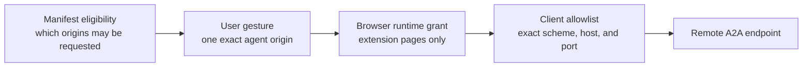
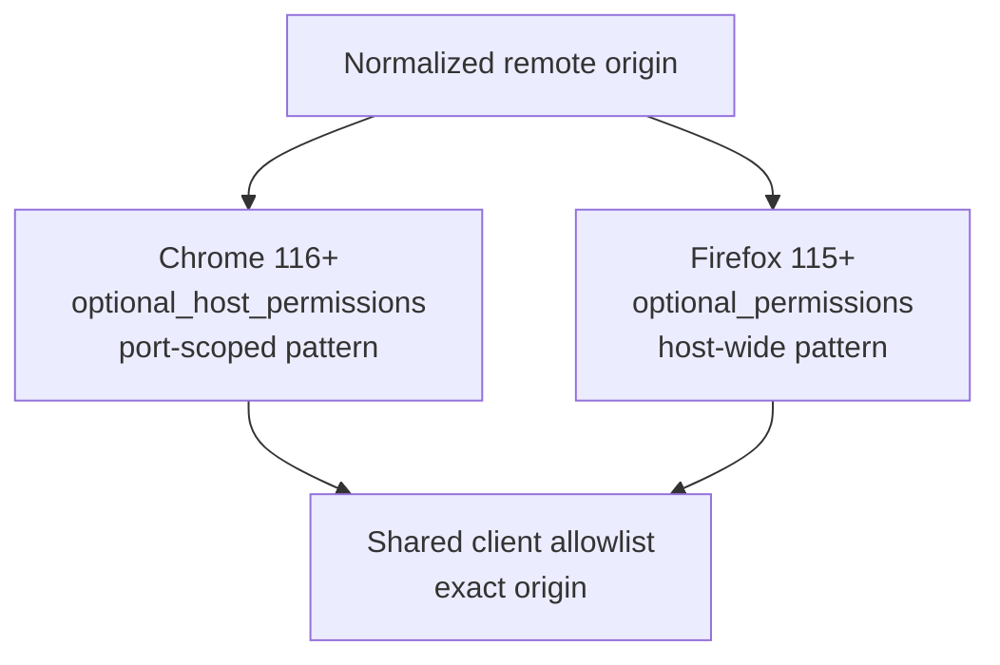

# ADR-0020 — Use optional host permissions for A2A agents

- **Status:** Accepted
- **Date:** 2026-08-05
- **Partially supersedes:** ADR-0002's rejection of optional host permissions

> **How to read this ADR:** [Context](#context) separates inspected-page access from remote-agent
> access. [Decision](#decision) defines the permission model, [Evidence](#evidence-and-limitations)
> states what Phase 0 proved, and [Consequences](#consequences) and
> [Alternatives](#alternatives-considered) record the trade-offs and rollback.

## Context

[ADR-0002](0002-activetab-only-permission-model.md) correctly makes `activeTab` the only host access
used to inspect a page. It also rejected optional host permissions before a concrete feature needed
them. A2A delivery is that feature: an extension page must discover and call a user-selected remote
agent whose origin cannot be known at package time. `activeTab` grants access to the inspected tab;
it cannot authorize an extension page to fetch an unrelated agent origin.

Optional eligibility and runtime consent are separate capabilities:

Declaring optional eligibility grants no origin by itself. The browser grants an eligible origin
only after a user gesture and browser-controlled consent. The A2A client then applies a stricter
exact-origin allowlist even where a browser match pattern is wider.

## Decision

Preserve `activeTab` as the sole inspected-page host capability. Add a distinct optional-permission
path for remote A2A agents:

1. Declare optional HTTPS eligibility and only the enumerated loopback HTTP patterns accepted by
   each browser. Never declare required `host_permissions`, `<all_urls>`, or wildcard HTTP.
2. Normalize a user-supplied agent URL before any request. Reject embedded credentials, fragments,
   unsupported schemes, malformed internationalized hosts, and non-loopback HTTP.
3. Request the card origin from an extension-page user gesture. If the selected A2A interface uses
   another origin, require a second gesture and grant before connecting.
4. Preserve Chrome's explicit port in the match pattern. Firefox 115 match patterns grant the scheme
   and host across ports, so keep the exact port in the client allowlist and reject every other
   origin in application code.
5. Keep remote fetching in extension pages or the extension transport adapter. An optional host
   grant does not authorize content scripts to become caller-directed network proxies.

The browser-specific manifest shape is part of the decision:

Firefox does not support `optional_host_permissions` until version 128. Using host match patterns
inside `optional_permissions` keeps the credential-store minimum at Firefox 115 without silently
discarding the optional eligibility declaration.

## Evidence and limitations

Phase 0 produced the following executable evidence:

- Unit tests cover normalization, default ports, Chrome port scoping, Firefox's host-wide grant,
  repeated grants, denial, revocation, and rejected URL classes against both browser adapters.
- Generated-manifest tests distinguish required permissions, optional eligibility, and runtime
  grants. Chrome retains `sidePanel`; Firefox does not gain it; neither target gains required host
  permissions or optional `identity` or `cookies` API permissions.
- A visible Chromium extension page invokes separate permission requests for the public Agent Card
  and selected interface origins from real clicks. Headless Chromium exposes but cannot accept the
  native consent prompt, so automated Chromium evidence stops at prompt invocation.
- Firefox Marionette cannot call WebExtension permission APIs from its page sandbox. The Firefox
  smoke proof injects the already-granted state through Firefox's internal extension-permission
  store, then exercises discovery, authenticated delivery, subscription, and polling from a visible
  extension page.

These automation boundaries are not cross-browser claims that permission prompts were accepted. They
are paired with browser-shim lifecycle tests and an already-granted Firefox runtime proof.

## Consequences

- Installing the extension still grants no standing access to inspected pages or remote agents.
- Connecting an agent creates a persistent browser-owned origin grant until the user or extension
  revokes it. Product UI must expose disconnection and revocation rather than treating the grant as
  invisible state.
- Firefox's browser-owned grant is wider than the selected port. Every fetch adapter must preserve
  the exact client allowlist; permission presence alone is never authorization to change ports.
- Multi-origin Agent Cards require multiple explicit grants. Discovery cannot turn the background
  process into an arbitrary URL fetcher.
- Firefox's minimum rises from 109 to 115 because `storage.session`, not the host grant itself, is
  required to keep credentials off disk.
- Store-review documentation must distinguish optional eligibility from origins the user has
  actually granted.

The rollback is to disable remote A2A connection, remove optional host eligibility from both
generated manifests, revoke grants the extension owns, and retain local copy/download workflows. No
inspected-page permission or stored session schema needs to change.

## Alternatives considered

**Keep ADR-0002's blanket rejection.** Rejected: `activeTab` cannot authorize a fetch from an
extension page to a separately selected agent origin, so A2A delivery would remain impossible.

**Add required HTTPS or `<all_urls>` host access.** Rejected: it would grant standing access at
install time to unrelated origins and weaken the inspected-page privacy guarantee.

**Proxy through the inspected content script.** Rejected: content scripts do not receive this
cross-origin capability, and accepting arbitrary URLs from page-controlled code would create a
confused-deputy and SSRF boundary.

**Use a hosted relay or native companion.** Rejected: both add a new trust boundary, deployment,
credential custodian, and availability dependency when browser-native extension requests work.

**Raise Firefox directly to 128 and use `optional_host_permissions`.** Rejected for Phase 0: Firefox
115 already provides `storage.session`, and the accepted `optional_permissions` host form preserves
the same runtime grant semantics with a larger supported population.

## Architecture review

`wk-arch-review` evaluated this ADR and the A2A client spec on 2026-08-05. Verdict: **accepted after
blockers were folded in**. The review required an explicit Firefox port-grant containment rule,
separate evidence from automation limitations, a credential-loss recovery contract, bounded remote
input before parsing, and a reversible kill path. Those requirements are normative above and in the
[A2A client spec](../specs/a2a-client.md).
