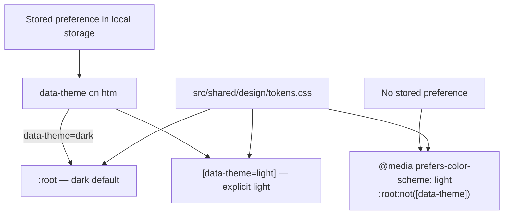

# ADR-0020 — Site theme override layers on top of the system preference

- **Status:** Accepted
- **Date:** 2026-08-13
- **Relates to:** [ADR-0010](0010-backdrop-luminance-theming-with-override.md) and
  [ADR-0011](0011-generated-design-tokens-with-drift-check.md)

## Context

The public site derived its theme from `prefers-color-scheme` alone. The design tokens ship a
`[data-theme="light"]` block, but the site build re-hoisted that block to a bare `:root` inside
`@media (prefers-color-scheme: light)`, which discarded the attribute selector. A visitor whose
operating system disagreed with how they wanted to read documentation had no recourse, and the
extension already offers exactly that override for its own surfaces under ADR-0010 — so the site was
the inconsistent surface, not the extension.

Adding a control raises two problems the site had not faced. Theme has to be resolved before first
paint or every navigation flashes, which no deferred Astro script can do. And a control that depends
on scripting must not exist when scripting is unavailable, because the site's standing rule is that
a dummy control is worse than an absent one.

## Decision

Layer an explicit override on the system preference rather than replacing it.

The site build keeps the token source's `[data-theme="light"]` selectors verbatim, so an attribute
on the document element selects the light palette with no translation. Only the system branch is
rewritten, and it is narrowed to `:root:not([data-theme])`:

One inline `<head>` script owns the behavior on every public surface. It applies a stored value
before first paint, writes nothing when there is none, adds `html.js` so the header control becomes
visible, wires every `[data-theme-toggle]` element, and keeps that control's accessible name naming
the theme it switches to. A blocked storage API degrades to the system preference and costs
persistence only.

## Consequences

- `prefers-color-scheme` remains the default for every visitor who never touches the control, so the
  behavior shipped before this ADR is unchanged for them.
- The site now has an inline script in `<head>`, the first exception to its otherwise uniform
  "bundled, deferred, progressive-enhancement" script pattern. That exception is load-bearing and
  narrow, and any future work must not treat it as licence for a second one.
- Light mode is now reachable on a machine set to dark, which exposes light-theme defects that
  previously only appeared for visitors whose operating system was already light. Any raw palette
  token used as a foreground on an accent fill is now a visible bug on more machines.
- Automated gates still run in the default theme only. Axe and Lighthouse do not force `data-theme`,
  so a light-only contrast regression would not be caught by CI and needs a manual pass.
- Three separate page headers exist. Until they are extracted into one component, the control has to
  be added per header, and nothing fails when one is missed.
- The generated site token file grew one selector's worth of specificity. Nothing consumes that file
  outside the two site stylesheets, and the token source is untouched, so the ADR-0011 drift gate is
  unaffected.

## Alternatives considered

**Leave `prefers-color-scheme` as the only input.** Rejected because it makes the operating system,
not the reader, decide how a long technical document is read, and because the extension already
offers the override the site withheld.

**Replace the media query with the attribute and set the attribute from script on every load.**
Rejected because the site would then render no correct theme at all without scripting, trading a
missing control for a missing baseline.

**Use a bundled, deferred Astro script like the install classifier.** Rejected because deferred
execution paints the token default first; the resulting flash on every navigation is exactly the
decorative motion the brand rules forbid.

**Add a three-state control including an explicit "system" option.** Rejected for now because it
triples the control's states and its labels to serve a visitor who can reach the same result by
matching their operating system. Clearing the stored key remains the escape hatch, and the option
can be added later without changing this decision.
