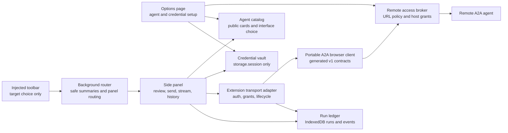
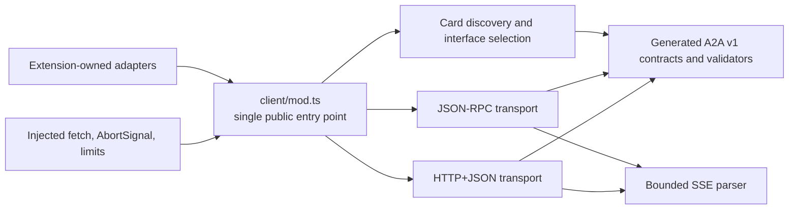
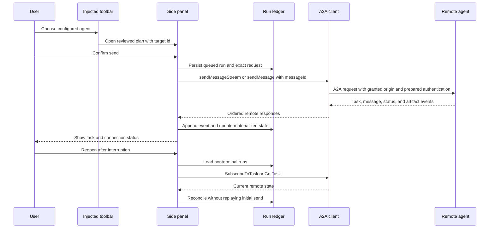
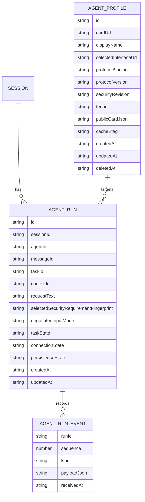
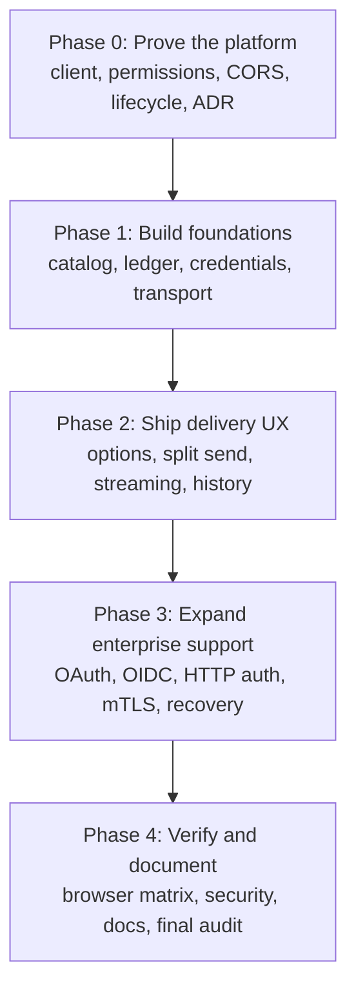
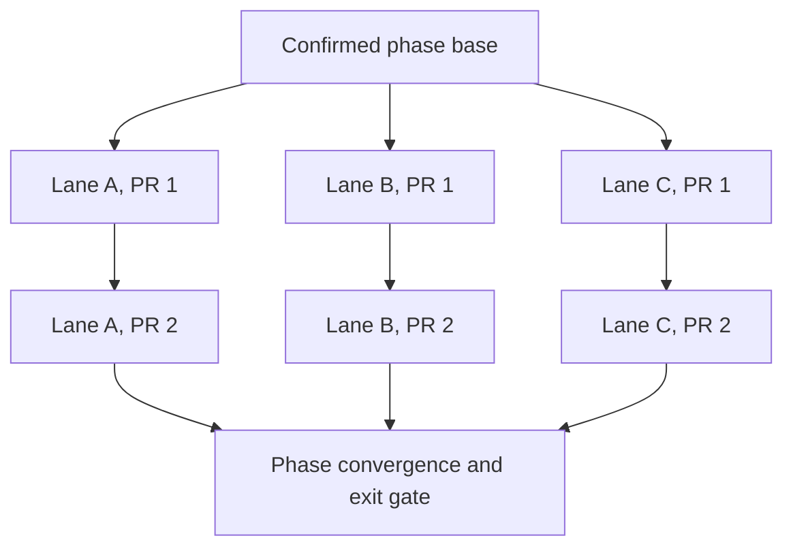

# A2A client delivery plan

> **For agentic workers:** Use `superpowers:subagent-driven-development` or
> `superpowers:executing-plans` to execute one numbered item at a time. Use `wk-pr` for every pull
> request and preserve the stack topology declared by the item.

**Goal:** Add a local-first A2A client to Point & Shoot so users can configure remote agents, review
and send the existing Markdown prompt, follow task status and streamed output, and revisit local
session and agent-run history without losing the current copy and download paths.

**Architecture:** The visible side panel owns live A2A streams. Extension-owned repositories keep
agent profiles, immutable outbound requests, task snapshots, and ordered events in IndexedDB;
extension-owned credential material lives only in `storage.session`. Cookie and mTLS material stays
in browser- or OS-managed stores, follows those stores' lifecycle, and is never copied into
extension storage. A project-owned, Web-standard client subtree owns generated A2A v1 contracts,
protocol parsing, JSON-RPC, HTTP+JSON, and SSE. Thin extension adapters own runtime permissions,
authentication, persistence, and lifecycle recovery without entering the portable subtree.

**Tech stack:** Manifest V3, Chrome service worker, Firefox event page, Preact, IndexedDB,
`storage.session`, generated A2A v1 protocol contracts, Web-standard `fetch` and streams, JSON-RPC,
HTTP+JSON, and SSE.

## How to read this plan

- **Context and goals** explain the product boundary and completion criteria.
- **Architecture reference** defines components, trust boundaries, stored records, and status
  semantics that every phase consumes.
- **Delivery phases** show the barrier order and link to agent-ready phase guides.
- **Stack execution contract** defines how concurrent agents create and land pull request stacks.
- **Sources and exclusions** distinguish protocol requirements from deliberate product scope.

The [architecture review](arch-review.md) records the failure analysis already folded into this
plan. It is rationale, not a second backlog.

## Phase 0 result

The four delivery layers are one linear review stack rooted in the SDK failure proof:

1. [PR #68](https://github.com/whizzzkid/point-and-shoot/pull/68) builds the portable browser-native
   client after [PR #66](https://github.com/whizzzkid/point-and-shoot/pull/66) proved the official
   client runtime fails on browser `Buffer` use.
2. [PR #71](https://github.com/whizzzkid/point-and-shoot/pull/71) adds optional origin grants,
   session-only storage, and the Firefox 115 floor.
3. [PR #72](https://github.com/whizzzkid/point-and-shoot/pull/72) proves two-origin discovery,
   authenticated streaming, bounded remote input, and lifecycle recovery.
4. [PR #74](https://github.com/whizzzkid/point-and-shoot/pull/74) records the accepted permission
   ADR, portable client spec, settled limits, and browser automation boundaries.

Phase 1's nine delivery items are technically unblocked by the evidence and begin after the complete
Phase 0 stack merges. The [Phase 0 guide](phase-0-prove-the-platform.md) is the authoritative status
and commit ledger.

## Context and goals

The extension already builds an image-free Markdown prompt in the plan view and exposes local copy,
Markdown download, and ZIP download actions. The injected toolbar's “Send to agent” action currently
opens that review surface; it does not perform a network request. That review boundary remains the
privacy gate for remote delivery.

This plan is complete when:

1. The options page can discover, validate, add, refresh, set as default, disconnect, and remove A2A
   agents without granting standing access to unrelated hosts.
2. The toolbar renders one accessible split action: the primary segment opens review for the default
   agent, and the arrow lists configured agents without sending from the inspected page.
3. The plan view sends the exact selected image-free Markdown through an A2A text part only after
   user review. Copy prompt, download prompt, and download bundle remain available and unchanged.
4. Every outbound request is recorded before network delivery and retains the exact text, selected
   note ids, target snapshot, message id, timestamps, and eventual task or message response.
5. The side panel streams task, message, status-update, and artifact-update events while visible,
   persists them in order, and renders A2A task state separately from local connection state.
6. Closing or suspending an extension context does not lose the durable run. Reopening reconciles
   known tasks through `SubscribeToTask` or `GetTask` without silently duplicating an uncertain
   send.
7. Session history cursor-pages every retained local session and its A2A runs. Removing an agent
   never erases historical runs, no automatic retention policy deletes sessions or responses, and
   quota failure marks the affected run history incomplete rather than silently dropping events.
   Deleting one session or using Clear all sessions transactionally deletes its associated runs and
   events after aborting active work, so remote prompts and responses do not survive the user's
   deletion request.
8. HTTP Bearer and header API-key authentication ship first. Later phases implement or explicitly
   constrain every A2A v1 security scheme declared by Agent Cards.
9. Chrome and Firefox pass unit, integration, end-to-end, visual, accessibility, manifest, and
   representative A2A smoke coverage.

### Scope boundaries

- Preserve the canonical `Session` schema. A2A records reference sessions but do not add delivery
  state to `src/shared/schema.ts`.
- Preserve the current local export actions and warning-only size behavior.
- Never fetch an agent, identity-provider, token, or key-set URL from a content script.
- Never add required `<all_urls>` or wildcard `host_permissions`. A static optional HTTPS envelope
  makes runtime-discovered hosts eligible; each host still requires a user grant, and the client
  separately enforces the configured scheme, host, port, and endpoint.
- Require HTTPS for non-loopback agents. Permit insecure HTTP only for loopback development agents
  after the permission spike proves the exact Chrome and Firefox match patterns.
- Never persist tokens, API keys, passwords, authorization codes, PKCE verifiers, client secrets, or
  authenticated extended Agent Cards to IndexedDB or `storage.local`.
- Raise Firefox's minimum from 109 to 115 when the credential vault lands. Firefox 115 is the first
  release with `storage.session`; an unreliable event-page memory shim or disk-backed fallback would
  violate the credential-lifetime contract.
- Bound every remote response before parsing or persistence. Phase 0 measures and settles card,
  metadata, key-set, JSON response, SSE-frame, and timeout budgets in the plan index; later phases
  consume those shared limits without imposing a hard cap on local copy or download actions.
- Do not introduce a native companion, public webhook receiver, remote registry, response Markdown
  renderer, task cancellation, or general multi-turn composer in this plan.
- Keep portable protocol code under `src/shared/a2a/client/` with `mod.ts` as its only supported
  import surface. That subtree may use Web-standard APIs and exact-pinned protocol dependencies but
  must not import extension permissions, storage, manifests, UI, browser shims, `Deno.*`, Node
  built-ins, or repository-specific domain records.
- Do not publish a package, add a workspace, or promise independent semantic-version compatibility
  yet. Extraction should be a directory move plus packaging metadata, not a rewrite, but package
  publication remains a separate decision when another consumer exists.

## Architecture reference

### Component map

The background router never accepts an arbitrary URL from the inspected page. Content sends only a
stored agent id; the background validates it against the catalog before writing the pending target
to `storage.session` and opening the panel. All remote bytes are rendered as text or typed metadata,
never assigned to `innerHTML`.

### Portable client boundary

Every extension caller imports the portable client through `client/mod.ts`. The subtree receives
network behavior through injected `fetch`, cancellation through `AbortSignal`, and settled remote
input limits through constructor options. Host grants, credential preparation, `storage.session`,
IndexedDB, browser lifecycle, and product error presentation remain outside. A dependency-boundary
test bundles `mod.ts` by itself and rejects imports from the rest of the extension, Node globals,
gRPC, and compatibility shims.

### Delivery and recovery flow

The side panel owns live streaming and polling because Chrome service workers can terminate after
inactivity or a slow fetch. For a card without streaming capability, the transport sends once and
polls a returned task through `GetTask`. The ledger is authoritative for local history; the remote
agent is authoritative for a known task's current A2A state. A run that loses the connection before
receiving a server task id is `delivery-unknown` and is never retried automatically because A2A
message idempotency is optional.

### Stored records

The optional interface tenant is persisted with the selected interface and included in every A2A
request to that interface. A security revision fingerprints the selected interface origin, the
selected requirement set, its scheme definitions, and requested scopes. Credentials are usable only
for that exact revision; refreshing a card into a different revision disconnects the profile until
the user reviews and reconnects it. `AgentRun` stores that revision, the negotiated input mode,
selected note ids, and a target snapshot so history remains intelligible after a session changes or
an agent profile is removed.

The run persistence state is `complete` or `incomplete`; a failed event append aborts stream
consumption and leaves the last committed event visible with an explicit storage error. Optional
values use discriminated unions in TypeScript rather than nullable-field combinations.
`AgentRunEvent` uses `[runId, sequence]` as its key so one streamed event is one append instead of a
rewrite of the complete history. Session summaries and run summaries are cursor-paged, event detail
loads only for the open run, and reconciliation is limited to the visible page with one active
operation at a time.

### Status model

The UI must never collapse remote task state and local transport state into one label.

**A2A task state:** Use the generated v1 values corresponding to `TASK_STATE_UNSPECIFIED`,
`TASK_STATE_SUBMITTED`, `TASK_STATE_WORKING`, `TASK_STATE_COMPLETED`, `TASK_STATE_FAILED`,
`TASK_STATE_CANCELED`, `TASK_STATE_INPUT_REQUIRED`, `TASK_STATE_REJECTED`, and
`TASK_STATE_AUTH_REQUIRED`. A direct `Message` response is a successful settled run without a task
id.

**Local connection state:** `queued`, `connecting`, `streaming`, `reconciling`, `disconnected`,
`delivery-unknown`, or `settled`. Connection loss never rewrites the last known A2A task state.

### Agent discovery and network access

Manifest V3 does not permit runtime manifest injection. The generated manifest therefore declares
one static optional HTTPS eligibility envelope, while `browser.permissions.request()` asks for the
narrowest scheme-and-host pattern from a user gesture. Chrome can include a port in a match pattern;
Firefox currently cannot, so its grant covers that scheme and host across ports. The client URL
policy still permits only the configured origin and endpoints. A granted host lets an extension page
or service worker perform a cross-origin request; it does not give that ability to a content script.
Standard page CORS headers are not the primary access mechanism, although phase 0 still tests
browser differences and explicit server-side Origin policies.

1. Accept an HTTPS origin, base URL, or explicit Agent Card URL. Normalize the well-known default to
   `/.well-known/agent-card.json`; reject embedded credentials, fragments, non-HTTP schemes, and
   non-loopback HTTP.
2. Request the narrowest browser-supported card-host pattern through `browser.permissions.request()`
   from the Add-agent click, while retaining the exact origin in the client allowlist.
3. Fetch and runtime-validate the public Agent Card within the shared byte and time budgets. Honor
   `Cache-Control`, `ETag`, and `Last-Modified`; never execute or remotely load card-provided
   presentation assets.
4. Select only portable-client browser transports: JSON-RPC or HTTP+JSON. gRPC remains unavailable
   in the browser. Persist the selected interface's optional tenant and include it in every request.
   If the selected interface uses another origin, require a second explicit grant.
5. Apply the same URL-policy and grant flow to OAuth metadata, token, OIDC discovery, and JWS
   key-set hosts. Never turn the background router into a caller-directed network proxy.
6. Cache only the public card persistently. Keep authenticated extended cards in `storage.session`
   for the authenticated browser session.

### Authentication roadmap

The latest A2A v1 model uses `securitySchemes` plus agent-level or skill-level
`securityRequirements`. This plan does not add skill selection, so initial delivery negotiates the
agent-level requirements. Skill-level requirements remain visible metadata; a skill-specific server
challenge becomes `AUTH_REQUIRED` or an HTTP authentication error rather than an invented client
choice. If the card has one satisfiable agent-level requirement, the client selects it. If it has
multiple satisfiable alternatives, the user must select one during connection; that stable choice is
stored by fingerprint and never changes silently because of card order, credential availability, or
an authentication failure. Every scheme inside the selected requirement remains mandatory.

Authentication is modeled as a prepared request contribution, not a header-only hook. An adapter may
contribute headers, a query parameter, browser request credentials, or a browser-managed TLS
precondition. Composition rejects collisions, cross-origin redirects, stale security revisions, and
unrequested scope changes before the portable client sends a request.

Agent Card security requirements authenticate A2A endpoint requests. `TASK_STATE_AUTH_REQUIRED`
instead represents in-task authorization and does not define a credential format. The client may
invoke an adapter only when a negotiated extension provides that mapping; otherwise it shows the
agent's request as text, lets the user fulfill it out of band, and then resumes subscription or
polling. It never places a credential in an A2A message without a separately negotiated extension.

| Scheme or flow           | Delivery decision                                                                                          |
| ------------------------ | ---------------------------------------------------------------------------------------------------------- |
| No authentication        | Supported in the first end-to-end slice.                                                                   |
| HTTP Bearer              | First authenticated slice; attach `Authorization` through the extension fetch wrapper.                     |
| Header API key           | First authenticated slice; use the card-declared header name.                                              |
| Other HTTP auth          | Phase 3 adds Basic and registered schemes that can be represented by request headers.                      |
| Query API key            | Phase 3 adds explicit URL injection with redacted logs and history.                                        |
| Cookie API key           | Phase 3 proves cross-browser cookie isolation first; request `cookies` only if implementation is safe.     |
| OAuth authorization code | Phase 3 uses `identity.launchWebAuthFlow()` with PKCE and registered extension redirects.                  |
| OAuth device code        | Phase 3 implements the card-declared device and token endpoints.                                           |
| OAuth client credentials | Phase 3 accepts credentials per browser session; it never claims a packaged client secret is confidential. |
| Deprecated OAuth flows   | Detect and explain implicit or password requirements; do not implement them.                               |
| OpenID Connect           | Phase 3 discovers metadata and validates signed ID-token issuer, audience, nonce, and time claims.         |
| Mutual TLS               | Use browser or OS certificate selection and enterprise policy when available; never package private keys.  |

If cookie credentials or mutual TLS cannot meet the same Chrome and Firefox safety contract, the
phase lands detection, an actionable unsupported state, and documented enterprise prerequisites. It
does not silently fall back to another scheme or expand into native messaging.

## Delivery phases

Phases are barriers. Each phase guide defines whether its delivery PRs form one linear stack or a
stack forest. A later phase begins only after every required PR is merged and the phase exit gate
passes.

| Phase | Guide                                                             | Stack structure                                       | Exit result                                              |
| ----- | ----------------------------------------------------------------- | ----------------------------------------------------- | -------------------------------------------------------- |
| 0     | [Prove the platform](phase-0-prove-the-platform.md)               | Four-PR stack ready for combined review               | Evidence-backed architecture and successor ADR           |
| 1     | [Build foundations](phase-1-build-foundations.md)                 | Catalog, ledger, authentication, extension adapter    | Tested non-UI A2A client foundation                      |
| 2     | [Ship delivery UX](phase-2-ship-delivery-ux.md)                   | Options, toolbar, delivery, history                   | Bearer/API-key send, stream, status, and history         |
| 3     | [Expand enterprise support](phase-3-expand-enterprise-support.md) | OAuth/OIDC, HTTP/API key, mTLS/card trust, recovery   | Full declared-scheme negotiation or explicit constraints |
| 4     | [Verify and document](phase-4-verify-and-document.md)             | Protocol tests, browser tests, quality, documentation | Cross-browser release evidence and current public docs   |

### Delivery PR inventory

The delivery plan contains 41 implementation PRs. The merged planning PR and the Phase 0
SDK-proof/replanning PR establish the implementation base; neither is an additional delivery PR. In
particular, P0.1-P0.4 are the four Phase 0 delivery PRs stacked after that proof, not replacements
for or additions to an earlier Phase 0 delivery set.

| Phase | Delivery items | Planned PRs | Topology                    |
| ----- | -------------- | ----------: | --------------------------- |
| 0     | P0.1-P0.4      |           4 | One linear stack            |
| 1     | P1.1-P1.9      |           9 | Phase-specific stack forest |
| 2     | P2.1-P2.9      |           9 | Phase-specific stack forest |
| 3     | P3.1-P3.10     |          10 | Phase-specific stack forest |
| 4     | P4.1-P4.9      |           9 | Phase-specific stack forest |
| Total | P0.1-P4.9      |          41 | Five phase barriers         |

## Stack execution contract

Phase 0 uses one linear four-PR delivery stack rooted in its SDK-proof/replanning PR because P0.3
consumes both proof foundations and P0.4 records their combined evidence. Later phases may use a
**stack forest**: one linear PR stack per lane, with multiple lanes rooted at the same confirmed
phase base. File-disjoint ownership still applies when items share a linear stack; stacking
determines review ancestry, not permission to mix concerns.

The phase coordinator hands each executor this plan, the current phase guide, and one item id. One
executor stays with a lane's linear PR stack; sibling executors work only on other currently
unblocked lanes. The coordinator owns phase-base confirmation, lane-tip landing, combined-tree
verification, and the convergence PR.

Agents executing an item must:

1. Read this file and the item's phase guide before changing code.
2. Confirm every declared dependency is merged or present in the parent branch. Never copy an
   unmerged sibling's code into another lane.
3. Name branches `feat/a2a-p<phase>-<item>-<slug>`. A stack's first PR targets the confirmed phase
   base; each child PR targets its immediate parent branch. Initialize planned branch slots when a
   stack begins, but open each PR only after that layer has a real owning commit.
4. Use `wk-pr` and the repository's stack tooling. Verify the live PR base, remote head, CI rollup,
   and tree identity rather than trusting cached stack metadata.
5. Keep one logical change per PR and commit. Every PR must pass `mise exec -- deno task ci` and its
   focused tests independently. For any change that can affect the shipped extension, finish local
   verification with `mise exec -- deno task build` after every other command that may write
   `dist/`, leaving development packages labeled for the branch tip.
6. Keep lane files disjoint. If implementation reveals an undeclared shared-file dependency, stop
   that lane, add the dependency to the phase guide, and rebase it onto the owning lane instead of
   racing edits.
7. Merge or submit stacks bottom-up. After every lane lands, fetch the phase base and verify the
   combined tree before starting the convergence item or next phase.
8. Record item status, commit, focused evidence, and newly unblocked work in the PR. The phase
   convergence item updates the shared phase guide after all lane tips land, avoiding parallel edits
   to one planning file.

## Completion gates

Every implementation PR must cover happy, sad, and edge paths, update affected specs or ADRs in the
same commit, and run the focused command listed by its item followed by `mise exec -- deno task ci`.
Visible changes also require live browser inspection and updated visual or accessibility evidence
where applicable. Any PR that affects the shipped extension must leave a final development build in
`dist/chrome/` and `dist/firefox/` after all other commands that can write those directories.

The final phase additionally runs `mise exec -- deno task e2e:full`, the Firefox smoke task, the
accessibility task, and the pinned Linux visual task. A result is claimed only for a command that
was actually run against the final combined head.

## Sources

- [What is A2A?](https://a2a-protocol.org/latest/topics/what-is-a2a/)
- [A2A key concepts](https://a2a-protocol.org/latest/topics/key-concepts/)
- [Agent discovery](https://a2a-protocol.org/latest/topics/agent-discovery/)
- [Enterprise authentication](https://a2a-protocol.org/latest/topics/enterprise-ready/#authentication)
- [A2A specification](https://a2a-protocol.org/latest/specification/)
- [A2A protocol repository](https://github.com/a2aproject/A2A)
- [Official A2A JavaScript SDK](https://github.com/a2aproject/a2a-js)
- [Chrome cross-origin network requests](https://developer.chrome.com/docs/extensions/develop/concepts/network-requests)
- [Chrome optional permissions](https://developer.chrome.com/docs/extensions/reference/api/permissions)
- [Chrome extension match patterns](https://developer.chrome.com/docs/extensions/develop/concepts/match-patterns)
- [Chrome service-worker lifecycle](https://developer.chrome.com/docs/extensions/develop/concepts/service-workers/lifecycle)
- [Firefox optional host permissions](https://developer.mozilla.org/en-US/docs/Mozilla/Add-ons/WebExtensions/manifest.json/optional_host_permissions)
- [Firefox extension match patterns](https://developer.mozilla.org/en-US/docs/Mozilla/Add-ons/WebExtensions/Match_patterns)
- [Firefox 115 extension API changes](https://developer.mozilla.org/en-US/docs/Mozilla/Firefox/Releases/115#changes_for_add-on_developers)
- [Cross-browser OAuth flow](https://developer.mozilla.org/en-US/docs/Mozilla/Add-ons/WebExtensions/API/identity/launchWebAuthFlow)
- [Extension session storage](https://developer.mozilla.org/en-US/docs/Mozilla/Add-ons/WebExtensions/API/storage)

## Exclusions

- A hosted relay, native companion, webhook receiver, or push-notification service.
- Automatic public or enterprise registry search; users add a known origin or Agent Card URL.
- gRPC in the extension runtime.
- Persisted secrets or browser-sync of credentials.
- Automatic retry of an initial delivery with an unknown outcome.
- Rendering agent-provided HTML or unsanitized Markdown.
- Automatic deletion or retention limits for sessions, runs, responses, or artifacts.
- Silent selection or fallback among alternative Agent Card security requirements.
- Changing the local export bundle or sending screenshots and ZIP bytes in the first delivery slice.
