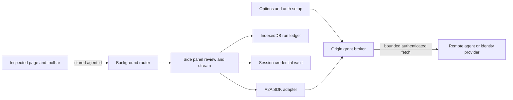
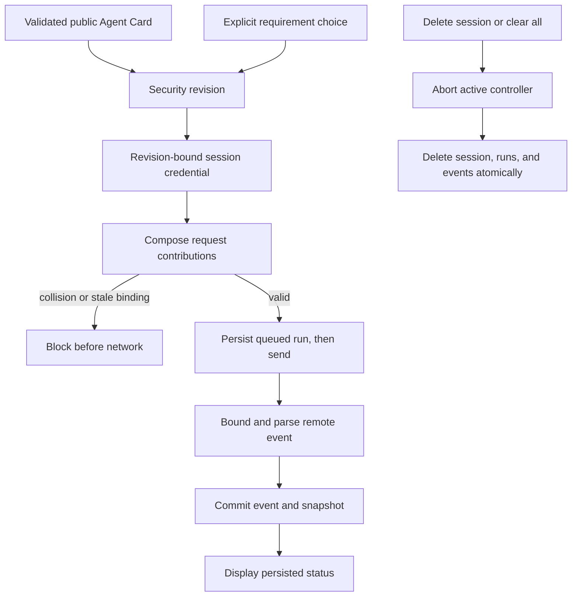

# Architecture review: A2A client delivery plan

**Reviewer role:** Distinguished engineer / principal architect

**Date:** 2026-07-31

**Document reviewed:** [A2A client delivery plan](README.md) and phase guides on branch
`plan/a2a-protocol`

## How to read this review

- **Context Block** fixes the product and operating assumptions used to rate findings.
- **Executive Summary** gives the verdict and largest residual risk.
- **Critical Findings** records falsifiable failures found and the plan changes that resolve them.
- **Underlying Assumptions** names the proofs that still gate implementation.
- **SPOF Map** shows the system boundaries and the two highest-risk state transitions.
- **Prioritised Actions** preserves risk order for the phased PR stacks.

## Context Block

- **Scale:** One local user per extension profile, a small agent catalog, potentially unbounded
  retained sessions, runs, and response events, and at most one visible live stream per side panel.
- **Top quality attributes (ranked):** 1. Security and privacy. 2. Durable, truthful history. 3.
  Cross-browser interoperability.
- **Environment:** Chrome and Firefox Manifest V3 extension contexts, local IndexedDB and
  `storage.session`, plus user-configured external A2A servers and identity providers.
- **Hard constraints:** Preserve `activeTab`-only access to inspected pages; no required
  `<all_urls>`; no persisted credentials; no remote code or HTML execution; local copy and download
  paths remain available; Deno-first exact-pinned toolchain; Chrome and Firefox are first-class.
- **Timeline:** Five barrier phases. No fixed date or supplied effort estimate; each phase exits
  only after its executable evidence passes.

## Executive Summary

The plan is accepted after thirteen findings were folded into the phase guides. The largest original
risk was an authentication boundary that could attach a valid credential to the wrong request:
header-only adapters, silent alternative selection, and credentials keyed without a card revision
could not safely implement the A2A v1 security model. The revised plan uses explicit requirement
selection, revision-bound credentials, composable request contributions, and fail-closed collision
checks. Phase 0 still blocks product implementation until the SDK, browser permission, pre-parse
input limits, streaming lifecycle, and cross-browser assumptions have executable evidence. The
2026-08-04 reconciliation against `main` found no superseded phase or new architecture finding; it
tightened preservation and verification contracts for behavior merged after the original review.

## Critical Findings

> Severity: 🔴 Critical · 🟠 High · 🟡 Medium · 🟢 Low · ℹ️ Info

#### [🔴 Critical] Clear all sessions would leave exact prompts and responses behind

- **Lens:** B - unhappy paths; E - security and trust; F - operability.
- **Where:** `README.md`, completion criterion 7; phase 1, P1.1; phase 2, P2.7-P2.9.
- **Problem:** The new `agentRuns` and `agentRunEvents` stores retain exact outbound Markdown and
  remote responses, but the existing session-deletion path only owns the `sessions` store. Without a
  cascade, an action named Clear all sessions would leave the most sensitive A2A history on disk.
- **Failure mode:** A user clears a session or all sessions, reopens history or inspects extension
  storage, and finds prompts and agent output they reasonably believed were deleted. A concurrent
  stream can also recreate an event after deletion.
- **Recommendation:** Abort matching controllers first, then transactionally delete the session, its
  runs, and its events. Make late callbacks unable to append after deletion; test rollback and
  active-stream races. The plan now assigns this contract to P1.1, P2.7-P2.9, and P4.
- **Effort:** TBD.

#### [🟠 High] A header-only authentication contract cannot represent A2A security schemes

- **Lens:** C - underlying assumptions; E - security and trust; H - delivery risk.
- **Where:** Phase 1, Shared interfaces and P1.6-P1.8; phase 3, P3.3-P3.6.
- **Problem:** The original `AuthStrategy.headers()` interface could represent Bearer and header API
  keys only. Query keys, cookies, and browser-managed mTLS need URL, request-credential, or
  transport preconditions, while combined requirements need safe composition.
- **Failure mode:** Later phases bypass the shared contract, duplicate request construction, or
  mislabel detected schemes as supported. Two schemes can overwrite a header or query parameter.
- **Recommendation:** Return typed request contributions for headers, query parameters, request
  credentials, and browser-managed TLS. Compose the complete selected requirement before transport
  and reject every collision or incompatible precondition. The shared interface and phase items now
  require this model.
- **Effort:** TBD.

#### [🟠 High] Credentials were not bound to the card definition that authorized them

- **Lens:** B - unhappy paths; E - security and trust.
- **Where:** `README.md`, Stored records and Authentication roadmap; phase 1, P1.3 and P1.6.
- **Problem:** Keying a secret by agent id and scheme name lets a refreshed card reuse that secret
  after changing the selected interface origin, header or query name, scopes, or requirement set.
  Scheme names are card-local identifiers, not durable security principals.
- **Failure mode:** A compromised or legitimately changed card causes a previously entered secret to
  be sent to a new origin or under a changed scheme without renewed user consent.
- **Recommendation:** Fingerprint interface origin, requirement choice, scheme definitions, and
  scopes as a security revision. Bind credentials and run snapshots to it; disconnect and require
  review when refresh changes it. The catalog, vault, options, and convergence items now enforce the
  binding.
- **Effort:** TBD.

#### [🟠 High] The credential store is unavailable at the declared Firefox minimum

- **Lens:** C - underlying assumptions; E - security and trust; H - delivery risk.
- **Where:** `README.md`, Scope boundaries; phase 0, P0.2 and P0.4; current browser-minimum table.
- **Problem:** The repository supports Firefox 109, but Mozilla added `storage.session` in Firefox
  115. The plan treated the API as universally available while making it the only acceptable secret
  store.
- **Failure mode:** On Firefox 109-114, agent setup throws because the API is absent. A quick
  fallback either loses credentials whenever the event page unloads or persists them to disk,
  violating the declared lifetime.
- **Recommendation:** Raise the generated Firefox minimum to 115 when the credential vault lands,
  update the settled browser-minimum documentation, and add no disk or event-page-memory fallback.
  P0.2 owns the code and plan-index change; P0.4 records the converged support table.
- **Effort:** TBD.

#### [🟠 High] Remote cards and streams had no pre-parse resource boundary

- **Lens:** A - single points of failure; B - unhappy paths; D - scalability and performance; E -
  security and trust.
- **Where:** `README.md`, Scope boundaries; phase 0, P0.3-P0.4; phase 1, P1.3 and P1.8.
- **Problem:** Host permission authorizes an untrusted server to return Agent Cards, OAuth metadata,
  JWK sets, JSON bodies, and indefinitely large SSE frames. Aborting after `response.json()` or
  whole-body buffering does not prevent memory exhaustion.
- **Failure mode:** One configured agent stalls the extension or exhausts its memory with an
  oversized or slow response before validation or persistence logic runs.
- **Recommendation:** Phase 0 must measure and settle byte limits plus request, first-byte, and idle
  timeouts. Reject a declared `Content-Length` above the budget, but accept an absent length and
  enforce streaming byte counters before parsing. Consume the shared limits in every later fetch
  path. The limits apply only to remote input, not local prompt copy or download.
- **Effort:** TBD.

#### [🟠 High] OpenID Connect validation stopped before identity-token verification

- **Lens:** B - unhappy paths; E - security and trust.
- **Where:** Phase 3, P3.2.
- **Problem:** Exact issuer matching and algorithm support are insufficient. An OIDC client must
  verify the token signature and bind issuer, audience, authorized party when applicable, nonce,
  expiry, and issued-at claims to the flow it initiated.
- **Failure mode:** A valid token issued for another client, a replayed token, or a substituted
  unsigned or incorrectly signed token establishes an authenticated session.
- **Recommendation:** Validate the ID-token signature through the granted provider JWK set and
  enforce issuer, audience, `azp`, nonce, expiry, issued-at sanity, and algorithm policy. P3.2 and
  P4 now name adversarial fixtures for each claim.
- **Effort:** TBD.

#### [🟡 Medium] Authentication alternatives had contradictory automatic-selection rules

- **Lens:** C - underlying assumptions; E - security and trust; F - operability.
- **Where:** `README.md`, Authentication roadmap; phase 3, P3.3 and P3.9.
- **Problem:** One section selected the first satisfiable requirement in card order while another
  preferred a header mechanism over a query alternative. Either policy can silently change when a
  credential expires or a card reorders alternatives.
- **Failure mode:** The extension sends through a different authentication mechanism than the user
  reviewed, or falls from a stronger organizational policy to a leak-prone query key.
- **Recommendation:** Automatically choose only when exactly one requirement is satisfiable. When
  multiple alternatives are available, require an explicit user choice, persist its fingerprint, and
  never switch on failure. The plan now uses that rule consistently.
- **Effort:** TBD.

#### [🟡 Medium] Retained history created an unbounded startup and reconciliation path

- **Lens:** D - scalability and performance; G - cost and efficiency.
- **Where:** `README.md`, Stored records; phase 1, P1.4-P1.5; phase 2, P2.7-P2.8.
- **Problem:** The product explicitly has no automatic retention limit, but the original history
  model listed every session and joined every run before rendering. Serial reconciliation bounds
  concurrency but not total startup work.
- **Failure mode:** Long-lived profiles eventually block the side panel on an O(n) IndexedDB read
  and then issue one remote request per retained nonterminal run.
- **Recommendation:** Cursor-page stable summaries, lazy-load events for the open run, and reconcile
  only nonterminal runs in the visible page with one active operation. The ledger and UI phase items
  now require those bounds.
- **Effort:** TBD.

#### [🟡 Medium] The proposed history layer could not expose corrupt session records

- **Lens:** B - unhappy paths; C - underlying assumptions; F - operability.
- **Where:** Phase 2, P2.7; current `src/shared/store.ts` and `src/sidepanel/repository.ts`.
- **Problem:** The plan promised a visible corrupt-session entry but assigned changes only to the
  side-panel layer. The current shared store validates `getAll()` results and silently skips records
  that fail validation, so the side panel cannot distinguish corruption from absence.
- **Failure mode:** One corrupt record vanishes from history and the user cannot diagnose or delete
  it, contradicting the stated failure behavior.
- **Recommendation:** P2.7 now modifies the shared store and tests, returning bounded valid and
  typed-corrupt entries through a cursor API instead of attempting to reconstruct missing evidence
  in the UI.
- **Effort:** TBD.

#### [🟡 Medium] The SDK authentication helper may violate the no-403-retry policy

- **Lens:** B - unhappy paths; C - underlying assumptions; H - delivery risk.
- **Where:** Phase 0, P0.1; phase 1, P1.7.
- **Problem:** The current SDK documents an authentication fetch helper that retries both `401` and
  `403`, while the plan permits one refresh after `401` and forbids automatic `403` retry. Assuming
  the helper is policy-compatible would hide an authorization retry in a dependency.
- **Failure mode:** A forbidden request is repeated with credentials, creating noisy audit trails or
  unexpected provider-side effects.
- **Recommendation:** P0.1 now inventories the helper behavior. P1.7 may use it only if the policy
  is configurable; otherwise a project wrapper supplies the SDK transport while enforcing one `401`
  refresh and zero `403` retries.
- **Effort:** TBD.

#### [🟡 Medium] Input-mode negotiation was mapped to a field the v1 TextPart does not have

- **Lens:** C - underlying assumptions; H - delivery risk.
- **Where:** Phase 1, P1.8.
- **Problem:** A2A v1 `TextPart` carries text; input media modes are Agent Card capability
  negotiation, not a media-type label on that part. The original wording encouraged an
  implementation field that is absent from the SDK type.
- **Failure mode:** The transport fails type-checking, invents a wire extension, or changes prompt
  bytes while trying to satisfy the selected mode.
- **Recommendation:** Send the exact Markdown in `{ text }`, negotiate `text/markdown` or
  `text/plain` against applicable input modes, and persist the chosen mode in the local run
  snapshot. The revised transport item makes that distinction explicit.
- **Effort:** TBD.

#### [🟡 Medium] Multi-origin OAuth cannot rely on one surviving browser user gesture

- **Lens:** B - unhappy paths; C - underlying assumptions; H - delivery risk.
- **Where:** Phase 2, P2.1; phase 3, P3.1.
- **Problem:** Discovery can reveal interface, metadata, token, and identity actions only after
  asynchronous work. Browser permission and identity APIs may require a fresh user gesture, so one
  Add agent click cannot safely span the complete chain.
- **Failure mode:** OAuth works in tests with pre-granted permissions but fails in a real profile
  when a later prompt is rejected for lacking a gesture.
- **Recommendation:** Model each grant and identity launch as an explicit continuation action with
  non-secret state between steps. P2.1 already uses this pattern for a second origin; P3.1 now
  applies and tests it across OAuth.
- **Effort:** TBD.

#### [🟢 Low] One split-button item targeted a file that does not exist

- **Lens:** H - delivery risk.
- **Where:** Phase 2, P2.3.
- **Problem:** The item named `src/ui/gallery/Gallery.tsx`; the current gallery entry point is
  `src/ui/gallery/index.tsx`.
- **Failure mode:** An executor creates a duplicate gallery component or stops for clarification.
- **Recommendation:** Target the existing `index.tsx`. The file list is corrected.
- **Effort:** TBD.

## Lens Coverage

| Lens                              | Result after incorporation                                                                                                        |
| --------------------------------- | --------------------------------------------------------------------------------------------------------------------------------- |
| A - Single points of failure      | SDK, access broker, ledger, and visible stream remain gates; each fails without disabling local exports.                          |
| B - Unhappy paths                 | Denial, revocation, stale auth, oversized input, deletion races, disconnect, task purge, and quota have named tests.              |
| C - Underlying assumptions        | SDK, permissions, Firefox API floor, session lifetime, auth hooks, and browser-managed mechanisms have explicit proof owners.     |
| D - Scalability and performance   | Remote bytes, history pages, event loading, streams, and reconciliation now have bounded work.                                    |
| E - Security and trust            | Exact origins, explicit auth choice, revision-bound credentials, OIDC claims, text rendering, and cascading deletion bound trust. |
| F - Operability and observability | Two-axis status, ids, redacted errors, corrupt entries, incomplete persistence, and unknown delivery remain visible.              |
| G - Cost and efficiency           | No hosted service exists; bounded browser work and explicit local quota are the relevant cost controls.                           |
| H - Delivery risk                 | Phase barriers prove the SDK and browser model before UI; PR-stack lanes own disjoint files with convergence points.              |

## Latest-main reconciliation

**Delta reviewed:** changes merged to `main` after the plan's original merge base, plus the plan
updates that preserve their contracts.

- **A - Single points of failure:** None observed. The delta adds no component, remote dependency,
  or state owner.
- **B - Unhappy paths:** Visual verification now preserves and restores the exact built manifest
  after success and failure; history verification retains generated, edited, and fallback names.
- **C - Underlying assumptions:** Current implementation and tests confirm Chrome's required
  `sidePanel` permission, native promise-only `sidePanel.open()`, branch-specific development
  `version_name`, release omission of `version_name`, and durable generated session names.
- **D - Scalability and performance:** None observed. No work bound or retention contract changed.
- **E - Security and trust boundaries:** The plan preserves target-specific required permissions; it
  does not widen Chrome or Firefox host access.
- **F - Operability and observability:** Extension-affecting PRs now finish with a development build
  so checked artifacts identify the branch tip after commands that rewrite `dist/`.
- **G - Cost and efficiency:** None observed. The delta adds no network, storage, or compute path.
- **H - Delivery risk:** No item is obsolete. Phase owners and parallel lanes remain disjoint, and
  the new checks prevent later work from regressing merged runtime and build contracts.

## Underlying Assumptions

| Assumption                                                                           | Status                                                  | Risk if wrong                                                       |
| ------------------------------------------------------------------------------------ | ------------------------------------------------------- | ------------------------------------------------------------------- |
| A stable A2A v1 SDK bundles into both targets without Node or gRPC dependencies.     | Unverified; P0.1 owns the proof.                        | Phase 1 stops for an explicit client decision.                      |
| SDK transport and auth hooks can accept the project's bounded fetch and auth policy. | Unverified; P0.1 owns the proof.                        | The adapter must wrap more of the SDK or replace it by decision.    |
| Optional host grants enable extension-context cross-origin fetch in both browsers.   | Documentation-verified; P0.3 owns runtime proof.        | Discovery and streaming require a different extension architecture. |
| Remote byte limits can be enforced before whole-body JSON and SSE parsing.           | Unverified; P0.3 owns the proof.                        | A hostile agent can exhaust extension memory.                       |
| Firefox 115 is the first supported release with `storage.session`.                   | Documentation-verified; P0.2 owns manifest enforcement. | Older Firefox fails agent setup or needs an unsafe fallback.        |
| `storage.session` survives context suspension and clears on browser restart.         | Documentation-verified; P0.3 owns runtime proof.        | Secrets disappear mid-run or persist beyond disclosure.             |
| An agent retains a known task long enough for lookup or subscription.                | Risky and server-dependent.                             | Reconciliation reports a purged task without inventing events.      |
| Cookie and mTLS paths meet one Chrome and Firefox safety contract.                   | Unverified; P3.4 and P3.6 own fixed decisions.          | The schemes remain detected but browser-managed or unsupported.     |
| Cursor paging keeps history responsive at the user's retained volume.                | Unverified; P4 load and fault tests own the proof.      | History requires a later explicit indexing or retention decision.   |

## SPOF Map

- **Official SDK wrapper** — blast radius: all A2A protocol operations; mitigation: phase-0 bundle
  and behavior proof, exact pin, and a narrow project adapter.
- **Remote access broker** — blast radius: all remote discovery and delivery; mitigation: exact
  origin policy and explicit grants while all local actions remain available.
- **Run ledger** — blast radius: durable A2A history; mitigation: transaction boundaries,
  persist-before-display, incomplete-state reporting, and cascading deletion.
- **Visible side panel** — blast radius: current live status only; mitigation: durable task ids and
  visibility-scoped lookup or subscription after remount.
- **Remote agent and identity provider** — blast radius: one configured target; mitigation: bounded
  timeouts, no automatic unknown send retry, and isolated credentials.

### High-level component and trust map

### Authentication and persistence detail

## Prioritised Actions

> Ordered by risk reduction divided by effort; estimates remain TBD because none were supplied.

1. Run P0.1-P0.3 and settle the SDK, Firefox 115 floor, permission, auth-hook, remote-input,
   timeout, and lifecycle facts before accepting the successor ADR.
2. Land the security revision, explicit requirement choice, composable auth contract, and credential
   invalidation in the phase-1 foundation.
3. Land transactional session/run/event deletion and active-controller cancellation with IndexedDB
   v2 before exposing history.
4. Keep every history and reconciliation read cursor-bounded and every remote read bounded before
   parse.
5. Ship the public, Bearer, and header API-key slice before OAuth, OIDC, cookies, and mTLS.
6. Re-run this architecture review against the combined implementation at P4.9; close no unresolved
   critical or high finding.

## What the Design Gets Right

- Remote delivery remains behind the existing review boundary, and local copy and download actions
  survive every remote failure.
- Optional host eligibility plus per-origin grants preserve `activeTab` privacy for inspected pages.
- The visible panel owns streaming while an append-only ledger supports honest restart recovery.
- A2A task state, local connection state, and persistence completeness remain separate facts.
- The phased stack forest maximizes parallel work while reserving shared integration files for
  convergence PRs.

## Empirical Review Evidence

- **PASS:** Current toolbar, plan view, and options paths were inspected; local prompt copy and both
  download actions remain independent of remote delivery in the plan.
- **FAIL corrected:** Mechanical Create/Modify target validation found `src/ui/gallery/Gallery.tsx`
  absent and `src/ui/gallery/index.tsx` present.
- **FAIL corrected:** Current `listSessions()` uses an unbounded read and drops invalid stored
  records, so P2.7 now owns a shared-store cursor and typed-corruption API.
- **FAIL corrected:** Current session deletion touches only the `sessions` store, so the plan now
  requires a transactional A2A cascade and late-write prevention.
- **FAIL corrected:** The declared Firefox 109 floor predates `storage.session`; P0.2 now raises the
  A2A-capable extension floor to Firefox 115 instead of introducing an unsafe secret-store fallback.
- **FAIL corrected:** Cross-document comparison found first-satisfiable and header-preferred auth
  rules in conflict; the revised rule requires explicit selection among multiple alternatives.
- **Unverified by design:** No A2A runtime exists on this branch. SDK, remote-fetch, auth, and
  stream state machines remain blocked behind their named executable phase gates.
