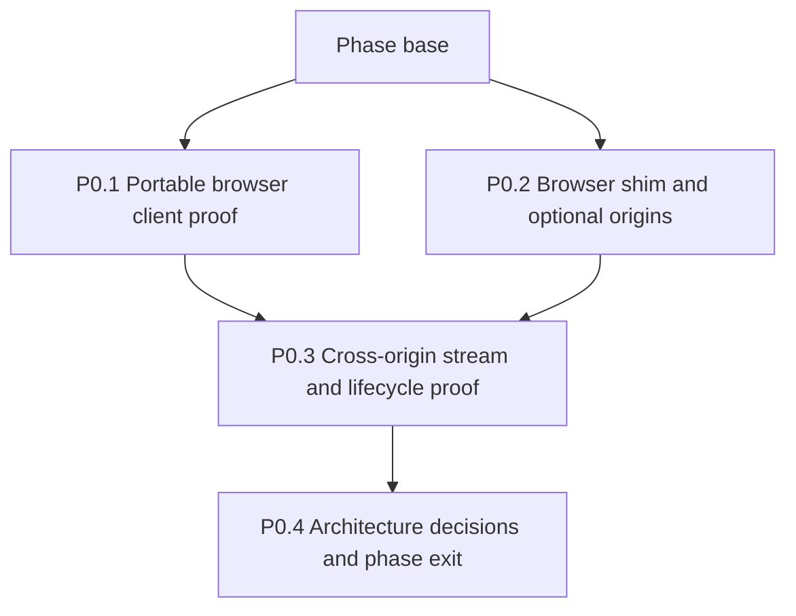

# Phase 0 - Prove the platform

## How to read this phase

- **Phase contract** defines what must be proven before product implementation begins.
- **Parallel stack map** assigns file-disjoint work to the protocol-client and browser-platform
  lanes.
- **Delivery items** provide exact artifacts, interfaces, verification, and PR boundaries.
- **Exit gate** prevents an unverified client, permission, or lifecycle assumption from entering
  phase 1.

## Phase contract

Phase 0 turns the riskiest external assumptions into executable evidence. Nothing in later phases
may hand-write or copy A2A wire types, request broad required host access, or keep a long-lived
stream in the background context to bypass a failed proof. Protocol contracts must be generated from
an official v1 schema snapshot derived from the pinned normative proto and remain inside the
portable client boundary.

**Phase base:** The merged planning PR on `main`.

**Maximum parallel width:** Two stack lanes. P0.1 and P0.2 start together. P0.3 starts after both
proof foundations land, and P0.4 records the combined decision.



## Delivery items

### P0.1 - Build and prove the portable browser client

**Marker:** `[AGENT-GUIDED]` - report measured bundle and runtime evidence in the PR before P0.4.

**Parallel safety:** Starts immediately in the protocol-client lane. It does not edit manifest or
browser-shim files owned by P0.2.

**Branch and PR:** `feat/a2a-p0-1-sdk-proof`, targeting the phase base. Retain the existing branch
name so the failed official-client proof and the browser-native replacement remain one audit trail.

**Files:**

- Modify: `deno.json`
- Delete: `src/shared/a2a/sdk.ts`
- Delete: `src/shared/a2a/sdk.test.ts`
- Create: `src/shared/a2a/client/mod.ts`
- Create: `src/shared/a2a/client/contracts.ts`
- Create: `src/shared/a2a/client/protocol.schema.json`
- Create: `src/shared/a2a/client/protocol.generated.ts`
- Create: `src/shared/a2a/client/validation.generated.ts`
- Create: `src/shared/a2a/client/validation.test.ts`
- Create: `src/shared/a2a/client/generate-protocol.ts`
- Create: `src/shared/a2a/client/generate-protocol.test.ts`
- Create: `src/shared/a2a/client/card.ts`
- Create: `src/shared/a2a/client/card.test.ts`
- Create: `src/shared/a2a/client/client.ts`
- Create: `src/shared/a2a/client/client.test.ts`
- Create: `src/shared/a2a/client/conformance.test.ts`
- Create: `src/shared/a2a/client/json-rpc.ts`
- Create: `src/shared/a2a/client/json-rpc.test.ts`
- Create: `src/shared/a2a/client/http-json.ts`
- Create: `src/shared/a2a/client/http-json.test.ts`
- Create: `src/shared/a2a/client/sse.ts`
- Create: `src/shared/a2a/client/sse.test.ts`
- Create: `src/shared/a2a/client/errors.ts`
- Modify: `build/build.ts`
- Modify: `build/build.test.ts`

**Produces:**

```ts
export type A2ATransportBinding = "JSONRPC" | "HTTP+JSON";

export interface A2AClientLimits {
  readonly cardBytes: number;
  readonly jsonBytes: number;
  readonly sseFrameBytes: number;
  readonly requestMs: number;
  readonly firstByteMs: number;
  readonly streamIdleMs: number;
}

export interface A2AClientFactoryOptions {
  readonly fetch: typeof fetch;
  readonly preferredTransports: readonly A2ATransportBinding[];
  readonly limits: A2AClientLimits;
}

export interface A2ARequestOptions {
  readonly signal: AbortSignal;
  readonly serviceParameters?: Readonly<Record<string, string>>;
}

export interface A2AClientTarget {
  readonly url: URL;
  readonly transport: A2ATransportBinding;
  readonly protocolVersion: "1.0";
  readonly tenant?: string;
}

export interface A2AClient {
  readonly target: A2AClientTarget;
  sendMessage(
    request: SendMessageRequest,
    options: A2ARequestOptions,
  ): Promise<SendMessageResponse>;
  sendMessageStream(
    request: SendMessageRequest,
    options: A2ARequestOptions,
  ): AsyncIterable<StreamResponse>;
  getTask(request: GetTaskRequest, options: A2ARequestOptions): Promise<Task>;
  subscribeToTask(
    request: SubscribeToTaskRequest,
    options: A2ARequestOptions,
  ): AsyncIterable<StreamResponse>;
}

export interface A2AClientFactory {
  resolve(cardUrl: URL, signal: AbortSignal): Promise<AgentCard>;
  select(agentCard: AgentCard): A2AClientTarget;
  create(target: A2AClientTarget): A2AClient;
}

export function createA2AClientFactory(options: A2AClientFactoryOptions): A2AClientFactory;
```

**Implementation:**

1. Preserve the failed official-client proof as PR evidence: stable `@a2a-js/sdk@1.0.1` bundles but
   uses `Buffer` in its v1 codec, and a raw part fails in Chromium with
   `ReferenceError: Buffer is not defined`. Remove the official SDK from the portable production
   graph; retain an exact test-only server pin for cross-implementation conformance. Do not adopt
   the v0.3-only `drew-foxall/a2a-js-sdk` fork, a Buffer polyfill, or copied SDK source.
2. Pin the normative A2A protocol definition to release `v1.0.0`. Store the official generated
   schema snapshot, proto URL, schema URL, source tag, SHA-256 digest, upstream Apache-2.0 license,
   and required attribution beside the generated types; record that the schema is a non-normative
   build artifact. Query the npm registry for the type and standalone-validator generators, pin
   exact stable versions in `deno.json`, and make regeneration deterministic and offline from the
   committed schema snapshot.
3. Generate `protocol.generated.ts` and standalone runtime validators from `protocol.schema.json`
   with the build-only `generate-protocol.ts`; never export the generator or edit either generated
   file. Preserve JSON wire representations, including base64 strings for raw bytes, instead of
   mapping them to Node `Buffer`. Generate validators for every accepted card, success response,
   stream event, and protocol error shape. Add a generation-check test that regenerates into a
   temporary directory and byte-compares both outputs with the committed files.
4. Treat `src/shared/a2a/client/` as a future package root. `mod.ts` is its only supported public
   entry point and exports only the documented contracts, generated protocol types, factory,
   signature primitives when added, and typed errors. Add TSDoc to every authored export and retain
   schema descriptions on generated exports. Production files in that subtree may import only
   sibling client files, exact-pinned third-party dependencies, and Web-standard APIs. They must not
   import the extension browser shim, permissions, manifests, storage, IndexedDB, UI, project domain
   records, `Deno.*`, Node built-ins, gRPC, or compatibility layers. Modules that use browser types
   add a file-local `/// <reference lib="dom" />`; do not widen the repository's global TypeScript
   libraries.
5. Require injected `fetch`, explicit `AbortSignal`, ordered transport preferences, and explicit
   limits. Keep permissions, authentication contributions, `401` refresh policy, credential storage,
   persistence, logging, and extension lifecycle outside the portable client. Extension code
   supplies a composed fetch implementation instead of the client learning extension policy.
6. Resolve a public Agent Card from an already-approved URL and validate it before use. Make
   interface selection a pure public operation that returns the URL, binding, protocol version, and
   optional tenant without performing I/O, so an extension can request the exact interface grant
   without reproducing selection logic. Select only v1 JSON-RPC or HTTP+JSON interfaces, honor the
   configured preference order, and fail closed for malformed, unsupported-version, or gRPC-only
   cards. Client creation from the selected target must also perform no I/O.
7. Implement `SendMessage`, streaming send, `GetTask`, and `SubscribeToTask` for both browser
   transports using only `fetch`, `Request`, `Response`, `ReadableStream`, `TextDecoder`, `URL`, and
   `AbortController`. Validate every parsed remote value with the generated validators before
   returning it. Keep method/path mapping and JSON envelope conversion behind transport-local
   modules so the public contract does not expose binding mechanics.
8. Implement incremental JSON and SSE readers that reject oversized declared `Content-Length`, count
   received bytes when it is absent or acceptable, enforce request, first-byte, and idle timeouts,
   and abort before whole-body buffering or parsing. P0.3 supplies the measured production values;
   P0.1 tests the configurable boundaries without inventing final numbers.
9. Return typed protocol and transport errors without including credentials or an unbounded remote
   body. Preserve safe HTTP status, A2A error code, selected binding, and retryability as structured
   fields for the extension adapter.
10. Test public factory creation, card discovery, preference order, injected fetch, both bindings,
    all four operations, tenants, service parameters, text and raw parts, malformed envelopes,
    protocol errors, HTTP errors, aborts, every byte boundary, every timeout, and gRPC-only cards.
    Add a cross-implementation suite against an OS-assigned-port official v1 JavaScript server as a
    test-only conformance oracle so a project-authored fixture cannot validate the same mistaken
    method, path, envelope, or serialization mapping. Keep all official SDK server imports outside
    the portable production graph.
11. Add a dependency-boundary test that starts at `client/mod.ts` and fails on any import outside
    the portable subtree other than allowlisted dependencies. Bundle that entry point independently
    for Chrome and Firefox and scan for `Buffer`, unresolved Node built-ins, gRPC, protobuf peers,
    and extension globals.
12. Record the minified portable-client byte delta. Unit tests must use a temporary output directory
    and must not replace the branch-labeled development packages in `dist/`. Assert that the build
    preserves the numeric `version` and branch-specific `version_name`.
13. Keep the portable client as production code. Do not publish it as a package in this phase. P3.5
    adds portable Agent Card signature primitives under the same public boundary while its
    permissioned key retrieval and trust presentation remain extension adapters.

**Verification:**

```bash
mise exec -- deno task test src/shared/a2a/client/ build/build.test.ts
mise exec -- deno task build
mise exec -- deno task lint:firefox
mise exec -- deno task ci
mise exec -- deno task build
```

Inspect `dist/chrome/` and `dist/firefox/` for Node-only imports. Record the protocol version,
schema digest, generator version, bundle delta, and browser runtime evidence in the PR body.

**Commit:** `feat(a2a): add the portable browser client`

### P0.2 - Add the cross-browser permission and session APIs

**Marker:** `[AGENT-READY]`.

**Parallel safety:** Starts immediately in the browser-platform lane. P0.1 owns the portable client
and build imports; P0.2 owns the manifest and browser shim.

**Branch and PR:** `feat/a2a-p0-2-browser-permissions`, targeting the phase base.

**Files:**

- Modify: `build/manifest.ts`
- Modify: `build/manifest.test.ts`
- Modify: `docs/plans/README.md`
- Modify: `src/shared/browser.ts`
- Modify: `src/shared/browser.test.ts`
- Create: `src/shared/a2a/remote-access.ts`
- Create: `src/shared/a2a/remote-access.test.ts`

**Produces:**

```ts
export interface RemoteOriginGrant {
  readonly origin: string;
  readonly chromePattern: string;
  readonly firefoxPattern: string;
}

export function normalizeRemoteOrigin(candidate: string): RemoteOriginGrant;
export function requestRemoteOrigin(
  permissions: BrowserShim["permissions"],
  grant: RemoteOriginGrant,
): Promise<boolean>;
```

The browser shim additionally exposes promise-based `permissions.contains`, `permissions.request`,
`permissions.remove`, `storage.session`, `identity.getRedirectURL`, `identity.launchWebAuthFlow`,
and the cookie methods needed for a later feasibility decision.

**Implementation:**

1. Add `optional_host_permissions: ["https://*/*"]` to both generated manifests. Add only browser-
   accepted loopback HTTP patterns proven by manifest tests; never add wildcard HTTP or required
   host permissions.
2. Raise `SUPPORTED.firefox` and the generated `strict_min_version` from 109 to 115, the first
   Firefox release with `storage.session`. Update the settled browser-minimum row in
   `docs/plans/README.md`. Do not emulate browser-session secret storage in a suspendable event page
   or persist a fallback to disk.
3. Do not declare optional `identity` or `cookies` API permissions yet. Phase 3 owns those
   declarations after the initial delivery slice is complete.
4. Extend the existing Chrome and Firefox adapters instead of reading `chrome.*` or `browser.*`
   elsewhere. Keep `storage.session` hidden from content scripts, and preserve Chrome's native
   promise-returning `sidePanel.open()` path instead of wrapping it as a callback API.
5. Normalize a user URL to an exact client origin plus the narrowest Chrome and Firefox permission
   patterns. Preserve a Chrome port restriction; omit the port for Firefox and enforce it in the
   client allowlist. Reject credentials in URLs, fragments, unsupported schemes, non-loopback HTTP,
   and malformed internationalized hosts.
6. Unit-test grants, denial, revocation, repeated grants, default ports, Chrome port scoping,
   Firefox's host-wide port grant, loopback hosts, and every rejected URL class against both fake
   browser globals.
7. Update the manifest permission assertion so it distinguishes required permissions, optional host
   eligibility, and runtime grants. Preserve Chrome's existing `sidePanel` grant while Firefox keeps
   the shared required-permission list. Assert that optional API permissions remain absent and both
   the shared support constant and generated Firefox manifest require 115.

**Verification:**

```bash
mise exec -- deno task test build/manifest.test.ts src/shared/browser.test.ts src/shared/a2a/remote-access.test.ts
mise exec -- deno task build
mise exec -- deno task lint:firefox
mise exec -- deno task ci
mise exec -- deno task build
```

Inspect both built manifests. Required permissions must remain unchanged per target: Chrome retains
`sidePanel`, and Firefox does not gain it.

**Commit:** `feat(extension): add optional A2A origin grants`

### P0.3 - Prove cross-origin discovery, authenticated SSE, and lifecycle recovery

**Marker:** `[AGENT-GUIDED]` - record Chrome and Firefox results and any browser-specific
limitation.

**Depends on:** P0.1 and P0.2. Start after both parallel proofs land so the fixture can use the
portable client and permission shim without copying either lane.

**Branch and PR:** `feat/a2a-p0-3-network-proof`, targeting the merged phase base after P0.1 and
P0.2 land.

**Files:**

- Create: `tests/fixtures/a2a/server.ts`
- Create: `tests/fixtures/a2a/cards.ts`
- Create: `tests/e2e/a2a-network.spec.ts`
- Create: `tests/firefox/a2a-network.ts`
- Modify: `deno.json`

**Produces:** A reusable OS-assigned-port A2A fixture with separate card and interface origins,
Bearer-protected requests, ordered SSE events, forced disconnect, polling, and task subscription.

**Implementation:**

1. Serve the public Agent Card and A2A interface from separate OS-assigned ports. Print and return
   both URLs; never reserve a fixed port.
2. Require a Bearer header on the A2A endpoint, emit `401` with `WWW-Authenticate` for a missing or
   invalid token, and expose deterministic JSON-RPC and HTTP+JSON routes.
3. Emit one task, status, artifact, and terminal event over SSE. Add fixtures for a non-streaming
   task with `GetTask` polling, malformed cards, gRPC-only cards, delayed first bytes, mid-stream
   disconnect, and recovery. Include oversized card, JSON response, and SSE-frame fixtures and prove
   the client aborts at the byte boundary before parsing or buffering the complete body.
4. Drive the permission prompt from an extension page user gesture, fetch the card through the
   portable client's public entry point, grant a second interface origin, and consume authenticated
   SSE from the visible extension page. Import no portable-client implementation file directly.
5. Close the page mid-task, reopen it, and prove recovery through subscription or polling. Do not
   attempt to keep the Chrome service worker alive for the stream.
6. Suspend and reopen the extension contexts and prove credentials survive context suspension in
   `storage.session` but disappear when session storage is cleared to model browser restart.
7. Exercise the representative path in Firefox. If Firefox cannot automate the permission prompt,
   test the grant through the shim and drive the already-granted runtime path in the smoke fixture;
   state that boundary precisely in the PR.
8. Measure safe card, metadata, key-set, JSON response, and SSE-frame limits plus request,
   first-byte, and stream-idle timeouts in both browsers. Reject a declared `Content-Length` above
   the budget; when the header is absent or acceptable, count streamed bytes and abort at the limit
   before parsing or whole-body buffering.
9. Add real `a2a:network` and `smoke:a2a-firefox` tasks only when they execute these assertions. Do
   not add a passing stub.

**Verification:**

```bash
mise exec -- deno task a2a:network
mise exec -- deno task smoke:a2a-firefox
mise exec -- deno task ci
```

**Commit:** `test(a2a): prove cross-origin streamed delivery`

### P0.4 - Record the evidence-backed architecture decisions

**Marker:** `[AGENT-READY]`.

**Depends on:** P0.1 and P0.3. Start only after both lane tips are available on the convergence
branch.

**Branch and PR:** `feat/a2a-p0-4-architecture`, targeting the merged phase base after both stacks
land.

**Files:**

- Create: `docs/adr/0019-optional-host-permissions-for-a2a.md`
- Create: `docs/specs/a2a-client.md`
- Modify: `AGENTS.md`
- Modify: `docs/adr/README.md`
- Modify: `docs/specs/README.md`
- Modify: `docs/plans/A2A-client/README.md`
- Modify: `docs/plans/A2A-client/phase-0-prove-the-platform.md`
- Modify: `docs/plans/README.md`

**Implementation:**

1. Supersede only ADR-0002's rejection of optional host permissions. Preserve its `activeTab`
   guarantee for inspected pages and explain the difference between optional eligibility and a
   granted remote-agent origin.
2. Record the proven A2A protocol version, schema digest, type-generator version, portable-client
   bundle delta, and Firefox 115 minimum. Add exact tool versions to the `AGENTS.md` version table;
   keep the schema digest in the A2A client spec. Record the supported browser transports, runtime
   origin-grant flow, loopback policy, stream owner, credential storage boundary, recovery behavior,
   pre-parse remote-input enforcement, and portable extraction boundary in that spec.
3. Include the tested failure results. Do not convert a Chrome-only observation into a cross-browser
   capability claim.
4. Run `wk-arch-review` over the ADR and spec, fold blockers into both artifacts, and record the
   review verdict before publishing.
5. Add the measured remote-input byte limits and request, first-byte, and idle timeouts to the
   settled-numbers table in `docs/plans/README.md`. Later items consume those values rather than
   choosing local constants. These remote safety limits do not cap local prompt copy or downloads.
6. Mark P0.1-P0.4 with commit and PR references and identify all phase-1 items as unblocked.

**Verification:**

```bash
mise exec -- deno task ci
```

Also re-run every P0.1 and P0.3 proof against the combined head.

**Commit:** `docs(a2a): record the client architecture`

## Phase exit gate

Phase 1 remains blocked until all statements below have executable evidence:

- The portable client bundles into both extension targets without `Buffer`, Node-only, extension,
  compatibility, or gRPC dependencies, and its generated protocol contract matches the pinned A2A v1
  schema snapshot.
- Chrome's existing minimum and Firefox 115 expose the session-only credential store required by the
  client; no older-Firefox disk or event-page memory fallback exists.
- Optional runtime grants permit extension-context cross-origin fetch without changing required host
  access or allowing content-script fetches.
- Multi-origin discovery and interface selection require and honor separate grants.
- Authenticated SSE works in the visible extension surface and recovery works after that surface
  closes.
- Remote cards, metadata, key sets, JSON responses, and SSE frames are bounded before parsing or
  whole-body buffering, with measured request, first-byte, and idle timeouts.
- The successor ADR and A2A client spec contain the proven result, limitations, and rollback path.
