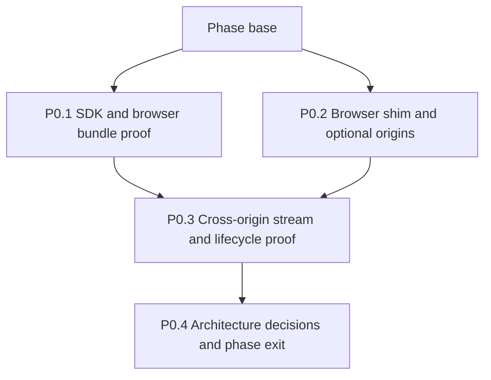

# Phase 0 - Prove the platform

## How to read this phase

- **Phase contract** defines what must be proven before product implementation begins.
- **Parallel stack map** assigns file-disjoint work to the SDK and browser-platform lanes.
- **Delivery items** provide exact artifacts, interfaces, verification, and PR boundaries.
- **Exit gate** prevents an unverified SDK, permission, or lifecycle assumption from entering
  phase 1.

## Phase contract

Phase 0 turns the riskiest external assumptions into executable evidence. Nothing in later phases
may hand-roll A2A wire types, request broad required host access, or keep a long-lived stream in the
background context to bypass a failed proof.

**Phase base:** The merged planning PR on `main`.

**Maximum parallel width:** Two stack lanes. P0.1 and P0.2 start together. P0.3 starts after both
proof foundations land, and P0.4 records the combined decision.



## Delivery items

### P0.1 - Prove the official SDK in both extension bundles

**Marker:** `[AGENT-GUIDED]` - report measured bundle and runtime evidence in the PR before P0.4.

**Parallel safety:** Starts immediately in the SDK lane. It does not edit manifest or browser-shim
files owned by P0.2.

**Branch and PR:** `feat/a2a-p0-1-sdk-proof`, targeting the phase base.

**Files:**

- Modify: `deno.json`
- Modify: `AGENTS.md`
- Create: `src/shared/a2a/sdk.ts`
- Create: `src/shared/a2a/sdk.test.ts`
- Modify: `build/build.ts`
- Modify: `build/build.test.ts`

**Produces:**

```ts
export interface A2ASdkFactoryOptions {
  readonly fetch: typeof fetch;
  readonly preferredTransports: readonly ("JSONRPC" | "HTTP+JSON")[];
}

export function createA2ASdkFactory(options: A2ASdkFactoryOptions): ClientFactory;
```

**Implementation:**

1. Query the npm registry for `@a2a-js/sdk`, select the newest stable release implementing A2A v1,
   and pin that exact version in `deno.json`. Record the same resolved version in the `AGENTS.md`
   version table. If no stable v1 release exists, stop the phase and request an explicit prerelease
   or alternative-client decision instead of silently pinning `next`.
2. Import only `@a2a-js/sdk` protocol types and `@a2a-js/sdk/client`. Never import server, Express,
   compatibility, or gRPC subpaths into an extension entry point.
3. Wrap `ClientFactory` construction in `src/shared/a2a/sdk.ts`, inject `fetch`, and restrict
   browser transport preference to JSON-RPC and HTTP+JSON.
4. Add a build test that bundles the new client module into Chrome and Firefox artifacts, scans for
   unresolved Node built-ins and gRPC peers, and records the minified byte delta in the test output.
5. Inventory and test the SDK's v1 client, authentication hook, stream, task lookup/subscription,
   and Agent Card signature-verification surfaces. Record missing or browser-incompatible surfaces
   for P0.4 instead of assuming an example from another release still applies.
6. Unit-test factory creation, transport preference, injected fetch, and failure when an Agent Card
   advertises only gRPC.
7. Keep the wrapper as production code. Do not land a throwaway spike, compatibility shim, or copied
   SDK type definition. If the client cannot bundle safely, phase 1 remains blocked pending a new
   architecture decision.

**Verification:**

```bash
mise exec -- deno test -A src/shared/a2a/sdk.test.ts build/build.test.ts
mise exec -- deno task build
mise exec -- deno task lint:firefox
mise exec -- deno task ci
```

Inspect `dist/chrome/` and `dist/firefox/` for Node-only imports. Record the exact SDK version and
bundle delta in the PR body.

**Commit:** `build(a2a): prove the browser SDK client`

### P0.2 - Add the cross-browser permission and session APIs

**Marker:** `[AGENT-READY]`.

**Parallel safety:** Starts immediately in the browser-platform lane. P0.1 owns SDK and build
imports; P0.2 owns the manifest and browser shim.

**Branch and PR:** `feat/a2a-p0-2-browser-permissions`, targeting the phase base.

**Files:**

- Modify: `build/manifest.ts`
- Modify: `build/manifest.test.ts`
- Modify: `src/shared/browser.ts`
- Modify: `src/shared/browser.test.ts`
- Create: `src/shared/a2a/remote-access.ts`
- Create: `src/shared/a2a/remote-access.test.ts`

**Produces:**

```ts
export interface RemoteOriginGrant {
  readonly origin: string;
  readonly chromePattern: string;
  readonly firefoxPattern: string;
}

export function normalizeRemoteOrigin(candidate: string): RemoteOriginGrant;
export function requestRemoteOrigin(
  permissions: BrowserShim["permissions"],
  grant: RemoteOriginGrant,
): Promise<boolean>;
```

The browser shim additionally exposes promise-based `permissions.contains`, `permissions.request`,
`permissions.remove`, `storage.session`, `identity.getRedirectURL`, `identity.launchWebAuthFlow`,
and the cookie methods needed for a later feasibility decision.

**Implementation:**

1. Add `optional_host_permissions: ["https://*/*"]` to both generated manifests. Add only browser-
   accepted loopback HTTP patterns proven by manifest tests; never add wildcard HTTP or required
   host permissions.
2. Do not declare optional `identity` or `cookies` API permissions yet. Phase 3 owns those
   declarations after the initial delivery slice is complete.
3. Extend the existing Chrome and Firefox adapters instead of reading `chrome.*` or `browser.*`
   elsewhere. Keep `storage.session` hidden from content scripts.
4. Normalize a user URL to an exact client origin plus the narrowest Chrome and Firefox permission
   patterns. Preserve a Chrome port restriction; omit the port for Firefox and enforce it in the
   client allowlist. Reject credentials in URLs, fragments, unsupported schemes, non-loopback HTTP,
   and malformed internationalized hosts.
5. Unit-test grants, denial, revocation, repeated grants, default ports, Chrome port scoping,
   Firefox's host-wide port grant, loopback hosts, and every rejected URL class against both fake
   browser globals.
6. Update the manifest permission assertion so it distinguishes required permissions, optional host
   eligibility, and runtime grants. Assert that optional API permissions remain absent.

**Verification:**

```bash
mise exec -- deno test -A build/manifest.test.ts src/shared/browser.test.ts src/shared/a2a/remote-access.test.ts
mise exec -- deno task build
mise exec -- deno task lint:firefox
mise exec -- deno task ci
```

Inspect both built manifests. The required permission list must remain unchanged.

**Commit:** `feat(extension): add optional A2A origin grants`

### P0.3 - Prove cross-origin discovery, authenticated SSE, and lifecycle recovery

**Marker:** `[AGENT-GUIDED]` - record Chrome and Firefox results and any browser-specific
limitation.

**Depends on:** P0.1 and P0.2. Start after both parallel proofs land so the fixture can use the
official SDK wrapper and permission shim without copying either lane.

**Branch and PR:** `feat/a2a-p0-3-network-proof`, targeting the merged phase base after P0.1 and
P0.2 land.

**Files:**

- Create: `tests/fixtures/a2a/server.ts`
- Create: `tests/fixtures/a2a/cards.ts`
- Create: `tests/e2e/a2a-network.spec.ts`
- Create: `tests/firefox/a2a-network.ts`
- Modify: `deno.json`

**Produces:** A reusable OS-assigned-port A2A fixture with separate card and interface origins,
Bearer-protected requests, ordered SSE events, forced disconnect, polling, and task subscription.

**Implementation:**

1. Serve the public Agent Card and A2A interface from separate OS-assigned ports. Print and return
   both URLs; never reserve a fixed port.
2. Require a Bearer header on the A2A endpoint, emit `401` with `WWW-Authenticate` for a missing or
   invalid token, and expose deterministic JSON-RPC and HTTP+JSON routes.
3. Emit one task, status, artifact, and terminal event over SSE. Add fixtures for a non-streaming
   task with `GetTask` polling, malformed cards, gRPC-only cards, delayed first bytes, mid-stream
   disconnect, and recovery.
4. Drive the permission prompt from an extension page user gesture, fetch the card, grant a second
   interface origin, and consume authenticated SSE from the visible extension page.
5. Close the page mid-task, reopen it, and prove recovery through subscription or polling. Do not
   attempt to keep the Chrome service worker alive for the stream.
6. Suspend and reopen the extension contexts and prove credentials survive context suspension in
   `storage.session` but disappear when session storage is cleared to model browser restart.
7. Exercise the representative path in Firefox. If Firefox cannot automate the permission prompt,
   test the grant through the shim and drive the already-granted runtime path in the smoke fixture;
   state that boundary precisely in the PR.
8. Add real `a2a:network` and `smoke:a2a-firefox` tasks only when they execute these assertions. Do
   not add a passing stub.

**Verification:**

```bash
mise exec -- deno task a2a:network
mise exec -- deno task smoke:a2a-firefox
mise exec -- deno task ci
```

**Commit:** `test(a2a): prove cross-origin streamed delivery`

### P0.4 - Record the evidence-backed architecture decisions

**Marker:** `[AGENT-READY]`.

**Depends on:** P0.1 and P0.3. Start only after both lane tips are available on the convergence
branch.

**Branch and PR:** `feat/a2a-p0-4-architecture`, targeting the merged phase base after both stacks
land.

**Files:**

- Create: `docs/adr/0018-optional-host-permissions-for-a2a.md`
- Create: `docs/specs/a2a-client.md`
- Modify: `docs/adr/README.md`
- Modify: `docs/specs/README.md`
- Modify: `docs/plans/A2A-client/README.md`
- Modify: `docs/plans/A2A-client/phase-0-prove-the-platform.md`

**Implementation:**

1. Supersede only ADR-0002's rejection of optional host permissions. Preserve its `activeTab`
   guarantee for inspected pages and explain the difference between optional eligibility and a
   granted remote-agent origin.
2. Record the proven SDK version, supported browser transports, runtime origin-grant flow, loopback
   policy, stream owner, credential storage boundary, and recovery behavior in the A2A client spec.
3. Include the tested failure results. Do not convert a Chrome-only observation into a cross-browser
   capability claim.
4. Run `wk-arch-review` over the ADR and spec, fold blockers into both artifacts, and record the
   review verdict before publishing.
5. Mark P0.1-P0.4 with commit and PR references and identify all phase-1 items as unblocked.

**Verification:**

```bash
mise exec -- deno task ci
```

Also re-run every P0.1 and P0.3 proof against the combined head.

**Commit:** `docs(a2a): record the client architecture`

## Phase exit gate

Phase 1 remains blocked until all statements below have executable evidence:

- The exact SDK client bundles into both extension targets without Node-only or gRPC dependencies.
- Optional runtime grants permit extension-context cross-origin fetch without changing required host
  access or allowing content-script fetches.
- Multi-origin discovery and interface selection require and honor separate grants.
- Authenticated SSE works in the visible extension surface and recovery works after that surface
  closes.
- The successor ADR and A2A client spec contain the proven result, limitations, and rollback path.
