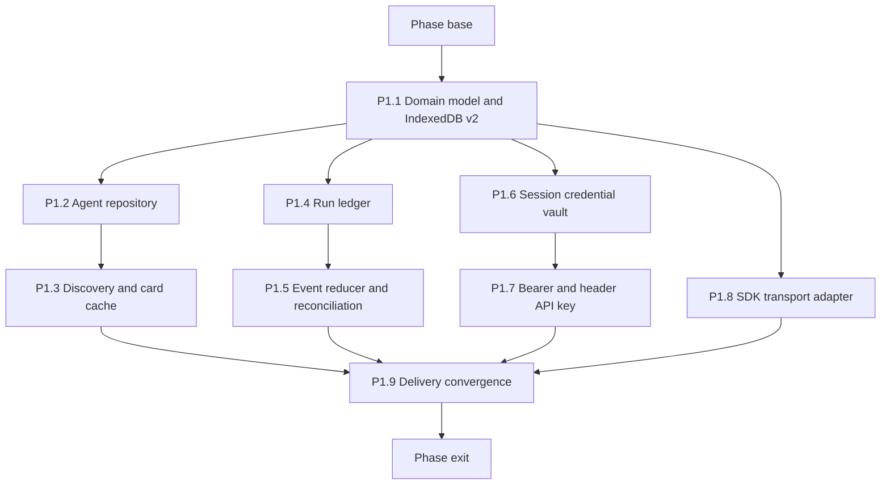

# Phase 1 - Build foundations

## How to read this phase

- **Phase contract** fixes ownership boundaries before concurrent implementation begins.
- **Parallel stack map** shows the four lanes unlocked by the common model PR.
- **Delivery items** are independently reviewable PR boundaries with explicit interfaces.
- **Exit gate** requires a complete non-UI client foundation before visible integration.

## Phase contract

Phase 1 adds an A2A-specific persistence and service layer without changing the canonical capture
`Session`. P1.1 establishes types and IndexedDB stores; four file-disjoint stacks then implement the
catalog, run ledger, credential/authentication layer, and SDK transport concurrently.

**Phase base:** `main` after phase 0 passes.

**Maximum parallel width:** Four stack lanes after P1.1.



## Shared interfaces

P1.1 owns the exact exported names below. Later lanes may implement them but must not rename or
duplicate them in their own modules.

```ts
export type AgentTransportBinding = "JSONRPC" | "HTTP+JSON";

export type AgentConnectionState =
  | "queued"
  | "connecting"
  | "streaming"
  | "reconciling"
  | "disconnected"
  | "delivery-unknown"
  | "settled";

export type AgentPersistenceState = "complete" | "incomplete";

export interface AgentTargetSummary {
  readonly id: string;
  readonly name: string;
  readonly isDefault: boolean;
  readonly authentication: "connected" | "required" | "unsupported";
}

export type AuthRequestContribution =
  | { readonly kind: "headers"; readonly values: Readonly<Record<string, string>> }
  | { readonly kind: "query"; readonly values: Readonly<Record<string, string>> }
  | { readonly kind: "credentials"; readonly value: "include" }
  | { readonly kind: "browser-managed"; readonly mechanism: "mtls" };

export interface AuthStrategy {
  supports(scheme: SecurityScheme): boolean;
  prepare(
    profile: AgentProfile,
    schemeName: string,
  ): Promise<readonly AuthRequestContribution[]>;
}

export interface AgentTransport {
  send(request: AgentSendRequest, signal: AbortSignal): AsyncIterable<StreamResponse>;
  getTask(request: AgentTaskRequest, signal: AbortSignal): Promise<Task>;
  subscribe(request: AgentTaskRequest, signal: AbortSignal): AsyncIterable<StreamResponse>;
}
```

## Delivery items

### P1.1 - Add the A2A domain model and IndexedDB v2

**Marker:** `[AGENT-READY]`.

**Parallel safety:** This is the phase root and must land before any lane starts.

**Branch and PR:** `feat/a2a-p1-1-domain-model`, targeting the phase base.

**Files:**

- Create: `src/shared/a2a/types.ts`
- Create: `src/shared/a2a/validation.ts`
- Create: `src/shared/a2a/validation.test.ts`
- Modify: `src/shared/store.ts`
- Modify: `src/shared/store.test.ts`
- Modify: `docs/specs/a2a-client.md`

**Implementation:**

1. Define discriminated `AgentProfile`, `AgentRun`, and `AgentRunEvent` records. Persist only public
   Agent Cards and the selected interface URL, binding, version, optional tenant, security revision,
   and selected requirement fingerprint; store exact request text, negotiated input mode, selected
   note ids, agent snapshot, message id, task/context ids, latest task state, connection state,
   persistence state, error category, and timestamps on a run.
2. Append IndexedDB migration version 2. Create `agents`, `agentRuns`, and `agentRunEvents` stores;
   never edit migration version 1.
3. Key run events by `[runId, sequence]`. Add indexes for agent profiles by normalized card URL,
   runs by session id, runs by agent id, runs by updated time, and events by run id.
4. Keep `SCHEMA_VERSION` in `src/shared/schema.ts` unchanged. Validate every record read from
   IndexedDB; never cast stored JSON to an A2A type.
5. Extend individual-session deletion and Clear all sessions so they first abort active controllers,
   then transactionally delete matching `sessions`, `agentRuns`, and `agentRunEvents`. Prevent late
   stream callbacks from recreating deleted history. Removing an agent still preserves run history.
6. Test fresh database creation, v1-to-v2 migration, duplicate card URLs, invalid records, aborted
   transactions, quota mapping, event ordering, delete during an active stream, transactional
   rollback, and a database blocked by an old connection.
7. Update the A2A client spec with the complete record reference and deletion semantics.

**Verification:**

```bash
mise exec -- deno task test src/shared/a2a/validation.test.ts src/shared/store.test.ts
mise exec -- deno task ci
```

**Commit:** `feat(a2a): add durable client records`

### P1.2 - Implement the agent-profile repository

**Marker:** `[AGENT-READY]`.

**Parallel safety:** First PR in the catalog stack; parallel with P1.4, P1.6, and P1.8.

**Depends on:** P1.1.

**Branch and PR:** `feat/a2a-p1-2-agent-repository`, targeting the phase base containing P1.1.

**Files:**

- Create: `src/shared/a2a/agent-repository.ts`
- Create: `src/shared/a2a/agent-repository.test.ts`

**Produces:** `listAgents`, `getAgent`, `putAgent`, `setDefaultAgent`, `softDeleteAgent`, and
`listAgentTargetSummaries` with a fresh IndexedDB connection per operation.

**Implementation:**

1. Enforce one active profile per normalized card URL and at most one active default profile in one
   transaction.
2. Soft-delete profiles so existing run foreign keys and target snapshots remain meaningful.
3. Return only non-secret target summaries to callers in content and background contexts.
4. Test default replacement, repeated add, concurrent default updates, deleted-profile exclusion,
   historical lookup, corrupt records, and transaction failure.

**Verification:**

```bash
mise exec -- deno task test src/shared/a2a/agent-repository.test.ts
mise exec -- deno task ci
```

**Commit:** `feat(a2a): add the agent catalog repository`

### P1.3 - Implement discovery, validation, interface choice, and card caching

**Marker:** `[AGENT-READY]`.

**Depends on:** P1.2. Second PR in the catalog stack, targeting P1.2's branch.

**Branch and PR:** `feat/a2a-p1-3-agent-discovery`, targeting `feat/a2a-p1-2-agent-repository`.

**Files:**

- Create: `src/shared/a2a/discovery.ts`
- Create: `src/shared/a2a/discovery.test.ts`
- Modify: `src/shared/a2a/agent-repository.ts`
- Modify: `tests/fixtures/a2a/cards.ts`

**Produces:**

```ts
export interface DiscoverAgentRequest {
  readonly cardUrl: string;
  readonly signal: AbortSignal;
}

export interface DiscoverAgentResult {
  readonly profile: AgentProfile;
  readonly additionalOrigins: readonly RemoteOriginGrant[];
}

export function discoverAgent(request: DiscoverAgentRequest): Promise<DiscoverAgentResult>;
```

**Implementation:**

1. Resolve the well-known card path, request no permissions internally, and require the caller to
   supply already-granted origins.
2. Fetch through the injected SDK-compatible fetch, runtime-validate the public card, and select the
   first supported interface in server order among JSON-RPC and HTTP+JSON. Preserve its optional
   tenant as opaque routing data.
3. Return every additional interface origin that still needs a user grant instead of fetching it.
4. Persist `ETag`, `Last-Modified`, and parsed `Cache-Control` metadata. Use conditional refreshes;
   preserve the last valid public card on `304`, and surface malformed replacements without
   overwriting it. Recompute a security revision over interface origin, requirement choice, scheme
   definitions, and scopes; a changed revision invalidates credentials and requires user review.
5. Reject redirects to ungranted origins, HTTPS downgrade, embedded credentials, required protocol
   extensions the client does not support, and cards with no browser transport.
6. Apply the settled card byte and time budgets before JSON parsing.
7. Test same-origin and multi-origin cards, cache hit/expiry, `304`, invalid JSON, oversized cards,
   security revision changes, stale credential rejection, redirect, unsupported extension, and
   gRPC-only failure.

**Verification:**

```bash
mise exec -- deno task test src/shared/a2a/discovery.test.ts src/shared/a2a/agent-repository.test.ts
mise exec -- deno task ci
```

**Commit:** `feat(a2a): discover and cache agent cards`

### P1.4 - Implement the run and event ledger

**Marker:** `[AGENT-READY]`.

**Parallel safety:** First PR in the ledger stack; parallel with P1.2, P1.6, and P1.8.

**Depends on:** P1.1.

**Branch and PR:** `feat/a2a-p1-4-run-ledger`, targeting the phase base containing P1.1.

**Files:**

- Create: `src/shared/a2a/run-repository.ts`
- Create: `src/shared/a2a/run-repository.test.ts`

**Produces:** Atomic `createRun`, `appendRunEvent`, `updateRunSnapshot`, `getRun`, cursor-paged
`listRunsForSession` and `listNonterminalRuns`, lazy `listRunEvents`, and cascading
`deleteRunsForSession` operations.

**Implementation:**

1. Create a queued run before the first network call. Store the exact Markdown request and message
   id in that transaction.
2. Allocate event sequence numbers transactionally per run. Duplicate or out-of-order remote events
   may produce separate ledger entries but must never overwrite an earlier event.
3. Update the materialized run snapshot in the same transaction as its appended event.
4. Map quota exhaustion to the existing typed storage error boundary and retain the last committed
   state. Mark the run history incomplete when that update can commit; otherwise keep the storage
   error in the active controller. Never auto-delete older history to make space.
5. Return bounded pages with opaque cursors and stable `(updatedAt, id)` ordering. Load event detail
   only for a requested run; never use an unbounded `getAll()` for retained history.
6. Test concurrent appends, rollback, pagination boundaries, ordering ties, direct-message runs
   without task ids, soft-deleted agents, missing sessions, invalid persisted records, cascading
   deletion, and quota exhaustion.

**Verification:**

```bash
mise exec -- deno task test src/shared/a2a/run-repository.test.ts
mise exec -- deno task ci
```

**Commit:** `feat(a2a): add the agent run ledger`

### P1.5 - Add event reduction and restart reconciliation

**Marker:** `[AGENT-READY]`.

**Depends on:** P1.4. Second PR in the ledger stack, targeting P1.4's branch.

**Branch and PR:** `feat/a2a-p1-5-run-reconciliation`, targeting `feat/a2a-p1-4-run-ledger`.

**Files:**

- Create: `src/shared/a2a/run-reducer.ts`
- Create: `src/shared/a2a/run-reducer.test.ts`
- Create: `src/shared/a2a/reconciliation.ts`
- Create: `src/shared/a2a/reconciliation.test.ts`

**Produces:** Pure `reduceRunEvent` plus a visibility-scoped reconciler that streams only the open
run and serially refreshes nonterminal tasks in the currently visible history page.

**Implementation:**

1. Reduce SDK stream responses into the two-axis status model without allowing a connection state to
   erase a task state.
2. Treat terminal task states and direct messages as settled. Treat `INPUT_REQUIRED` and
   `AUTH_REQUIRED` as interrupted remote states, not transport failures.
3. Preserve artifact identity and apply `append` and `lastChunk` updates in arrival order. Never
   fetch an artifact URL or interpret a binary part while reducing protocol state.
4. Reconcile a known nonterminal task through `SubscribeToTask` when streaming is advertised, then
   fall back to `GetTask` after an unsupported-subscription response or disconnect.
5. Mark a run `delivery-unknown` when initial delivery ends before a task id or direct message is
   observed. Never call the initial send method from reconciliation.
6. Never enumerate or reconcile the complete retained ledger on startup. Bound the visible page and
   keep one active network operation at a time.
7. Test every A2A task state, direct messages, artifact chunks, duplicate events, status regression,
   stale snapshots, missing task ids, subscription failure, polling failure, abort, large history,
   page changes, and panel visibility changes.

**Verification:**

```bash
mise exec -- deno task test src/shared/a2a/run-reducer.test.ts src/shared/a2a/reconciliation.test.ts
mise exec -- deno task ci
```

**Commit:** `feat(a2a): reconcile interrupted agent runs`

### P1.6 - Add the session-only credential vault and strategy registry

**Marker:** `[AGENT-READY]`.

**Parallel safety:** First PR in the authentication stack; parallel with P1.2, P1.4, and P1.8.

**Depends on:** P1.1 and P0.2's browser shim.

**Branch and PR:** `feat/a2a-p1-6-credential-vault`, targeting the phase base containing P1.1.

**Files:**

- Create: `src/shared/a2a/auth/credential-vault.ts`
- Create: `src/shared/a2a/auth/credential-vault.test.ts`
- Create: `src/shared/a2a/auth/strategy-registry.ts`
- Create: `src/shared/a2a/auth/strategy-registry.test.ts`

**Produces:** A `CredentialVault` backed only by `browser.storage.session` and a deterministic
security-requirement selector.

**Implementation:**

1. Key credentials by agent id, scheme name, and the profile's security revision. Bind each entry to
   the selected interface origin, exact scheme definition, and requested scopes. Make stored values
   readable only from trusted extension contexts and clear one agent or the complete vault without
   touching profiles or runs.
2. Model secrets as discriminated credential records. Never include a secret in an error, target
   summary, log, IndexedDB record, `storage.local`, URL history, or PR fixture.
3. A requirement is satisfiable only when every named scheme has an adapter and a credential. If
   exactly one is satisfiable, select it; if multiple are satisfiable, return them for explicit user
   selection. Persist the selected requirement fingerprint and never switch alternatives after a
   failure or because card order changes.
4. Compose typed request contributions from every scheme in the selected requirement. Reject
   duplicate headers or query parameters, conflicting request-credential modes, origin changes, and
   incompatible browser-managed preconditions before transport.
5. Return a typed unsupported result listing scheme names and kinds; never downgrade to no auth.
6. Test browser restart semantics by clearing session storage, missing and stale credentials,
   scheme-definition and scope changes, multiple alternative sets, explicit selection, multi-scheme
   collisions, unsupported schemes, and redacted errors.

**Verification:**

```bash
mise exec -- deno task test src/shared/a2a/auth/credential-vault.test.ts src/shared/a2a/auth/strategy-registry.test.ts
mise exec -- deno task ci
```

**Commit:** `feat(a2a): add session-only credentials`

### P1.7 - Implement HTTP Bearer and header API-key authentication

**Marker:** `[AGENT-READY]`.

**Depends on:** P1.6. Second PR in the authentication stack, targeting P1.6's branch.

**Branch and PR:** `feat/a2a-p1-7-header-auth`, targeting `feat/a2a-p1-6-credential-vault`.

**Files:**

- Create: `src/shared/a2a/auth/header-auth.ts`
- Create: `src/shared/a2a/auth/header-auth.test.ts`
- Modify: `src/shared/a2a/auth/strategy-registry.ts`

**Implementation:**

1. Support `httpAuthSecurityScheme.scheme` equal to Bearer, case-insensitively, and
   `apiKeySecurityScheme.location` equal to header.
2. Use the card-declared API-key header name. Reject forbidden, A2A-reserved, hop-by-hop, cookie,
   origin, and proxy authorization header names.
3. Attach credentials through the SDK authentication fetch hook. On `401`, consume
   `WWW-Authenticate`, refresh headers at most once, and never retry `403` automatically. Use the
   SDK authentication helper only if P0.1 proves it supports that policy; otherwise keep the SDK
   transport and provide the project fetch wrapper.
4. Redact authorization and API-key values from errors and test diagnostics.
5. Test valid headers, malformed schemes, forbidden header names, missing credentials, one `401`
   refresh, repeated `401`, `403`, abort, and concurrent requests using independent credentials.

**Verification:**

```bash
mise exec -- deno task test src/shared/a2a/auth/header-auth.test.ts src/shared/a2a/auth/strategy-registry.test.ts
mise exec -- deno task ci
```

**Commit:** `feat(a2a): support header authentication`

### P1.8 - Implement the SDK transport adapter

**Marker:** `[AGENT-READY]`.

**Parallel safety:** First PR in the transport stack; parallel with P1.2, P1.4, and P1.6.

**Depends on:** P1.1 and P0.1's SDK wrapper.

**Branch and PR:** `feat/a2a-p1-8-sdk-transport`, targeting the phase base containing P1.1.

**Files:**

- Create: `src/shared/a2a/transport.ts`
- Create: `src/shared/a2a/transport.test.ts`

**Produces:** The `AgentTransport` implementation using the selected public Agent Card interface,
`A2A-Version`, injected authenticated fetch, per-call `AbortSignal`, and SDK response types.

**Implementation:**

1. Create a client from the already-validated Agent Card. Never let the SDK re-fetch an ungranted
   URL behind the permission broker, and include the selected interface's tenant in every request
   when present.
2. Send the exact Markdown as one v1 user `TextPart` with a stable client-generated message id.
   Negotiate `text/markdown` when the selected agent or skill input modes accept it, otherwise
   `text/plain`; store that negotiated mode in the run snapshot, but do not invent a media-type
   field on `TextPart`. Block cards whose applicable input modes accept neither. Derive accepted
   output modes from the card.
3. Use streaming send only when the card advertises streaming. Otherwise call non-streaming send
   with immediate task return where supported, yield its single response through the same adapter,
   and let reconciliation poll a known nonterminal task with `GetTask`.
4. Expose streaming, task lookup, and task subscription as typed methods. Convert SDK or HTTP errors
   into project error categories without dropping the original safe status and error code.
5. Enforce the phase-0 settled JSON response, SSE-frame, request, first-byte, and idle budgets
   before parsing or buffering remote data.
6. Reject a card version or required extension the client does not support. Do not enable the v0.3
   compatibility layer in this phase.
7. Test JSON-RPC and HTTP+JSON, tenant routing, input-mode negotiation, streamed and non-streaming
   send, direct message, task response, polling, version rejection, oversized or malformed response,
   oversized SSE frame, protocol error, HTTP error, abort, and each timeout.

**Verification:**

```bash
mise exec -- deno task test src/shared/a2a/transport.test.ts
mise exec -- deno task ci
```

**Commit:** `feat(a2a): add the browser transport adapter`

### P1.9 - Orchestrate durable send and streamed persistence

**Marker:** `[AGENT-READY]`.

**Depends on:** P1.3, P1.5, P1.7, and P1.8. This is the phase convergence PR and starts only after
all four lane tips land.

**Branch and PR:** `feat/a2a-p1-9-delivery-orchestrator`, targeting the merged phase base.

**Files:**

- Create: `src/shared/a2a/delivery.ts`
- Create: `src/shared/a2a/delivery.test.ts`
- Modify: `docs/specs/a2a-client.md`

**Produces:** `sendAgentPrompt` as an async iterable of persisted `AgentRun` snapshots.

**Implementation:**

1. Build the immutable run request, persist it as queued, resolve authentication, and only then call
   the transport.
2. Persist every received event before yielding the updated snapshot to UI callers. If an event
   cannot persist, abort remote consumption and expose incomplete history rather than showing an
   unrecorded event.
3. Abort when the caller closes the visible run, record `disconnected`, and leave the remote task
   unchanged for later reconciliation. Session deletion aborts first and transactionally removes the
   run and events; an aborted callback cannot append after deletion.
4. Record `delivery-unknown` when no remote identifier was observed. Never auto-retry the send.
5. Test successful public and Bearer sends, storage failure before network, auth failure, disconnect
   before and after task id, event-persistence failure, direct message, terminal task, and abort.
6. Reconcile the catalog, ledger, credential, transport, and delivery contracts in the A2A client
   spec after the four lane implementations are present.

**Verification:**

```bash
mise exec -- deno task test src/shared/a2a/delivery.test.ts
mise exec -- deno task ci
```

**Commit:** `feat(a2a): persist streamed agent delivery`

## Phase exit gate

Phase 2 starts only after all four lane stacks land and the combined head proves:

- Public cards, selected interfaces, and cache validators persist without secrets.
- The credential vault survives context suspension but clears on browser restart.
- Bearer and header API-key requirements are negotiated from the card without a no-auth fallback.
- An immutable run exists before network delivery and every stream event is ordered durably.
- Credentials are bound to an explicit requirement fingerprint and security revision, and composed
  request contributions fail closed on collisions.
- Session deletion and Clear all sessions remove associated runs and events without a late-write
  race.
- Known tasks reconcile without replaying the initial send; unknown outcomes remain explicit.
- Every new IndexedDB record is runtime-validated, and the canonical session schema remains
  version 1.
