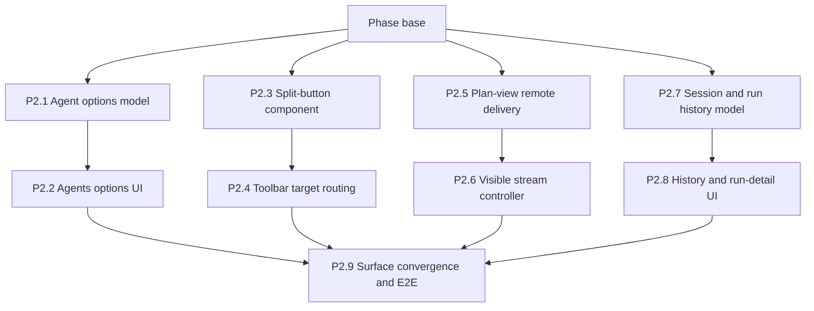

# Phase 2 - Ship delivery UX

## How to read this phase

- **Phase contract** defines the first useful end-to-end product slice.
- **Parallel stack map** isolates options, toolbar, delivery, and history files for concurrent work.
- **Delivery items** define visible behavior, failure behavior, and focused verification.
- **Exit gate** requires public, Bearer, and header API-key delivery across the complete review
  flow.

## Phase contract

Phase 2 makes the phase-1 client visible without weakening the current review and export behavior.
Four stack lanes build independently behind phase-1 interfaces; P2.9 is the only convergence PR.

**Phase base:** `main` after phase 1 passes.

**Maximum parallel width:** Four stack lanes.



## Delivery items

### P2.1 - Add the agent-options model and permission workflow

**Marker:** `[AGENT-READY]`.

**Parallel safety:** First PR in the options stack; parallel with P2.3, P2.5, and P2.7.

**Branch and PR:** `feat/a2a-p2-1-options-model`, targeting the phase base.

**Files:**

- Create: `src/options/agents-model.ts`
- Create: `src/options/agents-model.test.ts`
- Modify: `src/options/repository.ts`
- Modify: `src/options/repository.test.ts`

**Produces:** An options controller with `loadAgents`, `beginAddAgent`, `grantAdditionalOrigin`,
`connectHeaderCredential`, `refreshAgent`, `setDefaultAgent`, `disconnectAgent`, and `removeAgent`.

**Implementation:**

1. Model Add agent as explicit states: editing URL, requesting card origin, discovering card,
   requesting interface origin, requiring authentication, ready to save, and failed.
2. Keep every permission request in the originating user-click call stack. If discovery reveals a
   second origin after the first asynchronous grant, stop and expose a separate grant action.
3. Save a profile only after card validation and supported-interface selection. A denied grant or
   failed discovery leaves no partial profile.
4. Accept Bearer and card-declared header API-key credentials into `storage.session`; never echo the
   value back after save.
5. Removing a profile soft-deletes it, clears its session credentials, and revokes an origin only
   when no other active profile or credential endpoint uses that origin.
6. Test every state transition, repeated click, denial, multi-origin continuation, authenticated
   card retry, refresh failure, disconnect, shared-origin removal, and repository failure.

**Verification:**

```bash
mise exec -- deno test -A src/options/agents-model.test.ts src/options/repository.test.ts
mise exec -- deno task ci
```

**Commit:** `feat(options): add A2A agent management`

### P2.2 - Add the Agents options section

**Marker:** `[AGENT-READY]`.

**Depends on:** P2.1. Second PR in the options stack, targeting P2.1's branch.

**Branch and PR:** `feat/a2a-p2-2-agents-ui`, targeting `feat/a2a-p2-1-options-model`.

**Files:**

- Modify: `src/options/Options.tsx`
- Modify: `src/options/options.css`
- Modify: `src/options/Options.browser.test.ts`
- Modify: `tests/e2e/options-harness.tsx`
- Modify: `docs/specs/settings.md`
- Create: `docs/specs/a2a-agents.md`

**Implementation:**

1. Add an Agents section to the existing options navigation. Show active profiles, default status,
   card URL, chosen interface, protocol version, streaming capability, and authentication state.
2. Add an accessible form for a base or Agent Card URL. Explain each permission before the browser
   prompt and render both the exact configured origin and the browser's host permission pattern in
   mono type.
3. Render separate actions for second-origin permission, Bearer or API-key connection, refresh, set
   default, disconnect, and remove. Never display a saved credential value.
4. Treat remote descriptions and skill names as text. Do not load `iconUrl`, remote HTML, or other
   card-provided assets.
5. Keep one accent-blue interactive action per view, sentence-case copy, border-defined cards,
   keyboard order, focus restoration, and both forced themes.
6. Cover empty, loading, permission-denied, invalid card, unsupported transport, auth-required,
   connected, refresh-failed, shared-origin, and removed states.

**Verification:**

```bash
mise exec -- deno test -A src/options/Options.browser.test.ts src/options/agents-model.test.ts
mise exec -- deno task a11y
mise exec -- deno task ci
```

Run the options harness in a real browser and capture both forced themes for the later visual
update.

**Commit:** `feat(options): add the Agents section`

### P2.3 - Add an accessible split-button primitive

**Marker:** `[AGENT-READY]`.

**Parallel safety:** First PR in the toolbar stack; parallel with P2.1, P2.5, and P2.7.

**Branch and PR:** `feat/a2a-p2-3-split-button`, targeting the phase base.

**Files:**

- Create: `src/ui/components/SplitButton.tsx`
- Create: `src/ui/components/SplitButton.browser.test.ts`
- Modify: `src/ui/components/components.css`
- Modify: `src/ui/components/index.ts`
- Modify: `src/ui/gallery/Gallery.tsx`

**Produces:** A controlled split button with one primary action and an adjacent menu trigger. Menu
items carry ids and labels; the component owns keyboard navigation, focus return, outside click, and
`Escape`, but not target persistence.

**Implementation:**

1. Use one labelled control group. Give the arrow segment an accessible name that includes the
   primary action's purpose.
2. Support pointer activation, Enter, Space, ArrowDown, ArrowUp, Home, End, `Escape`, Tab dismissal,
   outside pointer dismissal, disabled primary action, disabled items, and an empty state.
3. Keep the primary and arrow segments visually one control. Do not add scale, spring, darkening
   hover, or a second accent.
4. Render menu labels as text and expose the selected item without encoding application behavior in
   the primitive.
5. Add gallery states for closed, open, disabled, empty, long labels, and both themes.

**Verification:**

```bash
mise exec -- deno test -A src/ui/components/SplitButton.browser.test.ts
mise exec -- deno task a11y
mise exec -- deno task ci
```

Inspect the gallery by keyboard and pointer in both themes.

**Commit:** `feat(ui): add an accessible split button`

### P2.4 - Route toolbar target choices without remote page access

**Marker:** `[AGENT-READY]`.

**Depends on:** P2.3 and phase-1 target summaries. Second PR in the toolbar stack, targeting P2.3's
branch after rebasing it onto the phase base that contains the catalog API.

**Branch and PR:** `feat/a2a-p2-4-toolbar-targets`, targeting `feat/a2a-p2-3-split-button`.

**Files:**

- Modify: `src/shared/messages.ts`
- Modify: `src/shared/messages.test.ts`
- Modify: `src/background/index.ts`
- Create: `src/background/index.test.ts`
- Modify: `src/content/index.ts`
- Modify: `src/content/toolbar/FloatingToolbar.tsx`
- Modify: `src/content/toolbar/toolbar.css`
- Modify: `src/content/toolbar/toolbar.browser.test.ts`

**Produces:** Typed requests for safe target summaries and `OpenPlanForAgent(agentId)`. The
background validates ids, writes the pending target to `storage.session`, and opens the side panel.

**Implementation:**

1. Replace the toolbar button with `SplitButton`. The primary segment selects the default agent when
   available; the arrow lists active target summaries and an “Manage agents” options action.
2. Keep the action disabled only when the session has zero notes. No configured agent still opens
   the plan view, where the user can choose local actions or navigate to Agents settings.
3. Fetch only safe summaries through the background. Never expose card JSON, credentials, run
   history, or a generic URL-fetch message to content.
4. Validate the supplied agent id in the background before setting the pending target. A deleted or
   unknown id opens review with no remote target and an actionable status.
5. Cover default, non-default, no agents, disconnected agent, deleted race, summary failure, panel
   failure, keyboard menu, `Escape`, remount, and both themes.

**Verification:**

```bash
mise exec -- deno test -A src/shared/messages.test.ts src/background/index.test.ts src/content/toolbar/toolbar.browser.test.ts
mise exec -- deno task a11y
mise exec -- deno task ci
```

Inspect the real injected toolbar without granting a remote origin; opening target selection must
perform no network request.

**Commit:** `feat(toolbar): select an A2A target`

### P2.5 - Add reviewed remote delivery to the plan view

**Marker:** `[AGENT-READY]`.

**Parallel safety:** First PR in the delivery stack; parallel with P2.1, P2.3, and P2.7.

**Branch and PR:** `feat/a2a-p2-5-plan-delivery`, targeting the phase base.

**Files:**

- Create: `src/sidepanel/plan/agent-delivery.ts`
- Create: `src/sidepanel/plan/agent-delivery.test.ts`
- Modify: `src/sidepanel/plan/PlanView.tsx`
- Modify: `src/sidepanel/plan/PlanView.browser.test.ts`
- Modify: `src/sidepanel/sidepanel.css`
- Modify: `docs/specs/export-bundle.md`

**Implementation:**

1. Load the pending or default target and display it next to the existing privacy disclosure. Allow
   target change from configured agents before send.
2. Generate remote request text through the same image-free Markdown projection used by Copy prompt
   and Download prompt. Do not send ZIP bytes, screenshots, or a separate serializer output.
3. Add Send to agent as a distinct reviewed action. Keep Copy prompt, Download prompt, and Download
   bundle in their current order and available during remote-target errors.
4. Disable remote send for an empty note selection, invalid prompt projection, missing grant,
   missing credential, unsupported auth, or active send. Preserve the current warning-only size
   behavior.
5. Display the exact target origin and data disclosure before confirmation. A failed remote action
   does not change selection, clear local actions, or end the session.
6. Test public, Bearer, and API-key send dispatch; no target; disconnected target; empty selection;
   over-warning-size prompt; storage error; auth error; network error; and duplicate-click guard.

**Verification:**

```bash
mise exec -- deno test -A src/sidepanel/plan/agent-delivery.test.ts src/sidepanel/plan/PlanView.browser.test.ts
mise exec -- deno task a11y
mise exec -- deno task ci
```

**Commit:** `feat(sidepanel): send a reviewed prompt to an agent`

### P2.6 - Stream and reconcile the visible run

**Marker:** `[AGENT-READY]`.

**Depends on:** P2.5. Second PR in the delivery stack, targeting P2.5's branch.

**Branch and PR:** `feat/a2a-p2-6-stream-status`, targeting `feat/a2a-p2-5-plan-delivery`.

**Files:**

- Create: `src/sidepanel/agent-run-controller.ts`
- Create: `src/sidepanel/agent-run-controller.test.ts`
- Create: `src/sidepanel/AgentRunStatus.tsx`
- Create: `src/sidepanel/AgentRunStatus.browser.test.ts`
- Modify: `src/sidepanel/plan/PlanView.tsx`
- Modify: `src/sidepanel/sidepanel.css`

**Implementation:**

1. Start the phase-1 delivery async iterable from the visible panel and render each persisted
   snapshot. Abort on unmount or target change; do not delegate the stream to background.
2. Show separate remote task and local connection labels, ordered status messages, text parts from
   messages and artifacts, artifact names/media types, timestamps, and redacted errors.
3. Render remote text through text nodes. Show structured or binary artifact metadata without
   interpretation, and never fetch an artifact URL. Provide no HTML execution, remote image load, or
   Markdown interpretation.
4. On remount, reconcile a known nonterminal task. For `delivery-unknown`, explain why automatic
   retry is unsafe and expose only a deliberate new-send action with a new message id.
5. Show `INPUT_REQUIRED` as paused with the agent's safe status message. Show `AUTH_REQUIRED` as a
   distinct in-task authorization request; phase 3 adds negotiated or out-of-band continuation.
6. Test unmount abort, stream event ordering, direct response, text-artifact chunks, every task
   state, reconnect, polling fallback, unknown outcome, malformed remote text, storage quota, and
   two concurrent run records.

**Verification:**

```bash
mise exec -- deno test -A src/sidepanel/agent-run-controller.test.ts src/sidepanel/AgentRunStatus.browser.test.ts
mise exec -- deno task a11y
mise exec -- deno task ci
```

**Commit:** `feat(sidepanel): stream A2A run status`

### P2.7 - Add the complete local session and run-history model

**Marker:** `[AGENT-READY]`.

**Parallel safety:** First PR in the history stack; parallel with P2.1, P2.3, and P2.5.

**Branch and PR:** `feat/a2a-p2-7-history-model`, targeting the phase base.

**Files:**

- Modify: `src/sidepanel/repository.ts`
- Modify: `src/sidepanel/repository.test.ts`
- Create: `src/sidepanel/history-model.ts`
- Create: `src/sidepanel/history-model.test.ts`

**Produces:** `listSessionHistory`, `loadHistoricalSession`, `listSessionRuns`, `loadRunDetail`, and
a derived session/run tree sorted by session update time and run creation time.

**Implementation:**

1. Extend the repository to list every validated session rather than only the displayed or active
   one. Keep the existing `load()` behavior for current-session startup.
2. Join sessions and runs in the model, not IndexedDB. Preserve orphaned run summaries with their
   stored target snapshot if a session record is corrupt or manually removed.
3. Never auto-delete or truncate history. Surface validation and quota errors per affected entry so
   one corrupt record does not hide valid sessions.
4. Test active and completed sessions, empty history, multiple runs, removed agent, missing session,
   corrupt session, corrupt run, concurrent save during list, and stable ordering.

**Verification:**

```bash
mise exec -- deno test -A src/sidepanel/repository.test.ts src/sidepanel/history-model.test.ts
mise exec -- deno task ci
```

**Commit:** `feat(sidepanel): add session and run history`

### P2.8 - Add history and run-detail views

**Marker:** `[AGENT-READY]`.

**Depends on:** P2.7. Second PR in the history stack, targeting P2.7's branch.

**Branch and PR:** `feat/a2a-p2-8-history-ui`, targeting `feat/a2a-p2-7-history-model`.

**Files:**

- Create: `src/sidepanel/HistoryView.tsx`
- Create: `src/sidepanel/HistoryView.browser.test.ts`
- Create: `src/sidepanel/RunDetailView.tsx`
- Create: `src/sidepanel/RunDetailView.browser.test.ts`
- Create: `src/sidepanel/history.css`

**Implementation:**

1. Render a history view with every retained session, note count, capture status, and nested A2A run
   summaries. Completed local sessions remain openable and exportable.
2. Render run detail from the immutable request and ordered event ledger, including target snapshot,
   remote identifiers, two-axis status, message and text-artifact responses, other artifact
   metadata, and safe errors.
3. Add explicit Refresh for nonterminal known tasks. Do not reconnect every historical run with an
   unbounded fan-out; serially refresh nonterminal summaries while the history view is visible and
   stream only the open run.
4. Keep remote values in mono type where technical and use text-only rendering. Preserve focus when
   moving among notes, history, run detail, and back navigation.
5. Cover empty, large, active, completed, failed, interrupted, unknown-outcome, removed-agent,
   missing-session, corrupt-entry, and quota-warning states in both themes.
6. Keep history styles in the history lane's own stylesheet. Import it from `HistoryView` so this
   parallel stack never edits the delivery lane's shared side-panel stylesheet.

**Verification:**

```bash
mise exec -- deno test -A src/sidepanel/HistoryView.browser.test.ts src/sidepanel/RunDetailView.browser.test.ts
mise exec -- deno task a11y
mise exec -- deno task ci
```

**Commit:** `feat(sidepanel): show session delivery history`

### P2.9 - Integrate surfaces and prove the first end-to-end slice

**Marker:** `[AGENT-READY]`.

**Depends on:** P2.2, P2.4, P2.6, and P2.8. This convergence PR starts after all four stack tips
land; it is not assigned concurrently with a lane.

**Branch and PR:** `feat/a2a-p2-9-delivery-e2e`, targeting the merged phase base.

**Files:**

- Modify: `src/sidepanel/NotesPanel.tsx`
- Modify: `src/sidepanel/NotesPanel.browser.test.ts`
- Modify: `src/sidepanel/index.tsx`
- Modify: `tests/e2e/full-flow.spec.ts`
- Create: `tests/e2e/a2a-delivery.spec.ts`
- Modify: `tests/visual/visual-manifest.test.ts`
- Modify: `docs/specs/a2a-client.md`
- Modify: `docs/specs/a2a-agents.md`

**Implementation:**

1. Add notes, plan, history, and run-detail navigation without discarding unsaved local note edits.
2. Consume and clear the pending target from `storage.session` exactly once when opening plan
   review.
3. Drive the complete path: add agent, grant card and interface origins, connect Bearer or API key,
   capture notes, choose target in the toolbar, review selection, send, stream terminal response,
   reopen history, and inspect the exact request and result.
4. Add sad paths for denied permission, revoked permission, `401`, `403`, disconnect after task id,
   disconnect before task id, panel close/reopen, invalid event, and persistence failure.
5. Update visual-manifest expectations for Agents options, split toolbar, remote plan, history, and
   run detail. Phase 4 captures final baselines after enterprise auth UI settles.

**Verification:**

```bash
mise exec -- deno task e2e:full
mise exec -- deno test -A tests/e2e/a2a-delivery.spec.ts
mise exec -- deno task a11y
mise exec -- deno task ci
```

Run a live Chrome extension flow against the OS-assigned-port fixture and inspect console output for
secret or captured-page data leakage.

**Commit:** `test(a2a): prove reviewed streamed delivery`

## Phase exit gate

Phase 3 begins only when Chrome's complete first slice and Firefox's representative path prove:

- Agents can be added through per-origin grants and session-only Bearer or API-key credentials.
- Toolbar target choice opens review but performs no remote request.
- Remote send uses the exact local Markdown projection and leaves all local actions intact.
- Ordered streamed or polled task events and response text survive panel close and reopen.
- History exposes every retained session and run without automatic deletion.
- Unknown initial-delivery outcomes, permission revocation, auth failure, and storage failure are
  explicit and do not silently retry or erase local data.
