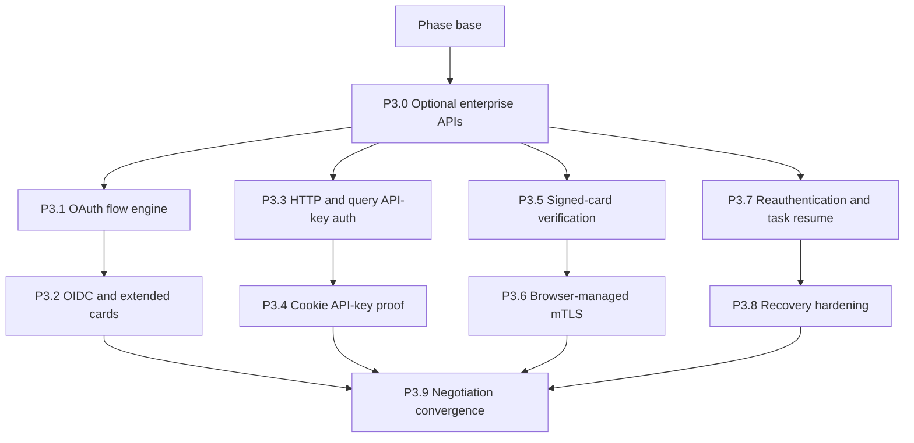

# Phase 3 - Expand enterprise support

## How to read this phase

- **Phase contract** defines what “plan for every security mechanism” means in a browser extension.
- **Parallel stack map** separates OAuth/OIDC, HTTP/API-key, trust, and recovery work.
- **Delivery items** include explicit fallback rules when the browser cannot safely own a
  credential.
- **Exit gate** requires accurate Agent Card negotiation rather than universal-success claims.

## Phase contract

Phase 3 expands the first Bearer/API-key slice across A2A v1 security declarations. A mechanism is
supported only when Chrome and Firefox can meet the same credential and origin-safety contract.
Browser- or enterprise-managed mTLS counts as supported when the network stack completes the
handshake; private-key provisioning never becomes extension responsibility.

**Phase base:** `main` after phase 2 passes.

**Maximum parallel width:** Four stack lanes after P3.0 declares the phase-owned optional APIs. P3.9
converges the lane tips and is the only owner of shared auth registration and enterprise UI.



## Delivery items

### P3.0 - Declare phase-owned optional enterprise APIs

**Marker:** `[AGENT-READY]`.

**Parallel safety:** This is the phase root and must land before the four stacks start.

**Branch and PR:** `feat/a2a-p3-0-enterprise-permissions`, targeting the phase base.

**Files:**

- Modify: `build/manifest.ts`
- Modify: `build/manifest.test.ts`

**Implementation:**

1. Add `identity` and `cookies` to optional API permissions in both generated manifests. Keep every
   existing required permission and optional host pattern unchanged.
2. Assert that neither API is granted until its owning user gesture requests it. OAuth requests
   `identity`; cookie API-key setup requests `cookies`.
3. Keep the declarations isolated from any credential implementation so each parallel lane can use
   the already-merged manifest contract without editing the same generator.
4. If P3.4 concludes cookie auth cannot ship safely, its lane removes the unused `cookies`
   declaration and records the tested reason.

**Verification:**

```bash
mise exec -- deno task test build/manifest.test.ts
mise exec -- deno task build
mise exec -- deno task lint:firefox
mise exec -- deno task ci
```

Inspect both built manifests and confirm that required permissions remain unchanged.

**Commit:** `feat(extension): declare optional enterprise auth APIs`

### P3.1 - Implement the OAuth flow engine

**Marker:** `[AGENT-GUIDED]` - report each tested provider-flow fixture and browser result.

**Parallel safety:** First PR in the OAuth/OIDC stack; parallel with P3.3, P3.5, and P3.7.

**Branch and PR:** `feat/a2a-p3-1-oauth`, targeting the phase base containing P3.0.

**Files:**

- Create: `src/shared/a2a/auth/oauth.ts`
- Create: `src/shared/a2a/auth/oauth.test.ts`
- Create: `src/shared/a2a/auth/pkce.ts`
- Create: `src/shared/a2a/auth/pkce.test.ts`
- Modify: `tests/fixtures/a2a/server.ts`

**Implementation:**

1. Implement authorization-code flow with PKCE through `identity.launchWebAuthFlow()`. Derive the
   browser redirect URL, require state and nonce validation, exchange the code only at a granted
   HTTPS token origin, and store tokens only in `storage.session`.
2. Implement device-code flow with the card-declared device and token endpoints. Display the server
   verification URI and user code as text; bound polling by server interval, expiry, abort, and
   terminal OAuth errors.
3. Implement client-credentials flow for a user-entered client id and secret held only for the
   browser session. State explicitly that a distributed extension cannot protect a packaged client
   secret and never ship one.
4. Never implement OAuth implicit or resource-owner-password flow. Detect them and return a typed
   unsupported result naming the deprecated requirement.
5. Request host access for each metadata, device-authorization, and token endpoint the extension
   fetches. Validate authorization and user-verification URLs, but navigate through browser APIs
   without requesting fetch access solely for navigation. Reject redirect URI changes, HTTPS
   downgrade, ungranted fetch endpoints, scope escalation, missing PKCE, mismatched state, expired
   device codes, and malformed token responses.
6. Treat each browser permission prompt and `launchWebAuthFlow()` call as a separate user-triggered
   continuation. Persist only non-secret continuation state between steps; never assume a user
   gesture survives an asynchronous discovery or grant boundary.
7. Apply the settled metadata and token-response byte and time budgets before parsing.
8. Test access-token refresh once after `401`, refresh failure, revoked consent, concurrent
   requests, browser restart, user cancel, timeout, prompt continuation, and secret redaction.

**Verification:**

```bash
mise exec -- deno task test src/shared/a2a/auth/oauth.test.ts src/shared/a2a/auth/pkce.test.ts
mise exec -- deno task a2a:network
mise exec -- deno task ci
```

**Commit:** `feat(a2a): add OAuth authentication flows`

### P3.2 - Add OpenID Connect and authenticated extended Agent Cards

**Marker:** `[AGENT-READY]`.

**Depends on:** P3.1. Second PR in the OAuth/OIDC stack, targeting P3.1's branch.

**Branch and PR:** `feat/a2a-p3-2-oidc`, targeting `feat/a2a-p3-1-oauth`.

**Files:**

- Create: `src/shared/a2a/auth/oidc.ts`
- Create: `src/shared/a2a/auth/oidc.test.ts`
- Modify: `src/shared/a2a/discovery.ts`
- Modify: `src/shared/a2a/discovery.test.ts`

**Implementation:**

1. Fetch and validate the card-declared OpenID Provider metadata from a granted HTTPS origin. Match
   the issuer exactly, select authorization-code with PKCE, and enforce the settled metadata and
   JWK-set byte and time budgets before parsing.
2. Request only scopes named by the chosen security requirement. Show the scopes before launching
   interactive authorization.
3. When `capabilities.extendedAgentCard` is true, fetch the extended card after authentication and
   keep it only in `storage.session`. Replace it on credential change and clear it on disconnect.
4. Use extended skills and requirements during the authenticated session without overwriting the
   persistently cached public card.
5. Validate the ID token signature through the discovered JWK set and require exact issuer, intended
   audience and `azp` when applicable, matching nonce, expiry, issued-at sanity, and an allowed
   signing algorithm before accepting the authenticated session.
6. Test signature failure, issuer mismatch, audience substitution, missing or mismatched `azp`,
   nonce mismatch, metadata and JWK redirects, oversized metadata or JWK sets, missing PKCE support,
   unsupported signing algorithm, scope denial, expired or future-issued token, invalid extended
   card, authenticated-card cache clear, and restart.

**Verification:**

```bash
mise exec -- deno task test src/shared/a2a/auth/oidc.test.ts src/shared/a2a/discovery.test.ts
mise exec -- deno task ci
```

**Commit:** `feat(a2a): support OpenID Connect agents`

### P3.3 - Add remaining header auth and query API keys

**Marker:** `[AGENT-READY]`.

**Parallel safety:** First PR in the HTTP/API-key stack; parallel with P3.1, P3.5, and P3.7.

**Branch and PR:** `feat/a2a-p3-3-http-auth`, targeting the phase base containing P3.0.

**Files:**

- Create: `src/shared/a2a/auth/http-auth.ts`
- Create: `src/shared/a2a/auth/http-auth.test.ts`
- Create: `src/shared/a2a/auth/query-api-key.ts`
- Create: `src/shared/a2a/auth/query-api-key.test.ts`

**Implementation:**

1. Add HTTP Basic and other IANA-registered header schemes that can be represented by the card's
   `scheme` and a session credential. Never guess a credential encoding for an unknown scheme.
2. Add query-located API keys only through a URL builder that sets the card-declared parameter,
   rejects duplicates, and returns a separately redacted URL for logs and errors.
3. Never persist the final query URL, include it in run history, or follow a redirect that carries
   the key to another origin.
4. Show a warning before connecting a query-located key because browser and intermediary logs may
   retain URLs. Do not silently prefer a header alternative: when multiple requirements are
   satisfiable, the options workflow requires an explicit stable user selection.
5. Test Basic encoding, unknown schemes, invalid parameter names, existing query values, redirect,
   redaction, `401`, `403`, concurrent requests, and browser restart.

**Verification:**

```bash
mise exec -- deno task test src/shared/a2a/auth/http-auth.test.ts src/shared/a2a/auth/query-api-key.test.ts
mise exec -- deno task ci
```

**Commit:** `feat(a2a): expand HTTP authentication`

### P3.4 - Prove and conditionally implement cookie API keys

**Marker:** `[AGENT-GUIDED]` - this item has a fixed decision rule, not an open-ended
implementation.

**Depends on:** P3.3 and P3.0's optional `cookies` declaration. Second PR in the HTTP/API-key stack,
targeting P3.3's branch.

**Branch and PR:** `feat/a2a-p3-4-cookie-auth`, targeting `feat/a2a-p3-3-http-auth`.

**Files:**

- Create: `src/shared/a2a/auth/cookie-api-key.ts`
- Create: `src/shared/a2a/auth/cookie-api-key.test.ts`
- Modify: `tests/e2e/a2a-network.spec.ts`

If the fixed decision rule rejects the adapter, also modify `build/manifest.ts` and
`build/manifest.test.ts` to remove the now-unused optional `cookies` declaration.

**Implementation:**

1. Request optional `cookies` plus the narrowest browser-supported agent-host permission only after
   the user chooses a card-declared cookie API-key scheme. Keep the cookie and fetch restricted to
   the exact configured origin in client policy.
2. Set a session cookie with the card-declared name, secure flag, narrowest valid path, and no
   persistence. Remove it on disconnect, browser shutdown where observable, agent removal, or scheme
   change.
3. Send with credentials enabled and prove Chrome and Firefox use the intended unpartitioned or
   partitioned cookie store without exposing the value to content scripts.
4. If either browser cannot satisfy steps 1-3 consistently, do not ship the adapter. Keep scheme
   detection, render “Requires browser-managed cookie authentication,” remove the unused browser API
   implementation, and document the tested limitation.
5. Test cookie collision, partitioning, existing unrelated cookie, path and domain rejection,
   removal, revoked permission, private browsing, restart, and no value in logs or history.

**Verification:**

```bash
mise exec -- deno task test src/shared/a2a/auth/cookie-api-key.test.ts src/shared/browser.test.ts
mise exec -- deno task a2a:network
mise exec -- deno task smoke:a2a-firefox
mise exec -- deno task ci
```

**Commit:** `feat(a2a): handle cookie authentication`

### P3.5 - Verify signed Agent Cards

**Marker:** `[AGENT-READY]`.

**Parallel safety:** First PR in the card-trust stack; parallel with P3.1, P3.3, and P3.7.

**Branch and PR:** `feat/a2a-p3-5-card-signatures`, targeting the phase base containing P3.0.

**Files:**

- Create: `src/shared/a2a/card-signature.ts`
- Create: `src/shared/a2a/card-signature.test.ts`
- Modify: `tests/fixtures/a2a/cards.ts`

**Implementation:**

1. Use the SDK's Agent Card canonicalization and signature verification helpers. Do not implement a
   second JCS or JWS stack.
2. Require an explicit host grant before fetching a JWS key-set URL from a protected header. Reject
   key locations supplied only by an unprotected header, non-HTTPS key sets, origin redirects,
   unsupported algorithms, missing key ids, expired keys, and signatures that do not cover the
   parsed card.
3. Show signature valid, unsigned, and signature invalid states plus the key origin. Never translate
   a cryptographically valid signature into “trusted agent” without an external trust policy.
   Unsigned cards remain usable because A2A signatures are optional; invalid present signatures
   block save and refresh.
4. Cache public keys only according to HTTP caching metadata and never fetch a key set from a
   different ungranted host. A self-declared key can prove integrity but not organizational
   identity.
5. Test valid rotation, unknown key, invalid signature, changed payload, redirect, cache expiry,
   multiple signatures, unsupported algorithm, and unsigned card.

**Verification:**

```bash
mise exec -- deno task test src/shared/a2a/card-signature.test.ts
mise exec -- deno task ci
```

**Commit:** `feat(a2a): verify signed Agent Cards`

### P3.6 - Support browser-managed mutual TLS

**Marker:** `[AGENT-GUIDED]` - report the tested browser/OS certificate behavior and policy needs.

**Depends on:** P3.5. Second PR in the card-trust stack, targeting P3.5's branch.

**Branch and PR:** `feat/a2a-p3-6-mtls`, targeting `feat/a2a-p3-5-card-signatures`.

**Files:**

- Create: `src/shared/a2a/auth/mtls.ts`
- Create: `src/shared/a2a/auth/mtls.test.ts`

**Implementation:**

1. Treat mTLS credential selection as browser/OS responsibility. The adapter contributes no private
   key or certificate bytes and performs the same HTTPS fetch through the browser network stack.
2. Detect a card that requires mTLS and show a connection test with guidance for installed client
   certificates or enterprise auto-selection policy.
3. Distinguish certificate rejection from DNS, TLS server-certificate, host permission or Origin
   policy, and A2A auth failures where the browser exposes enough information. Never claim a
   specific TLS cause from a generic network error.
4. If Chrome or Firefox cannot complete a representative policy-managed mTLS connection, land the
   recognized-but-externally-required state and tested limitation. Do not add native messaging or
   package a certificate.
5. Test scheme negotiation, no certificate, accepted browser certificate, rejected certificate,
   permission revocation, and user-triggered selection of another server-declared requirement set.
   Assert that authentication failure never switches requirements automatically.

**Verification:**

```bash
mise exec -- deno task test src/shared/a2a/auth/mtls.test.ts
mise exec -- deno task a2a:network
mise exec -- deno task smoke:a2a-firefox
mise exec -- deno task ci
```

**Commit:** `feat(a2a): support browser-managed mTLS`

### P3.7 - Handle in-task authorization requirements

**Marker:** `[AGENT-READY]`.

**Parallel safety:** First PR in the recovery stack; parallel with P3.1, P3.3, and P3.5.

**Branch and PR:** `feat/a2a-p3-7-auth-resume`, targeting the phase base containing P3.0.

**Files:**

- Modify: `src/sidepanel/agent-run-controller.ts`
- Modify: `src/sidepanel/agent-run-controller.test.ts`
- Modify: `src/sidepanel/AgentRunStatus.tsx`
- Modify: `src/sidepanel/AgentRunStatus.browser.test.ts`
- Create: `src/sidepanel/AgentAuthenticationPrompt.tsx`
- Create: `src/sidepanel/AgentAuthenticationPrompt.browser.test.ts`

**Implementation:**

1. On `AUTH_REQUIRED`, preserve the task and context ids and show the server status message as text.
   Do not assume that an Agent Card endpoint credential satisfies an in-task authorization request.
2. Invoke an auth adapter only when a negotiated A2A extension maps the request to a supported
   strategy. Otherwise show an out-of-band fulfillment state and a user-triggered “Check task”
   action without soliciting or transmitting the credential.
3. After negotiated or user-confirmed out-of-band fulfillment, call `SubscribeToTask` or `GetTask`
   for the same task id. Never send another message automatically, and never send credentials as
   task input. If the remote task remains `AUTH_REQUIRED`, keep it paused.
4. On `INPUT_REQUIRED`, display the requested input and leave the run paused. Do not add a general
   multi-turn composer in this plan.
5. Abort auth UI on run change, clear stale authorization codes, and prevent a credential obtained
   for one agent or scheme from being applied to another.
6. Test a negotiated auth extension, an unknown out-of-band request, canceled auth, expired state,
   task settlement during auth, mismatched task/context, repeated `AUTH_REQUIRED`, `INPUT_REQUIRED`,
   and panel close/reopen.

**Verification:**

```bash
mise exec -- deno task test src/sidepanel/agent-run-controller.test.ts src/sidepanel/AgentAuthenticationPrompt.browser.test.ts
mise exec -- deno task a11y
mise exec -- deno task ci
```

**Commit:** `feat(sidepanel): resume authenticated agent tasks`

### P3.8 - Harden disconnect and reconciliation behavior

**Marker:** `[AGENT-READY]`.

**Depends on:** P3.7. Second PR in the recovery stack, targeting P3.7's branch.

**Branch and PR:** `feat/a2a-p3-8-recovery`, targeting `feat/a2a-p3-7-auth-resume`.

**Files:**

- Modify: `src/shared/a2a/reconciliation.ts`
- Modify: `src/shared/a2a/reconciliation.test.ts`
- Modify: `src/sidepanel/history-model.ts`
- Modify: `src/sidepanel/history-model.test.ts`
- Modify: `src/sidepanel/RunDetailView.tsx`
- Modify: `src/sidepanel/RunDetailView.browser.test.ts`

**Implementation:**

1. Serially reconcile nonterminal runs in the visible history page. Stream only the open run and
   cancel its predecessor when navigation changes; never enumerate the complete retained ledger on
   startup.
2. Honor server retry guidance for idempotent `GetTask` and `SubscribeToTask` only. Bound retry by
   panel visibility, abort signal, and one active operation per run; add jitter without retrying
   initial message delivery.
3. Preserve event ordering but acknowledge that a server may not backfill missed message/status
   events after a disconnect. Mark the run reconciled from a task snapshot without fabricating
   missing events.
4. Handle task-not-found, purged history, revoked permission, expired credentials, offline browser,
   clock-skewed timestamps, malformed responses, and storage quota without deleting the run.
5. Test many nonterminal runs without request fan-out, rapid history navigation, duplicate
   subscription, abort during backoff, task purge, and restart with cleared credentials.

**Verification:**

```bash
mise exec -- deno task test src/shared/a2a/reconciliation.test.ts src/sidepanel/history-model.test.ts src/sidepanel/RunDetailView.browser.test.ts
mise exec -- deno task ci
```

**Commit:** `fix(a2a): harden task reconciliation`

### P3.9 - Converge authentication negotiation and enterprise UI

**Marker:** `[AGENT-READY]`.

**Depends on:** P3.2, P3.4, P3.6, and P3.8. Start only after all lane stacks land.

**Branch and PR:** `feat/a2a-p3-9-auth-convergence`, targeting the merged phase base.

**Files:**

- Modify: `src/shared/a2a/auth/strategy-registry.ts`
- Modify: `src/shared/a2a/auth/strategy-registry.test.ts`
- Modify: `src/shared/a2a/discovery.ts`
- Modify: `src/shared/a2a/discovery.test.ts`
- Modify: `src/options/agents-model.ts`
- Modify: `src/options/Options.tsx`
- Modify: `src/options/Options.browser.test.ts`
- Modify: `src/sidepanel/AgentAuthenticationPrompt.tsx`
- Modify: `tests/e2e/a2a-delivery.spec.ts`
- Modify: `docs/specs/a2a-client.md`
- Modify: `docs/specs/a2a-agents.md`

**Implementation:**

1. Exercise every SecurityScheme discriminant and every implemented OAuth flow through one
   requirement selector. Preserve all-of semantics inside one requirement set. Select the only
   satisfiable requirement automatically, but require explicit user choice when multiple
   alternatives are satisfiable; persist its fingerprint and never silently switch after failure.
2. Register the independently tested OAuth/OIDC, HTTP/query, cookie-decision, signed-card, and mTLS
   adapters. Integrate signed-card validation into discovery without duplicating SDK
   canonicalization or JWS logic.
3. Render supported, connected, missing-credential, deprecated, browser-managed, and unsupported
   states from the same typed result in options and run authentication UI.
4. Verify a card with alternative requirements preserves the user's selected fingerprint and a card
   with combined requirements supplies every request contribution without header, query,
   credential-mode, or browser-precondition collisions. Card or scope changes invalidate stale
   credentials before a request is prepared.
5. Add end-to-end fixtures for OAuth code, device code, OIDC, Basic, query key, the cookie decision,
   signed cards, mTLS decision, extended cards, `AUTH_REQUIRED`, `401`, and `403`.
6. Update the specs with observed cross-browser constraints. Never label a detected-only scheme as
   implemented.

**Verification:**

```bash
mise exec -- deno task test src/shared/a2a/auth/strategy-registry.test.ts src/options/Options.browser.test.ts
mise exec -- deno task test tests/e2e/a2a-delivery.spec.ts
mise exec -- deno task a11y
mise exec -- deno task ci
```

**Commit:** `test(a2a): verify enterprise authentication`

## Phase exit gate

Phase 4 starts only when:

- Every A2A v1 security-scheme discriminant has an implemented adapter or an explicit, tested
  browser-managed/unsupported result.
- Alternative security requirements require stable explicit selection; credentials are invalidated
  when their interface, scheme definition, or scope binding changes.
- Authorization-code with PKCE, device code, client credentials, and OIDC clear credentials on
  browser restart and never persist secrets to disk.
- Query and cookie decisions are documented with their measured browser behavior and leakage risks.
- Signed cards verify through the SDK and untrusted key-set origins require grants.
- `AUTH_REQUIRED`, disconnect, task purge, and missed-stream recovery retain durable history without
  replaying initial delivery.
