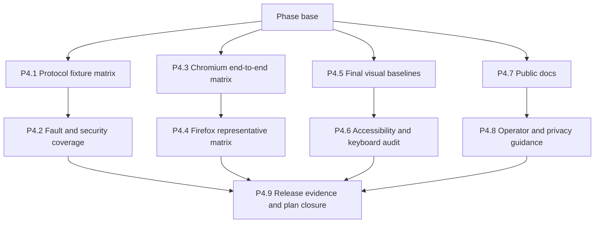

# Phase 4 - Verify and document

## How to read this phase

- **Phase contract** reserves final verification for the combined implementation rather than
  repeating incomplete lane claims.
- **Parallel stack map** separates protocol faults, browser flows, UI quality, and documentation.
- **Delivery items** name the final evidence and public guidance required for release.
- **Exit gate** closes the project only after every supported and constrained path is accurate.

## Phase contract

Phase 4 verifies the combined client against deterministic fixtures and updates the public docs.
Earlier phases still test every PR; this phase adds complete matrices, final visual baselines, and
cross-browser evidence that would be misleading before enterprise authentication converges.

**Phase base:** `main` after phase 3 passes.

**Maximum parallel width:** Four stack lanes. P4.9 converges their tips.



## Delivery items

### P4.1 - Complete the deterministic protocol fixture matrix

**Marker:** `[AGENT-READY]`.

**Parallel safety:** First PR in the protocol-verification stack; parallel with P4.3, P4.5, and
P4.7. It owns only the A2A fixture and protocol integration tests.

**Branch and PR:** `feat/a2a-p4-1-protocol-matrix`, targeting the phase base.

**Files:**

- Modify: `tests/fixtures/a2a/server.ts`
- Modify: `tests/fixtures/a2a/cards.ts`
- Create: `tests/a2a/protocol-matrix.test.ts`

**Implementation:**

1. Cover JSON-RPC and HTTP+JSON with direct messages, tasks, streamed status and artifact updates,
   task lookup, task subscription, and authenticated extended cards.
2. Cover cards with no auth, Bearer, header/query/cookie API keys, Basic, OAuth, OIDC, signed-card,
   mTLS, alternative requirements, combined requirements, and recognized unsupported schemes.
3. Give each fixture an OS-assigned port, deterministic clock, deterministic ids, and explicit
   cleanup. Make tests independent of the public internet and real identity providers.
4. Add malformed and oversized JSON, invalid and oversized cards, oversized metadata and JWK sets,
   unsupported protocol versions and extensions, redirects, delayed first bytes, request and idle
   timeouts, oversized or truncated SSE frames, duplicate events, status regression, and task purge.
5. Keep fixture secrets synthetic and assert that failures, snapshots, and captured logs do not
   contain them.
6. Add alternative-requirement, request-contribution collision, card security-revision drift,
   credential-staleness, OIDC issuer/audience/nonce substitution, and invalid-signature fixtures.

**Verification:**

```bash
mise exec -- deno task test tests/a2a/protocol-matrix.test.ts
mise exec -- deno task a2a:network
mise exec -- deno task ci
```

**Commit:** `test(a2a): complete the protocol matrix`

### P4.2 - Add fault-injection and security-boundary coverage

**Marker:** `[AGENT-READY]`.

**Depends on:** P4.1. Second PR in the protocol-verification stack, targeting P4.1's branch.

**Branch and PR:** `feat/a2a-p4-2-security-faults`, targeting `feat/a2a-p4-1-protocol-matrix`.

**Files:**

- Create: `tests/a2a/security-boundaries.test.ts`
- Create: `tests/a2a/recovery-faults.test.ts`
- Modify: `src/shared/a2a/remote-access.test.ts`
- Modify: `src/shared/a2a/delivery.test.ts`
- Modify: `src/shared/a2a/reconciliation.test.ts`

**Implementation:**

1. Prove that content messages cannot select arbitrary URLs, read credentials, obtain full cards, or
   cause the background to make a caller-directed fetch.
2. Revoke origin and API permissions during discovery, token exchange, initial send, and stream
   recovery. Verify the client stops at the trust boundary and preserves the last committed state.
3. Exhaust storage before run creation and during an event append. Initial failure must prevent the
   network call; mid-stream failure must abort consumption and expose incomplete local history.
4. Force worker suspension, panel close, offline transitions, abort races, duplicate UI activation,
   malformed remote strings, and over-budget remote responses without replaying the initial send or
   parsing beyond the settled boundary.
5. Delete a session and use Clear all sessions during active streams. Verify controllers abort,
   session/run/event deletion commits atomically, rollback preserves the previous state, and no late
   event recreates deleted history.
6. Scan persisted stores, session storage summaries, rendered errors, and test logs for credentials,
   authorization codes, PKCE verifiers, client secrets, query keys, and captured-page evidence.

**Verification:**

```bash
mise exec -- deno task test tests/a2a/security-boundaries.test.ts tests/a2a/recovery-faults.test.ts
mise exec -- deno task ci
```

**Commit:** `test(a2a): harden client security boundaries`

### P4.3 - Complete the Chromium end-to-end matrix

**Marker:** `[AGENT-GUIDED]` - attach command output and live inspection notes to the PR.

**Parallel safety:** First PR in the browser-verification stack; parallel with P4.1, P4.5, and P4.7.
It owns Chromium scenarios and their harness only.

**Branch and PR:** `feat/a2a-p4-3-chromium-e2e`, targeting the phase base.

**Files:**

- Modify: `tests/e2e/a2a-delivery.spec.ts`
- Create: `tests/e2e/a2a-authentication.spec.ts`
- Create: `tests/e2e/a2a-history.spec.ts`
- Modify: `tests/e2e/full-flow.spec.ts`

**Implementation:**

1. Cover add, refresh, default selection, disconnect, removal, origin grant, origin denial, origin
   revocation, and every enterprise state exposed by phase 3.
2. Drive toolbar target selection, review, exact Markdown send, streaming, status changes, panel
   close and reopen, task reconciliation, unknown delivery, and deliberate resend.
3. Prove Copy prompt, Download prompt, and Download bundle before and after every remote failure.
4. Page through old local sessions, removed-agent runs, direct-message runs, interrupted tasks,
   incomplete history, and corrupt-entry warnings without loading the full ledger or losing other
   history. Delete one session and clear all sessions, confirming that prompts, responses, runs, and
   events are removed while agent profiles remain.
5. Assert that selecting an agent in the injected toolbar produces no remote request before review.

**Verification:**

```bash
mise exec -- deno task test tests/e2e/a2a-delivery.spec.ts tests/e2e/a2a-authentication.spec.ts tests/e2e/a2a-history.spec.ts
mise exec -- deno task e2e:full
mise exec -- deno task ci
```

**Commit:** `test(a2a): complete Chromium client flows`

### P4.4 - Complete the representative Firefox matrix

**Marker:** `[AGENT-GUIDED]` - distinguish real Firefox coverage from shim-only assertions.

**Depends on:** P4.3. Second PR in the browser-verification stack, targeting P4.3's branch.

**Branch and PR:** `feat/a2a-p4-4-firefox-smoke`, targeting `feat/a2a-p4-3-chromium-e2e`.

**Files:**

- Modify: `tests/firefox/a2a-network.ts`
- Create: `tests/firefox/a2a-client.ts`

**Implementation:**

1. Drive one public and one header-authenticated discovery, send, stream, terminal task, reopen, and
   history flow in a real Firefox extension runtime.
2. Exercise one interactive OAuth or OIDC path if automation can safely control the browser flow;
   otherwise run the already-authorized path and identify the grant boundary as shim-covered.
3. Exercise permission revocation, browser restart with cleared credentials, disconnect after task
   id, and recovery through task lookup or subscription.
4. Run the cookie and mTLS decision fixtures that phase 3 marked supported. For externally managed
   outcomes, verify detection and user guidance without overstating handshake control.
5. Keep Playwright claims Chromium-only. Do not describe the representative Firefox smoke as full
   end-to-end parity.

**Verification:**

```bash
mise exec -- deno task smoke:a2a-firefox
mise exec -- deno task smoke:firefox
mise exec -- deno task lint:firefox
mise exec -- deno task ci
```

**Commit:** `test(a2a): verify representative Firefox flows`

### P4.5 - Capture final A2A visual baselines

**Marker:** `[AGENT-READY]`.

**Parallel safety:** First PR in the UI-quality stack; parallel with P4.1, P4.3, and P4.7. It owns
visual manifests and generated baselines, not component behavior.

**Branch and PR:** `feat/a2a-p4-5-visual-baselines`, targeting the phase base.

**Files:**

- Modify: `tests/wave-3-shots.ts`
- Modify: `tests/visual/run.ts`
- Modify: `tests/visual/run.test.ts`
- Modify: `tests/visual/visual-manifest.test.ts`
- Modify: `tests/visual/README.md`
- Modify: `tests/visual/baselines/`
- Modify: `docs/assets/`

**Implementation:**

1. Capture Agents options, permission continuation, each auth state, split toolbar, reviewed send,
   streaming, every task status class, history, run detail, and incomplete-history warnings.
2. Capture every state in forced light and dark themes on the repository's pinned Linux platform.
3. Keep remote names and response text deterministic. Include empty, long, error, disconnected,
   removed-agent, browser-managed, and unsupported states.
4. Extend `withNormalizedVisualManifestVersions` rather than replacing it. Keep the fixture
   `version` and `version_name` deterministic during capture, retain tests for exact manifest
   restoration after both success and failure, and restore the exact built manifest in either case.
5. Inspect diffs for sentence case, mono technical values, one accent action, semantic status color,
   border-defined edges, and non-darkening hover behavior.
6. Commit only intentional baselines and the stable fixture inputs that produced them.

**Verification:**

```bash
mise exec -- deno task visual:update
mise exec -- deno task visual
mise exec -- deno task ci
```

Run `visual:update` and the follow-up `visual` comparison in the documented pinned Linux image; do
not replace baselines from macOS.

**Commit:** `test(a2a): capture final visual states`

### P4.6 - Complete accessibility and keyboard verification

**Marker:** `[AGENT-GUIDED]` - perform both automation and manual assistive-technology checks.

**Depends on:** P4.5. Second PR in the UI-quality stack, targeting P4.5's branch.

**Branch and PR:** `feat/a2a-p4-6-accessibility`, targeting `feat/a2a-p4-5-visual-baselines`.

**Files:**

- Modify: `tests/a11y/surfaces.spec.ts`
- Modify: `tests/a11y/keyboard.spec.ts`
- Create: `tests/a11y/a2a-keyboard.spec.ts`

**Implementation:**

1. Run axe against every new stable surface and test forced colors, reduced motion, 200% zoom, and
   both forced themes.
2. Prove split-button menu semantics, arrow-key movement, dismissal, focus return, disabled states,
   and the no-agent path without trapping focus in the injected shadow root.
3. Prove options permission continuations, credential prompts, OAuth cancel, plan confirmation, live
   status updates, history navigation, and run detail by keyboard alone.
4. Use polite live regions for meaningful status transitions and prevent streamed text or repeated
   polling from flooding announcements.
5. Record manual VoiceOver results for names, roles, state, error association, and live updates; fix
   blockers in the owning component and update its focused test in this PR.

**Verification:**

```bash
mise exec -- deno task a11y
mise exec -- deno task test tests/a11y/a2a-keyboard.spec.ts
mise exec -- deno task ci
```

**Commit:** `test(a2a): verify accessible agent delivery`

### P4.7 - Publish the A2A user documentation

**Marker:** `[AGENT-READY]`.

**Parallel safety:** First PR in the documentation stack; parallel with P4.1, P4.3, and P4.5. It
owns user-facing docs only.

**Branch and PR:** `feat/a2a-p4-7-user-docs`, targeting the phase base.

**Files:**

- Modify: `README.md`
- Modify: `docs/README.md`
- Modify: `docs/specs/README.md`
- Modify: `docs/specs/a2a-client.md`
- Modify: `docs/specs/a2a-agents.md`
- Modify: `docs/specs/export-bundle.md`
- Modify: `docs/specs/settings.md`
- Create: `docs/tutorials/connect-an-a2a-agent.md`
- Create: `docs/tutorials/send-a-session-to-an-agent.md`
- Create: `tests/docs/links.test.ts`

**Implementation:**

1. Explain Agent Card discovery, narrowest browser-supported host grants, exact client URL
   enforcement, public-card caching, supported browser transports, and why the extension never
   grants inspected pages remote-agent access.
2. Document add, authenticate, set default, target selection, review, send, stream, reopen, history,
   disconnect, remove, and permission revocation as task-oriented workflows.
3. Document no-auth, Bearer, API-key, OAuth, OIDC, signed-card, cookie, and mTLS states exactly as
   phase 3 implemented or constrained them.
4. Explain that credentials clear on browser restart, local history persists until user deletion or
   storage exhaustion, individual deletion and Clear all sessions remove associated prompts and
   responses, incomplete history is explicit, and unknown initial delivery is not retried.
5. Keep local copy and download behavior first-class. Do not imply that A2A is required to use or
   export Point & Shoot.

**Verification:**

```bash
mise exec -- deno task test tests/docs/links.test.ts
mise exec -- deno task ci
```

**Commit:** `docs(a2a): publish the client guide`

### P4.8 - Publish operator, privacy, and troubleshooting guidance

**Marker:** `[AGENT-READY]`.

**Depends on:** P4.7. Second PR in the documentation stack, targeting P4.7's branch.

**Branch and PR:** `feat/a2a-p4-8-operator-docs`, targeting `feat/a2a-p4-7-user-docs`.

**Files:**

- Modify: `docs/tutorials/troubleshooting.md`
- Create: `docs/tutorials/a2a-enterprise-setup.md`
- Modify: `docs/specs/a2a-client.md`
- Create if the accepted decision changes: the next numbered successor ADR
- Modify if a successor ADR is created: ADR-0019's status line only
- Modify if a successor ADR is created: `docs/adr/README.md`

**Implementation:**

1. Give operators exact requirements for HTTPS, Agent Card and interface reachability, streaming,
   token endpoints, redirect URIs, cookies, mTLS policy, and any explicit server-side Origin checks.
   Explain that granted extension host access, not ordinary page CORS, enables remote fetches.
2. Explain extension id stability for OAuth redirects and enterprise certificate auto-selection.
   Separate Chrome and Firefox instructions where behavior genuinely differs.
3. Add diagnosis for permission denial or revocation, invalid cards, unsupported transport or auth,
   `401`, `403`, certificate failures, network errors, task purge, storage exhaustion, and unknown
   delivery.
4. Publish the data inventory: public cards and run history on disk; credentials, extended cards,
   codes, and verifiers in session-only storage; exact Markdown sent only after review; session
   deletion and Clear all sessions cascade through stored prompts, responses, runs, and events.
5. Keep accepted ADR-0019 immutable except for the status-only update the ADR policy permits. Record
   operational observations in the spec and tutorial. If measured browser behavior changes the
   accepted decision, create the next numbered ADR, mark it as superseding ADR-0019, change only
   ADR-0019's status to `Superseded by ADR-NNNN`, and update the ADR index.

**Verification:**

```bash
mise exec -- deno task test tests/docs/links.test.ts
mise exec -- deno task ci
```

**Commit:** `docs(a2a): add enterprise setup guidance`

### P4.9 - Audit release evidence and close the plan

**Marker:** `[AGENT-GUIDED]` - do not claim completion from lane-tip results.

**Depends on:** P4.2, P4.4, P4.6, and P4.8. Start only after all lane stacks land.

**Branch and PR:** `feat/a2a-p4-9-final-audit`, targeting the merged phase base.

**Files:**

- Modify: `.github/workflows/ci.yml`
- Modify: `AGENTS.md`
- Modify: `docs/README.md`
- Modify: `docs/specs/a2a-client.md`
- Create if the accepted architecture changes: the next numbered successor ADR
- Modify if a successor ADR is created: the current governing A2A ADR's status line only
- Modify if a successor ADR is created: `docs/adr/README.md`
- Modify or delete when empty: `docs/plans/README.md`
- Delete: `docs/plans/A2A-client/README.md`
- Delete: `docs/plans/A2A-client/arch-review.md`
- Delete: `docs/plans/A2A-client/phase-0-prove-the-platform.md`
- Delete: `docs/plans/A2A-client/phase-1-build-foundations.md`
- Delete: `docs/plans/A2A-client/phase-2-ship-delivery-ux.md`
- Delete: `docs/plans/A2A-client/phase-3-expand-enterprise-support.md`
- Delete: `docs/plans/A2A-client/phase-4-verify-and-document.md`

**Implementation:**

1. Run every project and A2A gate against the combined head. Add only stable, deterministic A2A
   tasks to CI and keep expensive browser jobs separated for actionable failure reporting.
2. Audit built Chrome and Firefox manifests for required permissions, optional host eligibility, and
   optional API declarations. Verify Firefox's minimum is 115 and compare both manifests with the
   current governing A2A ADR named by `docs/adr/README.md` and the published privacy guidance.
   Verify development manifests retain branch-labeled `version_name` values and release manifests
   omit `version_name`.
3. Audit bundles for Node-only imports, gRPC, remote code, secrets, fixture credentials, and an
   unpinned SDK dependency.
4. Re-run `wk-arch-review` against the delivered architecture. Resolve blockers in the owning code
   or docs; do not close the plan with accepted high-severity debt.
5. Move the supported and constrained authentication paths, known browser limitations, and final
   verification evidence into `docs/specs/a2a-client.md`. Keep the current governing A2A ADR
   immutable except for a permitted status-only update. If the delivered architecture changes its
   decision, create the next numbered successor ADR, change only the predecessor's status to
   `Superseded by ADR-NNNN`, and update the ADR index. Leave PR and commit delivery history on the
   final PR or tracking issue. Mark phases complete only after the combined results pass.
6. Retire the completed plan only after those durable artifacts are current: delete every file under
   `docs/plans/A2A-client/`, then remove its index row and provisional decisions from
   `docs/plans/README.md`. If no other active plans remain, remove the empty plan index and its map
   entry. In `AGENTS.md`, change the introductory active-plan reference to a non-linking path,
   change the docs-layout count from five folders to four, remove the `docs/plans/` table row, and
   adjust the lifecycle paragraph so no dead link or known-stale folder guidance remains.

**Verification:**

```bash
mise exec -- deno task ci
mise exec -- deno task e2e:full
mise exec -- deno task a2a:network
mise exec -- deno task smoke:a2a-firefox
mise exec -- deno task smoke:firefox
mise exec -- deno task a11y
mise exec -- deno task visual
mise exec -- deno task build
```

Run `visual` on the pinned Linux platform and verify `lint:firefox` through the aggregate or
directly. The final `build` must leave branch-labeled Chrome and Firefox development packages in
`dist/`. Attach the exact final output to the PR.

**Commit:** `chore(a2a): close the client delivery plan`

## Phase exit gate

The A2A client plan is complete only when:

- The complete Chromium path and representative real-Firefox path pass against offline fixtures.
- Every implemented auth path, browser-managed path, and unsupported result matches the Agent Card
  negotiation and published docs.
- Permissions remain optional and host-scoped, exact configured origins are enforced in client
  policy, and no content or background interface is a generic network proxy.
- Credentials and captured-page evidence are absent from durable stores, build output, logs, and
  fixtures.
- Remote cards, metadata, key sets, JSON responses, and SSE frames are rejected before parsing or
  whole-body buffering when they exceed settled budgets.
- Local actions work with no agents configured and during every tested remote failure.
- Run history is cursor-paged, durable, ordered, explicit when incomplete, and never silently
  deletes or replays work; explicit session deletion removes its complete A2A history atomically.
- Visual, accessibility, manifest, bundle, protocol, recovery, and documentation gates pass on the
  combined head.
