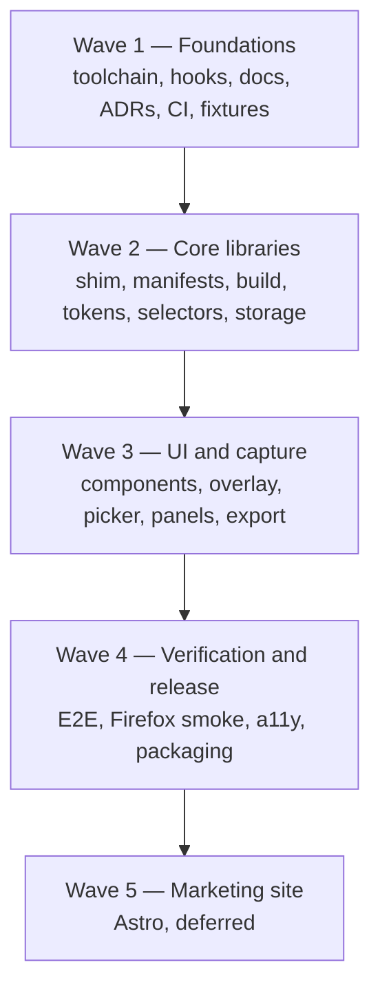
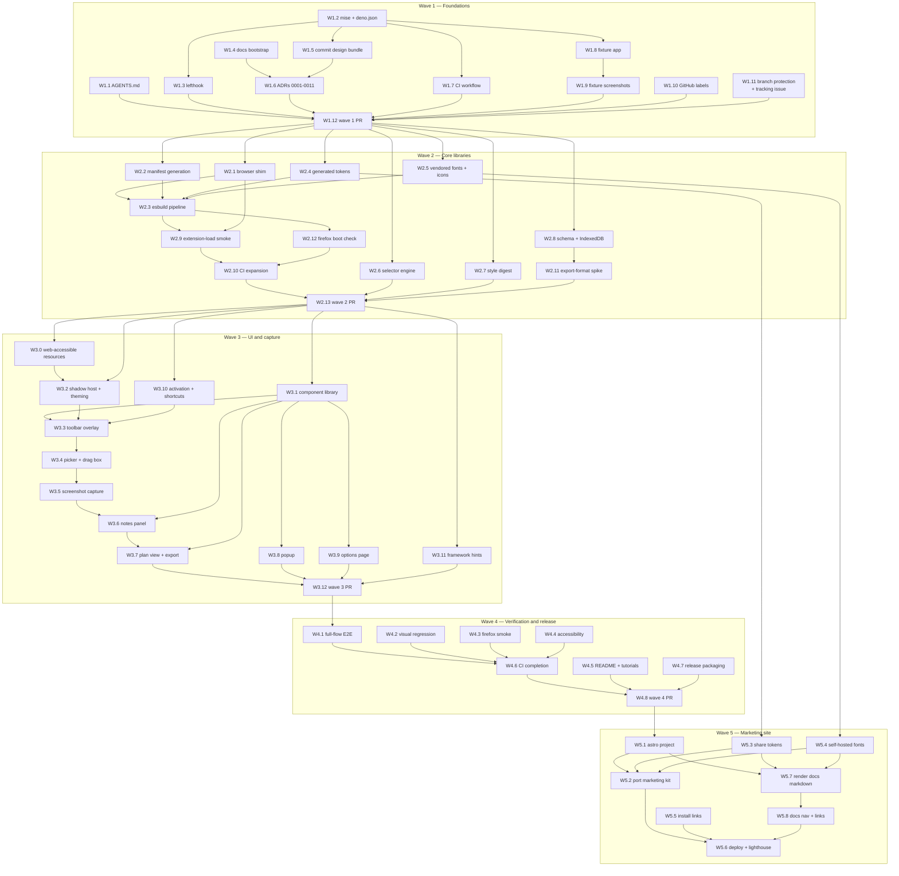

# Implementation Plan — index and shared context

`point-and-shoot` v1, planned as five waves. **This file is the shared context every wave file
assumes.** An agent prompted with _"work on W3.4"_ must read this file first, then
`wave-3-ui-and-capture.md`, and needs nothing else.

| Wave                         | File                                                   | Status                               |
| ---------------------------- | ------------------------------------------------------ | ------------------------------------ |
| 1 — Foundations              | [`wave-1-foundations.md`](wave-1-foundations.md)       | complete — PR #4 merged as `4758b19` |
| 2 — Core libraries           | [`wave-2-core-libraries.md`](wave-2-core-libraries.md) | complete — PR #6 merged as `6b732e2` |
| 3 — UI and capture           | [`wave-3-ui-and-capture.md`](wave-3-ui-and-capture.md) | open — wave 2's barrier is lifted    |
| 4 — Verification and release | [`wave-4-verification.md`](wave-4-verification.md)     | blocked on wave 3                    |
| 5 — Marketing site           | [`wave-5-marketing-site.md`](wave-5-marketing-site.md) | deferred, post-v1                    |
| — Nice-to-haves              | [`wave-nice-to-haves.md`](wave-nice-to-haves.md)       | open, unscheduled                    |

`wave-nice-to-haves.md` is not a wave. It holds work that is worth doing but blocks nothing, so no
wave's exit criteria reference it and no barrier waits on it. An item there that turns out to block
a wave gets **moved** into that wave's file, not copied.

[`arch-review-point-and-shoot.md`](arch-review-point-and-shoot.md) is the architecture review of
this plan. Its findings are already folded into the wave files and this index — read it for the
reasoning behind a rule you are tempted to skip, not as a list of outstanding work.

---

## Sequencing: waves are barriers, items inside a wave are parallel

Each wave is a **barrier** — do not start wave N+1 until wave N's exit criteria are met, because
later waves consume earlier waves' interfaces. Inside a wave, any item marked **parallel-safe**
touches files disjoint from its siblings and may be handed to a concurrent agent. Items with a
`Depends on:` line wait for what they name.



### Full item chart

All 54 items across all five waves. Solid arrows are hard dependencies, and the graph is drawn as a
transitive reduction — an item also waits on everything upstream of what it points at, not just its
immediate parent. Anything with no inbound arrow inside its wave can start the moment that wave
opens.



### Assignment table

Every item is assigned exactly one **role** here, so there is always an answer to "can this be
handed out now?" The last column is each wave's landing step. Item ids in parentheses are named as
_prerequisites_, not listed as work — an id can be assigned in one column and referenced in another.

| Wave | Immediately startable                    | Unblocks after one item lands           | Serial chain                              | Lands the wave |
| ---- | ---------------------------------------- | --------------------------------------- | ----------------------------------------- | -------------- |
| 1    | W1.1, W1.2, W1.4, W1.10, W1.11           | W1.3, W1.5, W1.7, W1.8 (all after W1.2) | W1.6 (after W1.4+W1.5); W1.9 (after W1.8) | W1.12          |
| 2    | W2.1, W2.2, W2.4, W2.5, W2.6, W2.7, W2.8 | W2.11 (after W2.8); W2.12 (after W2.3)  | W2.3 → W2.9 → W2.10                       | W2.13          |
| 3    | W3.0, W3.1, W3.2, W3.10, W3.11           | W3.8, W3.9 (both after W3.1)            | W3.3 → W3.4 → W3.5 → W3.6 → W3.7          | W3.12          |
| 4    | W4.1, W4.2, W4.3, W4.4, W4.5, W4.7       | —                                       | W4.6 (after W4.1–W4.4)                    | W4.8           |
| 5    | W5.1, W5.3, W5.4, W5.5                   | W5.2, W5.7 (both after W5.1+W5.3+W5.4)  | W5.8 (after W5.7)                         | W5.6           |

Wave 3's serial chain is the critical path of the whole project — five items that genuinely cannot
be parallelised, because each consumes the previous one's output. Start W3.3 as early as the wave
allows and run W3.0, W3.1, W3.2, W3.8, W3.9, W3.10, and W3.11 alongside it.

Wave 5 is the exception to the barrier rule in one respect: W5.3 and W5.4 consume wave-2 output
(W2.4 and W2.5) rather than anything in wave 5, so they can be prepared before wave 5 formally
opens.

Wave 5 also owns **publishing the documentation** (W5.7, W5.8), not just the landing page. Both
public web surfaces share the Astro toolchain and the same generated design tokens, so the docs are
themed like the product rather than with a stock docs theme. Writing the docs is not deferred to
wave 5 — every wave writes its own docs as it goes; wave 5 only renders what is already in `docs/`.

### Branching for parallel agents

One branch per item, cut from the wave's integration branch rather than from `main`, so an agent
gets its wave's prerequisites:

```
main
└── feat/inital-impl          (this branch — plan + wave 1 integration)
    ├── feat/w1-2-toolchain
    ├── feat/w1-4-docs
    └── feat/w1-5-design-bundle
```

Name branches `feat/w<wave>-<item>-<slug>` so the item is greppable from the branch list. Each
item's PR targets its wave's integration branch; the integration branch PRs into `main` once the
wave's exit criteria are met.

Hand an agent exactly two things: this file and its wave file. Then: _"work on W2.6."_

Dependency detail inside each wave also lives in that wave's file.

---

## What this project is

`point-and-shoot` is a **cross-browser Manifest V3 browser extension**. The user activates it from
the browser toolbar or a keyboard shortcut; a small floating toolbar appears on the current page.
They point at a broken element — or drag a box around a region — and write a note about what's
wrong, repeating across as many pages as they like. On export, the extension emits a structured
bundle (region screenshot, page URL, element selectors, computed-style digest, surrounding metadata,
and the note) that a local coding agent consumes as a fix prompt.

Product surfaces, all designed in `.claude-design/`: the injected **toolbar overlay**, the
**extension popup**, the **notes panel** (side panel), the **plan view**, the **options** page, and
a **marketing site** (wave 5).

## Settled decisions — do not relitigate

These came out of a design session. If you believe one is wrong, say so and stop; never silently
deviate. Each has a corresponding ADR under `docs/adr/`.

**Runtime and language**

- Deno-first. Deno owns source, lint, fmt, typecheck, and unit tests. Node-ecosystem tools
  (Playwright, esbuild, web-ext, font subsetting) run via `npm:` specifiers under `deno run -A`. No
  `package.json`, no committed `node_modules`. _Exception:_ wave 5's Astro site is isolated in
  `site/` with its own Node toolchain, and never ships inside the extension.
- TypeScript throughout, strict. Every exported symbol carries TSDoc.
- **Preact** is the UI layer for all five extension surfaces. JSX transforms via esbuild. Chosen
  over React (~45KB into arbitrary pages buys nothing here), Lit (rewrites the JSX prototypes), and
  Astro (Vite/Node toolchain, and a content script isn't a page — Astro cannot build the overlay,
  the hardest surface).

**Browser support**

- Chrome and Firefox are first-class. Safari is compatible-by-construction with no v1 pipeline.
- **Never use `chrome.offscreen`** — Firefox has no equivalent. Image cropping uses
  `createImageBitmap` + `OffscreenCanvas.convertToBlob`, which works in both background contexts.
- All extension APIs go through a promise-based `browser.*` shim, never bare `chrome.*` callbacks.
- Permissions are minimal: `activeTab`, `storage`, `scripting`, `commands`, `downloads`,
  `clipboardWrite`, plus `sidePanel` (Chrome) / `sidebar_action` (Firefox). **No `<all_urls>`.**
  `activeTab` is granted only on explicit user gesture, so the extension can never read a page the
  user didn't point it at. This is a user-facing privacy guarantee, not a convenience.

**Data**

- IndexedDB inside the extension. Versioned JSON is the canonical record; Markdown and clipboard
  output are projections rendered from it, never the source of truth.
- Screenshots: WebP, quality 0.7, capped at 1024px longest edge. Base64 data URI inline in the JSON
  record; the Markdown wrapper references extracted `./shots/note-NN.webp` files instead, because
  agents read image files far more reliably than multi-hundred-KB inline data URIs.
- Element identity is a **bundle**, not one selector: XPath, unique CSS path, test ids, ARIA role +
  accessible name, tag + class list, and a text snippet — plus an opt-in framework probe (React
  fiber `_debugSource`, Vue `__vueParentComponent`, Svelte/Angular markers) naming the likely
  component file. XPath alone is too brittle to survive a rebuild.
- Each note also carries a **computed-style digest** — box model, typography, color, spacing — since
  concrete numbers (`padding: 4px 8px`, `#6B7280`) are more actionable to a fix-agent than pixels,
  and they're greppable.
- A **session** is explicit and spans pages: activating starts or resumes a named session, and notes
  from any page join it until exported or ended.

**Design system**

- `.claude-design/` is the design source of truth, committed to the repo as of `9fc9c2a`. It holds
  the token files, 13 guideline specimen cards, 15 components in 14 files (`.jsx` + `.d.ts` +
  `.prompt.md`), the six UI kits, the icon mark, and its own adherence lint config. Read
  [`../design.md`](../design.md) before touching any UI item — it maps the bundle, states the three
  MV3 asset substitutions, and lists the binding brand rules.
- The bundle is an **upstream artifact**: never edit, reformat, or "fix" a file under
  `.claude-design/`. Changes go upstream and come back as a whole re-export in one commit, which is
  also why `deno fmt`/`deno lint` exclude the directory.
- Tokens are **generated** from it into `src/shared/design/` — never hand-copied — with a drift
  check in CI.
- Injected UI mounts in a **closed shadow root** so host-page CSS cannot reach it and its styles
  cannot leak onto the page under inspection. Tokens cross that boundary deliberately.
- **No remote assets, ever.** The design bundle loads Google Fonts and Lucide icons over CDN; MV3
  forbids remote code, and a remote font request from an injected overlay would leak the fact that
  you're annotating a page to a third party. Fonts are subset to WOFF2 and vendored; Lucide icons
  are vendored as an inline SVG sprite at build time.
- Theme **auto-adapts to the page backdrop** by sampling luminance behind the toolbar, with an
  options override that force-pins dark or light. Tests always force a theme — auto-adapt would
  otherwise make every visual assertion non-deterministic.
- Brand rules from `.claude-design/point-and-shoot/readme.md` are binding: sentence case everywhere,
  no emoji anywhere, mono type for every technical value (URLs, XPaths, tags, shortcuts), accent
  blue marks exactly one interactive thing on screen, semantic colors are for status only, hover
  lightens and never darkens, no scale/springy press states, borders rather than background shifts
  define most edges, and animation is functional only (120–280ms fades and 4–8px slides — nothing
  decorative).

**Testing**

- Three tiers: Deno unit tests, Playwright E2E on **Chromium only**, and a `web-ext` smoke check for
  Firefox. Playwright cannot load extensions in Firefox — there is no `--load-extension` equivalent.
  Never describe the suite as giving Firefox E2E parity.
- Browser-API divergence between Chrome and Firefox is covered by unit tests against fakes at the
  shim seam, which is cheaper than a second E2E stack and catches the class of bug that matters.

## Resolved versions — use these exact values

Resolved live on 2026-07-24. **Pin exactly. No `latest`, no `^`, no `~`, no floating tags.**

| Tool               | Version  | Pinned in                                                 |
| ------------------ | -------- | --------------------------------------------------------- |
| deno               | `2.9.4`  | `mise.toml`                                               |
| node               | `26.5.0` | `mise.toml` (Playwright browser install, font subsetting) |
| lefthook           | `2.1.10` | `mise.toml`                                               |
| playwright         | `1.62.0` | `deno.json` imports                                       |
| esbuild            | `0.28.1` | `deno.json` imports                                       |
| web-ext            | `10.5.0` | `deno.json` imports                                       |
| `actions/checkout` | `v7`     | CI workflows                                              |
| `jdx/mise-action`  | `v4`     | CI workflows                                              |

Browser floors belong here too, for the same reason the tool versions do — three things in wave 2
consume them and must not disagree. Resolved by W2.2 from each vendor's own MV3 support baseline,
not guessed.

| Floor            | Version                                               | Consumed by                                                                            |
| ---------------- | ----------------------------------------------------- | -------------------------------------------------------------------------------------- |
| Chrome minimum   | `116`                                                 | `minimum_chrome_version` in the Chrome manifest; the `SUPPORTED` constant W2.2 exports |
| Firefox minimum  | `109`                                                 | `browser_specific_settings.gecko.strict_min_version`; the same `SUPPORTED` constant    |
| esbuild `target` | derived from `SUPPORTED` — never written as a literal | W2.3                                                                                   |

Resolved each from **that vendor's own MV3 support baseline**, not from the other's number: Chrome's
`chrome.sidePanel` API landed in Chrome 114, but the `sidePanel.open()` method the browser shim
(W2.1) calls did not ship until Chrome 116, so the Chrome floor is 116. Firefox's Manifest V3 became
generally available in Firefox 109, so the Firefox floor is 109 — years below Chrome's, because
Firefox shipped MV3 well before Chrome's current release; a plausible Chrome-plus-one guess would
have locked out most of the Firefox installed base. Raising a floor is a one-line change in
`build/manifest.ts` plus a row here — never an edit in two places.

Preact's version is resolved and pinned in wave 2 (`npm view preact version` at the time), not
guessed. GitHub Actions pin to the official action's **semver major**, per project convention.

## Settled numbers — the five runtime budgets

Every bound the runtime enforces is fixed here, once. Five items across two waves consume these
(W2.7, W3.4, W3.6, W3.7, W3.9) and they are parallel-safe with each other — so each one picking its
own value is exactly how a session passes every per-note cap and still blows the export budget, a
disagreement discovered only at export time. **Read the number from this table; do not choose one
inside the item.** W2.11 is not in that list: it _produces_ the fifth number rather than consuming
any of them.

| Budget                              | Value                                                                 | Enforced in | Consumed by                                              |
| ----------------------------------- | --------------------------------------------------------------------- | ----------- | -------------------------------------------------------- |
| Style-digest properties per element | `40`                                                                  | W2.7        | W3.4, W3.6                                               |
| Sibling count per element           | `6` (3 either side, DOM order)                                        | W2.7        | W3.4                                                     |
| Subtree depth per element           | `3`                                                                   | W2.7        | W3.4                                                     |
| Elements collected per drag box     | `25`                                                                  | W3.4        | W3.6, W3.7                                               |
| Default export size budget          | `2 MB` — measured, see [W2.11 spike](../specs/export-format-spike.md) | W3.7        | W3.6 (warning threshold), W3.9 (user-adjustable default) |

The first four are **deliberate design caps**, set to keep a single note legible to an agent rather
than to be generous: a digest listing every computed property is noise, and a drag over `<body>`
must not collect two thousand elements. They are settled — no item re-derives them. The fifth was
the only guess; [W2.11's spike](../specs/export-format-spike.md) fed real bundles at five sizes (13
KB to ~9.93 MB) to real agents and found zero degradation through ~2.13 MB, with the first failure
mode (the markdown projection silently losing note text to tool-side compression, not a schema
defect) appearing at ~4.26 MB — confirming `2 MB` rather than revising it.

Changing any value here is a plan change, so [rule 7](#rules-for-working-any-wave) substep 5
applies: this table, the wave items that cite it, and the tests that assert it move together.

## Repo facts

- Remote `git@github.com:whizzzkid/point-and-shoot.git`; `gh` authenticated as `whizzzkid`.
- Default branch `main`. Wave 1's implementation lands on `feat/wave-1-plan`; later waves branch per
  the convention in `AGENTS.md`. `feat/inital-impl` was wave 1's originally-planned integration
  branch, but it merged to `main` as PR #1 carrying only the plan and the design bundle, before any
  wave-1 implementation started — so the branch names in this file's diagrams describe the intended
  shape, not the branch wave 1 actually uses.
- Docs layout is fixed: `docs/specs/`, `docs/plans/`, `docs/adr/`, `docs/tutorials/`, `docs/assets/`
  (committed images referenced by docs and PR bodies — W1.9 writes the first of them), plus
  [`docs/README.md`](../README.md) (the published index and doc conventions) and
  [`docs/design.md`](../design.md). Do not invent new top-level directories.
- **Everything under `docs/` is published** (wave 5, W5.7/W5.8) — rendered to HTML and themed with
  the product's own tokens. Write every doc for a reader who has never seen the repo, keep links
  relative, and put nothing there you would not publish.
- One GitHub artefact is load-bearing: the tracking issue W1.11 opened is
  **[issue #3](https://github.com/whizzzkid/point-and-shoot/issues/3)**, the durable status board.
  It outlives every wave PR, rule 7 targets it, and it closes only when v1 ships. **PR #1** is not
  that board and never stood in for it in practice: it merged on `feat/inital-impl` carrying only
  the plan and the design bundle, so it was closed before wave 1's first implementation commit. Wave
  1's own PR is the one W1.12 opens on `feat/wave-1-plan`.
- `main` is protected as of W1.11: required check `checks` (W1.7's job), strict up-to-date-before-
  merge, signed commits required, force-pushes and deletions denied, and `enforce_admins` on so the
  gate is not admin-bypassable. A red required check blocks the merge button — proven with a
  throwaway PR, not assumed. Adding a CI job that must gate merges means adding its context to the
  required list too; waves 2 and 4 both do this.

## Rules for working any wave

1. **One item = one commit.** Never batch two items into one commit.
2. Confirm your branch before the first edit: `git rev-parse --abbrev-ref HEAD`.
3. Run the item's **Verify** block and get it passing _before_ committing.
4. After the commit lands, edit the wave file: `[ ]` → `[x]`, replace `_pending_` with the real SHA,
   and update the wave's **Status**. Never end a session with the plan file stale. A few items
   produce no commit and so carry no `_pending_` slot — the PR items (W1.12, W2.13, W3.12, W4.8)
   record a PR number and W1.10 records nothing but the verification command. Tick those without
   inventing a SHA. W1.11 is **not** in that set: it produces one docs commit recording the tracking
   issue's number, so it carries a real SHA like any other item.
5. Deferred or abandoned → mark `[~]` with one line saying why.
6. Every claim in a PR body must correspond to a command actually run. If something couldn't be
   verified, say so and why.
7. **After your item's PR merges, update the broader plan on the tracking issue — same session,
   before you stop.** This is not optional bookkeeping: the tracking issue (opened by W1.11) is the
   only place a person or an agent can see what is done and what is now unblocked. A merged item
   that is still unticked there gets picked up twice. Do **not** use any wave PR as the board — a
   wave PR closes when its wave merges, so four waves of post-merge syncs would be writing to a
   closed thread. The board is [issue #3](https://github.com/whizzzkid/point-and-shoot/issues/3),
   open since W1.11.

   In order:
   1. On the wave's integration branch, pull the merge and confirm the wave file records the item's
      real merged SHA (`git log -1 --format=%H -- <the item's paths>`) — if the SHA changed because
      the merge squashed or rebased, fix it. A SHA that does not resolve is worse than `_pending_`.
   2. Tick the item in the wave file and update the wave's **Status** line if the wave's state
      changed (still blocked / in progress / complete).
   3. If your item was the last prerequisite for another, say so in the wave file so the next agent
      does not have to re-derive it from the graph.
   4. Push, then sync the tracking issue: tick the item in its checklist, record the merged SHA and
      the item's PR number, and update the "what's next / now unblocked" summary. Push first, sync
      second — a body edited before the push bakes in stale refs. If your item's own PR is still
      open, sync its body in the same pass.
   5. If the item changed the plan itself (new items, changed dependency, revised count), update
      this index too: the graph, the assignment table, the settled-numbers table, and the item count
      must all agree. W5.8 turns that last one into a CI check; until it exists, it is on you.

   Docs land with the item, in the item's own commit — never as a follow-up. Same for the plan-file
   tick: the plan is part of the deliverable, not cleanup after it.
