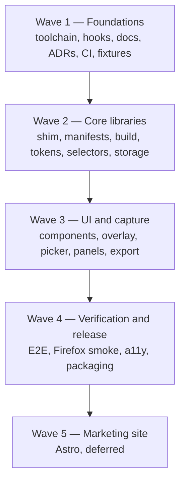

# Implementation Plan — index and shared context

`point-and-shoot` v1, planned as five waves. **This file is the shared context every wave file
assumes.** An agent prompted with *"work on W3.4"* must read this file first, then
`wave-3-ui-and-capture.md`, and needs nothing else.

| Wave | File | Status |
|---|---|---|
| 1 — Foundations | [`wave-1-foundations.md`](wave-1-foundations.md) | not started |
| 2 — Core libraries | [`wave-2-core-libraries.md`](wave-2-core-libraries.md) | blocked on wave 1 |
| 3 — UI and capture | [`wave-3-ui-and-capture.md`](wave-3-ui-and-capture.md) | blocked on wave 2 |
| 4 — Verification and release | [`wave-4-verification.md`](wave-4-verification.md) | blocked on wave 3 |
| 5 — Marketing site | [`wave-5-marketing-site.md`](wave-5-marketing-site.md) | deferred, post-v1 |

---

## Sequencing: waves are barriers, items inside a wave are parallel

Each wave is a **barrier** — do not start wave N+1 until wave N's exit criteria are met, because
later waves consume earlier waves' interfaces. Inside a wave, any item marked **parallel-safe**
touches files disjoint from its siblings and may be handed to a concurrent agent. Items with a
`Depends on:` line wait for what they name.

Dependency detail inside each wave lives in that wave's file.

---

## What this project is

`point-and-shoot` is a **cross-browser Manifest V3 browser extension**. The user activates it from
the browser toolbar or a keyboard shortcut; a small floating toolbar appears on the current page.
They point at a broken element — or drag a box around a region — and write a note about what's
wrong, repeating across as many pages as they like. On export, the extension emits a structured
bundle (region screenshot, page URL, element selectors, computed-style digest, surrounding metadata,
and the note) that a local coding agent consumes as a fix prompt.

Product surfaces, all designed in `.claude-design/`: the injected **toolbar overlay**, the
**extension popup**, the **notes panel** (side panel), the **plan view**, the **options** page, and
a **marketing site** (wave 5).

## Settled decisions — do not relitigate

These came out of a design session. If you believe one is wrong, say so and stop; never silently
deviate. Each has a corresponding ADR under `docs/adr/`.

**Runtime and language**
- Deno-first. Deno owns source, lint, fmt, typecheck, and unit tests. Node-ecosystem tools
  (Playwright, esbuild, web-ext, font subsetting) run via `npm:` specifiers under `deno run -A`.
  No `package.json`, no committed `node_modules`. *Exception:* wave 5's Astro site is isolated in
  `site/` with its own Node toolchain, and never ships inside the extension.
- TypeScript throughout, strict. Every exported symbol carries TSDoc.
- **Preact** is the UI layer for all four extension surfaces. JSX transforms via esbuild. Chosen
  over React (~45KB into arbitrary pages buys nothing here), Lit (rewrites the JSX prototypes), and
  Astro (Vite/Node toolchain, and a content script isn't a page — Astro cannot build the overlay,
  the hardest surface).

**Browser support**
- Chrome and Firefox are first-class. Safari is compatible-by-construction with no v1 pipeline.
- **Never use `chrome.offscreen`** — Firefox has no equivalent. Image cropping uses
  `createImageBitmap` + `OffscreenCanvas.convertToBlob`, which works in both background contexts.
- All extension APIs go through a promise-based `browser.*` shim, never bare `chrome.*` callbacks.
- Permissions are minimal: `activeTab`, `storage`, `scripting`, `commands`, `downloads`,
  `clipboardWrite`, plus `sidePanel` (Chrome) / `sidebar_action` (Firefox). **No `<all_urls>`.**
  `activeTab` is granted only on explicit user gesture, so the extension can never read a page the
  user didn't point it at. This is a user-facing privacy guarantee, not a convenience.

**Data**
- IndexedDB inside the extension. Versioned JSON is the canonical record; Markdown and clipboard
  output are projections rendered from it, never the source of truth.
- Screenshots: WebP, quality 0.7, capped at 1024px longest edge. Base64 data URI inline in the JSON
  record; the Markdown wrapper references extracted `./shots/note-NN.webp` files instead, because
  agents read image files far more reliably than multi-hundred-KB inline data URIs.
- Element identity is a **bundle**, not one selector: XPath, unique CSS path, test ids, ARIA
  role + accessible name, tag + class list, and a text snippet — plus an opt-in framework probe
  (React fiber `_debugSource`, Vue `__vueParentComponent`, Svelte/Angular markers) naming the likely
  component file. XPath alone is too brittle to survive a rebuild.
- Each note also carries a **computed-style digest** — box model, typography, color, spacing — since
  concrete numbers (`padding: 4px 8px`, `#6B7280`) are more actionable to a fix-agent than pixels,
  and they're greppable.
- A **session** is explicit and spans pages: activating starts or resumes a named session, and notes
  from any page join it until exported or ended.

**Design system**
- `.claude-design/` is the design source of truth, committed to the repo. Tokens are **generated**
  from it into `src/shared/design/` — never hand-copied — with a drift check in CI.
- Injected UI mounts in a **closed shadow root** so host-page CSS cannot reach it and its styles
  cannot leak onto the page under inspection. Tokens cross that boundary deliberately.
- **No remote assets, ever.** The design bundle loads Google Fonts and Lucide icons over CDN; MV3
  forbids remote code, and a remote font request from an injected overlay would leak the fact that
  you're annotating a page to a third party. Fonts are subset to WOFF2 and vendored; Lucide icons
  are vendored as an inline SVG sprite at build time.
- Theme **auto-adapts to the page backdrop** by sampling luminance behind the toolbar, with an
  options override that force-pins dark or light. Tests always force a theme — auto-adapt would
  otherwise make every visual assertion non-deterministic.
- Brand rules from `.claude-design/point-and-shoot/readme.md` are binding: sentence case
  everywhere, no emoji anywhere, mono type for every technical value (URLs, XPaths, tags,
  shortcuts), accent blue marks exactly one interactive thing on screen, semantic colors are for
  status only, hover lightens and never darkens, no scale/springy press states, borders rather than
  background shifts define most edges, and animation is functional only (120–280ms fades and 4–8px
  slides — nothing decorative).

**Testing**
- Three tiers: Deno unit tests, Playwright E2E on **Chromium only**, and a `web-ext` smoke check for
  Firefox. Playwright cannot load extensions in Firefox — there is no `--load-extension` equivalent.
  Never describe the suite as giving Firefox E2E parity.
- Browser-API divergence between Chrome and Firefox is covered by unit tests against fakes at the
  shim seam, which is cheaper than a second E2E stack and catches the class of bug that matters.

## Resolved versions — use these exact values

Resolved live on 2026-07-24. **Pin exactly. No `latest`, no `^`, no `~`, no floating tags.**

| Tool | Version | Pinned in |
|---|---|---|
| deno | `2.9.4` | `mise.toml` |
| node | `26.5.0` | `mise.toml` (Playwright browser install, font subsetting) |
| lefthook | `2.1.10` | `mise.toml` |
| playwright | `1.62.0` | `deno.json` imports |
| esbuild | `0.28.1` | `deno.json` imports |
| web-ext | `10.5.0` | `deno.json` imports |
| `actions/checkout` | `v7` | CI workflows |
| `jdx/mise-action` | `v4` | CI workflows |

Preact's version is resolved and pinned in wave 2 (`npm view preact version` at the time), not
guessed. GitHub Actions pin to the official action's **semver major**, per project convention.

## Repo facts

- Remote `git@github.com:whizzzkid/point-and-shoot.git`; `gh` authenticated as `whizzzkid`.
- Default branch `main`. Wave 1 lands on `feat/inital-impl`; later waves branch per the convention
  in `AGENTS.md`.
- Docs layout is fixed: `docs/specs/`, `docs/plans/`, `docs/adr/`, `docs/tutorials/`. Do not invent
  new top-level directories.

## Rules for working any wave

1. **One item = one commit.** Never batch two items into one commit.
2. Confirm your branch before the first edit: `git rev-parse --abbrev-ref HEAD`.
3. Run the item's **Verify** block and get it passing *before* committing.
4. After the commit lands, edit the wave file: `[ ]` → `[x]`, replace `_pending_` with the real SHA,
   and update the wave's **Status**. Never end a session with the plan file stale.
5. Deferred or abandoned → mark `[~]` with one line saying why.
6. Every claim in a PR body must correspond to a command actually run. If something couldn't be
   verified, say so and why.
