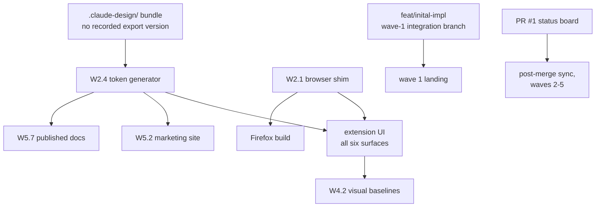

# Architecture review — point-and-shoot delivery plan

**Reviewed:** `docs/plans/` (index + five wave files, 50 items), `docs/design.md`, `docs/README.md`
**Reviewer role:** principal architect / distinguished engineer **Date:** 2026-07-27 **Reviewed at
commit:** `419cfa8` (plus one uncommitted edit to `wave-1-foundations.md`)

## How to read this

This is a **findings report**, not a summary — it assumes you have read the plan. Section 2 records
the context every severity rating is relative to. Section 3 is the findings, severity-ordered, each
with a document location. Sections 4–6 are the cross-cutting views (assumptions, single points of
failure, prioritised actions). Section 7 is the short honest list of what the plan gets right.

Every finding in this report has been **applied** to the plan files it names — the `status: applied`
frontmatter means the recommendations are already folded in, not pending. Read this document as the
record of _why_ those edits exist.

---

## 2. Context block

Extracted from the plan corpus; no scale/regulatory questions were put to the author because a
single-user client-side browser extension answers most of them structurally.

| Dimension                | Value                                                                                                                                                                 | Source                                                                                                               |
| ------------------------ | --------------------------------------------------------------------------------------------------------------------------------------------------------------------- | -------------------------------------------------------------------------------------------------------------------- |
| System                   | Cross-browser MV3 browser extension + static marketing/docs site                                                                                                      | [`README.md`](README.md) "What this project is"                                                                      |
| Scale                    | One user per install, no server, no shared datastore, no RPS                                                                                                          | structural — nothing in the plan ships a backend                                                                     |
| Data volume              | Bounded by one browser profile's IndexedDB; a session is tens of notes with WebP screenshots ≤1024px longest edge                                                     | [`README.md`](README.md) "Data"                                                                                      |
| Top-3 quality attributes | 1. correctness of the emitted bundle (a wrong selector sends an agent to the wrong element), 2. accessibility/keyboard parity, 3. maintainability across two browsers | inferred from the plan's own emphasis — W2.6, W4.4, W2.1                                                             |
| Deployment               | Chrome Web Store + AMO (manual, no automation in v1); GitHub Pages for the site and docs                                                                              | [`wave-4-verification.md`](wave-4-verification.md) W4.7, [`wave-5-marketing-site.md`](wave-5-marketing-site.md) W5.6 |
| Hard constraints         | MV3 CSP (no remote code, no `chrome.offscreen`), `activeTab`-only permissions, Playwright cannot load Firefox extensions, Deno-first toolchain                        | ADRs 0001, 0002, 0007, 0009                                                                                          |
| Regulatory               | None claimed. **But** the product captures arbitrary third-party page content — see finding 6                                                                         | —                                                                                                                    |
| Team                     | Agent-executed, one item per branch, concurrent agents                                                                                                                | [`README.md`](README.md) "Branching for parallel agents"                                                             |
| Timeline                 | None stated; waves 1–4 are v1, wave 5 is explicitly post-v1                                                                                                           | [`README.md`](README.md) wave table                                                                                  |

Severity is calibrated to that context: there is no availability SLO to breach and no multi-tenant
blast radius, so **the dominant risk classes here are (a) an isolated agent unable to execute an
item as written, (b) a defect that silently produces wrong output, and (c) validating the riskiest
product assumption last.** Findings are rated on those axes, not on uptime.

---

## 3. Executive summary

The plan is unusually strong on execution mechanics — dependency edges are explicit, every item
carries a falsifiable Verify block, and the recurring "an unproven gate is not a gate" discipline
(deliberately break one assertion and confirm the job fails) is better than most production
engineering orgs manage. It is weakest where it is **most confident**: the token-generation item
specifies an input list that provably cannot produce working output, and the plan validates its
single riskiest product assumption — that the exported bundle is actually useful to a coding agent —
in the last item of the last v1 wave, after five surfaces have been built around the format.

The single biggest risk is **finding 5 (export usefulness validated last)**. Everything in wave 3 is
scaffolding around a serialization format whose value is unmeasured until W3.12; if the format turns
out to need different content, the notes panel, plan view, and both serializers are rework. The
cheapest de-risking move in the whole plan is a hand-written bundle fed to a local agent during wave
2, before any UI exists.

Blast radius is real but contained by the plan's own structure: the wave barriers mean a wrong
decision is caught at a wave exit rather than at release, and every finding below is fixable by
editing plan text — none require re-architecting. Two findings (1 and 4) are latent contradictions
that an isolated agent would hit as a hard stop rather than a wrong result, which is the good
failure mode.

---

## 4. Critical findings

#### [🔴 Critical] W2.4 never reads `fonts.css`, so the three font-family tokens are never generated

- **Lens:** C (assumptions) — confirmed empirically, not argued
- **Where:** [`wave-2-core-libraries.md`](wave-2-core-libraries.md) W2.4, first bullet: "Read
  `.claude-design/point-and-shoot/tokens/{colors,typography,spacing,effects,base}.css`."
- **Problem:** `--font-display`, `--font-body`, and `--font-mono` are defined **only** in
  `tokens/fonts.css`, which that list excludes. `tokens/base.css` — which the list _does_ include —
  consumes all three (`body{font-family:var(--font-body)}`,
  `h1,h2,h3,h4{font-family:var(--font-display)}`, `code,pre,kbd{font-family:var(--font-mono)}`), and
  the bundle references them 85 times in total (26 `--font-body`, 18 `--font-display`, 41
  `--font-mono`). W2.4's own next bullet says the Google Fonts `@import` is "stripped and replaced
  by `@font-face`" — but you cannot strip a line from a file you never open. Verified by reading the
  bundle, not inferred from the plan.
- **Failure mode:** `deno task tokens` emits a `tokens.css` in which every `font-family` resolves to
  an undefined custom property, so every surface falls back to the browser default sans-serif — no
  Space Grotesk, no Inter, no JetBrains Mono. It fires on the first render in W3.1's gallery. It
  does **not** fail loudly: an undefined CSS variable is silent. Worse, W3.1 forbids hardcoded font
  stacks ("no hardcoded colours, spacings, radii, or durations… that's a question for the design
  bundle, not a literal in a component"), so a wave-3 agent that notices the wrong type cannot fix
  it locally and correctly, and the compliant path is to file it upstream. Compounding: W4.2
  generates visual regression baselines from that state, making wrong typography the committed
  reference; and W5.3/W5.7 consume the same generated tokens, so the marketing site and the
  published docs — which explicitly style prose with `--font-body`/`--font-display`/`--font-mono` —
  inherit the same defect. Also ordering: the concatenation must follow `styles.css`'s own `@import`
  order (`fonts` → `colors` → `typography` → `spacing` → `effects` → `base`), because `base.css`
  consumes variables the earlier files define.
- **Recommendation:** change W2.4's input list to
  `{fonts,colors,typography,spacing,effects,base}.css`, state that concatenation preserves
  `styles.css`'s order, and make the `@import`-stripping bullet explicit that it strips line 1 of
  `fonts.css` while **keeping** that file's `:root` font-family declarations. Add to W2.4's Verify:
  the generated `tokens.css` defines `--font-display`, `--font-body`, and `--font-mono`, and
  contains no `@import`. Add to wave 2's exit criteria that no `var(--…)` in the generated CSS is
  undefined.
- **Effort:** TBD (no sizing supplied)

#### [🟠 High] The riskiest product assumption is validated in the last item of the last v1 wave

- **Lens:** H (delivery risk)
- **Where:** [`wave-3-ui-and-capture.md`](wave-3-ui-and-capture.md) W3.12: "Do not claim the export
  is agent-ready without having fed a real exported bundle to a local agent and saying what
  happened."
- **Problem:** the product's entire value proposition is that the emitted bundle makes a local
  coding agent fix the bug. That assumption is tested exactly once, in the wave-3 PR — after W3.6
  (notes panel), W3.7 (plan view + both serializers), W2.6 (selector bundle), and W2.7 (style
  digest) have all been built to a format nobody has fed to an agent. The plan is otherwise
  scrupulous about validating early (W2.9 exists precisely because "wave 1 couldn't provide" a real
  extension load), which makes this the one place the discipline is not applied to the
  highest-uncertainty item.
- **Failure mode:** the agent needs content the bundle doesn't carry (DOM ancestry, sibling markup,
  the page's own console errors), or is derailed by content it does carry (an unbounded style
  digest, base64 noise). Discovered at W3.12, that invalidates the `toMarkdown()` format, the
  plan-view preview built around it, the size-budget UI, and W3.7's golden files — five items of
  rework at the end of the critical path, with nothing left in v1 to absorb the slip.
- **Recommendation:** add a wave-2 spike item that **hand-writes** one bundle (one note: URL,
  selector bundle, style digest, a real WebP, note text, `plan.md`) with no UI at all, feeds it to a
  local coding agent against a fixture page, and records verbatim what the agent did with it. Gate
  wave 3's serializer work on that finding. This costs one item and can run parallel-safe alongside
  W2.6/W2.7 because it consumes their _output shape_, which W2.8's schema already fixes. Keep
  W3.12's end-to-end check as confirmation rather than first contact.
- **Effort:** TBD

#### [🟠 High] Firefox output is built from wave 2 but unvalidated until wave 4 — and three wave-3 Verify blocks require a harness that does not exist yet

- **Lens:** B (unhappy paths) / H
- **Where:** [`wave-2-core-libraries.md`](wave-2-core-libraries.md) W2.9 (Chromium only), W2.10
  ("Still no `smoke-firefox` job — that lands in wave 4");
  [`wave-3-ui-and-capture.md`](wave-3-ui-and-capture.md) W3.2 ("Verify empirically in both
  browsers", "verify the font question in a real browser in both engines"), W3.5 (Firefox capture
  divergence), [`wave-4-verification.md`](wave-4-verification.md) W4.3
- **Problem:** W2.2 emits a Firefox manifest (event page rather than service worker,
  `browser_specific_settings.gecko.id`, `strict_min_version`, `sidebar_action`) and W2.3 builds
  `dist/firefox`, but nothing loads that output until W4.3 — two full waves later. Meanwhile W3.2's
  Verify block _requires_ checking the `@font-face`-in-shadow-DOM question "in both engines," which
  cannot be done with the harnesses wave 3 has. That is not a risk; it is a plan-internal
  contradiction: the item cannot satisfy its own Verify as written.
- **Failure mode:** a structural Firefox manifest error (a key MV3-invalid in Gecko, a
  `web_accessible_resources` form that `moz-extension://` resolves differently) sits undetected
  across ~20 items. It surfaces at W4.3, at which point wave-3 decisions built on the Chrome-only
  shape — panel opening, font loading, capture — may need revisiting after the fact. The plan
  already identifies `web_accessible_resources` as "the most likely place the Firefox build silently
  differs," and then schedules that check last.
- **Recommendation:** two changes, both cheap because `web-ext@10.5.0` is already resolved and
  pinned. (1) Add `deno run -A npm:web-ext@10.5.0 lint --source-dir dist/firefox` to W2.3's build
  verification and as a CI job in W2.10 — static, no browser download, catches manifest-shape errors
  at the moment the manifest is generated. (2) Move a _minimal_ Firefox boot assertion (event page
  starts, content script injects, a vendored font resolves through `moz-extension://`) into wave 2
  as its own item, and leave W4.3's fuller smoke check where it is. Until (2) lands, soften W3.2's
  and W3.5's Verify blocks to say explicitly which engine is checked when, so no agent is handed an
  unsatisfiable gate.
- **Effort:** TBD

#### [🟠 High] The export can carry credentials and PII off the user's screen, and no item says so

- **Lens:** E (security and trust boundaries)
- **Where:** [`wave-3-ui-and-capture.md`](wave-3-ui-and-capture.md) W3.7 (zip export + clipboard
  variant), W3.6 (panel shows page URL); [`wave-4-verification.md`](wave-4-verification.md) W4.5
  (troubleshooting page covers only technical limits)
- **Problem:** the plan treats the privacy boundary as _inbound_ — `activeTab`-only, no
  `<all_urls>`, no remote assets — and documents that well. It says nothing about the **outbound**
  boundary. The export bundles a screenshot of whatever the user pointed at (a logged-in dashboard,
  a customer record, a support ticket), the full page URL (which routinely carries `?token=`,
  `?access_token=`, session ids, or a signed S3 query string), and a text snippet from the DOM. The
  user then hands that zip to a coding agent, which for a hosted model means the content leaves the
  machine. Nothing in the plan warns, redacts, or even names this path — and the product's own docs
  will be published, so the silence is on the record.
- **Failure mode:** a user annotates a bug on an authenticated internal page, exports, and pastes
  the bundle into a hosted agent. A bearer token in the URL and PII in the screenshot leave the
  organisation. Nothing in the tool made that visible at the moment of export. For a tool whose
  entire purpose is producing a file you give to an LLM, this is the one data-egress path that
  matters, and it is the one the plan does not model.
- **Recommendation:** three concrete additions, none of them a new mechanism. (1) W3.7's plan view
  states plainly, in the export UI, what the bundle contains — screenshots, full URLs, DOM text — in
  the design's existing voice, so the user decides knowingly; this is a content change, not a
  feature. (2) W3.6/W3.7 offer a **strip query string** toggle on the recorded URL (default on for
  URLs containing a `token`/`key`/`secret`/`auth`-shaped parameter name, matched case-insensitively)
  — the path is what an agent needs, the query string usually is not. (3) W4.5's troubleshooting
  page gains a short "what an export contains and where not to send it" section. Record the decision
  as an ADR so the reasoning is auditable rather than folklore; it belongs with ADR 0002's privacy
  stance, which currently covers only the inbound half.
- **Effort:** TBD

#### [🟠 High] PR #1 _is_ the wave-1 PR, so the status board rule 7 depends on closes when wave 1 merges

- **Lens:** F (operability) / A
- **Where:** [`README.md`](README.md) rule 7 ("PR #1 is the only place a person or an agent can see
  what is done and what is now unblocked"); [`wave-1-foundations.md`](wave-1-foundations.md) W1.11
  ("One PR for all of wave 1 against `main`" … "Wave 1's integration branch _is_ PR #1's branch");
  [`wave-2-core-libraries.md`](wave-2-core-libraries.md) W2.11,
  [`wave-3-ui-and-capture.md`](wave-3-ui-and-capture.md) W3.12,
  [`wave-4-verification.md`](wave-4-verification.md) W4.8,
  [`wave-5-marketing-site.md`](wave-5-marketing-site.md) exit criteria — all four instruct "update
  PR #1's body"
- **Problem:** PR #1 is simultaneously cast as the permanent cross-wave status board _and_ as wave
  1's own deliverable PR against `main`. Those are incompatible: when W1.11 merges, PR #1 closes and
  its head branch is typically deleted. Four later items then instruct an agent to "sync PR #1's
  body so it shows wave 2 done and wave 3 open" — pointing at a closed PR that no one has a reason
  to open, on a branch that may not exist. This is the load-bearing mechanism the user explicitly
  asked to add, so it is worth getting structurally right rather than nominally present.
- **Failure mode:** from wave 2 onward, every post-merge sync writes to a closed PR. `gh pr view` on
  a wave-2 branch resolves to that branch's PR, not #1, so an agent following rule 7 either edits
  the wrong PR or reports the target missing. The stated invariant — "a merged item that is still
  unticked there gets picked up twice" — then fails exactly as described, silently, for four of five
  waves.
- **Recommendation:** separate the two roles. Keep PR #1 as wave 1's PR, and make the durable status
  board a **tracking issue** that is never closed until v1 ships; rule 7 targets the issue, and each
  wave PR links to it. Issues survive merges, support checklists identically, and are the
  conventional home for a status board. Rewrite rule 7 substep 4 to name the issue, and add one line
  to W1.11: on merge, PR #1's body gains a pointer to the tracking issue as its successor, so the
  link from the historical record forward is not lost. Until the issue exists, say in the index that
  PR #1 serves both roles _for wave 1 only_.
- **Effort:** TBD

#### [🟠 High] W1.2 and W1.4 will silently overwrite files that are already committed

- **Lens:** H (delivery risk — agent executability)
- **Where:** [`wave-1-foundations.md`](wave-1-foundations.md) W1.2 (owns `.gitignore`) and W1.4
  (owns `docs/README.md`), both still `[ ]` and both listed in the index's "Immediately startable"
  column
- **Problem:** both files now exist on disk with content the items do not describe. `.gitignore`
  landed in `9fc9c2a` carrying `.deno/`, `coverage/`, `*.lcov`, `.playwright-mcp/`, and
  `.remember/`; W1.2 prescribes a _different_ list (`dist/`, `node_modules/`, `.playwright/`,
  `playwright-report/`, `web-ext-artifacts/`, `*.zip`, `.DS_Store`) with no mention of merging.
  `docs/README.md` landed in `419cfa8` as the published docs index with the
  documentation-obligations contract; W1.4 describes it as a fresh "map of the docs tree." An
  isolated agent handed either item does exactly what the plan says — writes the prescribed file —
  and the existing content is gone. The plan's own W1.5 handles this correctly (three checkboxes,
  "Done —" prose, an explicit "Remaining"), which shows the pattern exists; it just was not applied
  to the two items that out-of-band work collided with.
- **Failure mode:** `.remember/` and `.playwright-mcp/` become untracked-but-unignored agent scratch
  that the next `git add` sweeps into a commit — precisely the failure the `9fc9c2a` entry prevents.
  `docs/README.md`'s "documenting interactions and intentions" obligations vanish, and with them the
  user's stated requirement, with no diff signal that anything was lost because the file still
  exists and reads plausibly.
- **Recommendation:** make both items **additive and explicit**. W1.2: state that `.gitignore`
  already exists and the item _adds_ the build-output entries to it, preserving the Deno, coverage,
  and agent-scratch sections; add to Verify that
  `git check-ignore -v .remember/ .playwright-mcp/ dist/` resolves for all three. W1.4: split into
  sub-checkboxes exactly as W1.5 was — mark `docs/README.md` done with its SHA and re-scope the item
  to the per-folder index files (`docs/adr/README.md`, `docs/specs/README.md`,
  `docs/tutorials/README.md`) that genuinely do not exist yet, and keep its link-resolution Verify,
  which is still needed because `docs/README.md` links to `plans/README.md` today and will link to
  the ADR index once W1.4 creates it.
- **Effort:** TBD

#### [🟡 Medium] The build's browser floors are an unresolved TBD and are not tied to the manifest's `strict_min_version`

- **Lens:** C (assumptions)
- **Where:** [`wave-2-core-libraries.md`](wave-2-core-libraries.md) W2.3:
  "`target: 'chrome120,firefox121'` (pick real floors and record them in `AGENTS.md`)"; W2.2: "plus
  `browser_specific_settings.gecko.id` and a `strict_min_version`"
- **Problem:** the plan pins every tool to the patch and states "no `latest`, no `^`, no `~`, no
  floating tags" — then leaves the two most consequential version numbers in the project as a
  parenthetical instruction to pick something. Worse, the same fact ("the oldest browser we
  support") is authored twice, independently: once as an esbuild `target` in W2.3 and once as
  `strict_min_version` in W2.2. Nothing connects them, and they land in different items, potentially
  from different agents.
- **Failure mode:** the manifest declares a Firefox floor below the esbuild target — entirely
  plausible since Firefox MV3 support starts around 109 and an agent may reasonably write that — so
  the extension installs on an older Firefox and then throws at parse time on syntax esbuild did not
  downlevel. The user sees a broken install, not a clear unsupported-version message. Chrome has the
  same shape with `minimum_chrome_version`, which the plan does not mention at all.
- **Recommendation:** resolve both floors now and record them in the index's resolved-versions table
  alongside the tool pins, sourced from each vendor's MV3 support baseline rather than picked.
  Export a single `SUPPORTED` constant from `build/manifest.ts` (which lands before W2.3) holding
  both floors; W2.3 derives its esbuild `target` from it, and W2.2 derives `strict_min_version` and
  `minimum_chrome_version` from it. One source, two consumers — the same argument W2.2 already makes
  for generating both manifests from one typed object. Add to W2.2's tests that the manifest floors
  and the build target agree.
- **Effort:** TBD

#### [🟡 Medium] W3.11 → W3.7 is a false hard dependency, and it sits on the declared critical path

- **Lens:** D (throughput of the delivery pipeline) / H
- **Where:** [`wave-3-ui-and-capture.md`](wave-3-ui-and-capture.md) W3.7 "**Depends on:** W3.1 …,
  W3.6, W3.11" and graph edge `W311 --> W37`
- **Problem:** W3.7 needs the `componentHint` _field_, not the _probe_. W2.8 already defines it —
  "the `componentHint` as optional (it's behind a flag)" — so the serializer can render it when
  present and omit it when absent, which is exactly the behaviour W3.11 itself describes as its
  degraded path ("any throw degrades to 'no hint'"). The probe is default-off and gated behind a
  W3.9 toggle, so the common case for W3.7 is that no hint exists at all. The plan names wave 3's
  serial chain as "the critical path for the whole project"; this edge lengthens it for an optional
  field.
- **Failure mode:** not a defect — a scheduling loss. W3.7 cannot start until a fragile, opt-in
  probe lands, so the payoff surface (the thing that makes the product demonstrable) waits on the
  item most likely to need iteration. If W3.11 stalls on framework-internals archaeology, the export
  stalls with it for no functional reason.
- **Recommendation:** drop the `W311 --> W37` edge. Change W3.7's `Depends on:` to W3.1 and W3.6,
  and add one sentence: the serializers render `componentHint` when the record carries one and omit
  the section when it does not, so W3.11 can land before or after. Add a golden-file case in W3.7
  for both shapes — with and without a hint — which is better coverage than the current implicit
  assumption that hints are present. Update the index's wave-3 graph and assignment table to match.
- **Effort:** TBD

#### [🟡 Medium] Every runtime budget is unquantified while every tool version is pinned to the patch

- **Lens:** D (scalability and performance)
- **Where:** [`wave-2-core-libraries.md`](wave-2-core-libraries.md) W2.7 ("cap the number of
  properties, the subtree depth, and the sibling count, and document the caps");
  [`wave-3-ui-and-capture.md`](wave-3-ui-and-capture.md) W3.4 ("cap the count… should not collect
  two thousand elements"), W3.6 ("warn as it approaches the point where an agent won't read it"),
  W3.7 (size budget), W3.9 ("export size budget" as a setting)
- **Problem:** four separate items depend on the same unstated numbers, and the plan's convention
  everywhere else is to resolve values rather than defer them. "The point where an agent won't read
  it" is not falsifiable, so W3.6's Verify cannot check it, W3.7's cannot either, and W3.9 ships a
  setting with no defensible default. Each agent picks its own number, and because these items are
  parallel-safe they pick them independently.
- **Failure mode:** W2.7's digest caps and W3.7's size budget disagree, so a session that passes the
  per-note cap still blows the export budget — and the user only finds out at export, after the
  notes are written. Or the reverse: caps set conservatively enough to strip the
  spacing-relationship data that W2.7 exists to provide. Neither is caught by any test, because no
  test has a number to assert.
- **Recommendation:** resolve five numbers in the index's settled-decisions section, next to the
  resolved-versions table, and have each item cite rather than choose: max style-digest properties
  per element, max sibling count, max subtree depth, max elements collected by one drag box, and the
  default export size budget in bytes. Derive the last from a real measurement during the wave-2
  spike recommended in finding 5 — feed a bundle to an agent and see where it degrades — which turns
  an unfalsifiable sentence into a measured default. Then W3.6's "warn as it approaches" becomes a
  testable threshold and W3.9's setting has a documented default.
- **Effort:** TBD

#### [🟡 Medium] CI is called the authoritative gate, but nothing in the plan makes the checks required

- **Lens:** F (operability)
- **Where:** [`wave-1-foundations.md`](wave-1-foundations.md) W1.7 "**Why:** CI is the authoritative
  gate"; W1.10 creates labels but no item configures branch protection
- **Problem:** the plan is careful that the pre-push hook and CI run the same `deno task ci` so
  "local and remote cannot diverge," and equally careful that a local hook must not be the
  authoritative gate. But an unrequired GitHub check is advisory: a PR with a red run is mergeable,
  and `--no-verify` or a push from a machine without hooks installed bypasses the local half. The
  authority the plan asserts is never actually configured anywhere in 50 items.
- **Failure mode:** a wave-3 item merges red on a Tuesday; wave 4's baselines are generated from
  that state; the failure is attributed to whatever landed next. The plan's whole verification story
  rests on gates it never makes mandatory — the same "unproven gate is not a gate" argument it
  applies rigorously to CI jobs, not applied to the gate over the gates.
- **Recommendation:** add an item to wave 1 (parallel-safe, alongside W1.10 — same `gh`-only shape,
  no code) that configures branch protection on `main`: require the `checks` context, require the
  branch be up to date, and — since the project signs commits — require signed commits. Verify with
  `gh api repos/whizzzkid/point-and-shoot/branches/main/protection` and by opening a throwaway PR
  with a deliberate lint error and confirming merge is blocked. Extend it in W2.10 and W4.6 as jobs
  are added, so the required-check list and the job list stay in step.
- **Effort:** TBD

#### [🟡 Medium] Item-count drift is already present, and rule 7's "must all agree" invariant has no gate

- **Lens:** C / F
- **Where:** [`../README.md`](../README.md) line 18 ("48 items");
  [`wave-5-marketing-site.md`](wave-5-marketing-site.md) W5.8 ("carries a 48-node graph");
  [`README.md`](README.md) ("All 50 items") and rule 7 substep 5 ("the graph, the assignment table,
  and the item count must all agree")
- **Problem:** the plan grew from 48 to 50 items when W5.7 and W5.8 were added, and two of the three
  places that state a count were not updated — one of them inside the very item that renders the
  graph. Rule 7 substep 5 names this exact invariant, so the failure is not that the rule is
  missing; it is that the rule is enforced by an agent remembering, and the first time it was
  exercised it was missed. The plan elsewhere refuses to rely on memory for the same class of
  problem: W2.4 has a drift check because "hand-copied tokens drift silently," and that argument
  transfers verbatim to hand-copied counts.
- **Failure mode:** counts diverge until a reader cannot tell which is authoritative, and the
  published docs (W5.7 renders all of this) state two different numbers on two pages of the same
  site. The wave-5 link checker will not catch it — it validates links, not claims.
- **Recommendation:** state the item count in **one** place — the index's wave table — and have
  every other reference point at it rather than restate it, which is the same fix the plan applies
  to tokens and to manifests. Fix both stale `48`s now. Add a `docs:check` task in W1.2's task list
  (implemented when W5.8 builds its link checker, since that is where the docs tooling lands) that
  derives the count from `grep -c '^- \[' docs/plans/wave-*.md` and fails on disagreement with the
  index — a drift check for prose, justified by exactly the argument W2.4 makes for CSS.
- **Effort:** TBD

#### [🟡 Medium] W5.7 publishes `docs/plans/` verbatim, including `_pending_` slots and agent-directed prose

- **Lens:** C (assumptions)
- **Where:** [`wave-5-marketing-site.md`](wave-5-marketing-site.md) W5.7 ("Publish `docs/plans/` too
  — the plan is public and the tracking PR links into it"); [`../README.md`](../README.md) ("put
  nothing there you would not publish")
- **Problem:** the decision to publish the plans is defensible — the repo is public and the plan is
  genuinely good documentation of intent. But the plan files are written _to an executing agent_,
  not to a reader: they carry `SHA: _pending_` placeholders, branch names, "do not invent UI," "an
  agent inventing a plausible SHA," and instructions to break assertions deliberately. Rendered as a
  documentation site, that reads as an unfinished internal artifact leaked to the web, which
  undercuts the credibility of the surface it sits next to (a marketing page for a UI-quality tool).
- **Failure mode:** not a defect — a presentation failure that lands on a public URL. Someone
  evaluating the extension reaches `/docs/plans/wave-3-ui-and-capture.md`, sees eleven unchecked
  boxes and `_pending_`, and concludes the project is abandoned. Meanwhile the assumption "the plan
  is public" is stated as settled without anyone having decided it against this consequence.
- **Recommendation:** keep publishing the plans — the transparency is worth more than the polish —
  but make the framing explicit rather than implicit. W5.7 renders `docs/plans/` under a section
  that states up front what these documents are (living delivery plans written for implementing
  agents; an unchecked box means not yet built) and shows each wave's Status prominently. Add to
  W5.7's Verify that every published plan page carries that framing. Record the publish-the-plans
  decision as a one-line rationale in [`../README.md`](../README.md) so the next reader knows it was
  chosen, not defaulted.
- **Effort:** TBD

#### [🟢 Low] W1.5's open sub-item is labelled parallel-safe but needs W1.2's `deno.json`

- **Lens:** H
- **Where:** [`wave-1-foundations.md`](wave-1-foundations.md) W1.5 (marked "**parallel-safe.**",
  remaining checkbox is the `deno fmt`/`deno lint` exclusion in `deno.json`);
  [`README.md`](README.md) assignment table, wave 1, "Immediately startable" column lists W1.5
- **Problem:** the item body is honest — it says the exclusion "waits on W1.2… the one part of this
  item that is not parallel-safe" — but the header still reads `parallel-safe` and the index still
  lists W1.5 as immediately startable. The index is what an agent reads first, per the plan's own
  instruction to hand out exactly two files.
- **Failure mode:** two agents hold `deno.json` concurrently (W1.2 creating it, W1.5 editing it) and
  the second gets a conflict on a file that did not exist when it started. Cheap to recover, but it
  is the exact class of collision the parallel-safe marker exists to prevent.
- **Recommendation:** change W1.5's marker to note the split — the committed sub-items were
  parallel-safe; the remaining `deno.json` edit depends on W1.2 — and move W1.5 in the assignment
  table from "Immediately startable" to "Unblocks once one item lands (after W1.2)".
- **Effort:** TBD

#### [🟢 Low] The design bundle has no recorded export version, so a re-export is indistinguishable from drift

- **Lens:** A (single points of failure)
- **Where:** [`../design.md`](../design.md) ("Need a token or component changed? Change it upstream
  and re-export the whole bundle in one commit");
  [`wave-2-core-libraries.md`](wave-2-core-libraries.md) W2.4 (`tokens:check` diffs generated output
  against committed output)
- **Problem:** `.claude-design/` is correctly treated as an upstream artifact, but nothing records
  _which_ export it is. `_ds_manifest.json` is committed and is the natural place for that, yet no
  item reads a version from it or asserts one. The token drift check compares generated-vs-committed
  output — it cannot distinguish "someone hand-edited the generated file" (the case it is designed
  to catch) from "the bundle was legitimately re-exported and the generated files are simply stale."
- **Failure mode:** a bundle re-export lands; `tokens-drift` goes red on the next unrelated PR; the
  agent working that PR sees a token failure it did not cause and either regenerates blindly (mixing
  a design change into an unrelated commit, exactly what the one-item-one-commit rule forbids) or
  distrusts the check. Every visual baseline from W4.2 also silently becomes wrong at the same
  moment, with no signal tying the two together.
- **Recommendation:** have W1.5 or W2.4 record the bundle's identity — the version or a content hash
  from `_ds_manifest.json` — in the generated files' header comment, and add to
  [`../design.md`](../design.md) that a re-export is its own commit which regenerates tokens and
  refreshes visual baselines in the same change. Then a red `tokens-drift` on an unrelated PR is
  immediately diagnosable: the recorded bundle id either matches or it does not.
- **Effort:** TBD

#### [ℹ️ Info] Lenses with no findings

- **Lens D at scale, and Lens G (cost):** none observed — a client-side extension with no backend
  has no RPS, no hot partition, and no per-request cost; CI is the only recurring spend and
  W2.10/W4.6 already cache browser downloads keyed on pinned versions. The scalability findings
  above are about _output size_ and _delivery throughput_, which are the only dimensions that scale
  here.
- **Lens B for distributed failure modes:** none observed — no queues, no retries across a network,
  no clock skew, no duplicate delivery. The unhappy paths that matter are local and the plan already
  enumerates them well (quota exceeded, capture without a gesture, restricted pages, closed shadow
  roots, cross-origin frames, `truncated` regions); finding 4 is the one gap.

---

## 5. Underlying assumptions

| Assumption                                                                    | Status         | Risk if wrong                                                                               |
| ----------------------------------------------------------------------------- | -------------- | ------------------------------------------------------------------------------------------- |
| The five token files W2.4 reads contain every custom property the bundle uses | **Falsified**  | Finding 1 — all typography silently wrong everywhere, including published docs              |
| An exported bundle in the planned format is useful to a local coding agent    | **Unverified** | Finding 5 — five wave-3 items are rework; the product's premise is unvalidated              |
| A Firefox manifest that generates cleanly will load cleanly                   | **Risky**      | Finding 4 — two waves of Chrome-shaped decisions to unwind                                  |
| The user knows what leaves their machine in an export                         | **Unverified** | Finding 6 — credential and PII egress to a hosted agent                                     |
| PR #1 remains a usable status board for all five waves                        | **Falsified**  | Finding 3 — it closes at wave 1 merge; four waves of syncs point nowhere                    |
| Files an item owns do not exist yet                                           | **Falsified**  | Finding 7 — `.gitignore` and `docs/README.md` already landed                                |
| esbuild targets and manifest minimum versions will be chosen consistently     | **Risky**      | Finding 8 — installable-but-broken on older browsers                                        |
| W3.7 needs W3.11's probe rather than W2.8's optional field                    | **Falsified**  | Finding 9 — critical path lengthened for no functional gain                                 |
| Agents will keep counts, graph, and table in agreement by following rule 7    | **Falsified**  | Finding 12 — already drifted at 48 vs 50 on first exercise                                  |
| CI being "authoritative" makes red runs unmergeable                           | **Falsified**  | Finding 11 — nothing configures branch protection                                           |
| `.claude-design/` is stable for the project's duration                        | **Risky**      | Finding 15 — a re-export reads as drift and invalidates baselines                           |
| Playwright cannot load Firefox extensions (ADR 0007)                          | **Verified**   | — correctly drives the `web-ext` tier                                                       |
| MV3 forbids remote code (ADR 0009)                                            | **Verified**   | — the three substitutions in `design.md` are grounded in the bundle's actual CDN references |
| Closed shadow roots and cross-origin iframes are unreachable                  | **Verified**   | — flagged rather than guessed at, in both W2.6 and the fixtures                             |

---

## 6. SPOF map

| SPOF                             | Blast radius                                                                                                                               | Mitigated?                                                                                  |
| -------------------------------- | ------------------------------------------------------------------------------------------------------------------------------------------ | ------------------------------------------------------------------------------------------- |
| `.claude-design/` bundle         | Tokens, fonts, icon sprite, every component, every visual baseline, the site, and the docs theme — one re-export moves all of them at once | Partially — committed and never hand-edited, but unversioned (finding 15)                   |
| W2.4 token generator             | Same set, one item wide: a defect here is invisible and total (finding 1 is exactly this)                                                  | Drift check exists, but it cannot catch a _missing input_ — only a hand edit                |
| W2.1 browser shim                | Every browser API call in the product; the only place Chrome/Firefox divergence is handled                                                 | Well mitigated — dual-fake unit tests, and the divergence is deliberately concentrated here |
| `feat/inital-impl`               | All eleven wave-1 items land in one PR; one blocked item blocks the wave                                                                   | Inherent to the wave model; acceptable given wave 1 ships no code                           |
| PR #1 as status board            | Every post-merge sync in waves 2–5                                                                                                         | **No** — finding 3                                                                          |
| GitHub Pages + `gh`              | Site and docs deploy; no fallback host                                                                                                     | Acceptable — a static site outage has no user-facing consequence for the extension          |
| Chromium-only E2E through wave 3 | Firefox correctness for ~20 items                                                                                                          | **No** — finding 4                                                                          |

---

## 7. Prioritised actions

Ordered by risk reduction per unit of effort — the cheap fixes that remove the most risk come first.
Items 1–4 are plan-text edits and should land with this review.

1. **Fix W2.4's input list** to include `fonts.css`, state the concatenation order, and add the
   font-token assertion to its Verify (finding 1). One line of plan text prevents a silent, total
   typography defect across three surfaces.
2. **Make W1.2 and W1.4 additive** with sub-checkboxes and preservation Verify steps (finding 7).
   Two short edits prevent an agent deleting committed work.
3. **Split the status board from PR #1** — tracking issue for the board, PR #1 stays wave 1's PR,
   rule 7 retargeted (finding 3). Fixes the mechanism the user asked for, at the cost of rewriting
   one rule.
4. **Drop the `W311 --> W37` edge** and add both golden-file shapes (finding 9). Shortens the
   critical path for free.
5. **Add `web-ext lint dist/firefox` to W2.3/W2.10, and soften W3.2/W3.5's "both engines" Verify**
   to name what is checked when (finding 4, part 1). Static check, no browser, closes the
   plan-internal contradiction immediately.
6. **Add the wave-2 export spike** — hand-write one bundle, feed it to a local agent, record what
   happened (finding 5). One item, parallel-safe, de-risks the product's premise before five
   surfaces are built on it. Also produces the measured number finding 10 needs.
7. **Resolve the five runtime budgets** into the index next to the resolved-versions table (finding
   10). Best done with the spike's measurement in hand.
8. **Add the branch-protection item to wave 1** (finding 11). `gh`-only, parallel-safe, makes the
   verification story real.
9. **Address the export's data-egress path** — disclosure in the plan view, query-string stripping,
   a troubleshooting section, and an ADR (finding 6). Larger than the others because it adds product
   behaviour, but the disclosure half is a content change that can land immediately.
10. **Unify the browser floors** behind one constant in `build/manifest.ts` and record them as
    resolved versions (finding 8).
11. **Fix the stale `48`s, state the count once, and add the `docs:check` count gate** (finding 12).
12. **Re-mark W1.5 and move it in the assignment table** (finding 13).
13. **Record the bundle's export identity** in the generated headers, and state the re-export
    protocol in `design.md` (finding 15).
14. **Frame the published plans** for an outside reader in W5.7 (finding 14).
15. **Add a minimal Firefox boot item to wave 2** (finding 4, part 2) — the only action here that
    adds real implementation work, which is why it is last despite mattering.

---

## 8. What the design gets right

- **Every item is falsifiable.** Verify blocks name commands and expected output, and the recurring
  instruction to break an assertion deliberately and watch the gate fail is the single best habit in
  this plan. Most production teams assert gates exist; this plan proves they can fail.
- **Silent wrongness is treated as the enemy.** Closed shadow roots return
  `unreachable: 'closed-shadow-root'` rather than a wrong selector; selectors round-trip-assert
  themselves; the drift check must be proven to fail. The plan consistently prefers a loud stop to a
  plausible answer, which is the correct instinct for a tool whose output drives an agent.
- **The parallelism model is real, not decorative.** `Depends on:` edges, parallel-safe markers, a
  per-item branch convention cut from the wave's integration branch, and an assignment table that
  answers "can this be handed out now?" — an isolated agent genuinely can execute most items from
  two files, which is the design goal and is rarely achieved.
- **Constraints are named where they bite, not in a preamble.** `chrome.offscreen` is forbidden at
  the item that would reach for it; the ESM-content-script uncertainty is flagged as "verify by
  loading it, don't reason about it"; the `@font-face`-in-shadow-DOM sharp edge is called out at
  W3.2 with an explicit instruction not to reason from first principles.
- **Honesty is built into the deliverables.** Every PR item requires a Limitations section, W4.3
  requires a header comment stating what the tier does _not_ cover, and the plan refuses to describe
  the suite as giving Firefox E2E parity. Findings 3, 4, and 7 above are gaps in a plan that is
  otherwise unusually resistant to overclaiming.
- **The design bundle is handled correctly as an upstream artifact** — committed verbatim, excluded
  from formatters, tokens generated rather than copied, with the three MV3 substitutions grounded in
  the bundle's actual CDN references rather than assumed.
