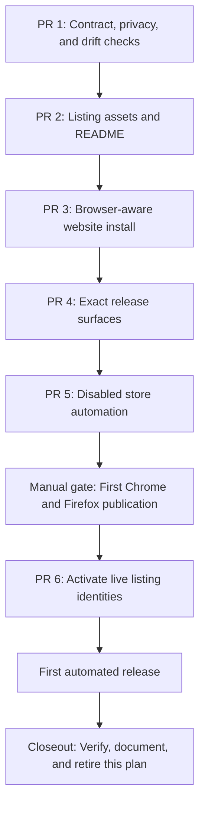
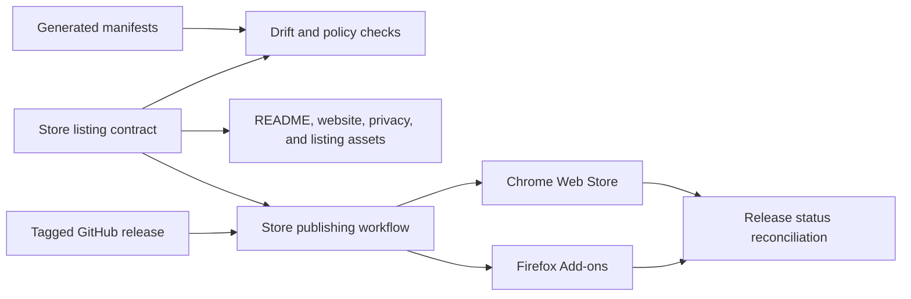
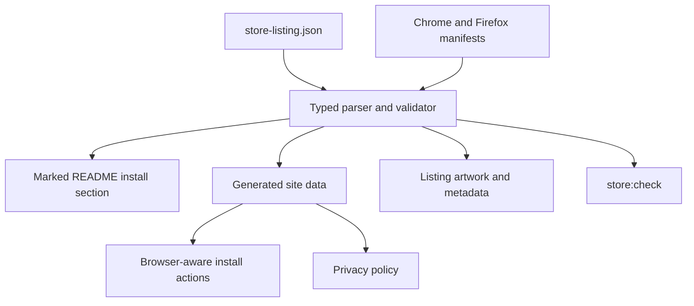
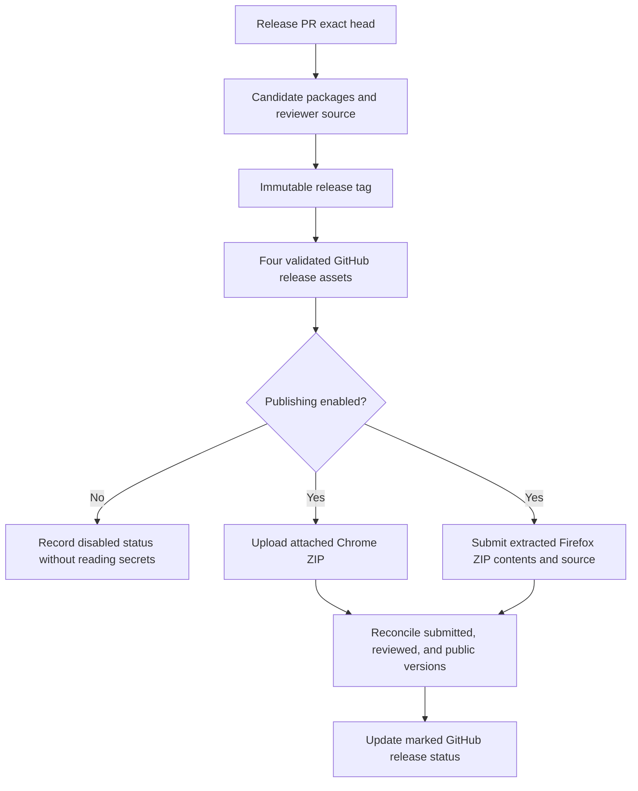

# Browser store publication implementation plan

> **For agentic workers:** REQUIRED SUB-SKILL: Use `superpowers:subagent-driven-development`
> (recommended) or `superpowers:executing-plans` to implement this plan task-by-task. Steps use
> checkbox (`- [ ]`) syntax for tracking.

**Goal:** Publish Point & Shoot to the Chrome Web Store and Firefox Browser Add-ons, make the
repository and website install flows browser-aware, and automatically submit each later GitHub
release to both stores.

**Architecture:** One checked-in store-listing contract owns public URLs, listing copy, privacy
disclosures, and publication state. Deterministic generators and checks project that contract into
the website, README, release surfaces, and store assets. The release workflow publishes the exact
tagged packages through vendor-supported APIs only after the first manual listings establish the
store identities.

**Tech stack:** Deno 2.9.4, TypeScript, Astro 7.1.6, GitHub Actions, Chrome Web Store API v2, and
`web-ext` 10.5.0.

> **How to read this plan:** [Global constraints](#global-constraints) and the
> [dependency graph](#dependency-graph) define sequencing. The
> [agent protocol](#agent-operating-protocol) defines handoffs. Each linked packet contains its
> implementation checklist and acceptance evidence.

## Global constraints

- Chrome and Firefox/Gecko are first-class. Safari is explicitly deferred.
- Chrome means Chromium-engine browsers whose extension store path is compatible with the Chrome Web
  Store. Firefox means Gecko-engine browsers compatible with Firefox Browser Add-ons.
- Browser detection recommends a store; it never hides the other store or automatically redirects.
- A website install action links to an official store listing. Chromium inline installation from a
  third-party website is not supported.
- Unknown store identifiers and URLs are represented as `null`, never as clickable dummy values.
- No store URL is rendered unless its state is `published` and its URL passes the canonical checker.
- Store credentials live only in GitHub environments or secrets. They never appear in source,
  artifacts, logs, pull request bodies, or this public plan.
- The extension uses no remote code and collects, transmits, sells, or shares no user data.
  Disclosures must still describe page content processed locally in response to a user gesture.
- The permission set remains `activeTab`, `storage`, `scripting`, `downloads`, `clipboardWrite`, and
  Chrome-only `sidePanel`; Firefox retains `sidebar_action` and its stable extension ID.
- Listing artwork is generated reproducibly as JPEG or 24-bit PNG without alpha.
- The five screenshots are exactly 1280×800. Promo tiles are exactly 440×280 and 1400×560.
- Store submission starts from the exact packages attached to the matching GitHub release, never a
  local rebuild. Chrome receives the attached ZIP bytes; Firefox tooling may deterministically
  repackage the extracted ZIP contents for signing.
- Every code PR includes tests for expected, failure, and boundary behavior and passes its own CI.
- Every visible PR includes current screenshots in its pull request body.
- `support@pointandshoot.app` is the public support address.
- This directory is an explicitly requested temporary delivery exception. Remove it after the first
  automated release is verified and preserve lasting behavior in specs, ADRs, and tutorials.

## Dependency graph

## Architecture

The delivery system has two boundaries: deterministic public-surface projection from repository
state, and vendor submission from an immutable GitHub release.

### Canonical projection detail

### Release publication detail

## Architecture review record

- Reviewed: 2026-08-04
- Verdict: clear
- Blast radius: release publication and public installation; extension runtime is unchanged by the
  plan itself
- Highest residual risk: vendor policy/API changes between plan authoring and execution

- A — Single points of failure: canonical config is intentional; validators fail closed, while
  manual vendor dashboards remain recovery paths.
- B — Unhappy paths: packets cover partial vendor success, timeout, warning, rejection, retry,
  version mismatch, and stale public state.
- C — Assumptions: vendor API and policy assumptions are marked for live re-verification at packet
  start.
- D — Scalability: work is release-time only; status polling is bounded and no user-request hot path
  is introduced.
- E — Security: protected environments, OIDC preference, fork isolation, masking, and log-redaction
  tests protect credentials.
- F — Operability: disable switch, exact-tag manual retry, reconciliation, and marked release status
  provide recovery and diagnosis.
- G — Cost: no always-on service is introduced; execution is limited to GitHub Actions and vendor
  API calls per release.
- H — Delivery: focused PRs, a hard manual gate, and an end-to-end canary release isolate external
  dependency risk.

The review incorporated four blocking corrections before this verdict: unpublished official badges
were removed; mobile wrappers were separated from desktop engine recommendations; Chrome listing
copy was made an explicit manual action because API v2 cannot mutate it; and Firefox repackaging was
distinguished from Chrome's byte-for-byte upload.

## Work packet status

Only the earliest packet whose dependencies are complete may move to `in progress`. Update this
table in the same commit that changes a packet's status.

| # | Packet                                                       | Depends on  | Status      | Owner        |
| - | ------------------------------------------------------------ | ----------- | ----------- | ------------ |
| 1 | [Contract and privacy](01-contract-and-privacy.md)           | None        | complete    | Codex        |
| 2 | [Listing assets and README](02-listing-assets-and-readme.md) | PR 1        | complete    | Codex        |
| 3 | [Website install flow](03-website-install-flow.md)           | PR 2        | complete    | Codex        |
| 4 | [Release surfaces](04-release-surfaces.md)                   | PR 3        | complete    | Codex        |
| 5 | [Publishing automation](05-publishing-automation.md)         | PR 4        | in progress | Codex        |
| 6 | [First manual publication](06-first-manual-publication.md)   | PR 5 merged | pending     | user         |
| 7 | [Activate live listings](07-activate-live-listings.md)       | Manual gate | pending     | unassigned   |
| 8 | [First automated release](08-first-automated-release.md)     | PR 6 merged | pending     | user + agent |

Allowed statuses are `pending`, `in progress`, `blocked`, and `complete`. Replace `unassigned` with
an agent or person before work starts. Record evidence in the packet: a pull request URL for PR
packets, a dated note for manual packets, or a release URL for release verification.

## Agent operating protocol

### Start a packet

- [ ] Read this file, the target packet, `AGENTS.md`, and every file listed under **Read first**.
- [ ] Confirm every dependency is `complete` in the table above.
- [ ] Confirm the branch and worktree are intended for this packet and the worktree is clean.
- [ ] Set the packet and table row to `in progress`; add the owner and start timestamp.
- [ ] Reconcile the packet against live vendor documentation before using an external API or CLI.
- [ ] Work only inside the packet's scope and stated PR boundary.

### Complete a packet

- [ ] Run every packet-specific verification and the repository gates affected by the change.
- [ ] Record commands and outcomes under the packet's **Completion record**.
- [ ] Update current specs, tutorials, and `AGENTS.md` in the same commits as their behavior.
- [ ] Publish the focused PR, resolve review and CI, and record its URL.
- [ ] Mark the packet `complete` only when its acceptance evidence exists.
- [ ] Update the next packet's **Incoming handoff** with facts that differ from this plan.

### Block a packet

- [ ] Set the packet and table row to `blocked`.
- [ ] Record the exact blocker, commands attempted, relevant URL or error, and the next authority
      needed.
- [ ] Do not begin a dependent packet. Independent investigation may continue without making its
      status `in progress`.

## PR stack and commit boundaries

Create a dependency-ordered stack. Each PR targets the preceding PR until it merges; then retarget
the remaining child to the new merged base without rewriting unrelated commits.

- PR 1: `feat(store): add canonical listing metadata contract`, then
  `docs(privacy): publish extension data-handling policy`.
- PR 2: `build(store): generate and validate listing artwork`, then
  `docs(readme): add browser store install flow`.
- PR 3: `feat(site): recommend the compatible browser store`, then
  `test(site): cover install detection and fallback states`.
- PR 4: `build(release): add reviewer source artifacts`, then
  `feat(release): report store installation status`.
- PR 5: `ci(store): submit released packages to both stores`, then
  `docs(release): document store publication and recovery`.
- PR 6: `chore(store): activate published extension listings`.

## Store metrics decision

The listing launch does not scrape either storefront. Firefox exposes public add-on and ratings APIs
that can supply rating summaries, current versions, and review text, although its current ratings
API warns that it is not frozen. The published Chrome Web Store API v2 resource list covers package
upload and publication state, not public ratings or reviews; the Chrome conclusion is an inference
from that official API surface.

A later metrics PR may add build-time Firefox data with a stale fallback, but only after it defines
an equivalent or intentionally asymmetric Chrome design. Store review text must never be copied into
the repository or website without a separate content and privacy review.

## Vendor references

Agents must re-check these official sources when their packet starts because policies and APIs can
change after this plan is written.

- [Chrome inline-installation deprecation](https://developer.chrome.com/docs/extensions/mv2/inline-faq)
- [Chrome image requirements](https://developer.chrome.com/docs/webstore/images)
- [Chrome badge rules](https://developer.chrome.com/docs/webstore/branding)
- [Chrome user-data FAQ](https://developer.chrome.com/docs/webstore/program-policies/user-data-faq)
- [Chrome Web Store API v2](https://developer.chrome.com/docs/webstore/api/reference/rest)
- [Chrome service accounts](https://developer.chrome.com/docs/webstore/service-accounts)
- [Firefox `web-ext` command reference](https://extensionworkshop.com/documentation/develop/web-ext-command-reference/)
- [Firefox source-code submission](https://extensionworkshop.com/documentation/publish/source-code-submission/)
- [Firefox website promotion](https://extensionworkshop.com/documentation/publish/promoting-your-extension/)
- [AMO add-on API](https://mozilla.github.io/addons-server/topics/api/addons)
- [AMO ratings API](https://mozilla.github.io/addons-server/topics/api/ratings.html)

## Final definition of done

- [ ] The README shows official Chrome and Firefox badges linked to live listings.
- [ ] The website recommends the correct store for Gecko and Chromium browsers while showing both.
- [ ] `/privacy/` is public, linked from both listings, and matches the shipped permissions.
- [ ] Chrome and Firefox listing copy, screenshots, and promotional tiles pass vendor validation.
- [ ] A release PR exposes exact candidate packages and clear install/testing instructions.
- [ ] A GitHub release reports expected, submitted, reviewed, and public versions for both stores.
- [ ] A later GitHub release submits the exact attached packages to both stores automatically.
- [ ] Store status reconciliation confirms each public version equals the GitHub release version.
- [ ] A clean install from the website succeeds in one Chromium browser and one Firefox browser.
- [ ] Each installed build completes capture, review, and export.
- [ ] Durable behavior is documented outside this temporary directory, then this directory is
      removed.

## Completion record

- Status: pending
- Owner: unassigned
- Started: not started
- Completed: not completed
- Evidence: none
- Deviations: none
