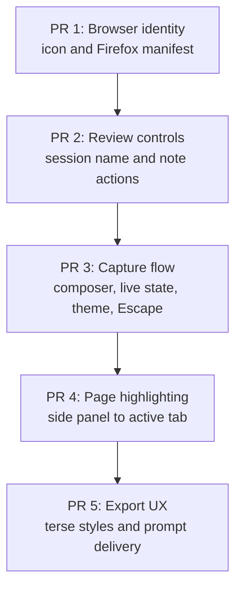
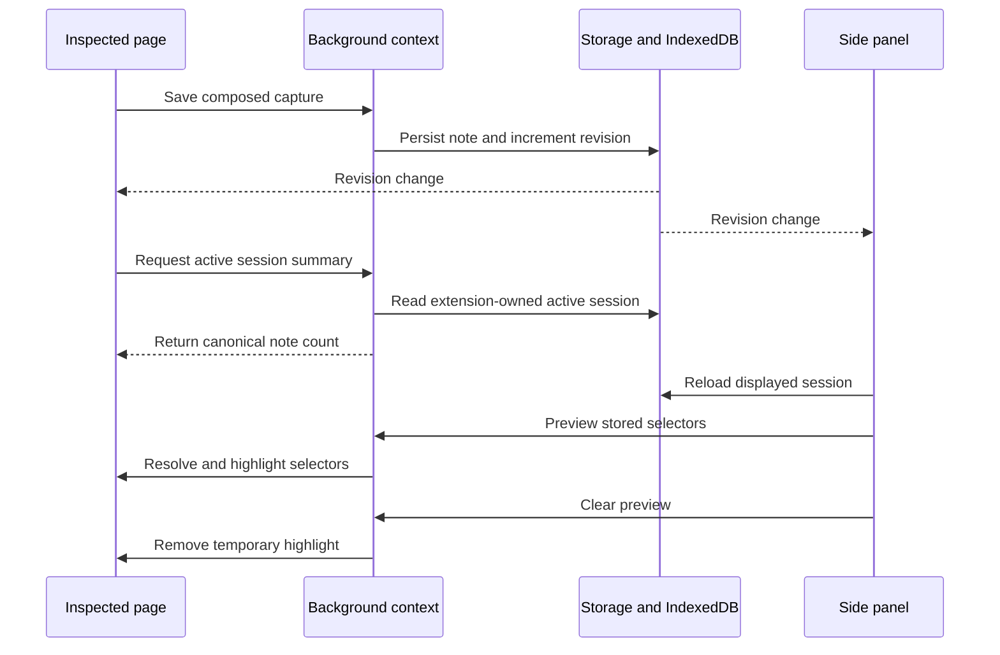

# Post-wave UX corrections

This plan fixes the UX defects found after implementing waves 1–4. It ships as five stacked pull
requests so each behavior change remains independently testable and reviewable.

## How to read this plan

- **Context and goals** explain why the work exists and define completion.
- **Stack design** is the reference for pull request boundaries and dependencies.
- **Delivery guide** defines the implementation and verification required in each pull request.
- **Completion gates** define the checks applied to every pull request and to the final stack.

## Context and goals

The completed extension has working capture, storage, review, and export foundations, but several
interactions do not match the intended workflow. Placeholder packaging assets remain, the injected
toolbar carries nonfunctional controls and stale state, session review lacks direct manipulation,
and export actions are harder to find than the generated prompt.

The stack is complete when:

1. Chrome and Firefox show the viewfinder extension icon and both manifests lint without the invalid
   `commands` permission.
2. A session can be renamed, and every note exposes edit, move up, move down, and delete as
   accessible icon buttons.
3. Selecting an element captures it, opens the note composer, and persists the note only through an
   explicit composer action.
4. The injected toolbar contains only selection, note count, and plan navigation; its count stays
   synchronized with storage and its automatic theme contrasts with the inspected page.
5. `Escape` dismisses the complete injected capture UI without ending or deleting the active
   session. The existing shortcut can reopen capture on the same page.
6. Hovering or focusing a note highlights its currently resolved element on the active inspected
   page and clears the highlight when the interaction ends.
7. Exported computed styles are shorter without changing stored session records, export size is
   advisory rather than blocking, and prompt copy/download actions are visible beside the preview.

### Scope boundaries

- Preserve the `activeTab`-only permission model and the current Chrome/Firefox browser shim.
- Preserve existing session records; this work does not bump `SCHEMA_VERSION` or migrate IndexedDB.
- Preserve screenshot capture as part of element or drag selection.
- Do not add dormant feature flags for the removed Screenshot and Note toolbar controls.
- Do not add remote assets, background uploads, or store-submission work.

## Stack design

Each pull request targets the preceding branch. Pull requests remain green and independently
reviewable at every stack level.

### Cross-context state contracts

The revision key is the only invalidation signal. Side-panel writes increment it only after
IndexedDB succeeds. The background context owns extension-origin session reads and returns a typed
active-session summary to content scripts; content scripts never open page-origin IndexedDB. Every
receiving surface reloads canonical state instead of applying count deltas, which prevents duplicate
events and failed writes from drifting either toolbar count.

## Delivery guide

### PR 1 — Correct browser identity assets

**Issues:** 1 and 13.

**Implementation:**

1. Replace the flat placeholder PNG generator with deterministic raster output matching
   `.claude-design/point-and-shoot/assets/icon.svg` at 16, 32, 48, and 128 pixels.
2. Keep the upstream design bundle read-only; test the generated mark's transparent background,
   viewfinder corners, center dot, dimensions, and PNG structure.
3. Remove `commands` from `permissions` while retaining the top-level `commands` declaration and
   shortcut behavior in both targets.
4. Update manifest tests and permission documentation that still includes `commands`.

**Verification:**

- Unit-test all generated icon sizes and both manifest variants.
- Run `deno task build`, `deno task lint:firefox`, and the fast CI gate.
- Inspect both built manifests and raster icons.

**Commits:**

- `docs(plans): define post-wave UX correction stack`
- `fix(extension): correct browser identity assets`

### PR 2 — Improve session and note controls

**Issues:** 2 and 4.

**Implementation:**

1. Add an immutable session-name update to the side-panel model and persist it through the existing
   repository.
2. Make every successful side-panel save increment `SESSION_REVISION_STORAGE_KEY` after IndexedDB
   commits so background and content surfaces receive one durable invalidation event.
3. Make the displayed session heading directly editable with save, cancel, empty-name validation,
   and storage-failure recovery.
4. Render edit, move up, move down, and delete as four icon buttons in that order.
5. Add the required up/down icons to the generated local sprite and keep disabled movement controls
   visible and accessible.

**Verification:**

- Cover rename success, cancellation, blank input, and failed persistence.
- Cover first, middle, last, and single-note movement states.
- Verify keyboard names, focus restoration, both themes, and persistence after panel reopen.

**Commit:** `feat(sidepanel): improve session and note controls`

### PR 3 — Restore the complete annotation flow

**Issues:** 3, 5, 6, 7, 8, and 14.

**Implementation:**

1. Remove the standalone Screenshot and Note toolbar tools and their unused tool-state branches.
2. After selector or drag capture completes, open an in-shadow-root note composer next to the
   selected region. Save persists the screenshot, selectors, and entered text; “Save without note”
   persists an empty note; cancel discards the pending capture.
3. Keep picker, toolbar, and composer geometry separate so the toolbar avoids both the selected area
   and composer.
4. Subscribe the background and content realms to `SESSION_REVISION_STORAGE_KEY`. The background
   reconciles the browser-action badge and title, while content requests a typed active-session
   summary for the injected toolbar after capture, edit, delete, reorder, rename, start, or end.
   Neither surface increments counts locally.
5. In automatic mode, choose the design theme opposite the sampled page backdrop. Explicit dark or
   light settings continue to select the named theme.
6. Make `Escape` dismiss the picker, composer, highlight, and toolbar while leaving the active
   session intact. A second `Escape` is a no-op; the existing shortcut remounts capture.

**Verification:**

- Cover save with text, save without text, cancel, capture failure, persistence failure, and rapid
  consecutive captures.
- Cover external deletion and edit events updating the toolbar count without remounting.
- Cover dark, light, threshold, explicit override, and empty-sample theme behavior.
- Cover pointer and keyboard capture, composer focus, `Escape` from picker and composer, repeated
  `Escape`, and shortcut resume.
- Refresh toolbar visual baselines for both themes.

**Commit:** `fix(capture): restore the complete annotation flow`

### PR 4 — Highlight reviewed notes on the inspected page

**Issue:** 9.

**Implementation:**

1. Add typed preview and clear messages through the side panel, background, and content realms.
2. On note hover or keyboard focus, send the note's page URL and selector bundle to the active tab.
3. Require the active tab URL to match the recorded page after applying the note's query-stripping
   rule. Resolve selectors in trust order: stable id/test attribute, ARIA identity, CSS path, then
   XPath.
4. Draw the preview in the closed shadow root without styling the host page. Clear it on pointer
   leave, blur, panel unmount, page mismatch, navigation, or resolution failure.
5. Carry a monotonically increasing preview generation through each request and ignore an older
   resolution that finishes after a newer hover or clear request.
6. Treat closed-shadow and cross-origin targets as unavailable previews without changing the note or
   logging a user-facing error.

**Verification:**

- Cover each selector fallback, stale selectors, wrong active tab, navigation, rapid hover changes,
  unreachable elements, keyboard focus, and cleanup.
- Verify the inspected page DOM remains unmodified and both themes retain visible contrast.

**Commit:** `feat(sidepanel): highlight notes on the inspected page`

### PR 5 — Streamline agent output

**Issues:** 10, 11, and 12.

**Implementation:**

1. Keep canonical IndexedDB records unchanged. During export only, collapse box-model sides into CSS
   shorthands and collapse equal border colors while preserving differing sides.
2. Keep exact projected bytes and the configured budget visible as advisory information. Never
   disable copy or download because the selection exceeds that budget.
3. Place prompt actions beside the Markdown preview so they remain visible before the footer: Copy
   prompt, Download prompt (`.md`), and Download bundle (`.zip`).
4. Keep empty selections and serialization failures blocking because they cannot produce a valid
   prompt; distinguish these errors from an advisory size warning.
5. Update the export and settings specifications to describe budgets as warnings and document the
   standalone Markdown download.

**Verification:**

- Golden-test terse styles with uniform, mixed, zero, and missing values.
- Confirm stored session JSON remains valid and unchanged after export.
- Cover over-budget copy, Markdown download, ZIP download, empty selection, clipboard rejection,
  download rejection, and archive-build failure.
- Verify all three actions at narrow and wide panel sizes and by keyboard.

**Commit:** `fix(export): streamline agent output`

## Completion gates

For every pull request:

1. Run focused tests while developing, then `mise exec -- deno task ci`.
2. Run browser-rendered tests and live preview for every changed surface.
3. Invoke `wk-workstyle`, `wk-docs`, and `wk-commit` before publishing.
4. Push the branch, create or update its pull request, and target the preceding stack branch.
5. Run one post-publish adversarial review, resolve blockers, and monitor CI through completion.

After PR 5:

1. Rebase or submit the complete stack with the repository's stack tooling.
2. Run the full browser, visual, accessibility, and Firefox gates against the final head.
3. Verify every pull request base and head, clean working trees, and record the session retro.
