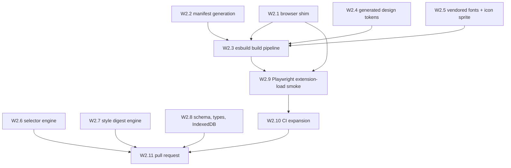

# Wave 2 — Core libraries

**Read [`README.md`](README.md) in this folder first.** Wave 2 assumes [wave 1](wave-1-foundations.md)
is complete.

- **Status:** blocked on wave 1
- **Goal:** every non-visual mechanism the UI will consume — the browser shim, manifest generation,
  the build pipeline, generated design tokens, vendored fonts and icons, the selector and
  style-digest engines, and the storage layer. Wave 2 ends with a **real extension loading in
  Playwright**, which is the gate wave 1 could not provide.

Wave 2 ships **no UI**. Nothing here renders a component; wave 3 does that. Keep UI out even when a
`console.log` would be faster to eyeball — an untested mechanism with a pretty demo on top is harder
to debug than a tested mechanism with no demo.

## Dependency graph

W2.1, W2.2, W2.4, W2.5, W2.6, W2.7, and W2.8 are all **parallel-safe** with each other — seven
disjoint file sets, safe to hand to concurrent agents.

---

## W2.1 — Promise-based browser shim

- [ ] `src/shared/browser.ts` + unit tests — SHA: _pending_

**parallel-safe.**

**Why:** this is the single seam where Chrome and Firefox differ, and the one place we can catch that
divergence cheaply. Everything else in the codebase imports from here and stays browser-agnostic.

**Write `src/shared/browser.ts`:**
- Export a typed `browser` object wrapping only the APIs this project uses: `tabs.captureVisibleTab`
  / `tabs.captureTab`, `tabs.query`, `runtime.sendMessage`, `runtime.onMessage`, `storage.local`,
  `scripting.executeScript`, `commands.onCommand`, `downloads.download`, `action.onClicked`, and the
  side-panel/sidebar opener. Do not wrap APIs speculatively — an unused wrapper is untested surface.
- Firefox exposes `browser.*` returning promises; Chrome exposes `chrome.*`, which in MV3 also
  returns promises for most APIs but **not uniformly**. Detect the global once at module load and
  normalize; never branch per call site.
- Normalize the genuinely divergent names behind one method each: capture (`captureVisibleTab` vs
  `captureTab`), and panel opening (`chrome.sidePanel` vs `browser.sidebarAction`). The rest of the
  codebase must not know which browser it's on.
- Export a `runtimeInfo` describing the detected engine, for logging and for tests to assert against.
- TSDoc every export, and document *which* browsers each method's behaviour differs on. That comment
  is the reason this file exists.

**Tests** (`src/shared/browser.test.ts`): inject a fake Chrome-shaped global and a fake
Firefox-shaped global, and assert the shim produces identical results through both — including that a
callback-style Chrome API resolves as a promise, and that the capture and panel name divergences
resolve correctly. This is the cheap substitute for Firefox E2E per ADR 0007; it only works if the
fakes genuinely mimic the shapes, so model them on the real API signatures rather than on what makes
the test pass.

**Verify:** `deno task test` green; `deno task check` clean.

**Commit:** `feat(shared): add promise-based cross-browser extension API shim`

---

## W2.2 — Manifest generation for both targets

- [ ] `build/manifest.ts` + generated manifests — SHA: _pending_

**parallel-safe.**

**Why:** Chrome and Firefox MV3 manifests differ structurally, and maintaining two hand-written JSON
files guarantees they drift. One typed source, two emitted files.

**Write `build/manifest.ts`:**
- A typed `manifest.base` object holding everything shared: `manifest_version: 3`, name, version,
  description, icons, `permissions` (exactly the six from the README's permission list — no more),
  `action`, `commands` (with a suggested default shortcut and a clear description string),
  `content_scripts`, and `web_accessible_resources` for the vendored fonts and icon sprite.
- A `forChrome()` producing `background.service_worker` (type `module`) and `side_panel`.
- A `forFirefox()` producing `background.scripts` (Firefox MV3 uses an event page, **not** a service
  worker) plus `browser_specific_settings.gecko.id` and a `strict_min_version`, and
  `sidebar_action` instead of `side_panel`.
- No `host_permissions` in either. If a future item wants one, that's an ADR-0002 revision, not a
  quiet edit.
- Set `content_security_policy.extension_pages` explicitly to the strict default (`script-src 'self'`,
  `object-src 'self'`) so any accidental inline script or remote asset fails loudly at load rather
  than subtly at runtime.
- TSDoc each divergence with the reason. Someone will eventually ask why there are two functions.

**Tests:** assert both outputs validate against the required MV3 keys for their browser, that neither
contains `host_permissions`, that the permission list matches the README's exactly, and that
Firefox's output has no `service_worker` key while Chrome's has no `scripts` key.

**Verify:** `deno task test` green.

**Commit:** `feat(build): generate chrome and firefox manifests from one typed source`

---

## W2.3 — esbuild build pipeline

- [ ] `build/build.ts` + `deno task build` — SHA: _pending_

**Depends on:** W2.1, W2.2, W2.4, W2.5.

**Why:** produces the `dist/chrome/` and `dist/firefox/` trees that everything downstream loads.

**Resolve and pin Preact first:** `npm view preact version` and `npm view preact dist-tags`, then add
`preact` at that exact version to `deno.json` imports. Do not guess a version from memory.

**Write `build/build.ts`** using `npm:esbuild@0.28.1`:
- Entry points: `src/background/index.ts`, `src/content/index.ts`, plus HTML-paired entries for the
  side panel, popup, and options page. Wave 2 may emit placeholder HTML shells for those three —
  a valid document that loads its bundle and renders nothing. Wave 3 fills them.
- `format: 'esm'`, `target: 'chrome120,firefox121'` (pick real floors and record them in
  `AGENTS.md`), `bundle: true`, sourcemaps in dev and none in release.
- JSX configured for Preact: `jsx: 'automatic'`, `jsxImportSource: 'preact'`.
- **Content-script caveat:** the content script must be classic-script-compatible or injected as a
  module per browser support; verify which by loading it in W2.9 rather than reasoning about it. An
  ESM content script that silently fails to execute looks identical to a bug in your code.
- Copy static assets into each dist: manifest from W2.2, vendored fonts and icon sprite from W2.5,
  generated token CSS from W2.4, extension icons.
- `--release` flag: minify, drop sourcemaps, and emit `dist/chrome.zip` / `dist/firefox.zip`.
- Fail the build loudly on any bundle containing an absolute `http://` or `https://` URL — this is the
  automated enforcement of ADR 0009. Grep the output; do not trust that nobody added a CDN link.

**Add `deno.json` tasks:** `build` and `build:release`.

**Verify:** `deno task build` produces `dist/chrome/manifest.json` and `dist/firefox/manifest.json`
plus bundles; the remote-URL check passes; `deno task build:release` emits both zips.

**Commit:** `feat(build): add esbuild pipeline emitting chrome and firefox bundles`

---

## W2.4 — Generated design tokens

- [ ] `build/tokens.ts`, `src/shared/design/`, drift check — SHA: _pending_

**parallel-safe.**

**Why:** per ADR 0011, hand-copied tokens drift from the design source invisibly. Generation plus a
CI diff check makes drift impossible to merge.

**Write `build/tokens.ts`:**
- Read `.claude-design/point-and-shoot/tokens/{colors,typography,spacing,effects,base}.css`.
- Emit `src/shared/design/tokens.css` — the concatenated custom properties, **with the Google Fonts
  `@import` stripped** and replaced by `@font-face` rules pointing at the W2.5 vendored WOFF2 files
  via `chrome.runtime.getURL`-resolvable paths. Preserve the `:root` and `[data-theme="light"]`
  blocks exactly; the light-theme override is how ADR 0010's theming works.
- Emit `src/shared/design/tokens.ts` — a typed union of every token name plus a `token()` helper, so
  a typo in a token name is a type error rather than a silently-empty CSS variable.
- Emit a header comment in both files: generated, do not edit, regenerate with `deno task tokens`.
- Add tasks `tokens` (regenerate) and `tokens:check` (regenerate to a temp dir and diff; non-zero
  exit on any difference).
- Add `lint:design` → `deno run -A npm:oxlint@<resolved> --config .claude-design/point-and-shoot/_adherence.oxlintrc.json src/`
  as a **non-blocking** informational task. Resolve oxlint's version with `npm view oxlint version`.
  It is not in `deno task ci` — it lints for design adherence against a config we didn't write, and a
  false positive there must not block a merge. Document that reasoning in `AGENTS.md`.

**Verify:** `deno task tokens` then `deno task tokens:check` exits 0; hand-edit one generated line and
confirm `tokens:check` exits non-zero (then revert). A drift check that never fails isn't a check.

**Commit:** `feat(build): generate design tokens from the design bundle with drift check`

---

## W2.5 — Vendored fonts and icon sprite

- [ ] `src/shared/design/fonts/`, `icons.svg`, `build/vendor-assets.ts` — SHA: _pending_

**parallel-safe.**

**Why:** ADR 0009. MV3 forbids remote code, and a remote font request from an overlay injected into
someone's page tells Google which pages they're annotating. This item removes every network
dependency from the rendered UI.

**Fonts:**
- Vendor Space Grotesk, Inter, and JetBrains Mono as WOFF2, subset to Latin plus the punctuation and
  symbols the UI actually uses. Use a subsetting tool via `npm:` (resolve the version with
  `npm view`) and record the exact subsetting command in `build/vendor-assets.ts` so it's
  reproducible rather than a one-off someone ran locally.
- Include only the weights the design uses — check `.claude-design/point-and-shoot/tokens/fonts.css`
  for the requested weights and the UI kits for which are actually applied. Shipping seven weights
  when the UI uses three is 100KB of dead payload.
- Output to `src/shared/design/fonts/`, and list them in `web_accessible_resources` (W2.2) so the
  content script can load them from within a host page.
- Record the total byte size in the commit message. The target from the design decision is roughly
  60–120KB combined; if you land materially above that, say so rather than letting it pass silently.

**Icons:**
- Vendor only the Lucide icons the six UI kits actually reference. Grep
  `.claude-design/point-and-shoot/ui_kits/` and `components/` for icon names rather than guessing.
- Emit a single `src/shared/design/icons.svg` sprite of `<symbol>` elements, with `stroke-width`
  preserved at Lucide's 1.5–2px and `stroke="currentColor"` so tokens colour them (per the design's
  iconography rules: stroke only, no filled or duotone variants, 16/20/24px).
- Emit a typed `IconName` union alongside, so an unknown icon name is a type error.

**Verify:** no file under `src/shared/design/` references any `http://` or `https://` URL; the fonts
render in the W2.9 smoke load; `deno task check` clean.

**Commit:** `feat(design): vendor subset fonts and lucide sprite, removing all remote assets`

---

## W2.6 — Selector engine

- [ ] `src/shared/selectors.ts` + tests — SHA: _pending_

**parallel-safe.**

**Why:** this is what decides whether the exported prompt is actionable. A selector bundle that
doesn't survive a rebuild makes the whole product useless, so it gets the most adversarial tests in
the project.

**Write `src/shared/selectors.ts`** exporting a function that takes an `Element` and returns the
selector bundle from the README: `xpath`, `cssPath` (unique, shortest that still resolves uniquely),
`testIds` (`data-testid`, `data-test`, `data-cy`, `id`), `ariaRoleName` (role plus computed
accessible name), `tagClasses`, and `textSnippet` (trimmed, length-capped).

Requirements that are easy to get wrong and must be handled explicitly:
- The generated `cssPath` and `xpath` **must round-trip**: re-querying the document with them returns
  the same element. Assert this in the function itself in dev builds — a selector that doesn't
  resolve is worse than no selector, because it sends the agent to the wrong element.
- Elements inside an **open** shadow root need a path that records the shadow boundary; a plain
  `document.querySelector` cannot cross it. Represent the boundary explicitly in the bundle.
- Elements inside a **closed** shadow root are unreachable. Return a bundle flagged as
  `unreachable: 'closed-shadow-root'` rather than a wrong selector. Silent wrongness is the failure
  mode to design against here.
- Cross-origin iframes are unreachable from the parent's content script. Flag them the same way.
- Prefer stable signals in the emitted order: test ids first, then ARIA, then a structural path.
  `AGENTS.md` should record that ordering so consumers know what to trust.

**Tests:** run against the W1.8 fixture pages — the ambiguous-class case, the no-id case, the
sibling-index-only list, the deeply nested button, both shadow hosts, and both iframes. Every
generated selector gets round-trip-asserted. Add the sad paths: detached elements, `<html>` itself,
and text nodes passed in by mistake.

**Verify:** `deno task test` green, with the fixture-backed round-trip assertions actually running
(not skipped).

**Commit:** `feat(shared): add selector bundle engine with round-trip verification`

---

## W2.7 — Computed-style digest engine

- [ ] `src/shared/style-digest.ts` + tests — SHA: _pending_

**parallel-safe.**

**Why:** per the README, concrete numbers are more actionable to a fix-agent than pixels, and they're
greppable. This is the cheapest high-value signal in the whole bundle.

**Write `src/shared/style-digest.ts`:** given an element, emit a bounded digest of `getComputedStyle`
plus `getBoundingClientRect` — box model (width, height, padding, margin, border), typography
(family, size, weight, line-height, letter-spacing), colour (text, background, border, resolved to
hex where possible), and spacing relationships to parent and adjacent siblings. Include the parent
and immediate siblings, since most spacing bugs are only explicable relative to neighbours.

Keep it **bounded** — cap the number of properties, the subtree depth, and the sibling count, and
document the caps. An unbounded digest silently balloons the export past what any agent will read.

**Tests:** assert stable output for fixture elements, that caps hold on a pathological deep subtree,
and that values are normalized (e.g. colours to a consistent form) so diffs between two notes are
meaningful rather than noise.

**Verify:** `deno task test` green.

**Commit:** `feat(shared): add bounded computed-style digest engine`

---

## W2.8 — Schema, types, and IndexedDB layer

- [ ] `src/shared/schema.ts`, `src/shared/store.ts` + tests — SHA: _pending_

**parallel-safe.**

**Why:** ADR 0003 makes this JSON the canonical record. Getting the shape and its versioning right
now is what makes v2's remote handoff a serializer swap instead of a rewrite.

**Write `src/shared/schema.ts`:** the `Session` and `Note` types from the README's data-model section,
with `schemaVersion` as a literal, TSDoc on every field explaining what a consumer should do with it,
and a runtime validator so a record read from storage is checked rather than trusted. Include the
`truncated` flag on `region`, the `unreachable` flag on element entries from W2.6, and the
`componentHint` as optional (it's behind a flag).

**Write `src/shared/store.ts`:** the IndexedDB layer — open with an explicit version and an
`onupgradeneeded` migration path from day one, even though there's only v1. Retrofitting migrations
onto a store with real user data is how you end up shipping a data-loss bug. CRUD for sessions and
notes, an export read, and quota-exceeded handling that surfaces a real error the UI can show rather
than throwing an opaque `DOMException`.

**Tests:** round-trip a session with a base64 WebP note through validation; reject a malformed record;
exercise the migration path with a synthetic v0→v1; simulate quota exceeded and assert the typed
error. Run against a fake IndexedDB in Deno, and re-verify for real in wave 3 when the extension has
a live context.

**Verify:** `deno task test` green; validator rejects at least three distinct malformed shapes.

**Commit:** `feat(shared): add versioned session schema and IndexedDB store`

---

## W2.9 — Playwright extension-load smoke

- [ ] `tests/e2e/load.spec.ts` + `deno task e2e:smoke` — SHA: _pending_

**Depends on:** W2.3, W2.1.

**Why:** this is the gate wave 1 couldn't provide, and the first moment we know the built artifact is
actually a working extension rather than a plausible-looking directory.

**Write `tests/e2e/load.spec.ts`** using `npm:playwright@1.62.0`:
- `chromium.launchPersistentContext` with `--disable-extensions-except=dist/chrome` and
  `--load-extension=dist/chrome`, per Playwright's Chrome-extensions guide.
- Resolve the extension ID from the service worker, and assert the worker actually booted.
- Navigate to a W1.8 fixture page and assert the content script executed — expose a single
  deterministic signal for this (a data attribute on `documentElement`, say) rather than sniffing for
  UI that doesn't exist yet.
- Assert **zero console errors and zero unhandled page errors** during load. This catches the CSP and
  ESM-content-script failure modes flagged in W2.3, which are otherwise invisible.
- Load the vendored font and icon sprite through the extension's own URL and assert they resolve —
  this is what proves `web_accessible_resources` is right.

**Add `deno.json` task:** `e2e:smoke`.

**Verify:** `deno task build && deno task e2e:smoke` green. If the content script doesn't execute,
fix W2.3's script format — do not weaken the assertion.

**Commit:** `test(e2e): load built extension in chromium and assert boot health`

---

## W2.10 — CI expansion

- [ ] `.github/workflows/ci.yml` updated — SHA: _pending_

**Depends on:** W2.9, W2.4.

Add to the existing workflow, each as its own job so a failure names itself:
- `build` — `deno task build`, uploading `dist/` as an artifact.
- `tokens-drift` — `deno task tokens:check`.
- `e2e-smoke` — installs the Chromium binary, runs `deno task e2e:smoke`, uploads Playwright traces
  on failure.

Cache the Playwright browser download keyed on the pinned Playwright version, or CI pays a full
browser download every run. Still no `smoke-firefox` job — that lands in wave 4 with the thing it
tests.

**Verify:** push and `gh run watch --exit-status`; confirm all jobs green and the `dist/` artifact is
downloadable and contains both browser trees.

**Commit:** `ci: add build, token drift, and extension smoke jobs`

---

## W2.11 — Pull request

- [ ] PR opened — record the number here

**Depends on:** W2.1–W2.10, CI green.

Body must include: what wave 2 establishes; a checklist with commit SHAs; the **vendored asset byte
sizes** from W2.5; confirmation that the built bundles contain no remote URLs; a Verification section
mapping each claim to a command actually run; and a Follow-ups section stating that no UI ships in
wave 2, the side panel / popup / options pages are placeholder shells, and Firefox is verified only
by unit-test fakes so far.

Screenshots: wave 2 has no UI to shoot. Instead attach the `chrome://extensions` view showing the
extension loaded without errors, and paste the `e2e:smoke` output. Say plainly that there's no UI
yet rather than padding the PR with fixture screenshots already shown in wave 1.

---

## Wave 2 exit criteria

- W2.1–W2.10 checked with real commit SHAs.
- `deno task build` produces working `dist/chrome/` and `dist/firefox/` trees.
- `deno task e2e:smoke` loads the built extension in Chromium with zero console errors.
- `deno task tokens:check` exits 0, and has been proven to fail on a hand edit.
- No file in `dist/` references any remote URL.
- Selector round-trip assertions pass against every fixture page, including the flagged-unreachable
  closed-shadow-root and cross-origin-iframe cases.
- CI green with `build`, `tokens-drift`, and `e2e-smoke` jobs.
