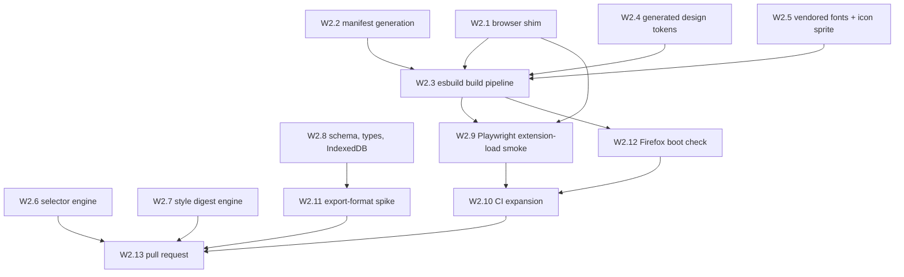

# Wave 2 — Core libraries

**Read [`README.md`](README.md) in this folder first.** Wave 2 assumes
[wave 1](wave-1-foundations.md) is complete.

- **Status:** blocked on wave 1
- **Goal:** every non-visual mechanism the UI will consume — the browser shim, manifest generation,
  the build pipeline, generated design tokens, vendored fonts and icons, the selector and
  style-digest engines, and the storage layer. Wave 2 ends with a **real extension loading in
  Playwright**, which is the gate wave 1 could not provide.

Wave 2 ships **no UI**. Nothing here renders a component; wave 3 does that. Keep UI out even when a
`console.log` would be faster to eyeball — an untested mechanism with a pretty demo on top is harder
to debug than a tested mechanism with no demo.

## Dependency graph



W2.1, W2.2, W2.4, W2.5, W2.6, W2.7, and W2.8 are all **parallel-safe** with each other — seven
disjoint file sets, safe to hand to concurrent agents. W2.11 joins them as soon as W2.8 fixes the
record shape; it writes only a spec and a throwaway bundle, so it collides with nothing.

---

## W2.1 — Promise-based browser shim

- [ ] `src/shared/browser.ts` + unit tests — SHA: _pending_

**parallel-safe.**

**Why:** this is the single seam where Chrome and Firefox differ, and the one place we can catch
that divergence cheaply. Everything else in the codebase imports from here and stays
browser-agnostic.

**Write `src/shared/browser.ts`:**

- Export a typed `browser` object wrapping only the APIs this project uses: `tabs.captureVisibleTab`
  / `tabs.captureTab`, `tabs.query`, `runtime.sendMessage`, `runtime.onMessage`, `storage.local`,
  `scripting.executeScript`, `commands.onCommand`, `downloads.download`, `action.onClicked`, and the
  side-panel/sidebar opener. Do not wrap APIs speculatively — an unused wrapper is untested surface.
- Firefox exposes `browser.*` returning promises; Chrome exposes `chrome.*`, which in MV3 also
  returns promises for most APIs but **not uniformly**. Detect the global once at module load and
  normalize; never branch per call site.
- Normalize the genuinely divergent names behind one method each: capture (`captureVisibleTab` vs
  `captureTab`), and panel opening (`chrome.sidePanel` vs `browser.sidebarAction`). The rest of the
  codebase must not know which browser it's on.
- Export a `runtimeInfo` describing the detected engine, for logging and for tests to assert
  against.
- TSDoc every export, and document _which_ browsers each method's behaviour differs on. That comment
  is the reason this file exists.

**Tests** (`src/shared/browser.test.ts`): inject a fake Chrome-shaped global and a fake
Firefox-shaped global, and assert the shim produces identical results through both — including that
a callback-style Chrome API resolves as a promise, and that the capture and panel name divergences
resolve correctly. This is the cheap substitute for Firefox E2E per ADR 0007; it only works if the
fakes genuinely mimic the shapes, so model them on the real API signatures rather than on what makes
the test pass.

**Verify:** `deno task test` green; `deno task check` clean.

**Commit:** `feat(shared): add promise-based cross-browser extension API shim`

---

## W2.2 — Manifest generation for both targets

- [ ] `build/manifest.ts` + generated manifests — SHA: _pending_

**parallel-safe.**

**Why:** Chrome and Firefox MV3 manifests differ structurally, and maintaining two hand-written JSON
files guarantees they drift. One typed source, two emitted files.

**Write `build/manifest.ts`:**

- **Export one `SUPPORTED` constant** holding the minimum Chrome and Firefox versions, resolved from
  each vendor's MV3 support baseline rather than picked — Firefox's MV3 floor in particular is well
  below the number a plausible guess produces. This constant is the single source for
  `strict_min_version`, `minimum_chrome_version`, **and** W2.3's esbuild `target`. Record the
  resolved numbers in the [index's browser-floors table](README.md), whose cells read
  `_pending W2.2_` until you fill them; a project that refuses `^` on a dev dependency should not
  leave its browser floors to whoever writes the item.
- A typed `manifest.base` object holding everything shared: `manifest_version: 3`, name, version,
  description, icons, `permissions` (exactly the six from the README's permission list — no more),
  `action`, `commands` (with a suggested default shortcut and a clear description string),
  `content_scripts`, and `web_accessible_resources` for the vendored fonts and icon sprite.
- A `forChrome()` producing `background.service_worker` (type `module`) and `side_panel`.
- A `forFirefox()` producing `background.scripts` (Firefox MV3 uses an event page, **not** a service
  worker) plus `browser_specific_settings.gecko.id` and a `strict_min_version`, and `sidebar_action`
  instead of `side_panel`.
- No `host_permissions` in either. If a future item wants one, that's an ADR-0002 revision, not a
  quiet edit.
- Set `content_security_policy.extension_pages` explicitly to the strict default
  (`script-src 'self'`, `object-src 'self'`) so any accidental inline script or remote asset fails
  loudly at load rather than subtly at runtime.
- TSDoc each divergence with the reason. Someone will eventually ask why there are two functions.

**Tests:** assert both outputs validate against the required MV3 keys for their browser, that
neither contains `host_permissions`, that the permission list matches the README's exactly, and that
Firefox's output has no `service_worker` key while Chrome's has no `scripts` key. Also assert each
manifest's declared floor equals the corresponding value in `SUPPORTED`, so a hand-edited literal
cannot reintroduce the divergence with W2.3's build target.

**Verify:** `deno task test` green.

**Commit:** `feat(build): generate chrome and firefox manifests from one typed source`

---

## W2.3 — esbuild build pipeline

- [ ] `build/build.ts` + `deno task build` — SHA: _pending_

**Depends on:** W2.1, W2.2, W2.4, W2.5.

**Why:** produces the `dist/chrome/` and `dist/firefox/` trees that everything downstream loads.

**Resolve and pin Preact first:** `npm view preact version` and `npm view preact dist-tags`, then
add `preact` at that exact version to `deno.json` imports. Do not guess a version from memory.

**Write `build/build.ts`** using `npm:esbuild@0.28.1`:

- Entry points: `src/background/index.ts`, `src/content/index.ts`, plus HTML-paired entries for the
  side panel, popup, and options page. Wave 2 may emit placeholder HTML shells for those three — a
  valid document that loads its bundle and renders nothing. Wave 3 fills them.
- `format: 'esm'`, `bundle: true`, sourcemaps in dev and none in release. **Derive `target` from the
  `SUPPORTED` constant W2.2 exports from `build/manifest.ts`** — do not write browser floors here as
  literals. The floors are one fact with two consumers (this build target, and W2.2's
  `strict_min_version` / `minimum_chrome_version`); authored twice they drift, and the failure is an
  extension that _installs_ on an older browser and then throws at parse time on syntax esbuild did
  not downlevel. W2.2 records the resolved floors in the [index's browser-floors table](README.md);
  mirror them in `AGENTS.md`.
- JSX configured for Preact: `jsx: 'automatic'`, `jsxImportSource: 'preact'`.
- **Content-script caveat:** the content script must be classic-script-compatible or injected as a
  module per browser support; verify which by loading it in W2.9 rather than reasoning about it. An
  ESM content script that silently fails to execute looks identical to a bug in your code.
- Copy static assets into each dist: manifest from W2.2, vendored fonts and icon sprite from W2.5,
  generated token CSS from W2.4, extension icons.
- `--release` flag: minify, drop sourcemaps, and emit `dist/chrome.zip` / `dist/firefox.zip`.
- Fail the build loudly on any bundle containing an absolute `http://` or `https://` URL — this is
  the automated enforcement of ADR 0009. Grep the output; do not trust that nobody added a CDN link.

**Add `deno.json` tasks:** `build` and `build:release`.

**Verify:** `deno task build` produces `dist/chrome/manifest.json` and `dist/firefox/manifest.json`
plus bundles; the remote-URL check passes; `deno task build:release` emits both zips.

**Also statically lint the Firefox output the moment it is first produced:**

```bash
deno run -A npm:web-ext@10.5.0 lint --source-dir dist/firefox
```

Nothing _loads_ `dist/firefox` until W2.12, so without this the build emits a Firefox artifact that
goes unchecked for the rest of the wave. `web-ext lint` needs no browser download and catches the
manifest-shape errors — an MV3 key Gecko rejects, a malformed `web_accessible_resources` entry —
that are otherwise invisible until much later. Add it as a `deno task lint:firefox` and wire it into
W2.10's CI.

**Commit:** `feat(build): add esbuild pipeline emitting chrome and firefox bundles`

---

## W2.4 — Generated design tokens

- [ ] `build/tokens.ts`, `src/shared/design/`, drift check — SHA: _pending_

**parallel-safe.**

**Why:** per ADR 0011, hand-copied tokens drift from the design source invisibly. Generation plus a
CI diff check makes drift impossible to merge.

**Write `build/tokens.ts`:**

- Read **all six** token files:
  `.claude-design/point-and-shoot/tokens/{fonts,colors,typography,spacing,effects,base}.css`.
  **`fonts.css` is not optional and is easy to skip** — it is the only file that defines
  `--font-display`, `--font-body`, and `--font-mono`, and `base.css` (which this list also reads)
  consumes all three. Omitting it emits a `tokens.css` where every `font-family` resolves to an
  undefined variable, so the whole UI silently falls back to the browser default sans-serif with no
  error anywhere.
- **Concatenate in the order `styles.css` uses** — `fonts`, `colors`, `typography`, `spacing`,
  `effects`, `base` — not alphabetically and not in directory order. `base.css` consumes variables
  the five files before it define; reordering produces undefined properties at the point of use.
- Emit `src/shared/design/tokens.css` — the concatenated custom properties, **with only line 1 of
  `fonts.css` (the Google Fonts `@import`) stripped** and replaced by `@font-face` rules pointing at
  the W2.5 vendored WOFF2 files via `chrome.runtime.getURL`-resolvable paths. Keep the rest of
  `fonts.css` — its `:root` block is the font-family definition, not the remote dependency. Preserve
  the `:root` and `[data-theme="light"]` blocks exactly; the light-theme override is how ADR 0010's
  theming works.
- Record the design bundle's identity in the generated header — the `namespace` value from
  `.claude-design/point-and-shoot/_ds_manifest.json` (it carries no version field) plus the bundle
  content hash W1.5 recorded in [`docs/design.md`](../design.md); the two must agree. Without it, a
  red `tokens-drift` cannot be told apart from a legitimate bundle re-export, and the agent hitting
  it has no way to know which.
- Emit `src/shared/design/tokens.ts` — a typed union of every token name plus a `token()` helper, so
  a typo in a token name is a type error rather than a silently-empty CSS variable.
- Emit a header comment in both files: generated, do not edit, regenerate with `deno task tokens`.
- Add tasks `tokens` (regenerate) and `tokens:check` (regenerate to a temp dir and diff; non-zero
  exit on any difference).
- Add `lint:design` →
  `deno run -A npm:oxlint@<resolved> --config .claude-design/point-and-shoot/_adherence.oxlintrc.json src/`
  as a **non-blocking** informational task. Resolve oxlint's version with `npm view oxlint version`.
  It is not in `deno task ci` — it lints for design adherence against a config we didn't write, and
  a false positive there must not block a merge. Document that reasoning in `AGENTS.md`.

**Verify:** `deno task tokens` then `deno task tokens:check` exits 0; hand-edit one generated line
and confirm `tokens:check` exits non-zero (then revert). A drift check that never fails isn't a
check.

Also assert the generated CSS is complete, not merely present:

- All three font families are **defined**, not merely referenced. A definition is `--font-x:`; a use
  is `var(--font-x)`, so match on the colon and check each name separately — one combined `grep -c`
  counts matching _lines_, and the bundle's minified `:root` puts all three on a single line, so it
  returns `1` whether three are defined or none are:

  ```bash
  missing=0
  for t in display body mono; do
    grep -q -- "--font-$t:" src/shared/design/tokens.css \
      || { echo "MISSING definition: --font-$t"; missing=1; }
  done
  exit "$missing"   # silent and exit 0 when all three are defined
  ```

  The `exit "$missing"` is load-bearing: a bare `|| echo` loop reports the problem and still exits
  `0`, so it reads as a pass under `set -e` and cannot back wave 2's exit criterion.

- `! grep -q '@import' src/shared/design/tokens.css` — note the negation: a bare `grep -c` returning
  `0` also _exits_ non-zero, so it aborts a `set -e` wrapper on the passing case. `@font-face` rules
  are present.
- **No `var(--…)` in the output references a property the output does not define.** Extract every
  `var(--x)` reference and every `--x:` definition and assert the reference set is a subset of the
  definition set. This is the check that would have caught a missing input file; a token generator
  that emits dangling references produces a UI that renders, looks wrong, and reports nothing.

**Commit:** `feat(build): generate design tokens from the design bundle with drift check`

---

## W2.5 — Vendored fonts and icon sprite

- [ ] `src/shared/design/fonts/`, `icons.svg`, `build/vendor-assets.ts` — SHA: _pending_

**parallel-safe.**

**Why:** ADR 0009. MV3 forbids remote code, and a remote font request from an overlay injected into
someone's page tells Google which pages they're annotating. This item removes every network
dependency from the rendered UI.

**Fonts:**

- Vendor Space Grotesk, Inter, and JetBrains Mono as WOFF2, subset to Latin plus the punctuation and
  symbols the UI actually uses. Use a subsetting tool via `npm:` (resolve the version with
  `npm view`) and record the exact subsetting command in `build/vendor-assets.ts` so it's
  reproducible rather than a one-off someone ran locally.
- Include only the weights the design uses — check `.claude-design/point-and-shoot/tokens/fonts.css`
  for the requested weights and the UI kits for which are actually applied. Shipping seven weights
  when the UI uses three is 100KB of dead payload.
- Output to `src/shared/design/fonts/`, and list them in `web_accessible_resources` (W2.2) so the
  content script can load them from within a host page.
- Record the total byte size in the commit message. The target from the design decision is roughly
  60–120KB combined; if you land materially above that, say so rather than letting it pass silently.

**Icons:**

- Vendor only the Lucide icons the six UI kits actually reference. Grep
  `.claude-design/point-and-shoot/ui_kits/` and `components/` for icon names rather than guessing.
- Emit a single `src/shared/design/icons.svg` sprite of `<symbol>` elements, with `stroke-width`
  preserved at Lucide's 1.5–2px and `stroke="currentColor"` so tokens colour them (per the design's
  iconography rules: stroke only, no filled or duotone variants, 16/20/24px).
- Emit a typed `IconName` union alongside, so an unknown icon name is a type error.

**Verify:** no file under `src/shared/design/` references any `http://` or `https://` URL; the fonts
render in the W2.9 smoke load; `deno task check` clean.

**Commit:** `feat(design): vendor subset fonts and lucide sprite, removing all remote assets`

---

## W2.6 — Selector engine

- [ ] `src/shared/selectors.ts` + tests — SHA: _pending_

**parallel-safe.**

**Why:** this is what decides whether the exported prompt is actionable. A selector bundle that
doesn't survive a rebuild makes the whole product useless, so it gets the most adversarial tests in
the project.

**Write `src/shared/selectors.ts`** exporting a function that takes an `Element` and returns the
selector bundle from the README: `xpath`, `cssPath` (unique, shortest that still resolves uniquely),
`testIds` (`data-testid`, `data-test`, `data-cy`, `id`), `ariaRoleName` (role plus computed
accessible name), `tagClasses`, and `textSnippet` (trimmed, length-capped).

Requirements that are easy to get wrong and must be handled explicitly:

- The generated `cssPath` and `xpath` **must round-trip**: re-querying the document with them
  returns the same element. Assert this in the function itself in dev builds — a selector that
  doesn't resolve is worse than no selector, because it sends the agent to the wrong element.
- Elements inside an **open** shadow root need a path that records the shadow boundary; a plain
  `document.querySelector` cannot cross it. Represent the boundary explicitly in the bundle.
- Elements inside a **closed** shadow root are unreachable. Return a bundle flagged as
  `unreachable: 'closed-shadow-root'` rather than a wrong selector. Silent wrongness is the failure
  mode to design against here.
- Cross-origin iframes are unreachable from the parent's content script. Flag them the same way.
- Prefer stable signals in the emitted order: test ids first, then ARIA, then a structural path.
  `AGENTS.md` should record that ordering so consumers know what to trust.

**Tests:** run against the W1.8 fixture pages — the ambiguous-class case, the no-id case, the
sibling-index-only list, the deeply nested button, both shadow hosts, and both iframes. Every
generated selector gets round-trip-asserted. Add the sad paths: detached elements, `<html>` itself,
and text nodes passed in by mistake.

**Verify:** `deno task test` green, with the fixture-backed round-trip assertions actually running
(not skipped).

**Commit:** `feat(shared): add selector bundle engine with round-trip verification`

---

## W2.7 — Computed-style digest engine

- [ ] `src/shared/style-digest.ts` + tests — SHA: _pending_

**parallel-safe.**

**Why:** per the README, concrete numbers are more actionable to a fix-agent than pixels, and
they're greppable. This is the cheapest high-value signal in the whole bundle.

**Write `src/shared/style-digest.ts`:** given an element, emit a bounded digest of
`getComputedStyle` plus `getBoundingClientRect` — box model (width, height, padding, margin,
border), typography (family, size, weight, line-height, letter-spacing), colour (text, background,
border, resolved to hex where possible), and spacing relationships to parent and adjacent siblings.
Include the parent and immediate siblings, since most spacing bugs are only explicable relative to
neighbours.

Keep it **bounded** — cap the number of properties, the subtree depth, and the sibling count. **Take
the three numbers from the [index's settled-numbers table](README.md); do not choose your own.**
Five items across two waves depend on the same budgets, they are parallel-safe with each other, and
each one picking independently is how W2.7's caps and W3.7's export budget end up disagreeing — a
session that passes every per-note cap and still blows the export budget, discovered only at export
time. An unbounded digest silently balloons the export past what any agent will read.

**Tests:** assert stable output for fixture elements, that caps hold on a pathological deep subtree,
and that values are normalized (e.g. colours to a consistent form) so diffs between two notes are
meaningful rather than noise.

**Verify:** `deno task test` green.

**Commit:** `feat(shared): add bounded computed-style digest engine`

---

## W2.8 — Schema, types, and IndexedDB layer

- [ ] `src/shared/schema.ts`, `src/shared/store.ts` + tests — SHA: _pending_

**parallel-safe.**

**Why:** ADR 0003 makes this JSON the canonical record. Getting the shape and its versioning right
now is what makes v2's remote handoff a serializer swap instead of a rewrite.

**Write `src/shared/schema.ts`:** the `Session` and `Note` types from the README's data-model
section, with `schemaVersion` as a literal, TSDoc on every field explaining what a consumer should
do with it, and a runtime validator so a record read from storage is checked rather than trusted.
Include the `truncated` flag on `region`, the `unreachable` flag on element entries from W2.6, and
the `componentHint` as optional (it's behind a flag).

**Write `src/shared/store.ts`:** the IndexedDB layer — open with an explicit version and an
`onupgradeneeded` migration path from day one, even though there's only v1. Retrofitting migrations
onto a store with real user data is how you end up shipping a data-loss bug. CRUD for sessions and
notes, an export read, and quota-exceeded handling that surfaces a real error the UI can show rather
than throwing an opaque `DOMException`.

**Tests:** round-trip a session with a base64 WebP note through validation; reject a malformed
record; exercise the migration path with a synthetic v0→v1; simulate quota exceeded and assert the
typed error. Run against a fake IndexedDB in Deno, and re-verify for real in wave 3 when the
extension has a live context.

**Verify:** `deno task test` green; validator rejects at least three distinct malformed shapes.

**Commit:** `feat(shared): add versioned session schema and IndexedDB store`

---

## W2.9 — Playwright extension-load smoke

- [ ] `tests/e2e/load.spec.ts` + `deno task e2e:smoke` — SHA: _pending_

**Depends on:** W2.3, W2.1.

**Why:** this is the gate wave 1 couldn't provide, and the first moment we know the built artifact
is actually a working extension rather than a plausible-looking directory.

**Write `tests/e2e/load.spec.ts`** using `npm:playwright@1.62.0`:

- `chromium.launchPersistentContext` with `--disable-extensions-except=dist/chrome` and
  `--load-extension=dist/chrome`, per Playwright's Chrome-extensions guide.
- Resolve the extension ID from the service worker, and assert the worker actually booted.
- Navigate to a W1.8 fixture page and assert the content script executed — expose a single
  deterministic signal for this (a data attribute on `documentElement`, say) rather than sniffing
  for UI that doesn't exist yet.
- Assert **zero console errors and zero unhandled page errors** during load. This catches the CSP
  and ESM-content-script failure modes flagged in W2.3, which are otherwise invisible.
- Load the vendored font and icon sprite through the extension's own URL and assert they resolve —
  this is what proves `web_accessible_resources` is right.

**Add `deno.json` task:** `e2e:smoke`.

**Verify:** `deno task build && deno task e2e:smoke` green. If the content script doesn't execute,
fix W2.3's script format — do not weaken the assertion.

**Commit:** `test(e2e): load built extension in chromium and assert boot health`

---

## W2.10 — CI expansion

- [ ] `.github/workflows/ci.yml` updated — SHA: _pending_

**Depends on:** W2.9, W2.4, W2.12.

Add to the existing workflow, each as its own job so a failure names itself:

- `build` — `deno task build`, uploading `dist/` as an artifact.
- `tokens-drift` — `deno task tokens:check`.
- `e2e-smoke` — installs the Chromium binary, runs `deno task e2e:smoke`, uploads Playwright traces
  on failure.
- `lint-firefox` — `deno task lint:firefox` (W2.3). Static, no browser, seconds to run; it is the
  only automated statement about the Firefox artifact until wave 4.
- `boot-firefox` — the W2.12 boot check.

Cache the Playwright browser download keyed on the pinned Playwright version, or CI pays a full
browser download every run. This wave now covers Firefox at the _static_ and _boots-at-all_ level;
the fuller `smoke-firefox` behavioural check still lands in wave 4 with the thing it tests.

Extend the branch-protection required-check list (W1.11) to include the new jobs in the same PR.
Adding a job without requiring it leaves the gate advisory, which is the failure W1.11 exists to
prevent.

**Verify:** push and `gh run watch --exit-status`; confirm all jobs green and the `dist/` artifact
is downloadable and contains both browser trees. Confirm via
`gh api repos/{owner}/{repo}/branches/main/protection` that the new jobs are required, not merely
present.

**Commit:** `ci: add build, token drift, firefox lint, and extension smoke jobs`

---

## W2.11 — Export-format spike: feed a hand-written bundle to a real agent

- [ ] `docs/specs/export-format-spike.md` — SHA: _pending_

**Depends on:** W2.8 (for the record shape only). **parallel-safe** with W2.9/W2.10.

**Why:** the product's whole premise is that the exported bundle makes a local coding agent fix the
bug. Nothing validates that until W3.12 — the last item of the last v1 wave — by which point W3.6's
notes panel, W3.7's plan view and both serializers, W2.6's selector bundle, and W2.7's style digest
are all built around a format nobody has tested. If the format is wrong, that is five items of
rework at the end of the critical path with no v1 slack left to absorb it. This item moves first
contact to the cheapest possible moment: before any UI exists.

- **Hand-write** one export bundle. No UI, no serializer, no build step — a directory you type out:
  one note with a page URL, a selector bundle in W2.8's shape, a style digest, a real WebP
  screenshot of a fixture region, note text, and a `plan.md`.
- Feed it to a local coding agent along with the fixture page's source, and ask it to make the
  change the note describes.
- **Record verbatim what the agent did** — what it used, what it ignored, what it asked for that
  wasn't there, and where it went wrong. Verbatim, not summarised: the useful signal is usually the
  thing the agent misread, and a paraphrase loses it.
- Measure the bundle size at which the agent's output degrades. That number becomes the default
  export size budget the [index's settled-numbers table](README.md) records and W3.6/W3.7/W3.9
  consume, instead of each item choosing one.
- If the format needs to change, say so here and amend W3.7 **before** wave 3 starts.

**Verify:** the spec records an actual agent transcript, not a description of one. The **export size
budget** row in the [index's settled-numbers table](README.md) carries the measured number with its
provisional marker removed. Leave the other four rows alone — they are deliberate design caps that
W2.7 and W3.4 are already built to, not measurements this spike re-derives. Anyone reading it can
tell whether the export worked without rerunning it.

**Commit:** `docs(specs): record the export-format spike and its measured budgets`

---

## W2.12 — Firefox boot check

- [ ] `scripts/boot-firefox.sh` (or equivalent), `deno task boot:firefox` — SHA: _pending_

**Depends on:** W2.3.

**Why:** W2.3 emits `dist/firefox`, and until this item nothing ever _loads_ it — W2.9 is
Chromium-only and the behavioural `smoke-firefox` check lands in W4.3, roughly twenty items later.
That leaves every Firefox-shaped decision in wave 3 unverified against a real Gecko runtime, and it
makes W3.2's and W3.5's "verify in both engines" instructions impossible to satisfy as written.
`web-ext@10.5.0` is already pinned for W4.3, so the marginal cost here is small.

Deliberately **minimal** — this is a boot check, not the wave-4 smoke suite:

- `web-ext run` against `dist/firefox` on a fixture page.
- Assert the event page starts, the content script injects, and a vendored WOFF2 resolves through
  `moz-extension://`. `web_accessible_resources` is the single most likely place the two builds
  silently diverge, so it is the one thing worth asserting beyond "it started."
- Fail loudly on any console error during load.

Do not grow this into behavioural coverage _within wave 2_. One wave-3 extension is sanctioned and
pre-agreed: W3.2 adds a shadow-root font case to this script, in W3.2's own commit — that does not
reopen this item or wave 2's exit criteria. Anything else waits for W4.3. This check's job is to
make a structural Firefox break visible in wave 2 rather than wave 4; W4.3 remains the item that
actually exercises the product in Firefox, and its header comment must keep saying what it does not
cover.

**Verify:** `deno task boot:firefox` passes. Then break it deliberately — add a bogus key to the
Firefox manifest, confirm the check fails, and revert. An unproven gate is not a gate.

**Commit:** `test(firefox): add a minimal web-ext boot check for the firefox build`

---

## W2.13 — Pull request

- [ ] PR opened — record the number here

**Depends on:** W2.1–W2.12, CI green.

Body must include: what wave 2 establishes; a checklist with commit SHAs; the **vendored asset byte
sizes** from W2.5; the **measured export size budget** from W2.11 (one number — the other four
budgets are settled design caps, not measurements); confirmation that the built bundles contain no
remote URLs; a Verification section mapping each claim to a command actually run; and a Follow-ups
section stating that no UI ships in wave 2, the side panel / popup / options pages are placeholder
shells, and Firefox is verified only by a static lint plus a boot check — not behaviourally — so
far.

Screenshots: wave 2 has no UI to shoot. Instead attach the `chrome://extensions` view showing the
extension loaded without errors, and paste the `e2e:smoke` output. Say plainly that there's no UI
yet rather than padding the PR with fixture screenshots already shown in wave 1.

**After it merges:** run the post-merge plan sync — [rule 7](README.md#rules-for-working-any-wave).
Tick every W2.x item with its merged SHA, flip this wave's **Status** to complete, and update the
**tracking issue** so it shows wave 2 done and wave 3 open. The tracking issue is the project's
status board — not PR #1, which closes when wave 1 merges. A merged wave that still reads "blocked"
there sends the next agent to the wrong item.

---

## Wave 2 exit criteria

- W2.1–W2.12 checked with real commit SHAs.
- `deno task build` produces working `dist/chrome/` and `dist/firefox/` trees.
- `deno task e2e:smoke` loads the built extension in Chromium with zero console errors.
- `deno task lint:firefox` and `deno task boot:firefox` both pass, and the boot check has been
  observed failing once on a deliberately broken manifest.
- `deno task tokens:check` exits 0, and has been proven to fail on a hand edit.
- The generated `tokens.css` defines `--font-display`, `--font-body`, and `--font-mono`, contains no
  `@import`, and references no custom property it does not itself define.
- No file in `dist/` references any remote URL.
- Selector round-trip assertions pass against every fixture page, including the flagged-unreachable
  closed-shadow-root and cross-origin-iframe cases.
- The browser floors are resolved, recorded in the index, and asserted equal between the manifests
  and the esbuild target.
- The export-format spike has run against a real agent, and the index's export-size-budget row
  carries its measured value with the provisional marker removed. The other four budgets are
  unchanged design caps.
- CI green with `build`, `tokens-drift`, `lint-firefox`, `boot-firefox`, and `e2e-smoke` jobs, all
  of them **required** by branch protection.
