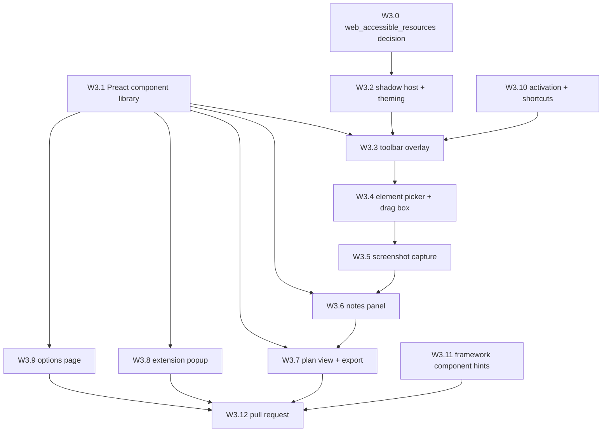

# Wave 3 — UI and capture

**Read [`README.md`](README.md) in this folder first.** Wave 3 assumes
[wave 2](wave-2-core-libraries.md) is complete.

- **Status:** exit reconciliation open — implementation delivered across PRs #9–#13; component
  gallery follow-up pending merge
- **Goal:** the product. Every surface from the design bundle, built in Preact against the generated
  tokens, plus the capture pipeline and the export that turns notes into an agent prompt.

## How to work against the design bundle

The design is authoritative and already exists — **do not invent UI.** For each surface, open the
matching kit under `.claude-design/point-and-shoot/ui_kits/` and read it top to bottom before
writing code. Also read `.claude-design/point-and-shoot/readme.md` (brand and content rules) and the
relevant `components/*/*.jsx` prototypes plus their `.d.ts` and `.prompt.md` siblings.

Per the bundle's own instructions: **match the visual output, don't copy the prototype's internal
structure** unless it happens to fit. The prototypes are HTML/CSS/JS mockups, not production code.
Everything you need — dimensions, colours, spacing — is in the source; read it rather than
screenshotting it.

Binding rules, repeated here because they are the ones most often violated: sentence case
everywhere; no emoji, ever; mono type for every technical value (URLs, XPaths, element tags,
shortcuts); exactly one accent-blue interactive element per screen; semantic colours for status
only, never decoration; hover **lightens**, never darkens; no scale or spring on press; borders
rather than background shifts define most edges; animation is functional only — 120–280ms fades and
4–8px slides, nothing decorative.

## Dependency graph

W3.0, W3.1, W3.2, W3.10, and W3.11 are **parallel-safe** starting points. W3.8 and W3.9 are
parallel-safe once W3.1 lands. W3.12 is the wave's landing step and waits on everything.

**W3.0 gates W3.2, not the whole wave.** The decision changes how the injected host resolves the
font and sprite URLs, so the shadow host should not be written against the current static-URL
assumption and then retrofitted. Nothing else in the wave reads those resources directly.

**W3.11 does not gate W3.7.** The serializer needs the `componentHint` _field_, which W2.8 already
defines as optional — not the probe that populates it. The probe is default-off and its own degraded
path is "no hint," so the common case for W3.7 is a record with no hint at all. Making the export
wait on a fragile, opt-in framework probe lengthened the wave's serial chain — the acknowledged
critical path for the whole project — for a field that is usually absent.

---

## W3.0 — `web_accessible_resources` fingerprinting decision

- [x] `build/manifest.ts` + `docs/adr/0012-*.md` — SHA: `962af1a`

**parallel-safe.** Carried in from wave 2, which deferred this decision here on purpose rather than
overlooking it — see [wave 2's carried list](wave-2-core-libraries.md#carried-into-wave-3).

The manifest exposes the vendored font and icon sprite to `<all_urls>` so the injected overlay can
load them. The pattern grants the extension nothing over page content, but it does mean **any page
can probe those paths to detect that this extension is installed** — a fingerprinting surface the
user did not opt into. `build/manifest.ts` already records the tradeoff in a comment; what it does
not do is resolve it.

Chrome's `use_dynamic_url: true` rotates the resource URLs per session, which removes the stable
probe. It is Chrome-only, and it changes how the injected UI resolves those URLs —
`runtime.getURL()` must be called from the extension context and the result passed in, rather than
hardcoded — so it is coupled to W3.2's shadow host, and to whatever W3.1 does about the sprite.

Decide it here, before the overlay is written against the current assumption:

- Measure the actual exposure first. Enumerate exactly which resources are listed, and confirm
  whether a page can distinguish "extension installed" from "resource missing" for each.
- Cost out the two-target split: `use_dynamic_url` on Chrome and the static URL on Firefox means the
  resolution path differs per target, and the W2.1 shim is where that belongs if it lands.
- Consider the narrower alternative — inlining the sprite into the injected DOM instead of shipping
  it as a fetchable resource — which would shrink the listed set rather than obscure it. ADR-0009
  forbids remote assets, not inline ones.
- Whatever the outcome, **write the ADR.** "We accept the fingerprinting surface because X" is a
  legitimate resolution and needs recording as one; leaving no ADR is what makes this recur.

**Verify:** a test asserting the manifest's resource list matches the intended set for each target,
and — if `use_dynamic_url` lands — that the injected UI resolves resources through
`runtime.getURL()` rather than a hardcoded path, so the Chrome build cannot silently break when the
URL rotates.

**Commit:** `feat(manifest): resolve the web_accessible_resources fingerprinting surface`

---

## W3.1 — Preact component library

- [x] `src/ui/components/` + gallery page — SHA: `b5a15f2`

**parallel-safe.** Nothing inside wave 3 blocks this, but five other items block on it — W3.3, W3.6,
W3.7, W3.8, and W3.9 all consume the component library, so start this first.

**Why:** five surfaces share these components. Porting them once, with a gallery to review them
against the design cards, is what keeps the surfaces consistent.

**Port from `.claude-design/point-and-shoot/components/`:** Button, IconButton, Card, Badge, Tag,
Icon, Input, Select, Checkbox, Switch, Tooltip, Toast, Dialog, Tabs, and CaptureMinimap. Each
prototype has a `.d.ts` giving its intended props — honour it, since wave 3's other items code
against these signatures.

- `Icon` renders from the W2.5 sprite with the typed `IconName` union. No inline SVG at call sites
  and no runtime icon fetching.
- `CaptureMinimap` is product-specific: it shows a note's captured region. Read
  `CaptureMinimap.prompt.md` for intent. It must handle the `truncated: true` region case visibly —
  the user needs to know the screenshot was clipped, not wonder why it looks wrong.
- Styling uses the generated token custom properties from W2.4 only. **No hardcoded colours,
  spacings, radii, or durations** — if a value you need isn't a token, that's a question for the
  design bundle, not a literal in a component.
- Every component: keyboard-operable, visible focus ring via `--shadow-focus`, and correct ARIA. The
  overlay in particular must be fully usable without a mouse, since it's an accessibility tool.
- Honour `prefers-reduced-motion` by disabling the fades and slides. The design says animation is
  functional only, which makes it safe to drop entirely.

**Build a gallery** at `src/ui/gallery/` — an extension page rendering every component in every
state (default, hover, focus, active, disabled, error, loading, empty) in both themes. This is the
surface wave 4's visual regression tests shoot, and the fastest way to review a port against
`.claude-design/point-and-shoot/components/*/*.card.html` and `guidelines/*.card.html` — 19 cards in
total; the component cards sit one level down, inside the category directories. Add
`deno task gallery` to serve it.

**Tests:** unit-test behaviour, not markup — Switch toggles and fires once, Dialog traps focus and
restores it on close, Select is keyboard-navigable, Toast auto-dismisses on its timer, Tabs move
selection with arrow keys.

**Verify:** `deno task test` green; gallery renders every component in both themes; compare against
the design cards and fix discrepancies before committing.

**Commit:** `feat(ui): port design system components to preact with gallery`

---

## W3.2 — Shadow host and theme resolution

- [x] `src/content/host.ts`, `src/shared/theme.ts` + tests — SHA: `d548340`

**parallel-safe.**

**Why:** ADRs 0006 and 0010. This is the boundary that keeps the extension's UI and the host page
from corrupting each other, and it's where the theme decision lands.

**Write `src/content/host.ts`:**

- Create a host element and attach a **closed** shadow root. Mount Preact inside it.
- Inject the generated `tokens.css` and component styles into the shadow root as a `CSSStyleSheet`
  via `adoptedStyleSheets` — never as a `<style>` in the page head, which would leak onto the page
  under inspection and corrupt the screenshots.
- Load the vendored `@font-face` files by extension URL. Fonts are a documented shadow-DOM sharp
  edge: `@font-face` must be declared in the **document**, not only inside the shadow root, for some
  engines to apply it. Verify empirically and document what you found — do not reason about it from
  first principles. **Chromium is covered by W2.9's harness; Firefox is covered by W2.12's boot
  check, which asserts a vendored WOFF2 resolves through `moz-extension://`.** Add the shadow-root
  case to that boot-check script **in this item's own commit** rather than reaching for a Firefox
  harness this wave does not have — W2.12 names this as its one sanctioned extension, so it does not
  reopen wave 2. The behavioural Firefox suite is still W4.3.
- Pin the host's `z-index` to the top of the stacking context and defend against host pages that
  also use extreme z-indexes. Record the chosen strategy in a comment; this is a known source of
  "the toolbar is invisible on exactly one site" bugs.
- Never set styles on any host-page element. Anything the picker highlights is drawn as an overlay
  in the shadow root, positioned over the target — not by mutating the target's own style.

**Write `src/shared/theme.ts`:**

- `resolveTheme()` returning `'dark' | 'light'`: if the options override is set, obey it; otherwise
  sample the backdrop luminance behind the toolbar's position and pick the theme that contrasts.
- Sampling must be cheap and bounded. Read a small set of points, not the whole viewport, and
  debounce re-evaluation on scroll. This runs on every page the user annotates.
- Export a `forceTheme()` used by tests. Per ADR 0010, **every automated visual check forces a
  theme** — auto-adapt makes output page-dependent, so unforced visual assertions are coin flips.

**Tests:** shadow root is closed and page CSS cannot reach in; a `<style>` injected into the page
does not affect shadow content; luminance sampling picks `light` on the `light.html` fixture and
`dark` on `dark.html`; the override beats sampling.

**Verify:** `deno task test` green; the font question answered in a real Chromium via W2.9 and in a
real Firefox via W2.12, with the finding written down either way. Do not mark this item done on a
Chromium-only result — the whole point of the check is the engine difference.

**Commit:** `feat(content): add closed shadow host and backdrop-adaptive theming`

---

## W3.3 — Toolbar overlay

- [x] `src/content/toolbar/` — SHA: `89d2fd2`

**Depends on:** W3.1, W3.2, W3.10.

Read `.claude-design/point-and-shoot/ui_kits/toolbar-overlay/index.html` and `themes.html` first.

The design states a hard functional constraint: the toolbar is fixed and floating (bottom-centre or
top-right) and **must never obstruct the highlighted region — it repositions to stay clear of the
active selection.** Implement that as real logic, not a fixed corner: compute the selection's rect,
pick the placement with no overlap, and animate the move within the token durations. Also keep it
clear of the viewport edges and of its own note-composer popover.

Also handle: pages that already have fixed elements in the same corner, `position: fixed`
containing-block quirks inside transformed ancestors, and full-screen mode.

**Verify:** on `tall.html` with its sticky header and on a selection in each viewport quadrant, the
toolbar never overlaps the selection. Assert this in a Playwright check comparing bounding boxes,
not by eye — this is exactly the constraint that regresses silently.

**Commit:** `feat(content): add floating toolbar that repositions clear of the selection`

---

## W3.4 — Element picker and drag box

- [x] `src/content/picker/` — SHA: `dadd66a`

**Depends on:** W3.3.

Two modes, per the settled design: hover highlights the element under the cursor devtools-style and
click pins it; shift-drag draws a rectangle and collects every element intersecting it.

Requirements:

- Highlight is drawn in the shadow root over the target, never by styling the target (W3.2).
- The highlight uses the design's subtle **pulsing outline on opacity, not scale**, to read as
  "actively selecting".
- Keyboard path: enter picker mode, move selection with arrow keys through the DOM (parent, child,
  next sibling), confirm with Enter, cancel with Escape. Without this the tool is mouse-only, which
  is indefensible for an accessibility annotation tool.
- Escape always exits cleanly and removes every overlay. Test this — a picker you can't get out of
  is the worst possible bug in an extension injected into someone's page.
- Intersecting-element collection must be bounded and ordered: cap the count at the value in the
  [index's settled-numbers table](README.md) rather than picking one here, order by DOM position,
  mark one element as `primary`, and skip elements that are purely structural wrappers with no
  visual box. An unbounded drag over `<body>` should not collect two thousand elements.
- Feed each collected element through W2.6's selector engine and W2.7's style digest.

**Verify:** Playwright tests against `index.html` (pick the ambiguous-class and no-id elements),
`shadow.html` (open host picks; closed host reports unreachable rather than picking wrong),
`iframe.html` (cross-origin flagged), `canvas.html` (a target with no DOM interior). Keyboard-only
traversal covered. Escape leaves zero overlay nodes.

**Commit:** `feat(content): add element picker with hover, drag box, and keyboard traversal`

---

## W3.5 — Screenshot capture

- [x] `src/background/capture.ts` + tests — SHA: `1465e43`

**Depends on:** W3.4.

The pipeline from the README: content script sends region rect plus `devicePixelRatio` → background
calls the shim's capture method → crop and encode with `createImageBitmap` +
`OffscreenCanvas.convertToBlob({type:'image/webp', quality:0.7})`, capped at 1024px longest edge by
default. W3.9 exposes fixed, validated alternatives while keeping these settled defaults.

**`chrome.offscreen` is forbidden** (ADR 0001). If you find yourself wanting it, the answer is
`OffscreenCanvas` in the background context.

Handle explicitly:

- **Hide the extension's own UI before capturing.** The toolbar and highlight overlay must not
  appear in the screenshot. This is easy to miss and ruins every capture.
- `devicePixelRatio` scaling — the captured bitmap is in device pixels while the rect is in CSS
  pixels. Getting this wrong yields a crop that's subtly offset or half-size, which looks like a
  rounding bug and isn't.
- Region taller or wider than the viewport: clamp to the viewport and set `truncated: true`. No
  scroll-and-stitch in v1 — it fights sticky headers and lazy loading. It's a tracked follow-up.
- Capture requires an active-tab grant from a user gesture. A capture attempt without one must
  produce a typed error the UI can explain, not a silent empty image.
- Firefox's promise-based capture API goes through the W2.1 shim, while Chrome's callback API is
  normalized to the same project method. **Unit-tested against a fake is the only Firefox coverage
  capture gets until W4.3** — W2.12 boots the Firefox build but does not exercise capture. Say so in
  the item's Limitations rather than implying the divergence is verified against a real Gecko.

**Verify:** Playwright captures on each fixture page in Chromium; assert output dimensions honour
the 1024px cap and the device-pixel-ratio maths; assert `truncated` is set on `tall.html`; assert
the extension's own UI is absent from the captured image; assert the WebP encodes under a sane byte
budget.

**Limitations:** Firefox's promise-based capture method is covered at the browser-shim seam with
fakes. The Firefox boot check proves the built extension starts in Gecko, but does not exercise
capture; W4.3 adds the real-Gecko capture smoke check.

**Commit:** `feat(background): add region screenshot capture, crop, and webp encoding`

---

## W3.6 — Notes panel

- [x] `src/sidepanel/` — SHA: `c4f0040`

**Depends on:** W3.1, W3.5.

Read `.claude-design/point-and-shoot/ui_kits/notes-panel/index.html` first.

The session review list: every note in the current session across pages, grouped by page. Edit note
text, delete, reorder, see each note's captured region via `CaptureMinimap`, and see the running
export size budget. Chrome uses `chrome.sidePanel`, Firefox `sidebar_action` — both through the W2.1
shim.

- Empty state per the design's tone: "No notes yet. Highlight anything on the page to start one."
- Technical values (URL, XPath, element tag) in mono, **truncated with an ellipsis rather than
  wrapped**, with a way to see the full value — `title` attribute or an expand affordance. That's a
  stated content rule.
- Surface the size budget honestly: show the projected export size and warn as it crosses the
  threshold in the [index's settled-numbers table](README.md) — a measured number from W2.11's
  spike, not a guess made here. Do not silently truncate.
- Deleting a note is destructive and the screenshot is unrecoverable — confirm, or offer undo.
- **Show the recorded URL in full, and offer to strip its query string.** A page URL routinely
  carries `?access_token=`, a session id, or a signed query — and the note that carries it is
  destined for an agent. Default the strip **on** when a parameter name matches
  `token|key|secret|auth|session` case-insensitively; the path is what an agent needs, the query
  string usually is not. The user can always turn it back on for a note where the query matters.

**Verify:** Playwright drives capture-then-review end to end; edits persist across a panel close and
reopen (proving the W2.8 store is wired, not just component state); the panel renders correctly in
both forced themes.

**Commit:** `feat(sidepanel): add session notes review panel`

---

## W3.7 — Plan view and export

- [x] `src/sidepanel/plan/`, `src/shared/serialize/` — SHA: `2e08e88`

**Depends on:** W3.1 (the plan view UI is built from the component library), W3.6. **Not W3.11** —
see the note under the dependency graph; render `componentHint` when the record carries one and omit
the section when it does not, so the probe can land before or after this item.

Read `.claude-design/point-and-shoot/ui_kits/plan-view/index.html` first. This is the payoff
surface: collected notes compiled into an agent-ready prompt. **Build the format W2.11's spike
validated** — if the spike found the agent needed something the bundle doesn't carry, that change
lands here.

**Write `src/shared/serialize/`:**

- `toJson()` — the canonical W2.8 record with base64 WebP inline.
- `toMarkdown()` — a section per note: page URL, note text, the selector bundle, the style digest,
  the surrounding metadata, the framework hint when present, and a relative reference to
  `./shots/note-NN.webp`. Optimise for an agent reading it: lead with what's wrong, then where, then
  the evidence.
- Export delivery: a zip download (`session.json` + `plan.md` + `shots/`) via `downloads`, plus an
  image-free Markdown variant to the clipboard for a quick paste.
- Serializers are **pure functions over the JSON record** — no DOM access, no storage reads. That's
  what makes them unit-testable and what makes v2's remote handoff a swap rather than a rewrite.

**Plan view UI:** preview the generated Markdown with the real content, per-note include/exclude
toggles, the size budget, and copy plus download actions. This item **enforces** the export size
budget — take the number from the [index's settled-numbers table](README.md) and do not pick your
own; W3.6 warns against the same value and W3.9 defaults its setting to it, so a locally-chosen
number here is a disagreement that only surfaces at export time. Take the drag-box element cap from
the same table. Primary action wording per the design: "Send to agent"-style phrasing, sentence
case, no exclamation.

**State what leaves the machine, at the moment it leaves.** The export bundles screenshots of
whatever the user pointed at — often an authenticated page — plus full URLs and DOM text, and its
whole purpose is to be handed to a coding agent, which for a hosted model means it leaves the
device. The plan view names that plainly before the export action, in the design's voice: what the
bundle contains, and that the user should treat it like any other file they'd paste into a chat.
This is a content change, not a feature; the privacy story elsewhere in this project is entirely
about what the extension _reads_ (`activeTab` only, no `<all_urls>`, no remote assets) and says
nothing about what it _emits_. Record the decision as an ADR alongside ADR 0002, which covers only
the inbound half.

**Verify:** golden-file tests for both serializers over a fixture session (so format changes are
visible in review), covering **both** record shapes — with a `componentHint` and without — since the
probe is default-off and the no-hint case is the common one; the zip contains exactly the expected
entries; the extracted Markdown's image references resolve to files that exist; a URL carrying
`?access_token=` is stripped by default and the UI says so; round-trip a real captured session end
to end in Playwright.

**Commit:** `feat(export): add plan view with json and markdown serializers`

---

## W3.8 — Extension popup

- [x] `src/popup/` — SHA: `de04f65`

**Depends on:** W3.1. **parallel-safe** with W3.9.

Read `.claude-design/point-and-shoot/ui_kits/extension-popup/index.html`.

Opened from the toolbar icon per [ADR-0014](../adr/0014-toolbar-action-opens-popup.md): start or
resume a session, show the current session name and note count, toggle the overlay on this tab, open
the notes panel, and reach options. Keep it small — the popup is a launcher, not a workspace; the
panel is the workspace.

**Superseded after Wave 3:** [ADR-0016](../adr/0016-toolbar-action-controls-session.md) makes the
toolbar click control the session directly. The popup remains buildable for regression coverage but
is no longer the normal toolbar entry point.

**Verify:** Playwright opens the popup by extension URL and asserts each action's effect. Both
themes.

**Commit:** `feat(popup): add session launcher popup`

---

## W3.9 — Options page

- [x] `src/options/` — SHA: `4dae656`

**Depends on:** W3.1. **parallel-safe** with W3.8.

Read `.claude-design/point-and-shoot/ui_kits/options/index.html`.

Settings: theme override (dark / light / follow backdrop, per ADR 0010), the framework-hint probe
toggle (default **off** — it reads page internals), export size budget (defaulting to the measured
value in the [index's settled-numbers table](README.md), not a number chosen here), the W3.6
query-string stripping toggle, screenshot quality and max dimension, keyboard shortcut display with
a link to the browser's own shortcut settings (extensions cannot rebind shortcuts directly), and a
destructive "clear all sessions" with confirmation.

Persist through the W2.1 shim's `storage.local`, with a typed settings schema and defaults in one
place so every consumer reads the same shape.

**Verify:** each setting round-trips through a reload; the theme override actually forces the
overlay's theme on a live page; the framework toggle genuinely gates the W3.11 probe.

**Commit:** `feat(options): add settings page with theme, probe, and budget controls`

---

## W3.10 — Activation and shortcuts

- [x] `src/background/activation.ts` — SHA: `7a49b63`

**parallel-safe.**

The `commands` keyboard shortcut toggles the overlay directly on the active tab. The toolbar icon
opens the launcher popup, whose start, resume, and switch controls delegate to the same activation
controller; see [ADR-0014](../adr/0014-toolbar-action-opens-popup.md). Inject the content script on
demand via `scripting.executeScript` under the `activeTab` grant — there is no `<all_urls>` (ADR
0002), so injection is gesture-driven by design.

The toolbar portion of this completed item was later superseded by
[ADR-0016](../adr/0016-toolbar-action-controls-session.md); the keyboard and injection guarantees
remain unchanged.

Handle: double activation must not inject twice or mount two hosts; pages where injection is
impossible (`chrome://`, the Chrome Web Store, `about:`, PDF viewer, `view-source:`) must fail with
a clear user-facing message rather than silently doing nothing; navigation within a tab must not
leave an orphaned host; and the shortcut must work when the popup has never been opened.

**Verify:** Playwright asserts single-mount on repeated activation, a clear message on a restricted
page, and clean teardown across navigation.

This item also closes a wave-2 gap: `tests/e2e/load.spec.ts` asserts the background boots but never
fires a gesture, so the `scripting.executeScript` path the whole permission model now rests on is
unexercised end to end. The activation check here is the first test that actually drives it — assert
the content script's presence in the page after activation, not just that the click dispatched.

**Commit:** `feat(background): add icon and keyboard activation with single-mount guard`

---

## W3.11 — Framework component hints

- [x] `src/content/framework-probe.ts` + tests — SHA: `63b0363`

**parallel-safe.**

Best-effort probe naming the likely source component: React fiber `_debugSource`, Vue
`__vueParentComponent`, and Svelte/Angular markers. Emits
`componentHint { framework, file, line, name }` into the note.

This is the single highest-value field for a fix-agent — it points straight at the file — and also
the most fragile, since it reads undocumented internals that change between framework versions. So:
default **off**, gated by the W3.9 toggle, wrapped so any throw degrades to "no hint" rather than
breaking capture, and never blocking. Document which framework versions you actually verified
against rather than claiming general support.

**Verify:** fixture pages for at least React and Vue with dev-mode builds; assert a hint is
produced; assert a production build with internals stripped degrades to no hint without error;
assert a page with no framework produces no hint and no console noise.

**Commit:** `feat(content): add opt-in framework component hint probe`

---

## W3.12 — Pull request

- [x] Delivery stack opened — [#9](https://github.com/whizzzkid/point-and-shoot/pull/9) →
      [#10](https://github.com/whizzzkid/point-and-shoot/pull/10) →
      [#11](https://github.com/whizzzkid/point-and-shoot/pull/11) →
      [#12](https://github.com/whizzzkid/point-and-shoot/pull/12) →
      [#13](https://github.com/whizzzkid/point-and-shoot/pull/13)

**Depends on:** W3.1–W3.11, CI green.

Wave 3 is the wave that produces something a person can actually use, so its pull-request evidence
carries the most weight of any in the project. The original integration review remains preserved as
draft [#8](https://github.com/whizzzkid/point-and-shoot/pull/8); the five-part delivery stack keeps
the implementation reviewable without losing the full-wave diff.

Body must include: what the wave delivers, surface by surface; a checklist with commit SHAs; **a
screenshot of every surface in both forced themes**, embedded with `?raw=1` blob URLs per the W1.9
convention; the bounding-box evidence that the toolbar never overlaps the active selection; a
Verification section mapping each claim to a command actually run; and a Limitations section stating
plainly what does not work yet — closed shadow roots, cross-origin iframes, viewport-clamped
regions, and which framework versions the W3.11 hints were verified against.

Do not claim the export is agent-ready without having fed a real exported bundle to a local agent
and saying what happened. W2.11's spike did this with a hand-written bundle before any of this UI
existed; this run is the confirmation that the built pipeline produces what the spike validated, so
compare the two and report any divergence rather than re-deriving the answer.

This reconciliation performs the post-implementation plan sync from
[rule 7](README.md#rules-for-working-any-wave). After the reconciliation PR merges, update the
[tracking issue](https://github.com/whizzzkid/point-and-shoot/issues/3) to include W3.0, record PRs
#9–#13 as delivered, and name component-gallery completeness as the remaining Wave 3 blocker. Mark
Wave 3 done and open Wave 4 there only after the gallery follow-up merges.

---

## Wave 3 exit criteria

- W3.0–W3.12 checked with real commit SHAs (W3.12 records delivery PR numbers rather than a SHA).
- The `web_accessible_resources` fingerprinting surface is resolved either way, with an ADR saying
  which way and why.
- The gesture-driven injection path is exercised end to end by at least one Playwright check, not
  only asserted at the background-boot level.
- Full flow works in Chromium end to end: activate → pick → note → review → export, with the
  exported zip containing valid JSON, Markdown, and screenshots.
- The toolbar provably never overlaps the active selection, asserted by bounding-box comparison.
- Keyboard-only operation covers picker, panel, and export.
- Both themes render every surface correctly, and forced themes make visual output deterministic.
- No component contains a hardcoded colour, spacing, radius, or duration.
- No extension UI appears in any captured screenshot.
- The export UI states what the bundle contains before it is produced, and a token-bearing query
  string is stripped by default.
- `deno task gallery` renders every component in every state in both themes.

### Exit verdict — re-run before the reconciliation, 2026-07-29

Every criterion above was re-checked against the final implementation head `da321a5` rather than
inferred from the delivery plan. This reconciliation is stacked on PR #13, so it cannot land on
`main` without the complete implementation beneath it.

| Criterion                                | Verdict | Evidence                                                                                                               |
| ---------------------------------------- | ------- | ---------------------------------------------------------------------------------------------------------------------- |
| W3.0–W3.12 carry real references         | ✅      | every implementation SHA resolves from `da321a5`; W3.12 links the five delivery PRs                                    |
| Resource fingerprinting is resolved      | ✅      | `build/manifest.ts` rotates Chrome URLs; ADR-0012 records the cross-browser decision                                   |
| Gesture-driven injection runs end to end | ✅      | `tests/e2e/activation.spec.ts` drives the built action path and observes one injected host                             |
| Chromium capture-to-export flow works    | ✅      | the built flow persists a WebP note and downloads JSON, Markdown, and the referenced screenshot                        |
| Toolbar avoids the selection             | ✅      | `toolbar-bounds.json` records four non-overlapping quadrants; browser tests assert collision-free placement            |
| Keyboard-only operation                  | ⚠️      | picker traversal is explicit; panel and export use native controls, but their browser suites still drive them by click |
| Both themes render deterministically     | ✅      | `shots:wave3` produced ten committed screenshots after forcing each surface theme                                      |
| Component styles use generated tokens    | ✅      | design-token checks pass; the only raw pixel value found is the side-panel viewport breakpoint                         |
| Captures exclude extension UI            | ✅      | `src/content/capture.browser.test.ts` asserts overlay and highlight pixels are absent during capture                   |
| Export disclosure and query privacy      | ✅      | plan-view and built-flow tests assert the disclosure copy and strip `access_token` values                              |
| Component gallery is complete            | ✅      | the gallery renders and asserts every applicable component-state combination in both themes                            |

The keyboard row is a stated qualification, not an implied pass. W3.1 supplies keyboard-operable
native controls and the picker has a dedicated keyboard-only browser path, but the notes and plan
browser suites use pointer activation. W4.4 owns the systematic keyboard and screen-reader audit, so
it must close that evidence gap before release.

The gallery follow-up closes the implementation and evidence gap with an explicit state matrix.
`src/ui/gallery/server.test.ts` asserts every applicable component-state combination in both themes
and keeps transient Toast examples visible for visual review. Wave 3 remains open—and therefore
keeps the Wave 4 barrier closed—until this follow-up merges. The post-merge plan sync then records
its SHA.
