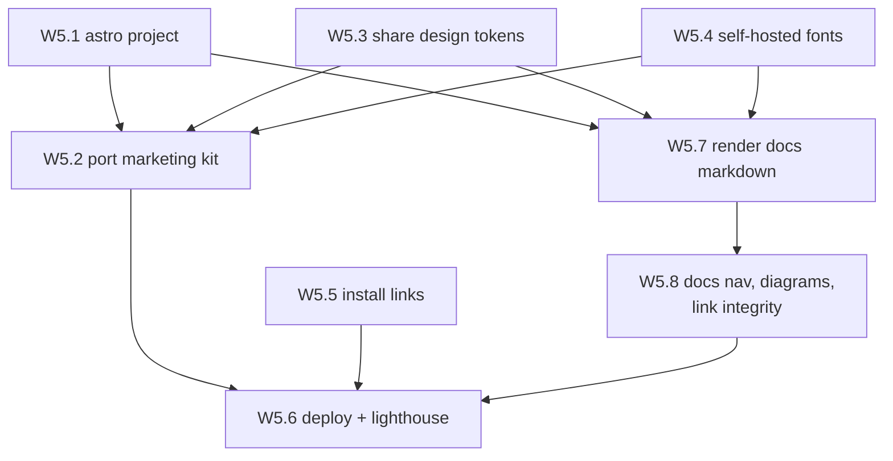

# Wave 5 — Marketing site

**Read [`README.md`](README.md) in this folder first.**

- **Status:** in progress
- **Goal:** the landing site from `.claude-design/point-and-shoot/ui_kits/marketing/index.html`,
  **and** the published documentation site rendered from the markdown in [`docs/`](../).

Both live in this wave deliberately: they are the project's only two public web surfaces, they want
the same toolchain, and the docs must be themed with the _product's_ design tokens rather than a
generic docs theme — which only works if the token pipeline (W5.3) is built once and consumed by
both.

## Why this was deferred and remains separate

A landing page ships nothing until there is something to install, and its content depends on a
product that doesn't exist yet. It is also the one surface where the design intentionally departs
from the rest — the bundle notes the marketing site is "the one place spacing opens up," in contrast
to the information-dense tool.

Nothing in waves 1–4 depended on this, and this depends on nothing but the design bundle. Work began
after v1 was functional, while the isolated site toolchain remains intentionally separate.

## Stack

**Astro**, per ADR 0008. Astro was rejected for the extension (Vite/Node toolchain, and a content
script is not a page) but it's the right fit here: static output, zero JS by default, and Preact
islands via `@astrojs/preact` if any section needs interactivity — which lets the W3.1 components be
reused rather than rebuilt.

The Node toolchain is isolated in `site/` with its own `package.json` and lockfile. This is the
documented carve-out from the Deno-first ADR, and it holds only because **nothing in `site/` ships
inside the extension**. Do not let Astro or Vite reach into `src/`.

## Dependency graph

W5.1, W5.3, W5.4, and W5.5 are **parallel-safe** starting points. W5.3 and W5.4 consume wave-2
output (W2.4 and W2.5 respectively) rather than anything inside this wave, so they can be prepared
before W5.1 exists.

W5.7 and W5.2 are independent of each other — one renders `docs/`, the other renders the landing
page — so they can run in parallel once the scaffold and token items land. W5.6 deploys both, which
is why it waits on W5.8 as well.

---

## W5.1 — Astro project scaffold

- [x] `site/` — SHA: `9aa7506`

**parallel-safe.**

Astro project in `site/`, with exact pinned versions (resolve each with `npm view <pkg> version` at
the time — do not guess), its own lint and build tasks, and a CI job separate from the extension's
so a site change never gates an extension change and vice versa.

**Verify:** `npm run build` in `site/` emits static output; the extension's `deno task ci` still
passes untouched; no Astro or Vite config references anything under `src/`.

**Commit:** `build(site): scaffold astro project for the marketing site`

---

## W5.2 — Port the marketing kit

- [x] `site/src/` — SHA: `dd10e4f`

**Depends on:** W5.1, W5.3, W5.4.

Read `.claude-design/point-and-shoot/ui_kits/marketing/index.html` first. Honour the brand rules
(sentence case, no emoji, exactly one accent element per screen) and the design's note that this
surface uses **more generous spacing** than the tool — this is the one place that departs from the
dense layout, so do not carry the toolbar's spacing over. The design specifies high-contrast
photography, no illustration.

**Verify:** every section from the kit is present; no hardcoded colour, spacing, radius, or duration
(all must come through the W5.3 tokens); no emoji anywhere in the rendered output.

**Commit:** `feat(site): port the marketing kit to astro`

---

## W5.3 — Share the design tokens

- [x] `site/src/styles/` — SHA: `4ade8c4`

**parallel-safe.** Consumes W2.4.

Consume the same generated tokens W2.4 produces, so a token change propagates to both the extension
and the site from one source. Duplicating the palette here would drift within a single release.

**Verify:** change one token value at its source and confirm both the extension build and the site
build pick it up, with no second copy of the palette anywhere under `site/`.

**Commit:** `feat(site): consume the generated design tokens`

---

## W5.4 — Self-hosted fonts

- [x] `site/public/fonts/` — SHA: `02766c6`

**parallel-safe.** Consumes W2.5.

Reuse the W2.5 subset WOFF2 files, self-hosted. The CDN prohibition was an MV3 constraint and does
not technically apply to a website, but self-hosting is still the right default — for performance,
and for not sending visitors' IP addresses to a third party.

**Verify:** no request to `fonts.googleapis.com`, `fonts.gstatic.com`, or any other third-party
origin in the built output — grep the build for `http`-scheme URLs and confirm every hit is
intentional.

**Commit:** `feat(site): self-host the subset woff2 fonts`

---

## W5.5 — Install links

- [x] `site/src/` install CTAs — SHA: `4c881b7`

**parallel-safe.**

Chrome Web Store and AMO links once those listings exist, with an install-from-source fallback until
then. **Do not ship dead store links** — a 404 on the primary call to action is worse than an honest
"build it yourself" instruction.

**Verify:** every link resolves (check each with `curl -sS -o /dev/null -w '%{http_code}'`); no
placeholder or `#` href remains.

**Commit:** `feat(site): add install links with a from-source fallback`

---

## W5.6 — Deploy and quality gates

- [x] `.github/workflows/site.yml` — SHA: `e45a63d`

**Depends on:** W5.2, W5.5, W5.8.

Deploy via GitHub Pages on a tag or on merge to `main` — the landing page at the root and the docs
under `/docs/`, from one build. Add a Lighthouse check in CI and a real accessibility pass using the
same axe standard as W4.4, covering **both** surfaces — a tool that markets itself on UI quality
cannot ship an inaccessible landing page or an inaccessible docs page.

The docs build is a **blocking** job, not a nice-to-have: a broken link or an unrenderable diagram
in published docs is a shipped defect. Fail the job on either.

**Verify:** `gh run watch --exit-status` green with the deploy, Lighthouse, and link-check jobs
present; the deployed URL serves the built site; `/docs/` serves the rendered documentation; axe
reports no serious or critical violations on either surface. Deliberately introduce one contrast
violation and confirm the a11y job fails, then revert it — an unproven gate is not a gate.

**Commit:** `ci(site): deploy site and docs to github pages with lighthouse and axe gates`

---

## W5.7 — Render the docs markdown

- [x] `site/src/content/docs/`, `site/src/pages/docs/` — SHA: `f804f51`

**Depends on:** W5.1, W5.3, W5.4.

Publish the markdown in [`docs/`](../) as HTML themed with the product's own design tokens. Not a
generic docs theme: the published docs should look like the tool, using the same palette, type
scale, and mono treatment for technical strings that the extension uses.

- Source the markdown **in place** from `docs/` — an Astro content collection pointing at the
  existing directory, or a build step that syncs it. Do **not** fork or copy the markdown into
  `site/`; two copies of a doc drift within one release, and the repo-local copy is the one
  contributors edit.
- Publish `docs/README.md`, `docs/design.md`, `docs/specs/`, and `docs/tutorials/`. Keep
  `docs/plans/` and `docs/adr/` repository-only. They remain public and readable in GitHub, and
  references to them from a published product document link back to the repository.
- Style prose from the tokens: body copy in `--font-body`, headings in `--font-display`, and every
  code span, URL, XPath, and element name in `--font-mono`. Long technical strings truncate with an
  ellipsis and expose the full value, exactly as in-product.
- Give code blocks a syntax theme derived from the token palette rather than importing a stock one.
- Support both themes, honouring `prefers-color-scheme`, since the docs are read on other people's
  screens (the extension's dual-theme requirement, ADR 0010, applies here for the same reason).

**Verify:** every Markdown file in the published set appears in the built output, and no plan or ADR
route exists. Enumerate the source patterns and assert one page each, so a new product doc cannot be
silently unpublished. Grep the build for hardcoded colours and font stacks: there must be none — and
confirm the three font tokens actually resolve to the vendored families rather than falling through
to a browser default, which is what a `tokens.css` missing its font definitions would look like. No
third-party origin in the output.

**Commit:** `feat(site): render the docs markdown as themed html`

---

## W5.8 — Docs navigation, diagrams, and link integrity

- [x] `site/src/components/docs/`, link-check task — SHA: `0619887`

**Depends on:** W5.7.

Make the rendered docs navigable and prove they are not broken.

- Sidebar navigation generated from the directory structure, not hand-maintained — a hand-written
  nav is the thing that goes stale the first time someone adds an ADR.
- Rewrite relative markdown links (`design.md`, `plans/README.md`) to their published URLs, so the
  same link works in the repo, on GitHub, and on the site. This is the single highest-risk part of
  the pipeline: the docs are written with repo-relative links on purpose.
- Render Mermaid blocks. `docs/plans/README.md` carries a graph with one node per plan item, so
  render at **build time** to static SVG rather than shipping a client-side Mermaid runtime — it
  keeps Astro's zero-JS default and means a malformed diagram fails the build instead of showing an
  error box to a reader.
- Anchor links for every heading, so a PR can cite a specific rule.
- A link checker over the built output covering internal links, anchors, and external URLs, wired as
  a task and run in CI (W5.6).
- A published-scope check in the same task: enumerate the product-document source patterns, require
  one output page per source, and reject any generated `/docs/plans/` or `/docs/adr/` route.

**Verify:** the link checker passes with zero broken internal links and zero broken anchors, and the
published-scope check matches the source set. Every Mermaid block in the published docs renders as
SVG with no error box — check each one in a browser, not just the exit code. Deliberately break one
relative link and confirm the checker fails; add a product doc without an output page and confirm
the scope check fails.

**Commit:** `feat(site): add docs nav, build-time mermaid, and link checking`

---

## Wave 5 exit criteria

- W5.1–W5.8 checked with real commit SHAs.
- Site builds and deploys; the deployed URL serves it, and `/docs/` serves the rendered
  documentation.
- Every Markdown file in the published product-doc set has a page, while plans and ADRs have no site
  route — verified by enumeration, not by spot check.
- Tokens and fonts are **shared** with the extension rather than copied — verified by changing one
  token at source and seeing both builds move. The docs are themed from those same tokens, with no
  stock docs theme and no second palette.
- No third-party origin in the built output.
- Link checker green; the published-scope check agrees with the source set; every published Mermaid
  diagram renders as build-time SVG.
- Lighthouse and axe both pass on the landing page and on a docs page, and the a11y gate has been
  observed failing once.
- Every install link resolves.
- The extension's `deno task ci` is unaffected by anything in `site/`.
- The tracking issue synced per [rule 7](README.md#rules-for-working-any-wave) — wave 5 marked
  complete and the deployed site and docs URLs recorded there. With every wave done, the issue
  closes.
