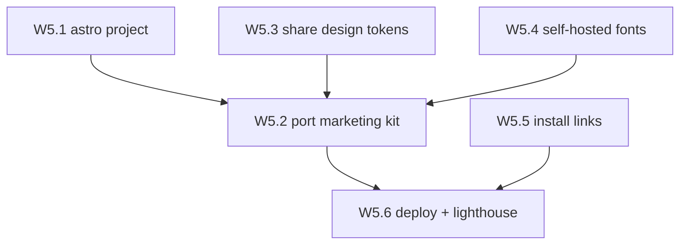

# Wave 5 — Marketing site

**Read [`README.md`](README.md) in this folder first.**

- **Status:** deferred, post-v1
- **Goal:** the landing site from `.claude-design/point-and-shoot/ui_kits/marketing/index.html`.

## Why this is deferred and separate

A landing page ships nothing until there is something to install, and its content depends on a product
that doesn't exist yet. It is also the one surface where the design intentionally departs from the rest
— the bundle notes the marketing site is "the one place spacing opens up," in contrast to the
information-dense tool.

Nothing in waves 1–4 depends on this, and this depends on nothing but the design bundle. It can be
picked up at any time after v1 works.

## Stack

**Astro**, per ADR 0008. Astro was rejected for the extension (Vite/Node toolchain, and a content
script is not a page) but it's the right fit here: static output, zero JS by default, and Preact
islands via `@astrojs/preact` if any section needs interactivity — which lets the W3.1 components be
reused rather than rebuilt.

The Node toolchain is isolated in `site/` with its own `package.json` and lockfile. This is the
documented carve-out from the Deno-first ADR, and it holds only because **nothing in `site/` ships
inside the extension**. Do not let Astro or Vite reach into `src/`.

## Dependency graph

W5.1, W5.3, W5.4, and W5.5 are **parallel-safe** starting points. W5.3 and W5.4 consume wave-2 output
(W2.4 and W2.5 respectively) rather than anything inside this wave, so they can be prepared before
W5.1 exists.

---

## W5.1 — Astro project scaffold

- [ ] `site/` — SHA: _pending_

**parallel-safe.**

Astro project in `site/`, with exact pinned versions (resolve each with `npm view <pkg> version` at
the time — do not guess), its own lint and build tasks, and a CI job separate from the extension's so
a site change never gates an extension change and vice versa.

**Verify:** `npm run build` in `site/` emits static output; the extension's `deno task ci` still
passes untouched; no Astro or Vite config references anything under `src/`.

**Commit:** `build(site): scaffold astro project for the marketing site`

---

## W5.2 — Port the marketing kit

- [ ] `site/src/` — SHA: _pending_

**Depends on:** W5.1, W5.3, W5.4.

Read `.claude-design/point-and-shoot/ui_kits/marketing/index.html` first. Honour the brand rules
(sentence case, no emoji, exactly one accent element per screen) and the design's note that this
surface uses **more generous spacing** than the tool — this is the one place that departs from the
dense layout, so do not carry the toolbar's spacing over. The design specifies high-contrast
photography, no illustration.

**Verify:** every section from the kit is present; no hardcoded colour, spacing, radius, or duration
(all must come through the W5.3 tokens); no emoji anywhere in the rendered output.

**Commit:** `feat(site): port the marketing kit to astro`

---

## W5.3 — Share the design tokens

- [ ] `site/src/styles/` — SHA: _pending_

**parallel-safe.** Consumes W2.4.

Consume the same generated tokens W2.4 produces, so a token change propagates to both the extension
and the site from one source. Duplicating the palette here would drift within a single release.

**Verify:** change one token value at its source and confirm both the extension build and the site
build pick it up, with no second copy of the palette anywhere under `site/`.

**Commit:** `feat(site): consume the generated design tokens`

---

## W5.4 — Self-hosted fonts

- [ ] `site/public/fonts/` — SHA: _pending_

**parallel-safe.** Consumes W2.5.

Reuse the W2.5 subset WOFF2 files, self-hosted. The CDN prohibition was an MV3 constraint and does
not technically apply to a website, but self-hosting is still the right default — for performance, and
for not sending visitors' IP addresses to a third party.

**Verify:** no request to `fonts.googleapis.com`, `fonts.gstatic.com`, or any other third-party origin
in the built output — grep the build for `http`-scheme URLs and confirm every hit is intentional.

**Commit:** `feat(site): self-host the subset woff2 fonts`

---

## W5.5 — Install links

- [ ] `site/src/` install CTAs — SHA: _pending_

**parallel-safe.**

Chrome Web Store and AMO links once those listings exist, with an install-from-source fallback until
then. **Do not ship dead store links** — a 404 on the primary call to action is worse than an honest
"build it yourself" instruction.

**Verify:** every link resolves (check each with `curl -sS -o /dev/null -w '%{http_code}'`); no
placeholder or `#` href remains.

**Commit:** `feat(site): add install links with a from-source fallback`

---

## W5.6 — Deploy and quality gates

- [ ] `.github/workflows/site.yml` — SHA: _pending_

**Depends on:** W5.2, W5.5.

Deploy via GitHub Pages on a tag or on merge to `main`. Add a Lighthouse check in CI and a real
accessibility pass using the same axe standard as W4.4 — a tool that markets itself on UI quality
cannot ship an inaccessible landing page.

**Verify:** `gh run watch --exit-status` green with the deploy and Lighthouse jobs present; the
deployed URL serves the built site; axe reports no serious or critical violations. Deliberately
introduce one contrast violation and confirm the a11y job fails, then revert it — an unproven gate is
not a gate.

**Commit:** `ci(site): deploy to github pages with lighthouse and axe gates`

---

## Wave 5 exit criteria

- W5.1–W5.6 checked with real commit SHAs.
- Site builds and deploys; the deployed URL serves it.
- Tokens and fonts are **shared** with the extension rather than copied — verified by changing one
  token at source and seeing both builds move.
- No third-party origin in the built output.
- Lighthouse and axe both pass, and the a11y gate has been observed failing once.
- Every install link resolves.
- The extension's `deno task ci` is unaffected by anything in `site/`.
