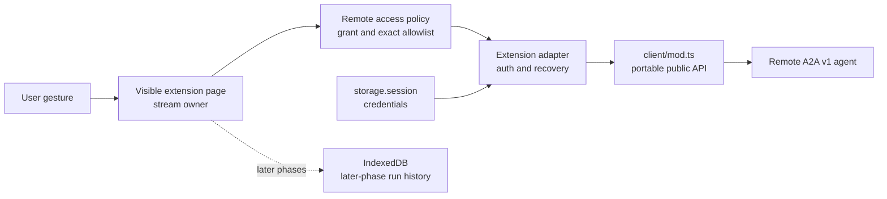
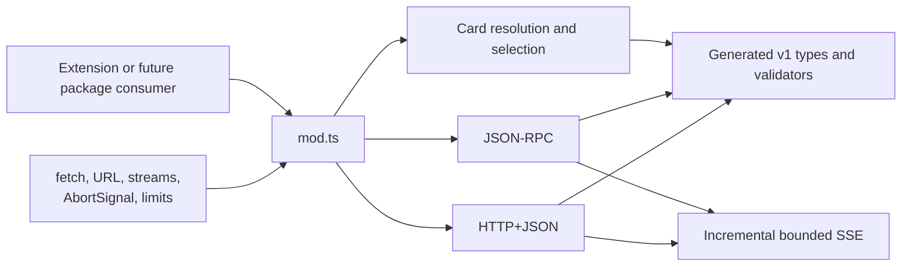
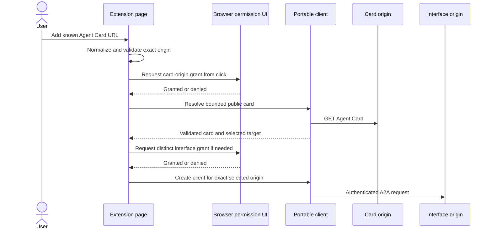

# A2A browser client platform

> **How to read this spec:** [Context](#context) defines the shipped Phase 0 boundary.
> [Portable client reference](#portable-client-reference), [Network access](#network-access), and
> [Limits](#remote-input-and-time-limits) are normative implementation contracts.
> [Lifecycle](#stream-and-credential-lifecycle) defines recovery behavior, while
> [Verification](#verification-evidence-and-limitations) states exactly which browser observations
> support those contracts.

## Context

Point & Shoot contains a browser-native A2A v1 client foundation. It can discover a public Agent
Card, select JSON-RPC or HTTP+JSON, send messages, consume SSE, look up tasks, and subscribe to task
updates using Web-standard APIs. Phase 0 does not expose product UI for configuring or sending to an
agent; later phases build extension-owned adapters and UI on this accepted platform contract.

The visible extension surface owns long-lived work. The background context routes safe identifiers
and short operations but never remains alive to hold an A2A stream.

## Portable client reference

### Provenance and build

| Property                         | Settled value                                                                |
| -------------------------------- | ---------------------------------------------------------------------------- |
| Protocol                         | A2A `1.0`, source tag `v1.0.0`                                               |
| Normative source                 | `specification/a2a.proto` from the official `a2aproject/A2A` `v1.0.0` tag    |
| Committed schema SHA-256         | `6b6560c726289734799b7d5883be84e4cc0452600736db0f811341bac43b8d62`           |
| Upstream schema generator        | `github.com/bufbuild/protoschema-plugins@v0.6.0`                             |
| Type generator                   | `json-schema-to-typescript@15.0.4`                                           |
| Standalone validator generator   | `ajv@8.20.0`                                                                 |
| Cross-implementation test oracle | `@a2a-js/sdk@1.0.1` server imports only                                      |
| P0.1 minified bundle delta       | 141,657 bytes per browser                                                    |
| Combined Phase 0 bundle delta    | 141,685 bytes per browser after the rejected-reader cancellation containment |

`src/shared/a2a/client/protocol.schema.json` is a byte-pinned, non-normative build artifact derived
from the normative proto. `deno task a2a:generate` deterministically regenerates the TypeScript
contracts and standalone validators; generation tests compare complete output bytes. Authored code
must not edit either generated TypeScript file.

The official JavaScript SDK is not a production dependency. Version `1.0.1` bundles in the browser
but its v1 raw-part codec reaches `Buffer`, producing `ReferenceError: Buffer is not defined` in
Chromium. Its server implementation remains test-only as an independent protocol oracle.

### Package boundary

`src/shared/a2a/client/` is a future package root. `mod.ts` is its only supported public import
surface.

Production files in this subtree may import sibling modules, exact-pinned dependencies, and
Web-standard APIs only. They must not import extension permissions, browser shims, manifests,
storage, IndexedDB, UI, project domain records, `Deno.*`, Node built-ins, gRPC, or compatibility
layers. An independent bundle and dependency-boundary test enforces this contract.

Extraction into a separate library must be a directory move plus package metadata. Publication,
package naming, and independent semantic-version compatibility remain undecided until another
consumer exists.

### Public operations and transports

The client supports protocol version `1.0` over the following browser transports:

| Operation         | JSON-RPC method        | HTTP+JSON shape                  |
| ----------------- | ---------------------- | -------------------------------- |
| Send message      | `SendMessage`          | `POST /message:send`             |
| Stream message    | `SendStreamingMessage` | `POST /message:stream`           |
| Get task          | `GetTask`              | `GET /tasks/{taskId}`            |
| Subscribe to task | `SubscribeToTask`      | `POST /tasks/{taskId}:subscribe` |

The factory requires injected `fetch`, ordered transport preferences, explicit limits, and an
`AbortSignal` for every operation. Agent Card selection is pure after card resolution. It chooses
only JSON-RPC or HTTP+JSON interfaces advertising protocol `1.0`, preserves the optional interface
tenant, follows caller preference order, and fails closed for malformed, incompatible, or gRPC-only
cards.

Authentication, permission acquisition, `401` refresh policy, credential persistence, redirects,
logging, product errors, and lifecycle recovery remain extension-adapter responsibilities. The
adapter supplies prepared headers or a composed `fetch`; the portable client does not read browser
state.

Runtime schema validation establishes that an Agent Card has a supported wire shape; it does not
establish the agent's identity or the card's authenticity. Until signed-card verification lands, the
product must present the configured origin as user-supplied and must not label an agent as verified.

## Network access

[ADR-0019](../adr/0019-optional-host-permissions-for-a2a.md) governs origin access.

Only HTTPS is accepted for non-loopback agents. Plaintext HTTP is accepted for `localhost`,
`127.0.0.1`, and `[::1]` development agents. URLs containing credentials or fragments, non-HTTP
schemes, non-loopback HTTP, invalid ports, and malformed internationalized hosts are rejected before
permission or network access.

Chrome 116+ uses `optional_host_permissions` and preserves an explicit port in its runtime match
pattern. Firefox 115+ uses host patterns in `optional_permissions`; its browser grant omits the port
and therefore covers the scheme and host across ports. The extension must retain the normalized
exact origin and reject a selected endpoint, redirect, metadata URL, token URL, or key-set URL that
escapes its separately approved origin.

The extension adapter must apply URL normalization to every card-advertised interface before asking
for its grant. It must disable automatic redirect following in its injected fetch and fail closed on
every redirect; a redirect target is a new origin decision even when the browser grant happens to
cover it. The portable client remains policy-free and does not substitute for this adapter check.

Required permissions remain unchanged. Optional `identity` and `cookies` API permissions are not
declared in Phase 0. Content scripts never receive remote-fetch responsibilities.

## Stream and credential lifecycle

A visible extension page owns `sendMessageStream` and `subscribeToTask`. It persists durable state
before later product phases initiate delivery and records events as they arrive. Closing the page
ends the live connection; it must not trigger a keepalive workaround in Chrome's service worker or
Firefox's event page.

Recovery follows this order:

1. If a durable run has a task ID and the card supports streaming, reopen the visible surface and
   call `SubscribeToTask`.
2. If subscription is unsupported or fails with a recoverable transport condition, call `GetTask`
   under a bounded polling policy.
3. Never automatically replay an initial send whose outcome is unknown and has no task ID. A2A
   message idempotency is not guaranteed.
4. Preserve remote task state separately from local connection state. A disconnect does not turn a
   working task into a failed task.

A subscription may replay state already observed before a disconnect. Durable consumers must
reconcile by protocol identity and task state; they must not assume a subscription resumes at a byte
or event offset. The Phase 0 fixture returns only the remaining deterministic events, so replay
deduplication remains a later persistence-layer requirement rather than a proven Phase 0 behavior.

Bearer tokens, API keys, authorization codes, PKCE verifiers, and authenticated extended cards live
only in `storage.session`. They survive extension-context suspension within the current browser
session and disappear when session storage is cleared or the browser session ends. If a credential
is absent during recovery, keep durable run history, mark the local connection as requiring
authentication, and require the user to reconnect; never persist a disk fallback or silently replay
the send.

## Remote input and time limits

Every remote body is bounded before JSON parsing or whole-body buffering. A declared
`Content-Length` above the relevant limit is rejected immediately. If the header is absent or
acceptable, the reader counts received bytes and aborts as soon as the limit is crossed. SSE is
decoded incrementally and each complete frame is bounded before parsing.

| Remote input or deadline | Limit      | Enforcement boundary                 |
| ------------------------ | ---------- | ------------------------------------ |
| Agent Card               | 64 KiB     | Before card JSON parsing             |
| OIDC metadata            | 64 KiB     | Before metadata JSON parsing         |
| JSON Web Key Set         | 64 KiB     | Before key-set JSON parsing          |
| JSON response            | 2 MiB      | Before protocol JSON parsing         |
| SSE frame                | 256 KiB    | Per frame, before event JSON parsing |
| Request                  | 10 seconds | Until response headers               |
| First byte               | 5 seconds  | From headers to first body bytes     |
| Stream idle              | 30 seconds | Between later response-body chunks   |

These limits apply only to remote A2A, authentication, and trust inputs. They do not cap local
prompt copy, Markdown download, or bundle download.

The values are conservative interoperability budgets exercised at their exact boundaries, not
measurements of browser memory ceilings or a claim that every A2A agent fits them. An agent that
exceeds a limit is incompatible until an evidence-backed spec change raises that shared value; the
UI must not provide a per-agent bypass.

Typed client errors expose a safe category, optional HTTP status or A2A error code, selected
transport, timeout stage, and retryability. They must not include credentials or unbounded remote
body text. Timeout-triggered and caller-triggered reader cancellation failures are contained so a
redundant transport `AbortError` cannot escape the authoritative typed failure.

## Failure contract

| Condition                                   | Required result                                                         |
| ------------------------------------------- | ----------------------------------------------------------------------- |
| Permission denied or revoked                | Stop before fetch; retain no credential for the unusable target         |
| Grant revoked during an active connection   | Abort or let the fetch fail; require a fresh gesture to recover         |
| Agent Card malformed or over 64 KiB         | Fail closed before interface selection                                  |
| Card advertises only gRPC or non-v1         | Return an unsupported/invalid-response error; do not add a shim         |
| Interface origin differs from card origin   | Require and verify a second runtime grant                               |
| HTTP `401`                                  | Extension adapter may refresh at most once, then surface authentication |
| HTTP `403`                                  | Never refresh or retry automatically                                    |
| Declared or streamed body exceeds a limit   | Abort before complete buffering or parsing                              |
| Request, first-byte, or idle deadline fires | Abort and identify the exact timeout stage                              |
| Stream ends before terminal task state      | Persist received events and recover by subscription or polling          |
| Subscription replays an observed update     | Reconcile by identity and state; do not append a duplicate blindly      |
| Visible stream owner closes                 | Stop the stream; recover only after a visible surface reopens           |
| Session credential is missing on recovery   | Preserve history, require reconnection, and do not replay unknown sends |

## Verification evidence and limitations

The combined Phase 0 head proves:

- deterministic generated contracts and validators match the pinned schema digest;
- the portable public entry bundles for Chrome and Firefox without Node, `Buffer`, gRPC, extension,
  or compatibility dependencies;
- the client conforms to an official `@a2a-js/sdk@1.0.1` test server for v1 operations;
- a two-origin OS-assigned-port fixture exercises both transports, Bearer `401` behavior, ordered
  task/status/artifact/terminal events, early stream close, subscription, polling, malformed and
  unsupported cards, byte boundaries, and all three timeout stages;
- a visible Chromium extension page invokes separate origin prompts, imports the production bundle,
  consumes authenticated incremental SSE, closes, reopens, and recovers;
- a visible Firefox 153 extension page uses an already-granted permission state, resolves the card,
  receives authenticated SSE through native Fetch, subscribes, and polls.

Browser automation has two explicit limits. Headless Chromium cannot accept its native permission
prompt, and Firefox Marionette cannot request WebExtension permissions from the page sandbox.
Firefox's Marionette Xray wrappers also prevent the portable incremental parser from iterating
native typed-array chunks, so the Firefox smoke consumes raw native SSE while the portable parser is
proved against the same fixture in Deno and Chromium. No broader cross-browser claim is implied.

## Rollback

Remote A2A delivery can be disabled without changing local capture, copy, Markdown download, or ZIP
download. Remove optional origin eligibility, revoke extension-owned remote grants, and stop
exposing the A2A adapter. The portable subtree and existing local session schema have no dependency
on that runtime grant and can remain for later correction or extraction.

## Architecture review

`wk-arch-review` evaluated this spec and ADR-0019 on 2026-08-05. Verdict: **accepted after blockers
were folded in**. The review found no server-side scalability or cost SPOF because the design adds
no hosted component. The material risks were browser permission-width divergence, unbounded remote
input, background-lifecycle assumptions, credential loss during recovery, duplicate delivery after
an unknown outcome, and claims stronger than the browser automation. Each has a normative failure
contract and executable Phase 0 evidence above.
