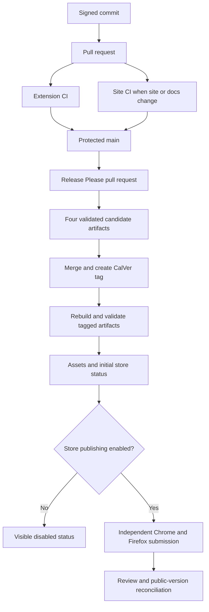

# Build, release, and verification

> **How to read this doc:** [Context](#context) explains why build and verification are split,
> [Reference](#reference) defines the normative outputs and gates, and
> [Delivery flow](#delivery-flow) shows how a commit reaches a release. Contributors should use the
> command table; release operators should also read the linked tutorial.

## Context

The repository uses Deno throughout, and the extension emits two browser packages from one source
tree. Browser behavior cannot be proven by one runner: Chromium supports a real extension end-to-end
harness, while Firefox requires `web-ext` plus Marionette. The static website has additional Astro,
link, accessibility, and Lighthouse gates in a path-filtered workflow, so those expensive gates do
not run for extension-only changes.

## Reference

### Tool ownership

`mise.toml` pins Deno `2.9.4` and lefthook `2.1.10`. `deno.json` is the repository's only task and
direct-dependency registry. npm packages for the extension and Astro site arrive through exact
`npm:` specifiers, and `deno.lock` records the resolved graph. The repository has no `package.json`
or npm lockfile. Deno may generate a gitignored `node_modules/` compatibility tree for Vite and
other packages that require Node-style resolution.

The pre-commit hook runs staged formatting and lint checks. The pre-push hook and the CI `checks`
job both run `deno task ci` after activating the pinned mise environment. The task executes
formatting, linting, type checking, and unit tests in sequence.

### Build outputs

`deno task build` wipes and recreates `dist/chrome/` and `dist/firefox/`. It bundles background and
content entry points as IIFEs, extension pages as ESM, copies generated token CSS, vendored WOFF2
fonts, the icon sprite, HTML shells, and generated manifests. The bundling stage rejects unexpected
absolute HTTP or HTTPS URLs in generated JavaScript; `release:validate` provides the full-tree
remote-URL guarantee for distributable archives.

`deno task build:release` additionally minifies, omits sourcemaps, and creates
`dist/chrome-<version>.zip` and `dist/firefox-<version>.zip` (with `<version>` matching the packaged
manifest CalVer). `deno task release:artifacts` runs that build and also creates
`dist/firefox-source.zip` plus `dist/firefox-build-instructions.md` for Mozilla reviewers. Tests use
temporary output directories and must not delete a developer's existing `dist/` tree.

### Verification tiers

| Gate                      | What it proves                                                                                          |
| ------------------------- | ------------------------------------------------------------------------------------------------------- |
| `deno task ci`            | Formatting, lint, type safety, unit behavior, browser-shim parity, and fixture-backed pure logic.       |
| `deno task e2e:smoke`     | The built Chrome extension boots, injects on demand, and resolves vendored assets.                      |
| `deno task e2e:full`      | Chromium multi-page capture, lifecycle persistence, restricted and failure paths, and export integrity. |
| `deno task visual`        | Gallery and every extension surface match Linux baselines in both forced themes.                        |
| `deno task a11y`          | Serious and critical axe findings, keyboard flow, focus, contrast, and reduced motion.                  |
| `deno task lint:firefox`  | The Firefox package passes `web-ext` static validation.                                                 |
| `deno task boot:firefox`  | Firefox starts the event page, injects content, and resolves exposed assets.                            |
| `deno task smoke:firefox` | Firefox completes one representative Marionette-driven capture and stores a valid note.                 |
| `deno task site:ci`       | Site formatting, Astro checks, tooling tests, build, published scope, and link integrity.               |

Firefox smoke coverage is not end-to-end parity. Safari is unbuilt. Visual baselines may be updated
only on the pinned Linux environment, and a failed comparison writes actual, expected, and diff
artifacts.

The `main` ruleset requires the ten extension CI contexts: `checks`, `build`, `tokens-drift`,
`e2e-smoke`, `e2e-full`, `visual`, `a11y`, `lint-firefox`, `boot-firefox`, and `smoke-firefox`.
Required checks use strict up-to-date policy; commits are signed; the ruleset restricts branch
creation, deletion, and non-fast-forward updates; and pull requests merge with merge commits.

### Release contract

The packaged version uses UTC CalVer `YYYY.MMDD.N`. `0.1.0` is the one permitted bootstrap value;
the first release calculation replaces it with CalVer. Multiple releases on one UTC date increment
`N`; a later UTC date resets it to `0`.

Local builds retain that numeric value in `version` and add
`version_name: "<version>-dev-<current-git-branch>"`. The descriptive value identifies a loaded
development package without violating browser update-version syntax. Release builds omit
`version_name`.

`.release-please-manifest.json`, `version.txt`, and `manifestBase.version` in `build/manifest.ts`
must agree. Release Please updates all three in lockstep, both browser manifests derive from
`manifestBase.version`, and a final tag must equal `v<manifest-version>`.
`deno task release:validate` checks both browser archives for:

- a non-empty archive with safe paths and a root `manifest.json`;
- required common and browser-specific manifest keys;
- the expected version;
- no sourcemaps or leaked `dist/` path segment; and
- no unexpected remote URL in shipped text assets.

It also requires the two Firefox reviewer artifacts. The source ZIP contains only tracked files from
`build/`, `src/`, and the required root build inputs: `.release-please-manifest.json`, `deno.json`,
`deno.lock`, `LICENSE`, `mise.toml`, and `version.txt`. It excludes `.git`, `dist/`,
`node_modules/`, environment files, worktrees, caches, website dependencies, and review scratch by
construction. Symbolic links and unsafe paths are rejected. A metadata file inside the archive and
the standalone instructions must both match the checked-out commit SHA and packaged version.

ZIP implementations may encode container metadata differently even when every shipped byte is the
same. `deno task release:compare <submitted.zip> <rebuilt.zip>` therefore compares sorted entry
paths and uncompressed file bytes. This normalized comparison is the reproducibility rule used for
the Firefox package.

The validator reports all four artifacts and their total byte size. Release Please maintains one
release pull request. Its exact head receives a 14-day candidate bundle containing all four named
artifacts. When that pull request merges, the workflow rebuilds from the tagged SHA, validates the
tag and artifact identity, and attaches the same names to the GitHub release.

After the four final assets exist, the release workflow calls the reusable browser-store workflow
with the exact tag and tagged commit SHA. `STORE_PUBLISH_ENABLED` is a fail-closed gate. Any value
other than `true` records a visible disabled result without entering the protected environment or
resolving a vendor credential. This is the launch state until the first listings are published
manually.

When enabled, the workflow re-downloads exactly the four release assets, verifies the tag, checkout,
manifest version, reviewer metadata, and asset set, then operates the stores independently:

- Chrome receives the attached `chrome-<version>.zip` bytes through Chrome Web Store API v2. A
  short-lived OAuth token comes from Google Workload Identity Federation, upload polling is bounded,
  publication blocks on vendor warnings, and the returned `crxVersion` must equal the GitHub release
  version.
- Firefox receives a deterministic package built by pinned `web-ext` `10.5.0` from the extracted
  `firefox-<version>.zip`. The listed submission includes release notes, reviewer notes, and the
  attached `firefox-source.zip`; the stable Gecko ID and manifest version are checked before
  submission.

An exact matching retry is idempotent. A conflicting version, missing enabled configuration,
timeout, warning, or rejection fails the workflow after recording each store's independent result.
The same workflow supports a manually dispatched `reconcile` operation that performs no upload.

The workflow adds a marked `point-and-shoot-store-status` section to the release body without
changing Release Please's notes. It starts Chrome and Firefox as unpublished and distinguishes the
expected GitHub version, submitted version, vendor review state, public version, reconciliation
time, and actionable failure text. A public version mismatch or missing live listing URL keeps
release closeout incomplete.

## Delivery flow

Every capability claim in a pull request must map to a command or a named remote job that actually
ran for the reviewed commit.
