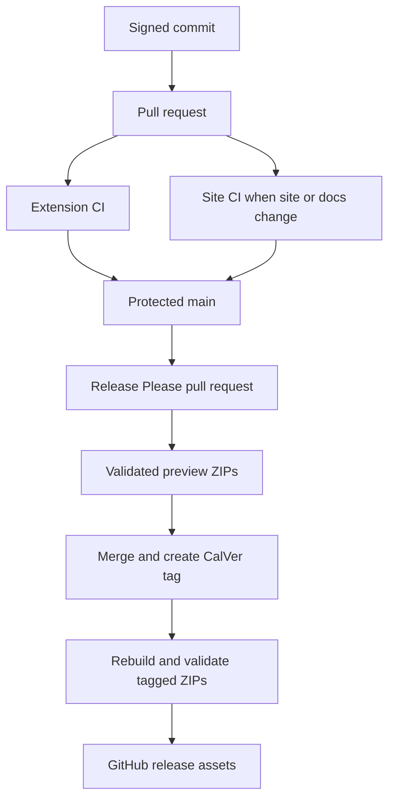

# Build, release, and verification

> **How to read this doc:** [Context](#context) explains why build and verification are split,
> [Reference](#reference) defines the normative outputs and gates, and
> [Delivery flow](#delivery-flow) shows how a commit reaches a release. Contributors should use the
> command table; release operators should also read the linked tutorial.

## Context

The extension is Deno-first and emits two browser packages from one source tree. Browser behavior
cannot be proven by one runner: Chromium supports a real extension end-to-end harness, while Firefox
requires `web-ext` plus Marionette. The static website has an isolated Node toolchain and a
path-filtered workflow, so website gates do not run for extension-only changes.

## Reference

### Tool ownership

`mise.toml` pins Deno `2.9.4`, Node `26.5.0`, and lefthook `2.1.10`. `deno.json` is the extension's
only task registry. Node packages used by extension tooling arrive through exact `npm:` specifiers;
only `site/` has a `package.json` and lockfile.

The pre-commit hook runs staged formatting and lint checks. The pre-push hook and the CI `checks`
job both run `deno task ci` after activating the pinned mise environment. The task executes
formatting, linting, type checking, and unit tests in sequence.

### Build outputs

`deno task build` wipes and recreates `dist/chrome/` and `dist/firefox/`. It bundles background and
content entry points as IIFEs, extension pages as ESM, copies generated token CSS, vendored WOFF2
fonts, the icon sprite, HTML shells, and generated manifests. The bundling stage rejects unexpected
absolute HTTP or HTTPS URLs in generated JavaScript; `release:validate` provides the full-tree
remote-URL guarantee for distributable archives.

`deno task build:release` additionally minifies, omits sourcemaps, and creates `dist/chrome.zip` and
`dist/firefox.zip`. Tests use temporary output directories and must not delete a developer's
existing `dist/` tree.

### Verification tiers

| Gate                      | What it proves                                                                                          |
| ------------------------- | ------------------------------------------------------------------------------------------------------- |
| `deno task ci`            | Formatting, lint, type safety, unit behavior, browser-shim parity, and fixture-backed pure logic.       |
| `deno task e2e:smoke`     | The built Chrome extension boots, injects on demand, and resolves vendored assets.                      |
| `deno task e2e:full`      | Chromium multi-page capture, lifecycle persistence, restricted and failure paths, and export integrity. |
| `deno task visual`        | Gallery and every extension surface match Linux baselines in both forced themes.                        |
| `deno task a11y`          | Serious and critical axe findings, keyboard flow, focus, contrast, and reduced motion.                  |
| `deno task lint:firefox`  | The Firefox package passes `web-ext` static validation.                                                 |
| `deno task boot:firefox`  | Firefox starts the event page, injects content, and resolves exposed assets.                            |
| `deno task smoke:firefox` | Firefox completes one representative Marionette-driven capture and stores a valid note.                 |
| `npm run ci` in `site/`   | Site formatting, Astro checks, tooling tests, build, published scope, and link integrity.               |

Firefox smoke coverage is not end-to-end parity. Safari is unbuilt. Visual baselines may be updated
only on the pinned Linux environment, and a failed comparison writes actual, expected, and diff
artifacts.

The `main` ruleset requires the ten extension CI contexts: `checks`, `build`, `tokens-drift`,
`e2e-smoke`, `e2e-full`, `visual`, `a11y`, `lint-firefox`, `boot-firefox`, and `smoke-firefox`.
Required checks use strict up-to-date policy; commits are signed; the ruleset restricts branch
creation, deletion, and non-fast-forward updates; and pull requests merge with merge commits.

### Release contract

The packaged version uses UTC CalVer `YYYY.MMDD.N`. `0.1.0` is the one permitted bootstrap value;
the first release calculation replaces it with CalVer. Multiple releases on one UTC date increment
`N`; a later UTC date resets it to `0`.

Local builds retain that numeric value in `version` and add
`version_name: "<version>-dev-<current-git-branch>"`. The descriptive value identifies a loaded
development package without violating browser update-version syntax. Release builds omit
`version_name`.

`.release-please-manifest.json`, `version.txt`, and `manifestBase.version` in `build/manifest.ts`
must agree. Release Please updates all three in lockstep, both browser manifests derive from
`manifestBase.version`, and a final tag must equal `v<manifest-version>`.
`deno task release:validate` checks both archives for:

- a non-empty archive with safe paths and a root `manifest.json`;
- required common and browser-specific manifest keys;
- the expected version;
- no sourcemaps or leaked `dist/` path segment; and
- no unexpected remote URL in shipped text assets.

The validator reports each archive and total byte size. Release Please maintains one release pull
request. Its head receives testable Chrome and Firefox ZIP artifacts. When that pull request merges,
the workflow rebuilds from the tagged SHA, validates against the tag, and attaches both ZIPs to the
GitHub release. Store submission remains manual.

## Delivery flow

Every capability claim in a pull request must map to a command or a named remote job that actually
ran for the reviewed commit.
