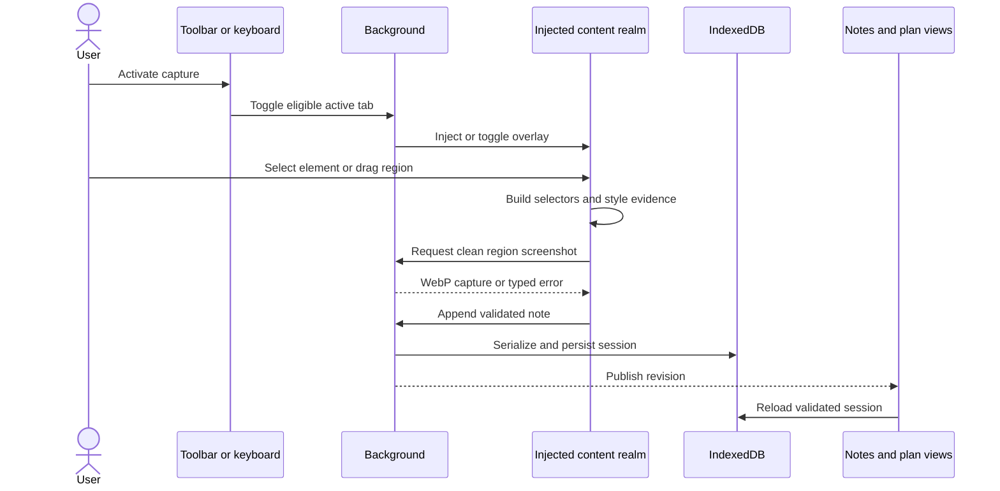

# Extension runtime

> **How to read this doc:** [Context](#context) explains the runtime boundaries,
> [Reference](#reference) defines the browser, capture, evidence, storage, and UI contracts, and
> [Capture flow](#capture-flow) shows their interaction. Implementors should follow the referenced
> modules; product readers can use the UI surfaces section as the behavioral summary.

## Context

Point & Shoot is one Manifest V3 extension with Chrome and Firefox packages generated from the same
source. It receives page access only after a user gesture, injects an isolated capture interface,
stores sessions locally, and exports files only when the user requests them. Safari has no v1 build
or verification pipeline.

## Reference

### Browser targets and permissions

`build/manifest.ts` is the only manifest source. Chrome `116` and Firefox `109` are the minimum
versions; `build/build.ts` derives its esbuild targets from the same `SUPPORTED` constant.

Both manifests grant exactly `activeTab`, `storage`, `scripting`, `downloads`, and `clipboardWrite`.
They declare no `host_permissions` and no static `content_scripts`. The background injects
`content/content.js` only after a toolbar click, keyboard command, or popup action supplies an
eligible active tab. A restricted page returns an unavailable state and does not create a session.

Chrome uses a module service worker and `side_panel`; Firefox uses an event-page script and
`sidebar_action`. Application code accesses both through the promise-based shim in
`src/shared/browser.ts`. The shim normalizes capture, messaging, storage, downloads, script
injection, action state, options navigation, and panel opening.

### Injected interface and theming

`src/content/host.ts` mounts all injected UI in one closed shadow root. The host follows a
fullscreen element when necessary and returns to the document when fullscreen ends. Mounting does
not steal focus from the inspected page.

The overlay theme is resolved by `src/shared/theme.ts`. A forced `dark` or `light` preference wins;
otherwise the runtime samples the backdrop behind the toolbar, skips transparent layers, and uses
hysteresis to avoid flicker near the luminance threshold. Automated visual assertions always force a
theme.

### Element evidence

The picker supports pointer selection, drag-box selection, and keyboard traversal. Escape removes
the injected picker and composer UI while leaving the active session and its stored notes intact.

`src/shared/selectors.ts` emits identity evidence in this trust order:

1. `data-testid`, `data-test`, `data-cy`, and `id` signals;
2. ARIA role and accessible name; and
3. structural CSS and XPath segment arrays.

CSS and XPath paths round-trip through open shadow roots and same-origin frames. Closed-shadow
interiors, foreign documents, and cross-origin frames emit a discriminated unreachable bundle
instead of a plausible but invalid selector.

`src/shared/style-digest.ts` records the selected element's box model, typography, resolved colors,
parent, and bounded neighboring siblings. Colors normalize to hex and numeric box measurements use
CSS pixels. The [runtime limits](runtime-limits.md) apply to digest and drag-box collection.

### Screenshot capture

The content realm hides extension pixels before requesting a screenshot and restores them in a
`finally` path. The background calls `captureVisibleTab`, converts the result with
`createImageBitmap`, crops it with `OffscreenCanvas`, and emits a WebP data URL.

The crop accounts for device-pixel scale, clamps to the visible viewport and bitmap, and downscales
to the configured longest edge. Any clamp or downscale sets `region.truncated` to `true`. Invalid or
empty geometry fails before capture; permission failures and image-processing failures return
distinct typed errors.

### Session and storage model

`src/shared/schema.ts` defines schema version `1`:

- A `Session` has an ID, name, creation time, nullable end time, and ordered notes.
- A `Note` has its page URL and title, optional query-stripping choice, captured region, ordered
  elements, creation time, and user text.
- A `RegionCapture` has a WebP data URL, viewport, crop box, and truncation flag.
- A `NoteElement` has a selector bundle, a nullable style digest, and an optional framework hint.

IndexedDB database `point-and-shoot`, version `1`, stores sessions by ID. Every read validates the
unknown stored value with `validateSession`. A single-record read rejects corrupt data; a list read
skips corrupt records. Quota exhaustion becomes `QuotaExceededError`. Database migrations append to
`MIGRATIONS`; existing migration entries are immutable, and open connections close on
`versionchange` so an upgrade cannot deadlock indefinitely.

`storage.local` holds settings and the active, displayed, and revision pointers. Session writes are
serialized in the background so concurrent starts or note appends cannot create duplicates or lose
data.

### UI surfaces

| Surface          | Current contract                                                                                                                                            |
| ---------------- | ----------------------------------------------------------------------------------------------------------------------------------------------------------- |
| Injected toolbar | Offers selection, current note count, and navigation to the side panel. It has no independent end-session or download action.                               |
| Notes side panel | Reviews the active or last displayed session, edits and reorders notes within page groups, previews targets on the matching page, and opens compile/export. |
| Plan view        | Selects notes and produces the canonical JSON, image-free prompt, and ZIP bundle described in [Export bundle](export-bundle.md).                            |
| Popup document   | Can toggle capture, start or resume a session, open notes, and open options. It is built but is not the toolbar action's `default_popup`.                   |
| Options page     | Edits validated settings, opens browser-owned shortcut management, and clears stored sessions after confirmation.                                           |

All extension surfaces show the packaged manifest version. The component gallery is a development
surface and does not ship as an extension page.

## Capture flow

The capture fails without altering stored notes when selection geometry, screenshot permission,
encoding, or storage fails. A successful note remains successful if only the later action-badge
refresh fails.
