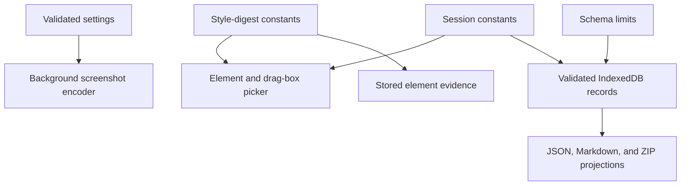

# Runtime limits

> **How to read this doc:** [Rationale](#rationale) explains why the runtime is bounded,
> [Reference](#reference) is the normative table, and [Data flow](#data-flow) shows where each value
> is enforced. Implementors should start with Reference; reviewers should verify both the constant
> and its boundary tests.

## Rationale

Point & Shoot captures enough evidence for a coding agent to identify a UI defect without dumping an
entire page into every note. Fixed bounds keep selectors, computed styles, screenshots, and exports
deterministic and legible. A consumer must import the owning constant instead of repeating its
numeric value.

The export-size value is retained for version-one settings compatibility. It is not a product limit:
no UI displays a size meter or blocks an export because of it.

## Reference

| Limit                           |              Value | Owning symbol                                                         | Behavior at the boundary                                                    |
| ------------------------------- | -----------------: | --------------------------------------------------------------------- | --------------------------------------------------------------------------- |
| Style properties per element    |               `40` | `MAX_STYLE_PROPERTIES` in `src/shared/style-digest.ts`                | The fixed digest shape remains below the ceiling.                           |
| Siblings per element            |                `6` | `MAX_SIBLINGS` in `src/shared/style-digest.ts`                        | At most three preceding and three following siblings are emitted.           |
| Descendant depth in a drag box  |                `3` | `MAX_SUBTREE_DEPTH` in `src/shared/style-digest.ts`                   | Deeper descendants are excluded.                                            |
| Elements in one note            |               `25` | `MAXIMUM_NOTE_ELEMENTS` in `src/shared/session.ts`                    | Collection stops in DOM order; stored requests beyond the cap are rejected. |
| Framework hint text             | `1,024` code units | `MAX_COMPONENT_HINT_TEXT_LENGTH` in `src/shared/schema.ts`            | Longer names or source paths fail validation.                               |
| Default screenshot longest edge |     `1,024` pixels | `DEFAULT_SETTINGS.screenshotMaxDimension` in `src/shared/settings.ts` | Larger captures are downscaled and marked `truncated`.                      |
| Default screenshot WebP quality |              `0.7` | `DEFAULT_SETTINGS.screenshotQuality` in `src/shared/settings.ts`      | The background applies the value to every capture request.                  |

The allowed screenshot dimensions are `512`, `1,024`, and `2,048` pixels. Allowed WebP quality
values are `0.5`, `0.7`, `0.85`, and `1`.

## Data flow

Each owning module has happy-path and boundary tests. `src/background/notes.test.ts` rejects element
evidence beyond the note cap, `src/shared/style-digest.test.ts` checks the sibling and property
ceilings, `src/shared/schema.test.ts` validates framework hints, and
`src/background/capture.test.ts` checks screenshot downscaling and truncation.

Changing a limit requires changing its owning constant, every consumer that imports it, this table,
and the corresponding boundary tests in one commit.
