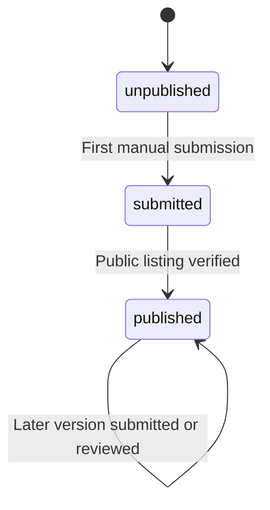
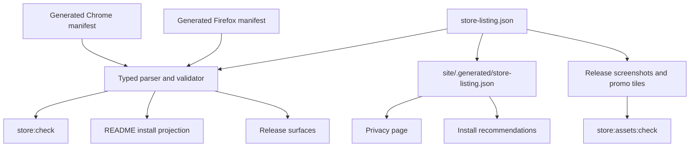

# Browser store publication

> **How to read this doc:** [Context](#context) explains why store metadata is a checked contract,
> [Reference](#reference) defines its schema and failure behavior,
> [Projection flow](#projection-flow) shows how public surfaces consume it, and
> [Store metrics](#store-metrics) records which vendor data may be used without scraping.

## Context

Browser-store identity starts unknown and becomes durable only after a maintainer creates and
publishes each listing. Placeholder URLs are unsafe because they look installable before a vendor
has assigned the real identity. Listing copy and privacy disclosures also describe extension
behavior that can change independently of the store dashboards.

The root `store-listing.json` file is therefore the canonical source for store state, identities,
public links, listing copy, support details, and privacy disclosures. The generated manifests remain
canonical for requested permissions and Firefox's stable extension ID. The non-writing `store:check`
task joins these sources and rejects drift.

## Reference

### Contract schema

The contract uses `schemaVersion: 1`. Unknown vendor-assigned identities and public listing URLs are
JSON `null`, never empty strings or dummy links.

| Field                           | Guarantee                                                                         |
| ------------------------------- | --------------------------------------------------------------------------------- |
| `support.email`                 | Exactly `support@pointandshoot.app`                                               |
| `support.url`                   | Exactly `https://pointandshoot.app/`                                              |
| `listing.name`                  | Matches the generated manifest name                                               |
| `listing.shortDescription`      | Matches the generated manifest description and is at most 132 characters          |
| `listing.currentVersionSummary` | Concise summary intentionally reviewed when shipped capabilities change           |
| `listing.fullDescription`       | At most 16,000 characters; contains the version summary and support email         |
| `artwork.screenshots`           | Five named screenshots in Point, Shoot, Review, Compile, Settings workflow order  |
| `artwork.smallPromoFileName`    | Exactly `small-promo.png`                                                         |
| `artwork.marqueePromoFileName`  | Exactly `marquee-promo.png`                                                       |
| `privacy.url`                   | Exactly `https://pointandshoot.app/privacy/`                                      |
| `privacy.effectiveDate`         | A real calendar date in canonical `YYYY-MM-DD` form                               |
| `privacy.singlePurpose`         | Chrome single-purpose declaration, at most 1,000 characters                       |
| `privacy.remoteCode`            | Always `false`                                                                    |
| `privacy.permissions`           | One explanation, at most 1,000 characters, for each generated manifest permission |
| `privacy.dataDisclosures`       | Local handling categories and explicit false collection/use declarations          |
| `stores.chrome`                 | State, extension ID, publisher ID, and listing URL                                |
| `stores.firefox`                | State, slug, stable extension ID, and listing URL                                 |

The required locally handled categories are `websiteContent`, `webHistory`, `userActivity`, and
`userGeneratedContent`. These categories describe data processed on the device after a user gesture;
they do not mean the extension collects or transmits that data. The collection, transmission, sale,
sharing, advertising, and credit-purpose declarations remain `false`.

### Store state

Each store state is `unpublished`, `submitted`, or `published`.

Only `published` permits a non-null `listingUrl`. Any non-null Chrome extension ID is a 32-character
vendor ID; a published Chrome entry also requires its extension and publisher IDs. A published
Firefox entry requires its slug, and its `extensionId` must always match `FIREFOX_EXTENSION_ID` from
`build/manifest.ts`. URLs must use HTTPS, the official vendor host, no credentials, custom port,
query, or fragment, and the exact path shape matching the configured identity. Once a listing is
public, later package submissions do not change this visibility state; per-version review status is
tracked by release automation instead.

### Validation and failures

`parseStoreListing(value)` treats decoded JSON as untrusted input and fails if any required field
has the wrong shape. `validateStoreListing(root)` returns every schema, limit, manifest-drift,
state, identity, URL, privacy, and public-sentinel issue in deterministic order.
`deno task store:check` prints those issues and exits unsuccessfully without modifying the
repository.

`deno task store:assets` captures the release build, creates the two text-free promo tiles from
generated product tokens, reuses committed digest-pinned official vendor badges without network
access, and writes `docs/assets/store/manifest.json`. Use `deno task store:assets:refresh-badges`
only when intentionally refreshing those badges from their official sources. The five listing
screenshots are opaque 24-bit RGB PNG files at 1280×800. The small and marquee tiles are opaque
24-bit RGB PNG files at 440×280 and 1400×560. `deno task store:assets:check` rejects missing files,
dimensions or color modes outside this contract, modified vendor badges, output hash drift,
source-fingerprint drift, or a current-version summary that was not recorded when the assets were
regenerated. Generation stages the complete asset set before promotion, and browser or fixture
failures close their resources without modifying the committed outputs.

The checker compares the privacy explanation keys with the union of the permissions generated for
Chrome and Firefox. Adding or removing a permission therefore requires the manifest, contract,
privacy page, and disclosure tests to change together. The repository README, site source, and the
published documentation set (`docs/README.md`, `docs/design.md`, `docs/specs/**`, and
`docs/tutorials/**`) may not contain store URL sentinel tokens.

The README contains one generated block delimited by `<!-- store-install:start -->` and
`<!-- store-install:end -->`. `deno task store:sync` replaces only that block. A store badge and
canonical link render only when that store is `published`; unpublished and submitted stores render
an in-progress statement and the source-build fallback instead. `store:check` rejects projection
drift without rewriting the README.

## Projection flow

The Astro runner parses and normalizes the root contract into `site/.generated/store-listing.json`
before each check, build, or development-server start. The generated directory is disposable and is
never a second source of truth. Later repository, asset, install, and release projections consume
the same validated contract.

## Store metrics

Firefox Add-ons exposes a documented add-on detail endpoint containing `average_daily_users`,
`weekly_downloads`, and rating aggregates including average, total count, and text-review count. Its
ratings endpoint can list public rating text, but that endpoint is explicitly not frozen. A later
website change may fetch Firefox aggregates at build time with a cached or absent-state fallback; it
must not make page rendering depend on a live vendor request. See the official
[add-on API reference](https://mozilla.github.io/addons-server/topics/api/addons) and
[ratings API reference](https://mozilla.github.io/addons-server/topics/api/ratings.html).

The documented Chrome Web Store API v2 exposes package upload, submission status, publication,
cancellation, and deployment-percentage methods. It does not expose a documented public method for
listing stars, rating counts, or review text. This conclusion is based on the current
[Chrome Web Store API v2 resource list](https://developer.chrome.com/docs/webstore/api/reference/rest).
The site must not scrape the Chrome listing. Chrome metrics remain store-native until Google ships a
documented supported endpoint or the maintainers choose a clearly labelled manual snapshot.
