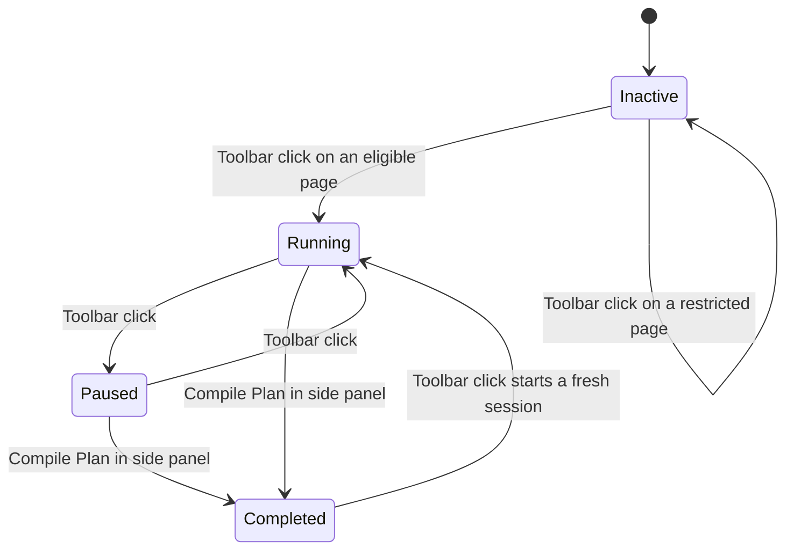

# Toolbar session control

The browser toolbar icon owns the capture-session pause/resume lifecycle. Compile Plan in the notes
side panel is the only completion gesture. See
[ADR-0022](../adr/0022-pause-resume-and-compile-plan-completion.md) for the full rationale.

## Entry points

The Chrome and Firefox manifests declare an action title but no `action.default_popup`. A toolbar
click therefore dispatches `action.onClicked` to the background session controller.

The `_execute_action` keyboard shortcut fires `action.onClicked`, granting `activeTab` permission
and following the same session-toggle path as the toolbar click. Both entry points use the same
per-tab activation controller, which injects the content bundle only when no content listener
exists.

## Lifecycle

When no active session exists, a toolbar click:

1. Opens the browser side panel or sidebar from the direct user gesture.
2. Ensures the overlay is mounted on the clicked tab.
3. Creates one schema-valid session in IndexedDB named `<tab-title>-<YYYY-MM-DD-HH-MM-SS>` using the
   active tab title and local creation time. A missing or blank title becomes `Untitled page`. The
   session's `domain` is captured from the tab URL (see
   [ADR-0021](../adr/0021-session-domain-field.md)).
4. Stores its ID as both `activeSessionId` and `displaySessionId`.
5. Updates the action badge and title to the running state.

When an active session is running (not paused), a toolbar click:

1. Unmounts the overlay on the clicked tab without injecting a missing content realm.
2. Stamps the session's `pausedAt`. `activeSessionId` is retained; `endedAt` stays `null`.
3. Updates the action badge and title to the paused state.

When an active session is paused, a toolbar click:

1. Ensures the overlay is mounted on the clicked tab.
2. Clears the session's `pausedAt`.
3. Updates the action badge and title to the running state.

Only Compile Plan in the side panel completes a session — it stamps `endedAt`, clears `pausedAt`,
drops `activeSessionId`, and keeps `displaySessionId` pointing at the completed record. The next
toolbar click after completion creates a fresh session. Concurrent lifecycle and capture writes
serialize through one background service, so a capture cannot append after the same session has
ended.

### Overlay follows page navigation

The background registers a `tabs.onUpdated` listener. When the listener sees
`changeInfo.status === "complete"` and the active session's `pausedAt` is `null`, it asks the
activation controller to mount the overlay in the completed tab. This keeps note capture available
across page navigations without requiring the user to re-click the toolbar. Paused sessions do not
follow navigation; restricted pages are ignored via the existing `unavailable` activation outcome.

## Action badge and tooltip

| Session state           | Badge       | Hover title                                       |
| ----------------------- | ----------- | ------------------------------------------------- |
| No active session       | Empty       | `Point and Shoot — Start session`                 |
| Running, 0–99 notes     | Exact count | `Point and Shoot — Pause session (N note/notes)`  |
| Paused, 0–99 notes      | Exact count | `Point and Shoot — Resume session (N note/notes)` |
| Any state, 100+ notes   | `99+`       | Exact count in the running or paused title        |
| Page cannot be injected | `!`         | `Point and Shoot — unavailable on this page`      |

Every successful note write advances `sessionRevision`. An open side panel reloads the displayed
session, and the background refreshes the badge and title from the durable active session. The
background also restores action state when its Manifest V3 worker or event page starts again.

## Side-panel behavior

The side panel loads `displaySessionId` first and falls back to `activeSessionId` for data created
before the separate display pointer existed. Header labels reflect all three durable states:
`Current session` when running, `Paused session` when `pausedAt != null`, and `Completed session`
when `endedAt != null`.

Compile Plan is the completion gesture — clicking it invokes `NotesRepository.complete`, which
stamps `endedAt`, clears `pausedAt`, drops the active pointer, and keeps the panel on the same
session id so plan view renders without a flicker.

Edits and exports remain available after a session ends. Clearing all sessions from options removes
the IndexedDB records plus `activeSessionId`, `displaySessionId`, and `sessionRevision`.

The generated name is only the initial value. The existing side-panel session-name editor can
replace it at any point in the lifecycle.

## Failure behavior

A restricted page must not create a session. The side panel may still open so an earlier completed
session remains reviewable, while the action shows the unavailable badge and title.

If session creation fails after the overlay mounts, the controller unmounts the overlay and shows an
error badge with `Point and Shoot — session could not start`. If pause or resume fails, the
controller restores the previous overlay state and shows `Point and Shoot — session could not pause`
or `… could not resume` respectively, leaving the durable session in its previous state so the user
can retry.

A note that saves successfully remains successful even if the later badge refresh fails; the refresh
error is logged rather than misreporting the durable note write.

The built popup document is not declared as the action popup and is not part of the normal toolbar
flow.
