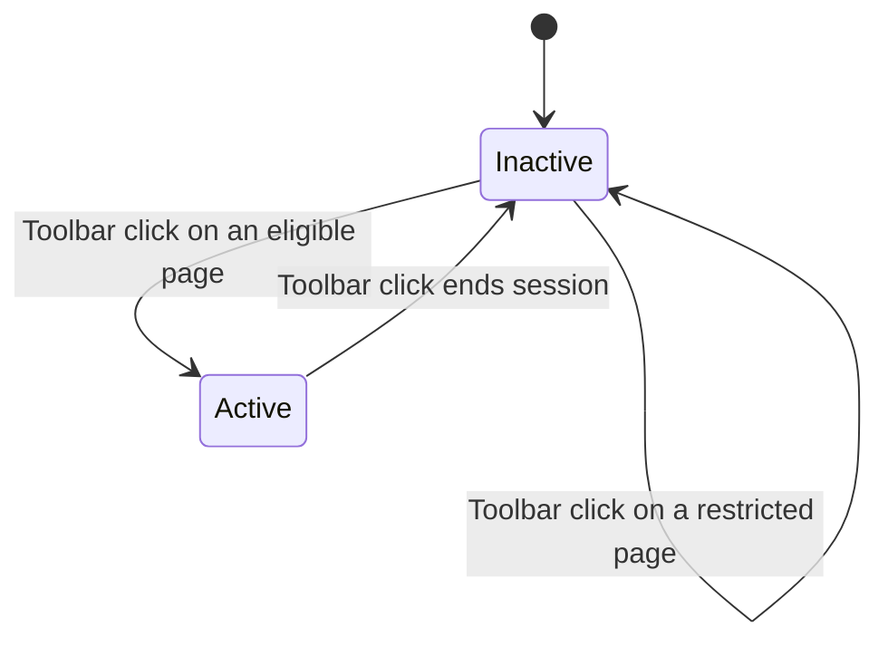

# Toolbar session control

The browser toolbar icon owns the capture-session lifecycle. The notes side panel is the primary
workspace for reviewing, editing, compiling, and exporting the session.

## Entry points

The Chrome and Firefox manifests declare an action title but no `action.default_popup`. A toolbar
click therefore dispatches `action.onClicked` to the background session controller.

The `_execute_action` keyboard shortcut fires `action.onClicked`, granting `activeTab` permission
and following the same session-toggle path as the toolbar click. Both entry points use the same
per-tab activation controller, which injects the content bundle only when no content listener
exists.

## Lifecycle

When no active session exists, a toolbar click:

1. Opens the browser side panel or sidebar from the direct user gesture.
2. Ensures the overlay is mounted on the clicked tab.
3. Creates one schema-valid session in IndexedDB named `<tab-title>-<YYYY-MM-DD-HH-MM-SS>` using the
   active tab title and local creation time. A missing or blank title becomes `Untitled page`.
4. Stores its ID as both `activeSessionId` and `displaySessionId`.
5. Updates the action badge and title.

When a session is active, a toolbar click:

1. Ensures the overlay is unmounted on the clicked tab without injecting a missing content realm.
2. Sets the session's `endedAt`.
3. Removes `activeSessionId` while retaining `displaySessionId`.
4. Leaves the side panel open on the completed session.
5. Clears the badge and restores the start-session title.

The next toolbar click creates a fresh session and moves `displaySessionId` to it. Concurrent
lifecycle and capture writes serialize through one background service, so a capture cannot append
after the same session has ended.

## Action badge and tooltip

| Session state           | Badge       | Hover title                                    |
| ----------------------- | ----------- | ---------------------------------------------- |
| No active session       | Empty       | `Point and Shoot — Start session`              |
| Active, 0–99 notes      | Exact count | `Point and Shoot — End session (N note/notes)` |
| Active, 100+ notes      | `99+`       | Exact count in the same end-session title      |
| Page cannot be injected | `!`         | `Point and Shoot — unavailable on this page`   |

Every successful note write advances `sessionRevision`. An open side panel reloads the displayed
session, and the background refreshes the badge and title from the durable active session. The
background also restores action state when its Manifest V3 worker or event page starts again.

## Side-panel behavior

The side panel loads `displaySessionId` first and falls back to `activeSessionId` for data created
before the separate display pointer existed. It labels unended data `Current session` and ended data
`Completed session`.

Edits and exports remain available after a session ends. Clearing all sessions from options removes
the IndexedDB records plus `activeSessionId`, `displaySessionId`, and `sessionRevision`.

The generated name is only the initial value. The existing side-panel session-name editor can
replace it before or after the session ends.

## Failure behavior

A restricted page must not create a session. The side panel may still open so an earlier completed
session remains reviewable, while the action shows the unavailable badge and title.

If session creation fails after the overlay mounts, the controller unmounts the overlay and shows an
error badge with `Point and Shoot — session could not start`. If ending fails, the controller
remounts the overlay and shows `Point and Shoot — session could not end`, leaving the durable
session active so the user can retry.

A note that saves successfully remains successful even if the later badge refresh fails; the refresh
error is logged rather than misreporting the durable note write.

The built popup document is not declared as the action popup and is not part of the normal toolbar
flow.
