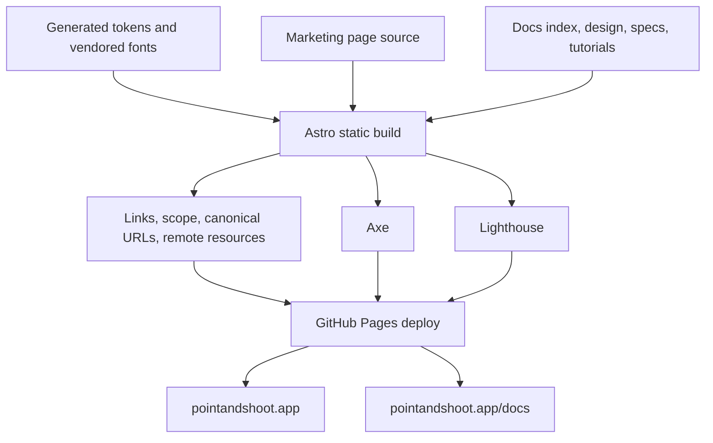

# Website and published documentation

> **How to read this doc:** [Context](#context) explains the public web surfaces,
> [Reference](#reference) defines source, rendering, navigation, and deployment guarantees, and
> [Publishing flow](#publishing-flow) shows how repository content becomes the live site. Site
> implementors should follow the build and integrity sections; documentation authors should follow
> the published-scope section.

## Context

The Astro project under `site/` builds two public surfaces from one static bundle: the marketing
page at `https://pointandshoot.app/` and product documentation under
`https://pointandshoot.app/docs/`. The site is isolated from extension source and never ships inside
the browser packages.

## Reference

### Design and assets

The landing page follows the marketing kit in `.claude-design/point-and-shoot/ui_kits/marketing/`
with the product's sentence case, restrained animation, and single-accent rules. Its layout may use
more generous spacing than the extension.

Both public surfaces consume the generated CSS tokens from `src/shared/design/tokens.css`. Site
styles may add layout compositions but must not duplicate the palette, font families, radii, or
motion values. The site copies the extension's subset WOFF2 files into its build and makes no
third-party font request.

Install calls to action link to working store listings when they exist; otherwise they link to the
repository's install-from-source instructions. Placeholder and fragment-only destinations are not
valid install links.

### Published documentation scope

`site/src/lib/docs-manifest.ts` publishes Markdown directly from these repository sources:

- `docs/README.md`;
- `docs/design.md`;
- every Markdown file under `docs/specs/`; and
- every Markdown file under `docs/tutorials/`.

ADRs remain repository-only. Implementation plans are not part of the repository's documentation
model and must not be reintroduced under `docs/`.

One generated page must exist for every published source. The integrity checker rejects a missing
page, an unexpected ADR route, a broken internal link or anchor, an obsolete repository-prefixed
asset URL, a malformed canonical URL, and an unexpected remote resource in HTML or CSS.

### Rendering and navigation

The documentation sidebar derives from the published collection rather than a hand-maintained list.
Every heading receives a stable anchor. Repository-relative Markdown links are rewritten to
published routes when the target is published and to GitHub when the target is source code, an ADR,
or another repository-only artifact.

Mermaid blocks render at build time to static SVG. The shipped documentation includes no Mermaid
runtime and no client-side diagram fallback. Both themes derive from product tokens and honor
`prefers-color-scheme`; technical strings use the vendored mono family and expose their full value
when visually truncated.

### Quality and deployment

The `Site` workflow builds and checks the site on relevant pull requests and pushes to `main`.
Independent jobs run the build, link and published-scope checker, axe scan, and Lighthouse. A push
deploys only after all four jobs pass.

Every site command is a root-level `deno task site:*` command. Astro and its npm dependencies are
resolved by Deno from `deno.json` and `deno.lock`; the workflow does not install or invoke Node or
npm.

GitHub Pages uses workflow deployment with the custom domain `pointandshoot.app`. The build derives
its canonical origin and base path from Pages metadata supplied by CI; local builds use localhost.
The built server and integrity tests cover root-relative assets, canonical URLs, missing paths, and
malformed percent encoding.

The axe gate rejects serious and critical violations on the landing page and a documentation page.
Lighthouse checks both surfaces. External links are validated by the link task, while contact links
are allowed without being treated as fetchable page resources.

## Publishing flow

Documentation changes are product changes because they alter a deployed surface. A pull request that
changes published Markdown must pass the same site build and integrity jobs as a site-code change.
