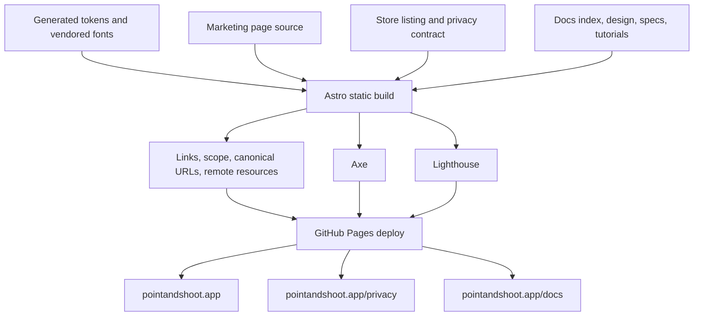

# Website and published documentation

> **How to read this doc:** [Context](#context) explains the public web surfaces,
> [Reference](#reference) defines source, rendering, navigation, and deployment guarantees, and
> [Publishing flow](#publishing-flow) shows how repository content becomes the live site. Site
> implementors should follow the build and integrity sections; documentation authors should follow
> the published-scope section.

## Context

The Astro project under `site/` builds three public surfaces from one static bundle: the marketing
page at `https://pointandshoot.app/`, the extension privacy policy at
`https://pointandshoot.app/privacy/`, and product documentation under
`https://pointandshoot.app/docs/`. The site is isolated from extension source and never ships inside
the browser packages.

## Reference

### Design and assets

The landing page follows the marketing kit in `.claude-design/point-and-shoot/ui_kits/marketing/`
with the product's sentence case, restrained animation, and single-accent rules. Its layout may use
more generous spacing than the extension.

All three public surfaces consume the generated CSS tokens from `src/shared/design/tokens.css`. Site
styles may add layout compositions but must not duplicate the palette, font families, radii, or
motion values. The site copies the extension's subset WOFF2 files into its build and makes no
third-party font request.

Install calls to action use only the generated `site/.generated/store-listing.json` projection.
Server-rendered HTML always communicates Chrome, Firefox, and source-install choices. A published
store renders its canonical official listing as a user-activated navigation; an unpublished store is
plain status text, never a disabled or dummy control. Source installation remains available in every
state. Hero and closing sections share the same install component and URL source.

The progressive-enhancement classifier receives only User-Agent Client Hint brands, user-agent text,
platform and touch/mobile evidence, and Gecko-specific `-moz-appearance` capability support. It
classifies mobile iOS, iPadOS, and Android first; then Gecko capability and Firefox-family evidence;
then Chromium UA-CH brands and Chromium-family UA evidence. Safari, WebKit-only strings, bots, and
legacy EdgeHTML remain unknown. Unrecognized evidence also remains unknown. The script leaves
canonical publication status unchanged and writes transient browser guidance to one dedicated polite
live region. It sets recommendation labels, attributes, and the one accent treatment. In the hero
the call to action collapses to a single link: the script keeps only the determined store and hides
the other store choices along with the build-from-source option, so a visitor sees exactly the store
they can install from. The closing section never collapses — it lists every published store and
keeps building from source visible so a visitor can still reach another browser's listing or build
locally. When the browser is unknown or unsupported the script recommends no store and the hero
keeps the full set. It never redirects, opens a store protocol, or attempts inline installation.
Unknown and Safari states recommend neither store and explain that Safari is deferred; mobile states
explain that desktop extension installation is unavailable.

From the website, **installable** means a user activates a link to a published official
browser-store listing. It does not mean the website can install the extension inline. The
no-JavaScript fallback keeps every available action and publication status available without focus
changes.

One further script applies the stored theme override. It is the only inline script in `<head>`: a
deferred module would paint the token default first and flash the wrong theme on every navigation.
It reads and writes one local-storage key, sets `data-theme` on the document element, keeps the
control's accessible name describing the theme it switches to, and reveals that control only once it
has run — without scripting the header ships no theme control rather than a control that cannot
work. A blocked storage API costs persistence only, never the in-page switch. See ADR-0020.

### Published documentation scope

`site/src/lib/docs-manifest.ts` publishes Markdown directly from these repository sources:

- `docs/README.md`;
- `docs/design.md`;
- every Markdown file under `docs/specs/`; and
- every Markdown file under `docs/tutorials/`.

ADRs and implementation plans remain repository-only. The temporary browser-store rollout is the
only plan allowed under `docs/plans/` and must be removed after its verified closeout.

One generated page must exist for every published source. The marketing, documentation index, and
privacy routes are required even though they do not all originate from Markdown. The integrity
checker rejects a missing required page, a missing published document, an unexpected ADR or plan
route, a broken internal link or anchor, an obsolete repository-prefixed asset URL, a malformed
canonical URL, and an unexpected remote resource in HTML or CSS.

### Rendering and navigation

The documentation sidebar derives its membership from the published collection rather than a
hand-maintained list. Order is not membership: the indexes lead, and the tutorials follow the user
story — install, configure, capture a session, compile and export, run beside Playwright, build from
source, troubleshoot, release — rather than filename order, because an alphabetical sidebar opens on
the export step. A document outside that declared sequence keeps a shared rank and stays
alphabetical among its peers, so adding one never reorders the rest. The same order drives the prev
and next pagination, so the sidebar and the pagination cannot disagree. Every heading receives a
stable anchor. Repository-relative Markdown links are rewritten to published routes when the target
is published and to GitHub when the target is source code, an ADR, or another repository-only
artifact.

The documentation header links the documentation index, the privacy policy, and the repository. Each
link carries an icon and the display family one step below the wordmark, and the single accent
treatment marks the current page only. The repository link carries the public star count resolved at
build time; nothing about it is fetched from the visitor's browser, and a build that cannot reach
the GitHub API renders the link with no badge rather than failing or showing a placeholder.

The marketing header pairs every navigation link with the same icon set, so both headers read as one
system; it takes none of the documentation header's pill chrome or star badge. The marketing footer
labels the repository link `GitHub`, matching the headers rather than naming the same destination
twice, and closes with the maintainer's copyright. That copyright carries no year: a static build
would bake in its own build date and then disagree with the calendar until the next deploy.

Every documentation page ends with a route back to the index: the footer links the documentation
index and the published Markdown source on GitHub. A page with a neighbour in the published order
also carries pagination links above that footer, and the rule dividing them sits above the
pagination, so it separates the article body from the navigation rather than doubling the footer's
own rule.

Mermaid blocks render at build time to static SVG. The shipped documentation includes no Mermaid
runtime and no client-side diagram fallback. Both themes derive from product tokens and honor
`prefers-color-scheme` by default. A visitor may pin either theme from the header control; that
choice persists in local storage, applies to every public surface, and wins over the
operating-system preference until it changes. With no stored choice the site writes no theme
attribute at all, so the operating-system preference remains the only input. Technical strings use
the vendored mono family and expose their full value when visually truncated.

### Quality and deployment

The `Site` workflow builds and checks the site on relevant pull requests and pushes to `main`.
Independent jobs run the build, link and published-scope checker, axe scan, and Lighthouse. A push
deploys only after all four jobs pass.

Every site command is a root-level `deno task site:*` command. Astro and its npm dependencies are
resolved by Deno from `deno.json` and `deno.lock`; the workflow does not install or invoke Node or
npm.

GitHub Pages uses workflow deployment with the custom domain `pointandshoot.app`. The build derives
its canonical origin and base path from Pages metadata supplied by CI; local builds use localhost.
The built server and integrity tests cover root-relative assets, canonical URLs, missing paths, and
malformed percent encoding.

The axe gate rejects serious and critical violations on the landing page, privacy policy, and a
documentation page. Lighthouse checks the marketing and documentation surfaces. External links are
validated by the link task, while contact links are allowed without being treated as fetchable page
resources.

## Publishing flow

Documentation changes are product changes because they alter a deployed surface. A pull request that
changes published Markdown must pass the same site build and integrity jobs as a site-code change.
