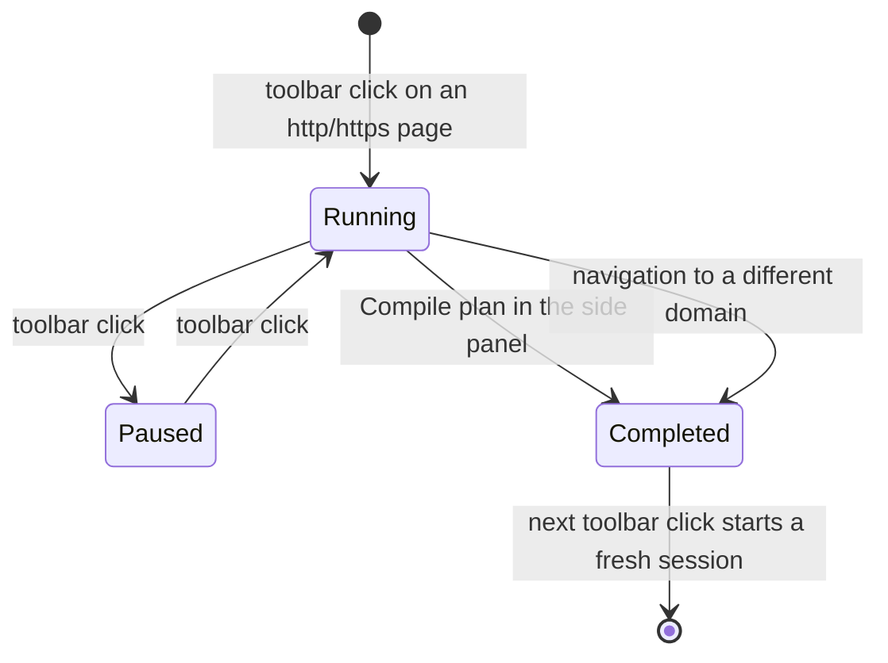

# Manage a Point and Shoot session

A session is the unit of work in Point and Shoot. Everything you capture belongs to one, and every
export is produced from one. This guide covers the whole lifecycle: starting, capturing across
pages, pausing, renaming, editing notes, reloading a past session, ending, and clearing storage.

It assumes the extension is already built and loaded. If it is not, follow
[get started](getting-started.md) first, which walks the same lifecycle at a lighter depth.

## What a session is

A session is a named collection of notes captured across one or more pages of a site, held in the
extension's own IndexedDB database on your machine. Point and Shoot never uploads it.

Each session record carries:

- a `name`, generated at start and editable at any time;
- a `createdAt` timestamp, and an `endedAt` timestamp once the session is finished;
- a `pausedAt` timestamp while the session is paused, and `null` while it runs;
- a `domain`, the hostname of the tab the session started on; and
- an ordered list of notes, each with its screenshot, page URL, selector bundle, computed-style
  digest, and your note text.

Exactly one session at a time is the active session — the one a toolbar click acts on and a capture
appends to. A paused session is still the active one. Separately, the side panel displays one
session, which does not have to be the active one; loading an old session for review therefore does
not disturb a session you have running.

## The lifecycle at a glance

The browser toolbar icon is a three-way toggle — start, pause, resume — and never ends a session.
Ending is a separate, deliberate act described in [end a session](#end-a-session).

## Start a session

Open an ordinary `http://` or `https://` page and select the Point and Shoot toolbar icon. That one
gesture opens the notes side panel (Firefox sidebar), injects the capture overlay into the tab,
creates a session, and switches the toolbar tooltip to **Point and Shoot — Pause session (0 notes)**
with a `0` badge.

The generated name joins the tab title and the local start time, for example
`Checkout-2026-08-18-14-07-03`. A tab with no title becomes `Untitled page`. The name is only a
starting point; see [rename a session](#rename-a-session).

The default shortcut, `Command+Shift+P` on macOS or `Ctrl+Shift+P` elsewhere, is bound to the same
browser action, so it starts, pauses, and resumes exactly as the icon does.

### What the badge is telling you

| Badge   | Meaning                                                                        |
| ------- | ------------------------------------------------------------------------------ |
| Empty   | No active session. The next click starts one.                                  |
| A count | Notes in the active session, running or paused. Counts above 99 read as `99+`. |
| `!`     | Either the page cannot be injected, or a lifecycle action failed.              |

Read the tooltip to tell those last two apart. A restricted page reads **Point and Shoot —
unavailable on this page**; a failure reads **Point and Shoot — session could not start**, or
`pause` or `resume` in place of `start`.

The `!` for a restricted page means no session was created and nothing was lost. Point and Shoot
holds the `activeTab` permission only, so it cannot inject into `chrome://` and `about:` pages, the
extension gallery, the built-in PDF viewer, or another extension's pages. Move to an ordinary web
page and click again. See [troubleshooting](troubleshooting.md) for the full list of surfaces that
cannot be captured.

## Capture notes across pages

While a session runs, navigate freely within the hostname it started on. The badge follows you and
keeps showing the running note count, so you can see at a glance that the session is still yours to
add to. Leaving that hostname is what ends it, as described
[below](#crossing-to-a-different-domain-ends-the-session).

The overlay does not survive navigation. `activeTab` is granted per user gesture and the browser
revokes it the moment the page changes, so Point and Shoot has no standing permission to re-inject
itself — by design, and the reason it can promise it never reads a page you did not point it at.

Bringing the overlay back takes **two** clicks of the toolbar icon, not one. Navigation leaves the
session running rather than pausing it, so the first click pauses it and the second resumes it and
re-injects the overlay. Both clicks keep the same session and every note in it. The tooltip tells
you which click you are on: **Pause session** before the first, **Resume session** before the
second.

The side panel groups notes by page. Select a page under **Pages** to see its notes under **Notes on
this page**.

### Crossing to a different domain ends the session

A session records the hostname it started on. If a navigation completes on a different hostname
while the session runs, Point and Shoot ends that session and clears the badge. The next toolbar
click then starts a fresh session for the new domain rather than mixing two sites into one export.

Nothing is discarded — the ended session keeps all its notes and remains fully exportable. Plan for
it: if a bug report spans two domains, capture and export one session per domain.

Two details make this fire more often than you might expect. The comparison is on the full hostname,
so moving between subdomains — `www.example.com` to `app.example.com` — ends the session. And it is
not scoped to the tab hosting the session: a navigation completing in _any_ tab on a different
hostname ends the running session, including a link you opened in a background tab. Pause the
session first when you need to browse away.

## Pause and resume a session

Selecting the toolbar icon while a session runs pauses it. The overlay is removed from that tab and
the tooltip becomes **Point and Shoot — Resume session (N notes)**. The badge keeps showing the note
count, so the tooltip, not the badge, is what distinguishes paused from running.

Pausing is for getting the overlay out of the way — to interact with the page normally, reproduce a
bug through a flow the toolbar would obstruct, or take the tab somewhere unrelated — without
sacrificing the session. A paused session stays the active session and keeps its id, so the next
click resumes it with every note intact.

While paused:

- the side panel labels the session **Paused session**, and the per-domain session list marks its
  row **Paused**;
- the options page shows its status as **Paused**; and
- navigation is ignored entirely. The badge does not refresh and the cross-domain end does not fire,
  so you can pause, browse anywhere including a different site, come back, and resume.

Select the icon again to resume. Point and Shoot re-injects the overlay first and only then clears
the pause, so resuming on a restricted page leaves the session paused and shows the `!` badge rather
than resuming a session with no way to capture. Move to a capturable page and try again.

## Rename a session

The generated name is a timestamped placeholder. Replace it with something a reviewer will
recognize, because it becomes the export filename slug.

1. In the side panel, select **Edit session name** — the pencil button beside the session name.
2. Type the new name into the **Session name** field.
3. Select **Save**, or **Cancel** to keep the old one.

**Save** stays disabled for an empty or whitespace-only name, and surrounding whitespace is trimmed.
There is no length limit, though export filenames truncate the slug at 64 characters. Renaming works
in every state, including a completed session.

## Edit and manage notes

Each note card in the side panel carries four icon buttons:

- **Edit** opens the **Edit note** dialog. Change **Note text**, then select **Save changes**.
- **Move up** and **Move down** reorder the note within its page group. Ordering is per page, so a
  note never moves across pages; the buttons disable at each end of a group.
- **Delete** opens **Delete note?**. This permanently removes the note's screenshot and cannot be
  undone.

Each card also has a **Strip query when exporting** switch. It controls one note at a time and
affects only the exported projection — the full URL stays in the stored record either way.

Stripping is all or nothing: the whole query is dropped from the export, not just the parameters
that looked risky. A note's switch starts on when the **Strip sensitive query strings** setting is
enabled _and_ the captured URL has at least one parameter whose name resembles a credential —
`token`, `key`, `secret`, `auth`, or `session`. One such parameter therefore drops every other
parameter alongside it, so turn the switch off for a note whose query you need in the export.

A note may hold up to 25 annotated elements. A capture that would exceed that is rejected with an
explicit error rather than silently truncated.

## Browse past sessions

### From the side panel

The side panel has a collapsible **Sessions on `<hostname>`** list showing every stored session that
started on the page's domain, each with its note count and status. Select one to load it into the
panel for reading, editing, or exporting.

Loading a session into the panel does not stop a running session. The panel's displayed session and
the active session are tracked separately, so you can review yesterday's capture and then click the
toolbar icon to keep adding to today's.

The delete button beside a row is labelled **Delete `<session name>`** and confirms through **Delete
this session?** before removing the session and all of its notes.

### From the options page

The options page's **Sessions** tab lists every stored session regardless of domain, newest first.
Each row shows the name, the domain, the creation time, the note count, and the status —
**Running**, **Paused**, or **Completed**. A session whose start URL was unparseable displays **No
domain**.

- **Group by domain** collapses the list into one expandable group per hostname. The preference
  persists across visits.
- **Load in side panel** opens the side panel on that session, the same as picking it from the panel
  list.
- **Delete** confirms through **Delete this session?**, then removes that session only.

Open the options page from the extension's context menu in the browser toolbar, or from the
extension card in `chrome://extensions` or `about:addons`.

## End a session

Select **Compile plan** in the side panel. That both moves you to the plan view and ends the
session: it stamps the end time, clears any pause, and releases the active-session pointer, so the
badge clears and the next toolbar click starts a fresh session.

**Compile plan** appears only once the session holds at least one note — an empty session has
nothing to compile. Delete an empty session from either session list instead.

Ending is not a loss of access. The side panel stays on the completed session and labels it
**Completed session**, and you can still rename it, edit and delete its notes, and export it as many
times as you like. Ending only means the session no longer accepts new captures and no longer owns
the toolbar icon.

A session also ends without a gesture when a navigation crosses to a different domain, as described
[above](#crossing-to-a-different-domain-ends-the-session).

Note that ending a session does not remove the overlay from the page. Press `Escape`, or navigate
away, to dismiss it. Do not reach for the toolbar icon or its shortcut here — with no active
session, that starts a fresh one instead of closing the overlay.

## Where sessions are stored

Sessions live in an extension-owned IndexedDB database named `point-and-shoot`, in a single
`sessions` object store. It is local to the browser profile and local to the machine. Screenshots
are stored inline in the record as WebP data URIs, which is what makes a session's footprint
dominated by its images.

Because every record is re-validated against the current schema when it is read, a record that
predates a schema change or has been corrupted is skipped rather than crashing the list. A session
that has silently vanished from the list was almost certainly unreadable.

If the profile runs out of storage, a capture or edit fails with **IndexedDB storage quota exceeded
— export or delete old sessions to free space.** There is no usage meter and no proactive warning.
Recover by exporting the sessions you still need, then deleting them. Lowering **Screenshot
quality** or **Maximum screenshot dimension** in the options page reduces the footprint of future
captures.

### Clear every session

The options page's **Data** tab holds **Clear all sessions** under **Stored data**. It confirms
through **Clear all sessions?**, then permanently deletes every session, note, and screenshot in the
profile. Settings are kept.

There is no undo and no recycle bin. Export anything you care about first — the confirmation dialog
says as much.

## Next steps

- [Get started](getting-started.md) for the install and first-capture walkthrough.
- [Build Point and Shoot from source](building-from-source.md) when you need an unpacked build
  instead of a store install.
- [Troubleshoot and understand known limits](troubleshooting.md) when a page or target will not
  capture.
